# 朱庇特笔记本备忘单:朱庇特笔记本初学者指南

> 原文：<https://medium.com/edureka/jupyter-notebook-cheat-sheet-88f60d1aca7?source=collection_archive---------2----------------------->

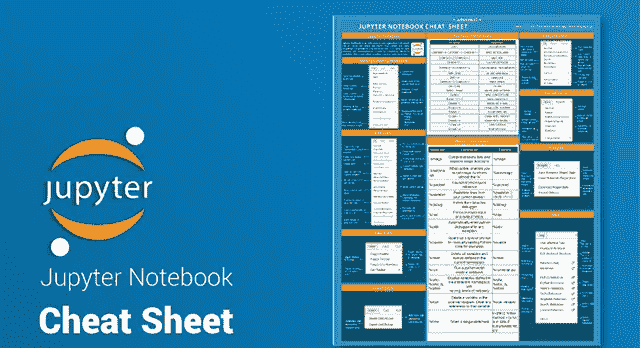

Jupyter Notebook Cheat Sheet — Edureka

Jupyter 笔记本是编写和迭代 Python 代码进行数据分析的强大工具。Jupyter Notebook 基于 IPython 构建，内核运行计算并与 Jupyter Notebook 前端接口通信。这个 Jupyter 笔记本备忘单将帮助你找到著名的笔记本应用程序，这是 Jupyter 项目的子项目。

# Jupyter 笔记本备忘单

Jupyter Notebook 是一个开源的 web 应用程序，允许您创建和共享包含实时代码、等式、可视化和叙述性文本的文档。它用于数据清理和转换、数值模拟、统计建模、数据可视化、**机器学习**等等。

这个 Jupyter 笔记本备忘单是 Jupyter 笔记本中使用的工具栏和键盘快捷键的指南。

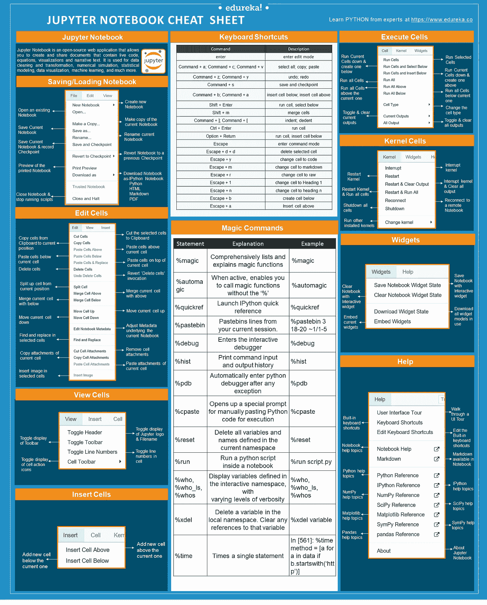

# 保存/加载笔记本

让我们从 Jupyter 笔记本的保存或加载开始

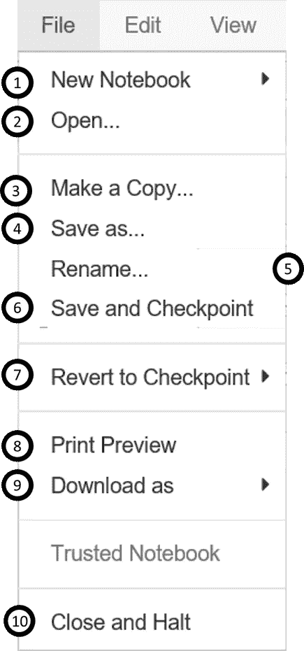

1.  创建新笔记本
2.  打开现有笔记本
3.  制作当前笔记本的副本
4.  保存当前笔记本
5.  重命名当前笔记本
6.  保存当前笔记本并记录检查点
7.  将笔记本恢复到以前的检查点
8.  打印笔记本的预览
9.  下载笔记本为-

*   IPython 笔记本
*   计算机编程语言
*   超文本标记语言
*   降价
*   便携文档格式

10.关闭笔记本并停止运行脚本

# 快捷键

以下是运行 Python 内核的 Jupyter 笔记本最常用的键盘快捷键。这个列表经常变化。查看笔记本中的“帮助”->“键盘快捷键”,了解最新的快捷键

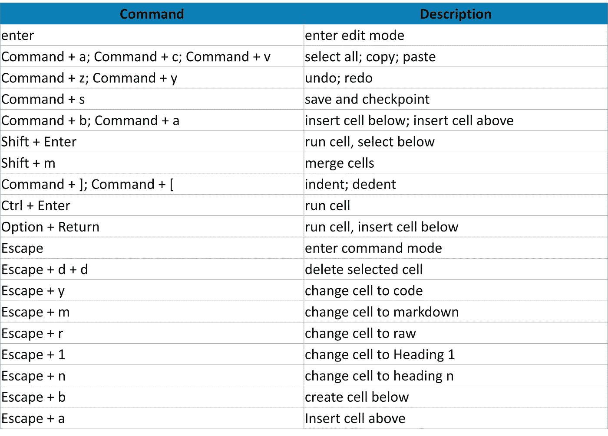

# 编辑单元格

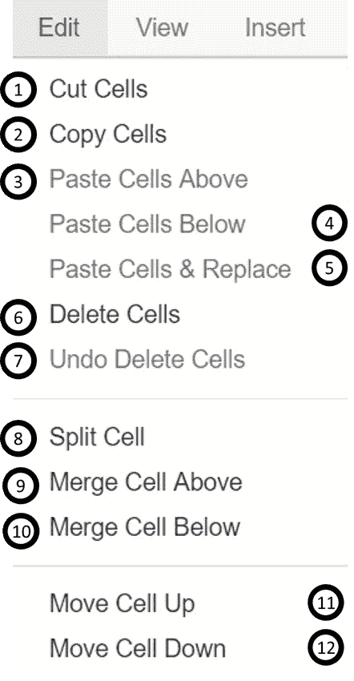

1.  将所选单元格剪切到剪贴板
2.  将剪贴板中的单元格复制到当前位置
3.  将剪贴板中的单元格粘贴到当前单元格上方
4.  将剪贴板中的单元格粘贴到当前单元格下方
5.  将剪贴板中的单元格粘贴到当前单元格的顶部
6.  删除单元格
7.  还原“删除单元格”调用
8.  从当前位置拆分单元格
9.  将当前单元格与上面的单元格合并
10.  将当前单元格与下面的单元格合并
11.  将当前单元格上移
12.  向下移动当前单元格

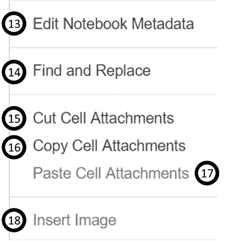

13.调整当前笔记本的元数据

14.在选定的单元格中查找和替换

15.移除单元格附件

16.复制当前单元格的附件

17.粘贴当前单元格的附件

18.在选定的单元格中插入图像

# 查看单元格

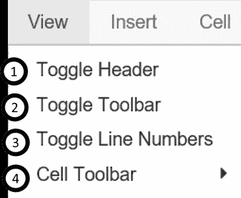

1.  切换 Jupyter 徽标和文件名的显示
2.  切换工具栏的显示
3.  切换单元格中的行号
4.  切换单元格操作图标的显示:

*   没有人
*   编辑元数据
*   原始单元格格式
*   幻灯片
*   附件
*   标签

# 插入单元格

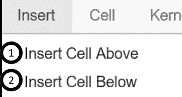

1.  在当前单元格上方添加新单元格
2.  在当前单元格下方添加新单元格

# 执行单元格

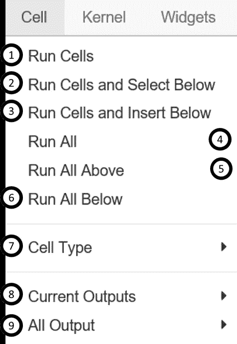

1.  运行选定的单元格
2.  关闭当前单元格，并在下面创建一个新单元格
3.  向下运行当前单元格，并在上面创建一个新单元格
4.  运行所有单元格
5.  运行当前单元格上方的所有单元格
6.  运行当前单元格下的所有单元格
7.  更改当前单元格的单元格类型
8.  切换、切换滚动和清除当前输出
9.  切换、切换滚动和清除所有输出

# 魔法命令

以下是 Jupyter Notebook 中一些常用的魔法命令。

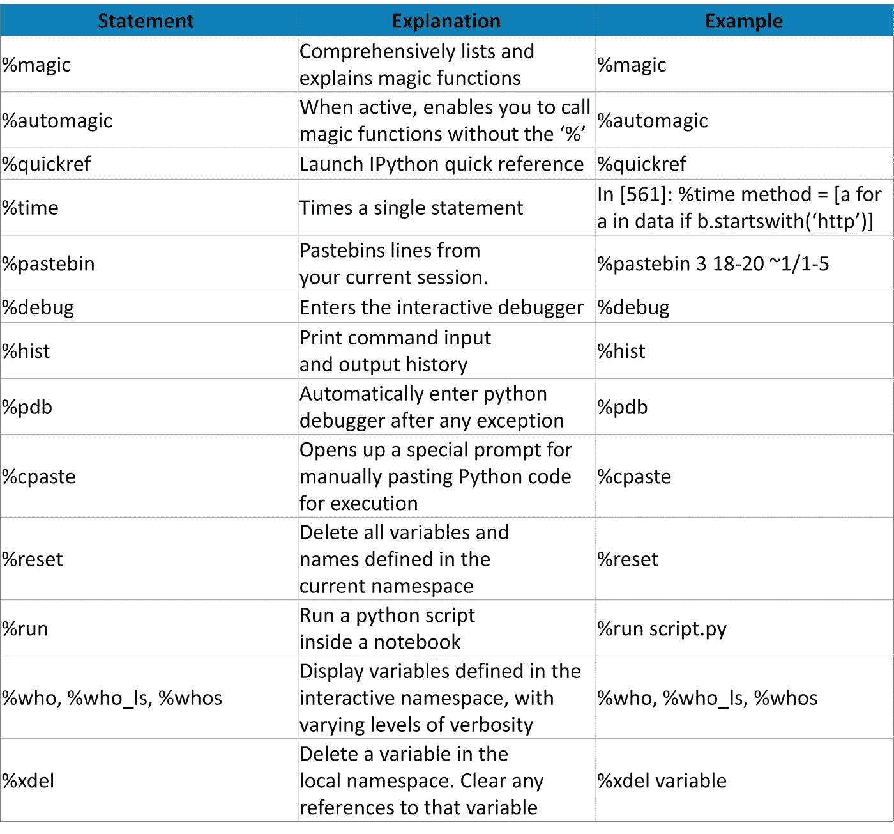

# 使用不同的编程语言

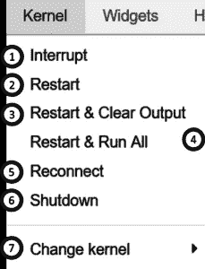

内核提供计算和与前端接口(如笔记本电脑)的通信。安装 Jupyter Notebook 会自动安装 IPython 内核。

1.  中断内核
2.  重启内核
3.  中断内核并清除所有输出
4.  重启内核并运行所有单元
5.  连接回远程笔记本
6.  重启内核并运行所有单元
7.  运行其他安装的内核

# 小工具

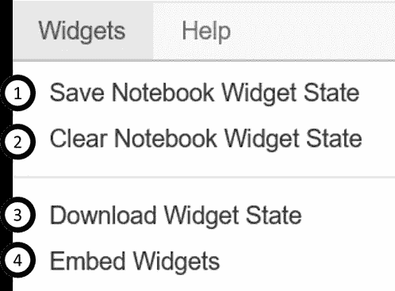

1.  使用交互式小工具保存笔记本
2.  带有交互式小部件的透明笔记本
3.  下载所有正在使用的小部件模型的序列化状态
4.  嵌入当前小部件

# 帮助

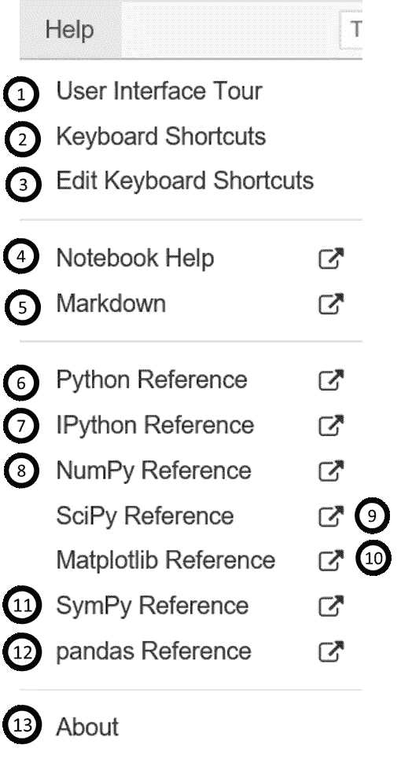

1.  浏览用户界面教程
2.  内置键盘快捷键列表
3.  编辑内置键盘快捷键
4.  笔记本帮助主题
5.  笔记本中可用的降价描述
6.  Python 帮助主题
7.  IPython 帮助主题
8.  NumPy 帮助主题
9.  SciPy 帮助主题
10.  Matplotlib 帮助主题
11.  SymPy 帮助主题
12.  熊猫帮助主题
13.  关于 Jupyter 笔记本

下载 Python 的 Jupyter 笔记本备忘单

## [**为 Python 下载 Jupyter 笔记本备忘单**](https://www.edureka.co/blog/wp-content/uploads/2018/10/Jupyter_Notebook_CheatSheet_Edureka.pdf)

如果你想查看更多关于人工智能、DevOps、道德黑客等市场最热门技术的文章，那么你可以参考 [Edureka 的官方网站。](https://www.edureka.co/blog/?utm_source=medium&utm_medium=content-link&utm_campaign=jupyter-notebook-cheat-sheet)

请留意本系列中的其他文章，它们将解释深度学习的各个其他方面。

> *1。* [*人工智能教程*](/edureka/artificial-intelligence-tutorial-4257c66f5bb1)
> 
> *2。* [*TensorFlow 教程*](/edureka/tensorflow-tutorial-ba142ae96bca)
> 
> *3。* [*张量流中的物体检测*](/edureka/tensorflow-object-detection-tutorial-8d6942e73adc)
> 
> *4。* [*PyTorch 教程*](/edureka/pytorch-tutorial-9971d66f6893)
> 
> *5。* [*感知器学习算法*](/edureka/perceptron-learning-algorithm-d30e8b99b156)
> 
> *6。* [*神经网络教程*](/edureka/neural-network-tutorial-2a46b22394c9)
> 
> *7。* [*什么是反向传播？*](/edureka/backpropagation-bd2cf8fdde81)
> 
> *8。* [*卷积神经网络*](/edureka/convolutional-neural-network-3f2c5b9c4778)
> 
> *9。* [*胶囊神经网络*](/edureka/capsule-networks-d7acd437c9e)
> 
> 10。 [*递归神经网络*](/edureka/recurrent-neural-networks-df945afd7441)
> 
> *11。* [*受限玻尔兹曼机教程*](/edureka/restricted-boltzmann-machine-tutorial-991ae688c154)
> 
> *12。* [*自动编码器教程*](/edureka/autoencoders-tutorial-cfdcebdefe37)
> 
> 13。[*PyTorch vs tensor flow*](/edureka/pytorch-vs-tensorflow-252fc6675dd7)
> 
> *14。* [*深度学习用 Python*](/edureka/deep-learning-with-python-2adbf6e9437d)
> 
> 15。 [*人工智能应用*](/edureka/artificial-intelligence-applications-7b93b91150e3)
> 
> *16。* [*张量流图像分类*](/edureka/tensorflow-image-classification-19b63b7bfd95)
> 
> *17。* [*如何成为一名人工智能工程师？*](/edureka/become-artificial-intelligence-engineer-5ac2ede99907)
> 
> *18。* [*问学*](/edureka/q-learning-592524c3ecfc)
> 
> *19。* [*Apriori 算法*](/edureka/apriori-algorithm-d7cc648d4f1e)
> 
> *20。* [*马尔可夫链与 Python*](/edureka/introduction-to-markov-chains-c6cb4bcd5723)
> 
> *21。* [*人工智能算法*](/edureka/artificial-intelligence-algorithms-fad283a0d8e2)
> 
> *22。*[*12 大人工智能工具*](/edureka/top-artificial-intelligence-tools-36418e47bf2a)
> 
> *23。* [*人工智能面试问题*](/edureka/artificial-intelligence-interview-questions-872d85387b19)

*原载于***。**