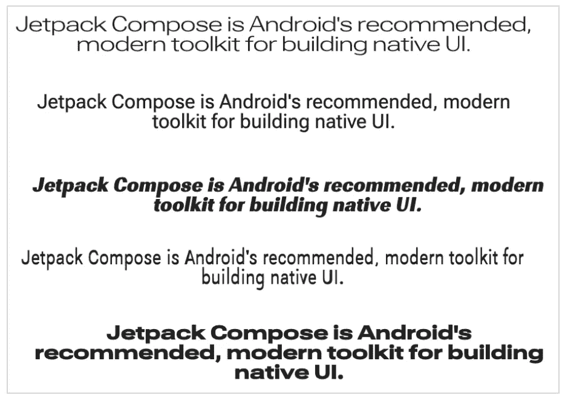
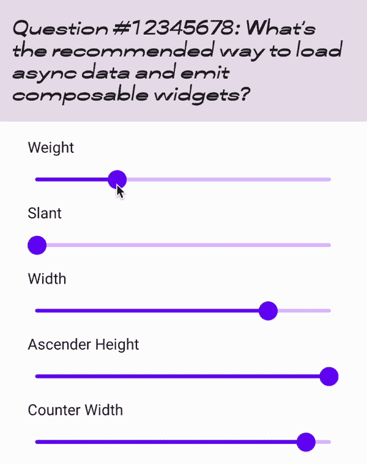
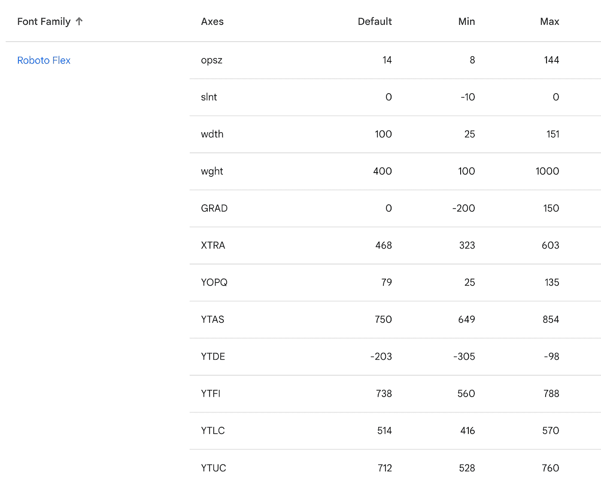
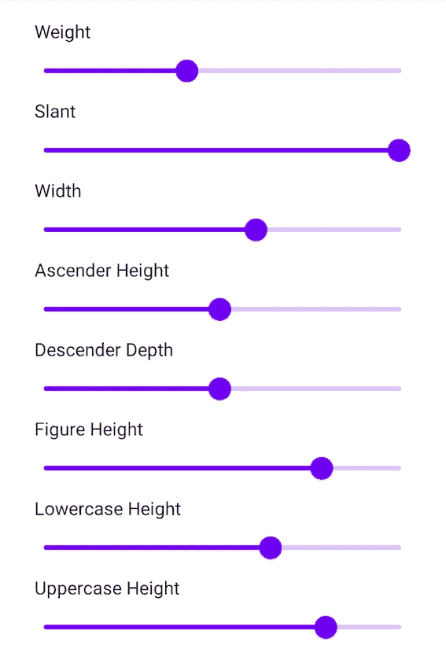
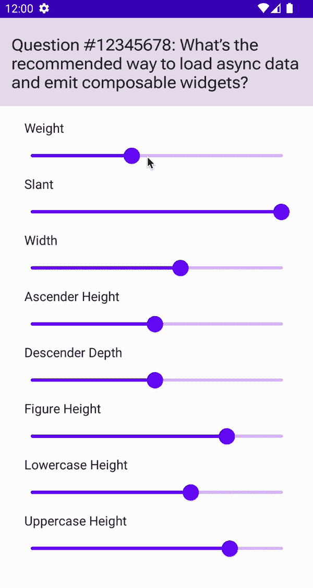

# 适合您的类型:撰写中的可变字体

> 原文：<https://medium.com/androiddevelopers/just-your-type-variable-fonts-in-compose-5bf63b357994?source=collection_archive---------7----------------------->

可变字体可以从 Compose UI [1.3.0](https://developer.android.com/jetpack/androidx/releases/compose-ui#1.3.0) 中使用，适用于 Android O 及以上版本。

可变字体是一种可以通过多种方式(或轴或参数)定制的字体，可以创建截然不同的样式，同时存在于单个字体文件中。这些轴可以是众所周知的，并在标准中定义(例如:粗细、宽度、倾斜、斜体)或由字体本身添加。在[谷歌字体知识](https://fonts.google.com/knowledge/topics/variable_fonts)中了解更多关于可变字体的信息。

*Text using the same variable font customized with different axes values.*

通过使用可变字体而不是常规字体文件，您只需要管理一个字体文件，而不是多个，包含所有可能的字体变化。
它可以让设计师真正表达品牌，让开发者在字体允许的情况下尽可能发挥创造力，通过访问各种风格，真正灵活地进行微调。

> 在你真正的应用程序中，你将有一个可变的字体，并根据你的设计要求，以一种非常简单的方式定制它，使其有 3-5 种变化，总是使用相同的字体文件。

在这篇博客中，我们将更进一步。使用可变字体，我们将能够快速构建一个应用程序，动态地更改字体的属性并显示它，如下所示:

This app shows a text using a variable font, and multiple sliders to modify the font axes.

对于这个例子，我们将使用由[字体局](https://fontbureau.typenetwork.com/)通过[谷歌字体](https://fonts.google.com/)设计的一种叫做 [Roboto Flex](https://fonts.google.com/specimen/Roboto+Flex) 的可变字体。

但是谷歌字体中有更多的可变字体。您可以在此处找到整个目录[以及每个字体](https://fonts.google.com/?vfonly=true)支持的轴的[表。](https://fonts.google.com/variablefonts)

# 在 Compose 中实现

## 设置

首先，我们得到字体。在撰写本文时，可下载字体不支持可变字体(这是一个[开放特征请求](https://issuetracker.google.com/223262013))。因此，我们需要下载字体并将其捆绑在 APK 中。确保。您添加的 ttf 文件是该字体的*可变字体版本*。

对于 **Roboto Flex** 字体，该文件将被命名为类似于“*RobotoFlex-variable font _ GRAD，XTRA，YOPQ，YTAS，YTDE，YTFI，YTLC，YTUC，opsz，slnt，wdth，wght.ttf* 的名称，我们将其重命名为“*RobotoFlex _ variable . TTF*，以添加到 Android 中。

接下来，我们添加正确的依赖项。撰写 UI 应在 [1.3.0](https://developer.android.com/jetpack/androidx/releases/compose-ui#version_13_2) 或更高版本上:

现在，进入有趣的部分🎉。

如果我们再次检查[可变字体目录](https://fonts.google.com/variablefonts)，我们会看到 Roboto Flex 可以通过以下轴进行定制:

Axes for Roboto Flex shown in the Google Fonts website

该信息非常重要，因为它包含不同的轴名称(如 XTRA、YTDE 等)、最小值、最大值和默认值。*查看* [*谷歌字体词汇表*](https://fonts.google.com/knowledge/glossary) *了解各轴如何配置字体。*

> *在我们的演示应用程序中，我们将只选择和实现 8 个 Roboto Flex 轴的子集，而其余的是相同的。*

我们首先创建一个可组合的屏幕。我们为想要展示的每个轴添加一个标签和选择器(或[滑块](https://developer.android.com/reference/kotlin/androidx/compose/material/package-summary#Slider(kotlin.Float,kotlin.Function1,androidx.compose.ui.Modifier,kotlin.Boolean,kotlin.ranges.ClosedFloatingPointRange,kotlin.Int,kotlin.Function0,androidx.compose.foundation.interaction.MutableInteractionSource,androidx.compose.material.SliderColors))，并使用`[MutableState<T>](https://developer.android.com/reference/kotlin/androidx/compose/runtime/MutableState)`定义所有这些选择器的状态。

`[Slider](https://developer.android.com/reference/kotlin/androidx/compose/material/package-summary#Slider(kotlin.Float,kotlin.Function1,androidx.compose.ui.Modifier,kotlin.Boolean,kotlin.ranges.ClosedFloatingPointRange,kotlin.Int,kotlin.Function0,androidx.compose.foundation.interaction.MutableInteractionSource,androidx.compose.material.SliderColors))` composable 带有一个`valueRange`参数，可以用上表中的字体信息(最小/最大值)轻松定制。应用程序的这一部分看起来会像这样:

到目前为止，我们已经像这样配置了所有的选择器:

Sliders configured for 8 axes for Roboto Flex

## 预定义轴

接下来，我们需要使用选择器的值并配置我们的字体。为此，我们将使用新的( [experimental](https://developer.android.com/reference/kotlin/androidx/compose/ui/text/ExperimentalTextApi) ) `[FontVariation](https://developer.android.com/reference/kotlin/androidx/compose/ui/text/font/FontVariation)` API。

对于预定义的轴，`[FontVariation](https://developer.android.com/reference/kotlin/androidx/compose/ui/text/font/FontVariation.Settings)`提供了预定义的方法。例如，我们有`[weight](https://developer.android.com/reference/kotlin/androidx/compose/ui/text/font/FontVariation#weight(kotlin.Int))`和`[slant](https://developer.android.com/reference/kotlin/androidx/compose/ui/text/font/FontVariation#slant(kotlin.Float))`，它们可以设置如下:

其中为*重量*和*倾斜度*传递的值先前被定义为来自`[Slider](https://developer.android.com/reference/kotlin/androidx/compose/material/package-summary#Slider(kotlin.Float,kotlin.Function1,androidx.compose.ui.Modifier,kotlin.Boolean,kotlin.ranges.ClosedFloatingPointRange,kotlin.Int,kotlin.Function0,androidx.compose.foundation.interaction.MutableInteractionSource,androidx.compose.material.SliderColors))`的`[State](https://developer.android.com/reference/kotlin/androidx/compose/runtime/State)`。

## 自定义轴

对于自定义轴，您可以使用`[FontVariation.Settings](https://developer.android.com/reference/kotlin/androidx/compose/ui/text/font/FontVariation.Settings)`方法，该方法接收设置名称和值作为参数。设置的名称和其他相关信息由我们之前查询的 Google [可变字体目录](https://fonts.google.com/variablefonts)给出。我们可以这样配置它们:

## 现在都在一起

最后，我们将新字体添加到字体家族中。我们创建一个可组合的文本，并设置字体系列。我们的主屏幕将如下所示:

> *在一个真实的应用程序中，你可能会在你的* `*Type.kt*` *文件中用静态值定义字体系列，而不是快照状态变量。*

就是这样！我们已经完成了我们的示例应用程序，展示了 [Roboto Flex](https://fonts.google.com/specimen/Roboto+Flex?vfquery=roboto+flex) 可变字体是如何通过它的所有轴来风格化的。

App completed with sliders configuring 8 axes for Roboto Flex, and text dynamically reacting to the font changes.

## 最佳实践

我们可以对代码进行两项改进。

对于自定义轴，我们可以将它们包装在一个验证函数中，如下所示:

这种重构有一些好处。最值得注意的是，它可以验证和防止其他开发人员对字体的错误配置。它还会产生更干净、更地道的语法。

其次，Android O 之前不支持可变字体，因此如果在带有运行时`IllegalStateException`的旧版本中运行，这段代码会使你的应用崩溃。为了防止这种情况，我们可以添加一个带有后备字体的护栏，如下所示:

# 概述

希望你学到了一些新的东西，可以将可变字体的力量融入到你的应用程序中。

如果您发现任何错误或有功能请求，请通过在我们的[跟踪器](https://issuetracker.google.com/issues/new?component=779818&template=1371638)上提交问题来让我们知道。

最后，在这里或 Twitter [@astamatok](https://twitter.com/astamatok) 或[乳齿象](https://androiddev.social/@astamato)上放下你所有的问题，分享你使用可变字体构建的东西！

快乐作曲！👋

*这篇文章是与 Jetpack 撰写文本团队的* [*肖恩·麦克奎蓝*](https://tech.lgbt/@objcode) *合作撰写的。感谢 DevRel 团队的* [*丽贝卡·弗兰克斯*](https://androiddev.social/@riggaroo) *和* [*弗洛里纳·芒特内斯库*](https://twitter.com/FMuntenescu) *对他们的点评。*