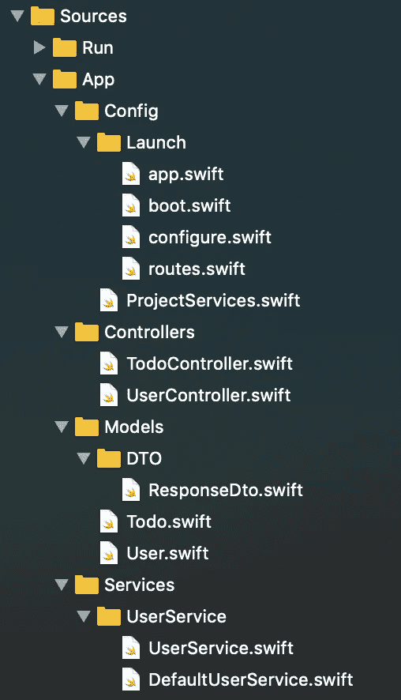
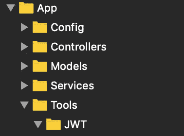
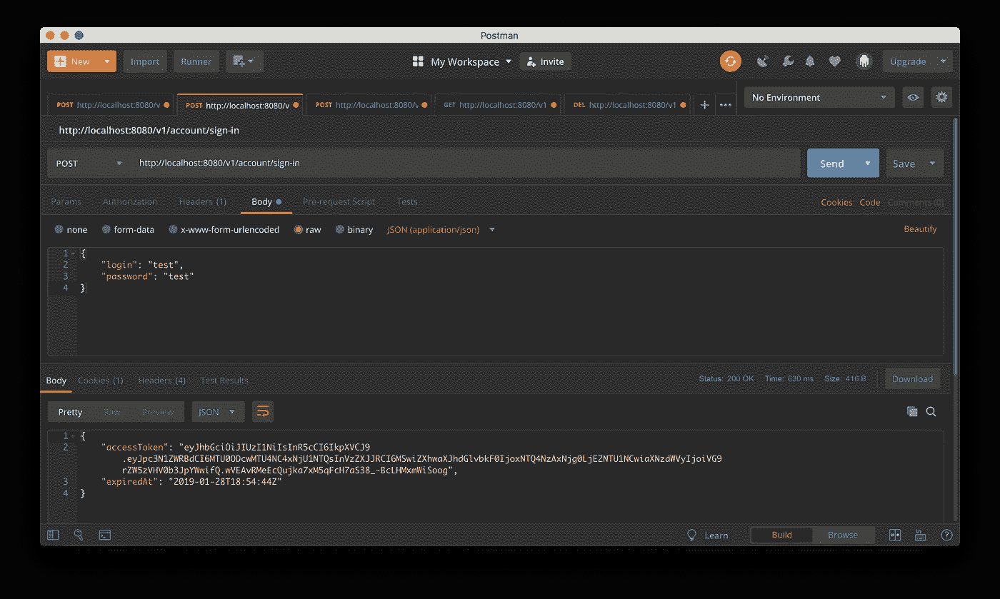
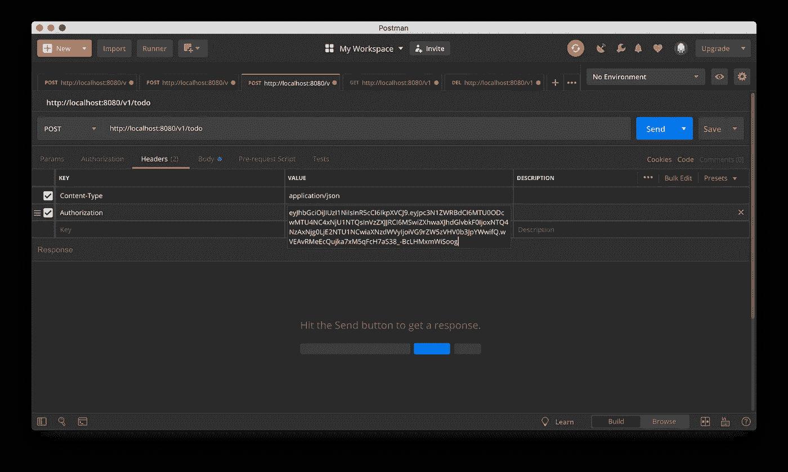
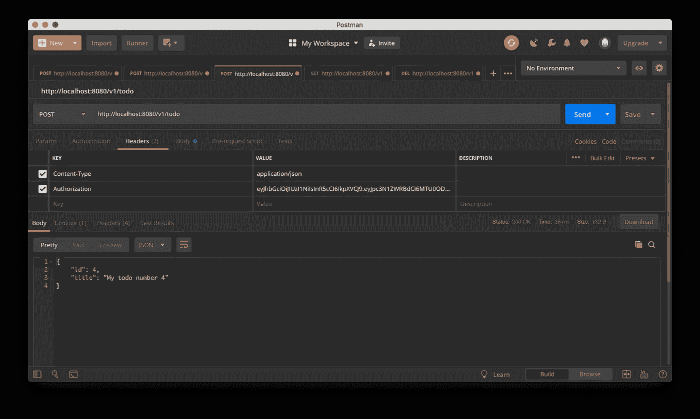
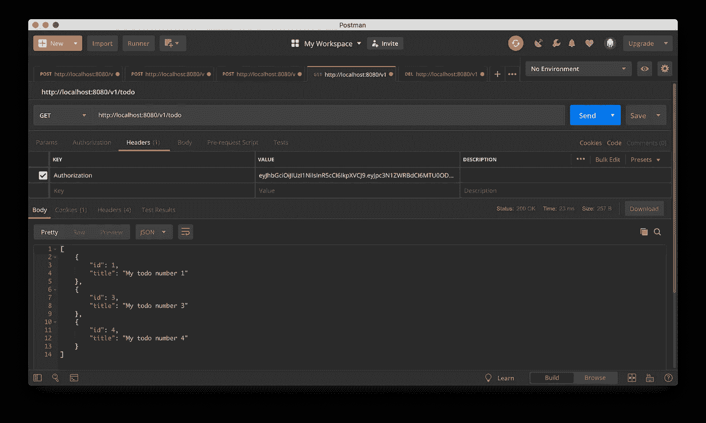
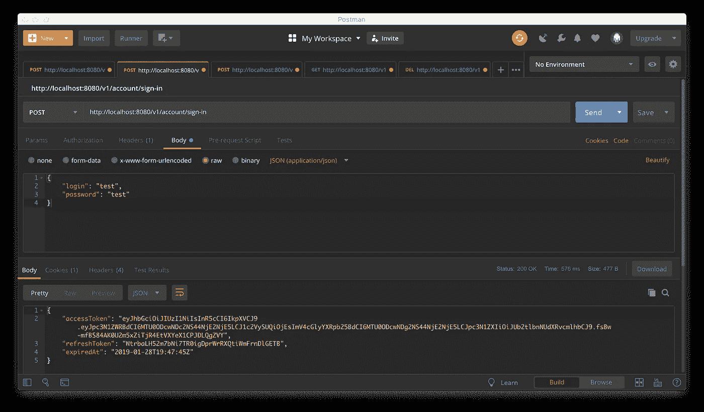
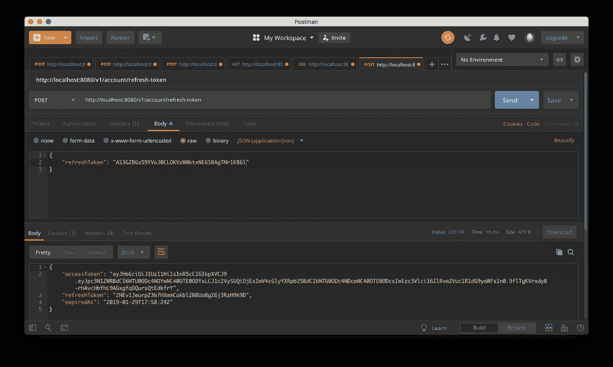

# 带有 Vapor 3 的 JWT 访问和刷新令牌

> 原文：<https://medium.com/quick-code/jwt-access-and-refresh-token-with-vapor-3-85a0aee5291b?source=collection_archive---------1----------------------->


# 介绍

我们经常需要识别向服务器发送请求的用户，我们还需要确保客户端-服务器信息传输的安全性。这就是接入令牌帮助我们的地方，特别是在 JWT。

> **JSON Web 令牌(JWT)** 是基于 JSON 格式创建访问令牌的开放标准(RFC 7519)。通常，它用于在客户机-服务器应用程序中传输授权数据。令牌由服务器创建，用秘密密钥签名并传送给客户机，客户机随后使用这个令牌来确认其身份。

为了充分的安全，我们的 JWT 应该有一个有限的生命周期，为了它的更新，用户必须能够确认他的真实性。在本文中，我们将研究如何在不将用户数据存储在客户机上的情况下做到这一点。

我们将不详细讨论 JWT，因为这超出了本文的范围。推荐阅读 [**这篇文章**](/vandium-software/5-easy-steps-to-understanding-json-web-tokens-jwt-1164c0adfcec) 来熟悉 JWT。

# 认证和授权

首先，让我们突出两个概念:**认证**和**授权**。

**认证**它是对用户凭证(通常是一个登录/密码对)的验证。

**授权** —授予某个人或某组人执行某些操作的权利，即检查用户是否有权访问特定资源的程序。

通常，身份验证和授权过程如下:

1.  用户向服务器发送他的数据(登录/密码)。*认证过程*。
2.  如果数据正确，服务器会为用户生成一个 JWT 令牌，其中包含必要的数据(权限、ID、令牌生命周期)。
3.  用户用收到的令牌向服务器发送请求。
4.  服务器根据令牌中的数据(权限、生存期)决定是否授予用户访问权限。*授权流程*。

# 刷新令牌

为了不存储用户数据并且仍然能够更新 JWT，我们将得到一个新概念的帮助，例如**刷新令牌**。认证令牌将被称为**访问令牌**。*更新访问令牌*的第二个令牌是**刷新令牌**。我们将把它保存在客户端，而不是登录/密码对。

一般来说，**刷新令牌**比**访问令牌**寿命要长得多，比如一两个月。在我的一个项目中，刷新令牌的生命周期是 60 天。

我们会将刷新令牌存储在数据库中，并在客户端想要更新其访问令牌时立即对其进行验证。它本身是一个随机生成的字符串(例如 lxd 6 bj 7 w 33 gex 1 gosgzczwnsmskaaumpwgg 6um)。

让我们更详细地看看更新算法。

# 访问令牌更新

1.  通过发送登录名/密码对对客户端进行身份验证。
2.  如果成功，服务器将创建新的访问令牌和刷新令牌。**刷新令牌伴随着他一生的时间被记录在数据库里。**
3.  服务器以如下形式向客户端发送响应:

```
{
    "expired_at": ...,
    "access_token": ...,
    "refresh_token": ...
}
```

4.客户端保存这些数据。

5.对于每个请求，客户端检查访问令牌是否过期。如果访问令牌没有过期，它只是使用它发送请求。

6.对于更新，客户端发送一个**刷新令牌**到一个特别定义的端点。(例如`/v1/account/refresh-token`)

7.服务器检查刷新令牌，该令牌位于发送的数据库中。还有，检查过期与否。

8.如果刷新令牌过期，或者在数据库中没有找到，那么我们向客户端返回一个 **401 错误**，以便通过**认证**。

9.如果发现刷新令牌并且它仍然相关，则**创建新的访问令牌**并且**更新刷新令牌**。我们按照第 3 段发送这些数据。

10.现在，客户端可以继续使用新的访问令牌执行请求。

# 履行

考虑在 Vapor 3 上的具体实现。

## 项目设置

我创建并设置了一个启动项目。这里 下载 [**。**](https://github.com/timbaev/TokensTutorial)



Project Structure

文件夹*配置*包含项目设置。*启动*文件夹中有标准的 Vapor 文件。`ProjectServices.swift`包含项目中使用的服务类的实例。

*控制器*文件夹包含控制器本身，它们在请求时被调用。

项目中有两种 ORM SQLite 数据库模型: *Todo* 和 *User* 。该想法将是用户可以注册，并在认证后将接收**访问和刷新令牌**。有了这个令牌，用户可以创建、获取或删除他的待办事项。*用户*和*待办事项*是一对多的关系。也就是说，一个用户可能有几个待办事项。

在 *DTO* (数据传输对象)文件夹中包含向响应体传输数据的模型。它们不应该包含任何业务逻辑。*响应*模型只响应任何消息。

在 *Services* 文件夹中，我们存储了我们所有的服务，其中包含了主要的业务逻辑。JSON 比 XML 更容易使用，也更容易阅读。因此，初学者可以利用[最佳 JSON 教程](https://blog.coursesity.com/best-json-tutorials/)。

## 创建 JWT 访问令牌

我们需要的下一步是在认证之后，用户可以获得他们的访问令牌。

为此，让我们在 *App* 文件夹中创建 *Tools* 文件夹。在*工具*文件夹本身中，创建另一个 *JWT* 文件夹。结果是以下结构:



Creating a JWT folder

创建一个文件`JWTConfig.swift`，其内容将如下:

这是我们的 JWT 访问令牌的基本配置。

我们还需要处理与 JWT 相关的错误。为此，我们将使用已经存在的 JWTError 类。在一个新文件`JWTErrorExtensions.swift`中为它写一个*扩展名*:

用以下内容创建一个`AccessTokenPayload.swift`文件:

有效载荷是 JWT 的公共参数，将以 base64 编码。此外，JWTPayload 需要实现`verify(signer:)`方法，如果我们的令牌不再有效，就会抛出异常。在我们的例子中，我们只检查令牌是否过期(您也可以检查*发布者*是否正确)。

要使用 JWT，创建一个单独的类— *TokenHelpers* :

有了这个助手，我们可以创建一个新的 JWT 访问令牌，找出令牌的过期时间，验证并获得用户 ID。

要发送新令牌，在*模型/DTO* 文件夹中创建一个*访问*模型:

很好，现在我们已经为创建新令牌做好了一切准备。在`DefaultUserService.swift`上增加`signIn(request:, user:)`功能:

我们正在通过登录寻找用户，如果成功，我们用一个特殊的函数`digest.verify(_, created:)`检查我们的散列密码，然后我们向我们的客户端发布一个新的访问令牌及其到期时间。

## 使用访问令牌

为了让控制器中的每个请求不要每次都检查令牌是否有效，我们将创建自己的*中间件*。来自官方文件:

> **中间件**放在服务器和你的路由器之间。它能够改变传入的请求和传出的响应。**中间件**可以选择将请求传递给链中的下一个**中间件**，或者如果需要，它们可以短路并返回自定义的“响应”。

在请求到达控制器之前，我们验证报头中的令牌是否有效，否则，我们只是返回一个错误，让客户端知道令牌不再有效。

在 JWT 文件夹中，创建一个`JWTMiddleware.swift`文件:

一切都很简单:我们检查令牌的可用性并验证它(检查令牌是否过期)。如果出现错误，我们将向客户端返回一个带有描述的错误。

一个`extension Request`来获得一个令牌和一个授权用户也很有用(你可以把它放在*工具/扩展*):

现在，让我们创建一切必要的东西，以便用户可以创建、获取或删除待办事项。

为此，创建`TodoDto.swift` ( *模型/DTO* ):

创建一个服务，它将包含我们处理 Todo notes 的业务逻辑，并用协议( *Services/TodoService* )覆盖它:

更新`TodoController.swift`:

注意路由器的创建:`let group = router.grouped("v1/todo").grouped(JWTMiddleware())`。这里我们指定了端点的公共基路径，还添加了 **JWTMiddleware** ，即该组的所有请求都将通过令牌的*验证。*

将我们的新服务添加到`ProjectServices.swift`:

并更新`routes.swift`:

太好了，现在我们可以构建一个项目，并检查一切工作正常！

我们通过认证(`v1/account/sign-in`)，作为响应，我们得到我们的**访问令牌**(如果没有用户，您可以使用端点`/v1/account/sign-up`创建它):



将我们的令牌复制并粘贴到*授权*头中:



之后，我们已经可以从授权用户那里创建、获取或删除待办事项:



很好，但是过了一会儿，您会得到一个错误:

```
{
    "error": true,
    "reason": "JWT verification failed"
}
```

不幸的是，我们的**访问令牌**过期了，我们不再能够访问我们的待办事项(我提醒您，您可以设置一个更长的访问令牌生命周期，对于本课来说，这个时间只有 100 秒)。为此，我们需要重新通过认证过程。等等，不不，我们还有… **刷新令牌！**

## 正在创建刷新令牌

为此向 *TokenHelpers* 类添加一个新函数:

这个函数尽可能简单:它从变量`letters`中生成一个长度为 40 的随机字符字符串。

现在您需要创建一个模型，我们将在其中存储用户的刷新令牌(一个用户可能有几个刷新令牌):

向*用户*模型添加一个关系:

很好，现在登录时，我们需要创建并向客户端提供访问和刷新令牌。更新我们的*访问到*:

Added new field “refreshToken”

好了，现在我们的`signIn`函数将看起来像这样(向响应添加了刷新标记，并将其保存在数据库中):

不要忘记将模型迁移添加到`configure.swift`:

```
migrations.add(model: RefreshToken.**self**, database: .sqlite)
```

现在签到可以返回**刷新令牌！还有待学习如何使用它来更新**访问令牌**。**



## 使用刷新令牌

添加一个新函数来更新我们的令牌:

一切都很简单——我们在数据库中寻找带有刷新令牌的模型，否则，我们返回状态 *unauthorized* (为了通知客户端需要再次通过身份验证)。接下来，我们检查我们的刷新令牌是否过期，如果成功，在数据库中创建一个**新访问**和**更新刷新令牌**(也不要忘记日期)。

如果我们的刷新令牌已经过期，那么将其从数据库中删除，并将状态返回给客户端*未授权*。

不要忘记在协议中添加新方法:

```
**protocol** UserService {**...** ***func*** *refreshToken(request: Request, refreshTokenDto: RefreshTokenDto)* ***throws*** *-> Future<AccessDto>*}
```

向*用户控制器*添加新功能:

```
**func** refreshToken(**_** requets: Request, refreshTokenDto: RefreshTokenDto) **throws** -> Future<AccessDto> { **return** **try** **self**.userService.refreshToken(request: requets, refreshTokenDto: refreshTokenDto)}
```

注册端点以在`boot`函数中更新令牌:

```
**func** boot(router: Router) **throws** { **let** group = router.grouped("v1/account") ... group.post(RefreshTokenDto.**self**, at: "/refresh-token", use: **self**.refreshToken)}
```

经过身份验证后，我们保存从 JSON 响应中收到的刷新令牌:

```
{
    "accessToken": "...",
    "refreshToken": "**AS3GZB6z59YVoJ0CLOKVzWWktxNE6SBAgTMr1K86l**",
    "expiredAt": "..."
}
```

现在，在我们的*访问令牌*到期后，我们可以使用端点`/v1/account/refresh-token`上的*刷新令牌*来更新它:



完美！现在我们可以更新我们的**访问令牌**而不用存储用户数据！

# 结论

这种使用**访问+刷新令牌**的方案保证了攻击者无法发现用户的数据。

此外，为了提高安全性，您可以创建一个被阻止或被盗令牌的黑名单。并对存储进行优化，定期从数据库中清除过期的**刷新令牌**。

就这些，如果你有任何补充或建议，我随时欢迎讨论，请在评论中提问！

这个项目的最终版本可以在这里找到:[https://github.com/timbaev/TokensTutorialFinal](https://github.com/timbaev/TokensTutorialFinal)