# K-means 聚类算法:了解其工作原理

> 原文：<https://medium.com/edureka/k-means-clustering-1db7b018a0a2?source=collection_archive---------1----------------------->

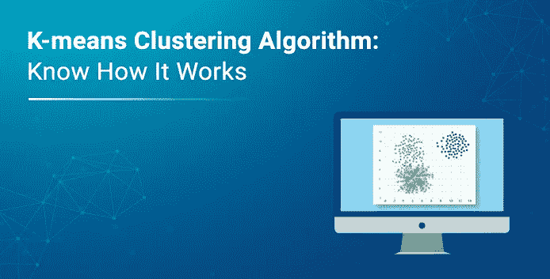

大多数零售企业主发现很难认识到顾客的需求。网飞、沃尔玛、塔吉特等数据驱动型公司。之所以做得如此好，是因为他们有一群经过认证的数据分析师，他们通过使用正确的工具来创建个性化的营销策略，从而发展他们的业务。我们理解并非所有的顾客都是相似的，有着相同的品味。因此，这导致了向正确的客户营销正确的产品的挑战。可能吸引特定客户群的优惠或产品可能对其他客户群没有太大帮助。因此，您可以应用 k-means 聚类算法，根据各种指标(如他们在社交媒体上的活动、喜欢和不喜欢，以及他们的购买历史)将您的所有客户细分为具有相似特征和偏好的群体。根据这些确定的客户群，您可以创建个性化的营销策略，并为您的组织带来更多的业务。在深入研究 k-means 聚类之前，我将介绍以下主题，让您对聚类有一个基本的了解。

*   机器学习导论
*   需要用实例进行分组
*   什么是集群？
*   聚类的类型
*   k 均值聚类
*   实验操作:使用 r 在电影数据集上实现 k-means 聚类。根据电影的业务和观众的受欢迎程度对电影进行聚类。

机器学习是最新和最令人兴奋的技术之一。你可能一天要用十几次，而自己却不知道。机器学习是一种人工智能，它为计算机提供了学习能力，而无需显式编程。它在监督和非监督学习模型上工作。与监督学习模型不同，机器学习的非监督模型没有预定义的组，您可以在这些组下分发数据。您可以通过聚类找到这些分组。我会通过下面的例子进一步解释。

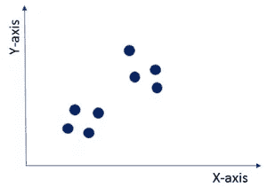

正如你在这张图片中看到的，数据点显示为蓝点。这些数据点没有可以用来区分它们的标签。你对这些数据一无所知。所以现在的问题是，你能在这些数据中找出任何结构吗？使用聚类技术可以解决这个问题。聚类会将具有相似数据点的不同标签下的整个数据集(这里称为聚类)划分为一个聚类，如下图所示。它被用作探索性描述性分析的一种非常强大的技术。

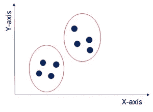

这里，聚类技术将整个数据点划分为两个聚类。一个聚类中的数据点彼此相似，但不同于其他聚类。例如，你有病人症状的数据。现在，你可以根据这些症状找出特定疾病的名称。

让我们用一个 google 新闻的例子来进一步理解集群。

谷歌新闻所做的是，每天都有成百上千的新闻出现在网络上，它将它们组合成连贯的新闻故事。让我们看看如何？

一旦你去了 news.google.com，你会看到许多新闻故事，如下图所示。

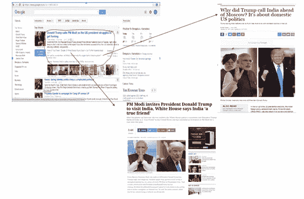

它们被分成不同的新闻故事。在这里，如果你看到红色突出显示的区域，你会知道与特朗普和莫迪有关的各种新闻网址被分组在一个部分下，其余部分在其他部分。点击该组中不同的网址，你会看到同一主题的不同故事。因此，google news 会自动将同一主题的新故事聚集到预定义的集群中。

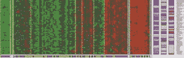

聚类的另一个非常有趣的应用是在基因组学中。基因组学是对 DNA 的研究。正如你在图中看到的，不同的颜色如红色、绿色和灰色描述了一个人拥有或不拥有特定基因的程度。所以，你可以对一群人的 DNA 数据运行聚类算法来创建不同的聚类。这可以让你对特定基因的健康有非常有价值的了解。

例如，达菲阴性基因型的人往往对疟疾有更高的抵抗力，通常在非洲地区发现。所以，你可以画出基因型和自然栖息地之间的关系，找出它们对特定疾病的反应。

因此，基本上聚类将具有相似性的数据集划分成不同的组，这可以作为进一步分析的基础。结果是，一个组中的对象彼此相似，但与另一个组中的对象不同。

现在，一旦您理解了什么是集群，让我们看看实现这些集群的不同方法。

**独家集群**:

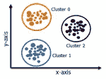

在独占群集中，一个项目只属于一个群集，而不是几个群集。在图像中，您可以看到属于分类 0 的数据不属于分类 1 或分类 2。k-means 聚类是一种排他聚类。

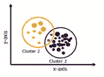

**重叠聚类**:这里一个项目可以属于多个聚类，每个聚类之间的关联程度不同。模糊 C 均值算法是基于重叠聚类的。

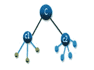

**层次聚类**:在层次聚类中，聚类不是在一个单一的步骤中形成的，而是遵循一系列的划分来得出最终的聚类。它看起来像一棵树，如图所示。

在实现任何算法时，计算速度和效率成为最终结果的一个非常重要的参数。因此，我解释了 k-means 聚类，因为它非常适合大型数据集，因为它的计算速度更快，而且易于使用。

# k 均值聚类

k-means 聚类是最简单的算法之一，它使用无监督学习方法来解决已知的聚类问题。k 均值聚类需要以下两个输入。

1.  k =聚类数
2.  训练集(m) = {x1，x2，x3，……..，xm}

假设您有一个未标记的数据集，如下所示，并且您想要将该数据分组到集群中。

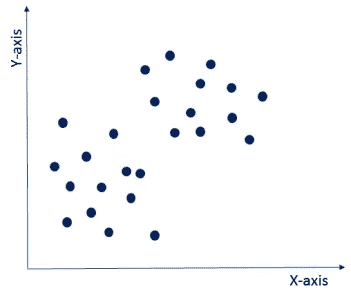

现在，重要的问题是如何选择最佳的集群数量？有两种可能的方法来选择簇的数量。

**(一)肘法:**这里你画一条 WSS(在平方和内)和簇数之间的曲线。它被称为肘方法，因为曲线看起来像人的手臂，肘点为我们提供了最佳的聚类数。正如你所看到的，在肘点之后，WSS 的值有一个非常缓慢的变化，所以你应该把肘点的值作为最终的聚类数。

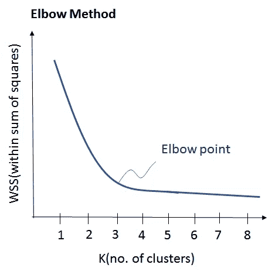

**(二)** **基于目的:**可以运行 k-means 聚类算法，根据各种目的得到不同的聚类。您可以根据不同的指标对数据进行划分，并查看它在特定情况下的表现。我们举一个营销不同尺码 t 恤的例子。根据您想要达到的目的，您可以将数据集划分为不同数量的聚类。在下面的例子中，我采用了两个不同的标准，价格和舒适度。

让我们看看这两种可能性，如下图所示。

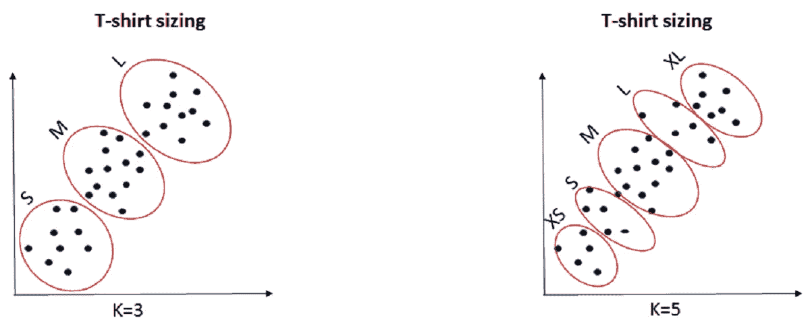

1.  1.K=3:如果您想只提供 3 种尺寸(S、M、L)以便价格更便宜，您将把数据集分成 3 个聚类。
2.  K=5:现在，如果您想为您的客户提供更多尺寸(XS、S、M、L、XL)的舒适性和多样性，那么您将把数据集分成 5 个集群。

现在，一旦我们有了 k 的值，让我们来理解它的执行。

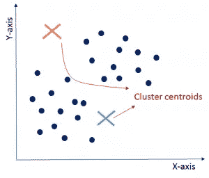

*   **初始化:**
    首先，你需要随机初始化两个点，称为聚类质心。这里，您需要确保如图所示由橙色和蓝色十字表示的聚类质心小于由深蓝色点表示的训练数据点。k-means 聚类算法是一种迭代算法，它迭代地遵循接下来的两个步骤。完成初始化后，让我们进入下一步。
*   **C**

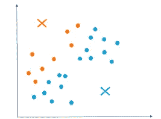

*   **cluster Assignment:** 在这一步中，它会遍历所有的海军蓝数据点，计算这些数据点与上一步初始化的聚类质心之间的距离。现在，根据与橙色簇形心或蓝色簇形心的最小距离，它会将自己分组到特定的组中。因此，数据点分为两组，一组用橙色表示，另一组用蓝色表示，如图所示。因为这些集群形式不是优化的集群，所以让我们继续，看看如何得到最终的集群。

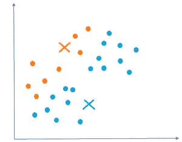

*   **移动质心:**
    现在，你将采取上述两个集群质心，并迭代重新定位它们进行优化。您将获得所有蓝点，计算它们的平均值，并将当前的聚类质心移动到这个新位置。类似地，将橙色聚类质心移动到橙色数据点的平均值。因此，新的簇质心将如图所示。接下来，让我们看看如何优化集群，这将为我们提供更好的洞察力。

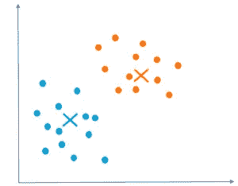

*   **优化:**
    你需要反复重复以上两步，直到聚类质心停止改变位置，变成静态。一旦聚类变成静态的，那么 k-means 聚类算法就被认为是收敛的。
*   **收敛:** 最后，k-means 聚类算法收敛，将数据点分成清晰可见的橙色和蓝色两个聚类。根据聚类的初始化方式，k-means 最终可能会收敛到不同的解。

正如您在下图中所看到的，这三个簇清晰可见，但是根据您选择的簇质心，您最终可能会得到不同的簇。

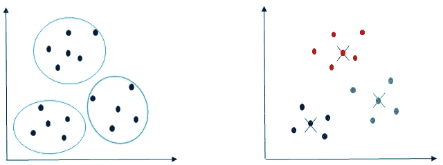

下面显示的是基于不同的簇形心选择的其他一些簇划分的可能性。根据您的需求和您试图实现的目标，您最终可能会拥有这些分组中的任何一个。

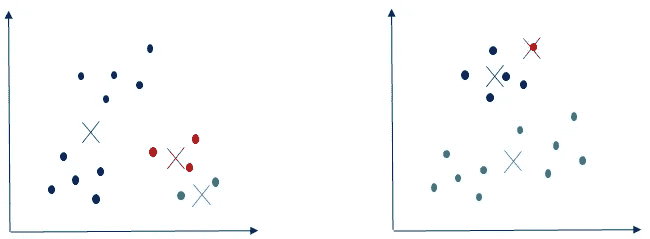

既然您已经理解了集群的概念，那么让我们来实际操作一下 r。

**k-means 聚类案例研究:电影聚类**

比方说，你有一个电影数据集，有 28 个不同的属性，从导演 facebook 喜欢，电影喜欢，演员喜欢，预算到总收入，你想找出观众中最受欢迎的电影。您可以通过 k-means 聚类来实现这一点，并将整个数据划分到不同的聚类中，并根据流行度做进一步的分析。

为此，我采用了具有 28 个属性的 5000 个值的电影数据集。

**第一步**。首先，我已经在 RStudio 中加载了数据集。

电影 _ 元数据

View(movie_metadata)

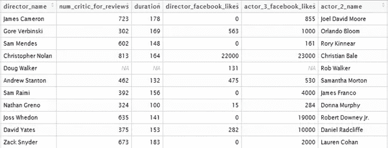

**第二步**。如您所见，该数据中有许多 NA 值，因此我将清理数据集并从中删除所有空值。

电影

movie

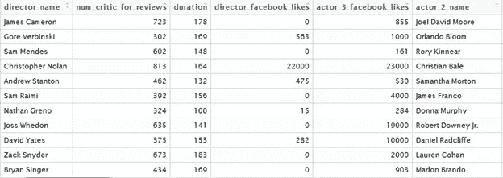

**第三步**。在这个例子中，我从数据集中取了前 500 个值进行分析。

步骤 4 。此外，使用下面的 R 代码，您可以从数据集中获取两个属性 budget 和 gross 来创建集群。

smple_short

smple_matrix

View(smple_matrix)

Our dataset will look like below.

**步骤 5。现在，让我们来确定集群的数量。**

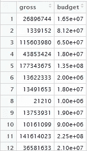

wss

for (i in 2:15) wss[i]

plot(1:15, wss, type=”b”, xlab=”Number of Clusters”, ylab=”Within Sum of Squares”)

It gives the elbow plot as follows.

As you can see, there is a sudden drop in the value of WSS (within the sum of squares) as the number of clusters increases from 1 to 3\. Therefore, the bend at k=3 gives stability in the value of WSS. We need to strike a balance between k and WSS. So, in this case, it comes at k=3.

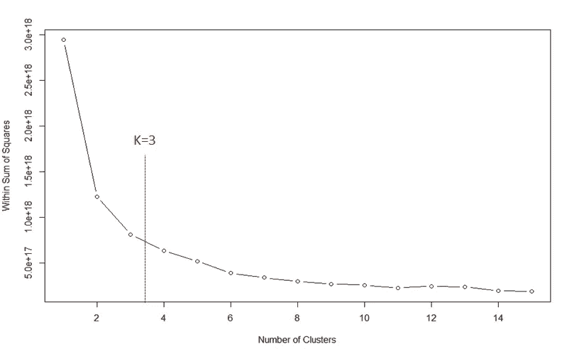

**步骤 6** 。现在，有了这些干净的数据，我将应用 R 中内置的 means 函数来形成集群。

cl

You can plot the graph and cluster centroid using the following command.

plot(smple_matrix, col =(cl$cluster +1) , main=”k-means result with 2 clusters”, pch=1, cex=1, las=1)

points(cl$centers, col = “black”, pch = 17, cex = 2)

**第七步**。现在，我将使用命令 **cl 来分析我的集群编队有多好。**它给出以下输出。

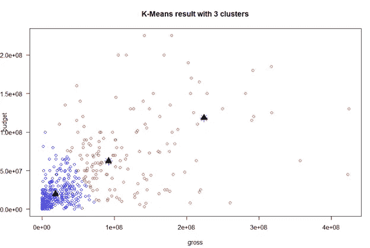

分类内按分类的平方和:

[1]3.113949 e+17 2.044851 e+17 2.966394 e+17

(between_SS / total_SS = 72.4 %)

这里，total_SS 是每个数据点到全局样本均值的平方距离之和，而 between_SS 是聚类质心到全局均值的平方距离之和。这里，72.4 %是数据集中总方差的度量。k-means 的目标是最大化组间离差(between_SS)。因此，百分比值越高，模型越好。

**第八步**。为了更深入地了解聚类，我们可以使用 cl$centers 组件来检查聚类质心的坐标，如下所示为毛额和预算(单位为百万)。

总预算

根据群集质心，我们可以推断群集 1 和群集 2 的毛收入超过了预算。因此，我们可以推断，集群 1 和集群 2 获利，而集群 3 亏损。

1 91791300 62202550

2 223901969 118289474

3 18428131 19360546

**第九步**。此外，我们还可以检查聚类分配如何与个人特征相关，如 director_facebook_likes(第 5 列)和 movie_facebook_likes(第 28 列)。我取了以下 20 个样本值。

使用聚合函数，我们可以查看数据的其他参数并获得洞察力。正如你在下面看到的，第三组是脸书最不喜欢的电影，也是导演最不喜欢的电影。这是意料之中的，因为集群 3 已经处于亏损状态。此外，第二类在获得最大点赞和最大总点击率方面做得相当不错。

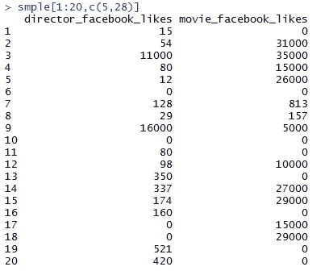

像网飞这样的组织正在利用聚类来瞄准观众中最受欢迎的电影聚类。他们正在出售这些电影，从中赚取巨额利润。

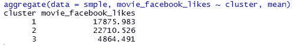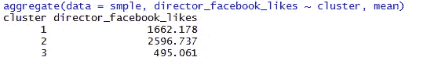

“我们与顾客同在，同呼吸，”网飞产品分析总监戴夫·黑斯廷斯说。目前，网飞在全球拥有 9380 万流媒体客户。他们密切关注你在互联网上的一举一动，比如你喜欢什么电影，你喜欢哪个导演，然后根据受欢迎程度应用聚类对电影进行分组。现在，他们从最受欢迎的集群中推荐电影，并提升他们的业务。

我强烈建议你看看这个 k-means 聚类算法视频教程，它解释了我们在博客中讨论的所有内容。继续，欣赏视频，告诉我你的想法。如果你想查看更多关于 Python、DevOps、Ethical Hacking 等市场最热门技术的文章，你可以参考 Edureka 的官方网站。

请留意本系列中解释数据科学各个方面的其他文章。

*1。* [*数据科学教程*](/edureka/data-science-tutorial-484da1ff952b)

> *2。* [*数据科学的数学与统计*](/edureka/math-and-statistics-for-data-science-1152e30cee73)
> 
> *3。*[*R 中的线性回归*](/edureka/linear-regression-in-r-da3e42f16dd3)
> 
> *4。* [*机器学习算法*](/edureka/machine-learning-algorithms-29eea8b69a54)
> 
> *5。*[*R 中的逻辑回归*](/edureka/logistic-regression-in-r-2d08ac51cd4f)
> 
> *6。* [*分类算法*](/edureka/classification-algorithms-ba27044f28f1)
> 
> *7。* [*随机森林中的 R*](/edureka/random-forest-classifier-92123fd2b5f9)
> 
> *8。* [*决策树中的 R*](/edureka/a-complete-guide-on-decision-tree-algorithm-3245e269ece)
> 
> *9。* [*机器学习入门*](/edureka/introduction-to-machine-learning-97973c43e776)
> 
> *10。* [*朴素贝叶斯在 R*](/edureka/naive-bayes-in-r-37ca73f3e85c)
> 
> *11。* [*统计与概率*](/edureka/statistics-and-probability-cf736d703703)
> 
> *12。* [*如何创建一个完美的决策树？*](/edureka/decision-trees-b00348e0ac89)
> 
> 13。 [*关于数据科学家角色的十大神话*](/edureka/data-scientists-myths-14acade1f6f7)
> 
> 14。 [*顶级数据科学项目*](/edureka/data-science-projects-b32f1328eed8)
> 
> *15。* [*数据分析师 vs 数据工程师 vs 数据科学家*](/edureka/data-analyst-vs-data-engineer-vs-data-scientist-27aacdcaffa5)
> 
> *16。* [*人工智能类型*](/edureka/types-of-artificial-intelligence-4c40a35f784)
> 
> 17。[*R vs Python*](/edureka/r-vs-python-48eb86b7b40f)
> 
> 18。 [*人工智能 vs 机器学习 vs 深度学习*](/edureka/ai-vs-machine-learning-vs-deep-learning-1725e8b30b2e)
> 
> 19。 [*机器学习项目*](/edureka/machine-learning-projects-cb0130d0606f)
> 
> *20。* [*数据分析师面试问答*](/edureka/data-analyst-interview-questions-867756f37e3d)
> 
> *21。* [*面向非程序员的数据科学和机器学习工具*](/edureka/data-science-and-machine-learning-for-non-programmers-c9366f4ac3fb)
> 
> *22。* [*十大机器学习框架*](/edureka/top-10-machine-learning-frameworks-72459e902ebb)
> 
> *23。* [*统计机器学习*](/edureka/statistics-for-machine-learning-c8bc158bb3c8)
> 
> *24。* [*随机森林中的 R*](/edureka/random-forest-classifier-92123fd2b5f9)
> 
> *25。* [*广度优先搜索算法*](/edureka/breadth-first-search-algorithm-17d2c72f0eaa)
> 
> *26。* [*线性判别分析中的 R*](/edureka/linear-discriminant-analysis-88fa8ad59d0f)
> 
> *27。* [*机器学习的先决条件*](/edureka/prerequisites-for-machine-learning-68430f467427)
> 
> *28。* [*互动 WebApps 使用 R 闪亮*](/edureka/r-shiny-tutorial-47b050927bd2)
> 
> *29。* [*机器学习十大书籍*](/edureka/top-10-machine-learning-books-541f011d824e)
> 
> 三十岁。 [*监督学习*](/edureka/supervised-learning-5a72987484d0)
> 
> 31。 [*10 本最好的数据科学书籍*](/edureka/10-best-books-data-science-9161f8e82aca)
> 
> *32。* [*机器学习使用 R*](/edureka/machine-learning-with-r-c7d3edf1f7b)
> 
> *原载于 2017 年 2 月 10 日 https://www.edureka.co**的* [*。*](https://www.edureka.co/blog/k-means-clustering-algorithm/)

*Originally published at* [*https://www.edureka.co*](https://www.edureka.co/blog/k-means-clustering-algorithm/) *on February 10, 2017.*