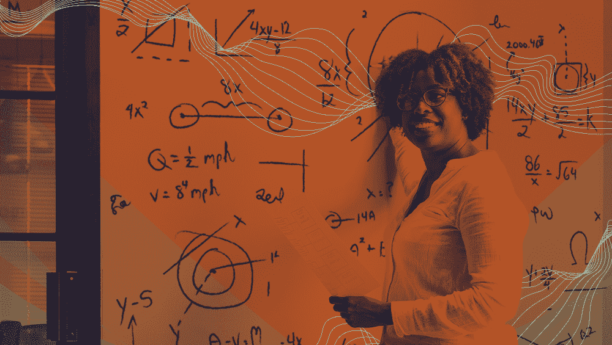
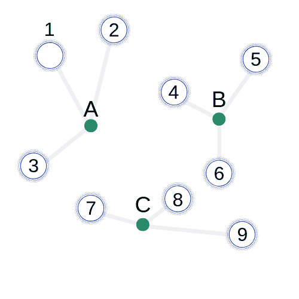
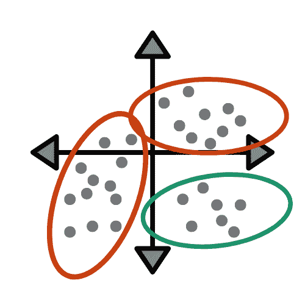
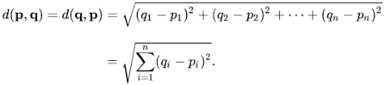
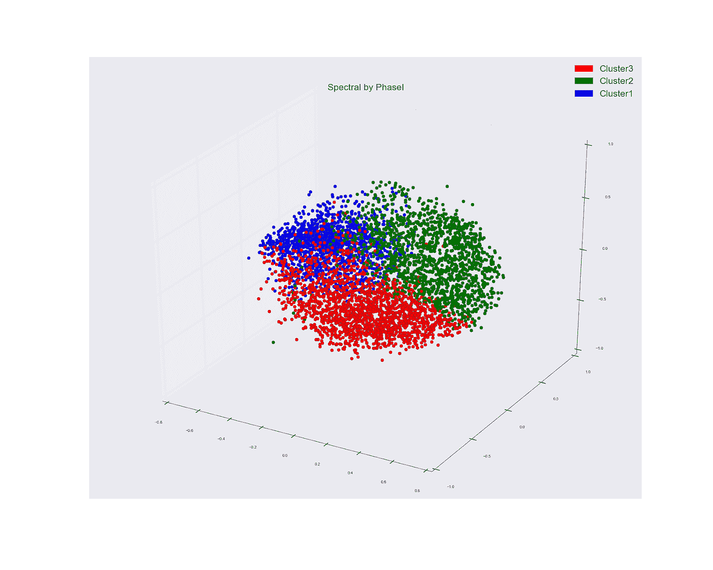

# 机器学习的 k-均值聚类算法

> 原文：<https://medium.com/capital-one-tech/k-means-clustering-algorithm-for-machine-learning-d1d7dc5de882?source=collection_archive---------3----------------------->

## 机器学习算法介绍系列的第 2 部分

***在我们的第一篇帖子中，我们覆盖了*** [***k 近邻***](/capital-one-tech/k-nearest-neighbors-knn-algorithm-for-machine-learning-e883219c8f26) ***。今天我们将讨论 k 均值聚类。***

# 介绍

K-means 聚类是机器学习中经常使用的另一种基本技术。虽然机器学习通常被认为是一个相当新的概念，但其基本原理已经存在了很长时间，超出了许多人的预期。具体来说，k-means 聚类算法自 1967 年以来一直存在，当时它是由一位名叫 [James MacQueen](https://books.google.com/books?hl=en&lr=&id=IC4Ku_7dBFUC&oi=fnd&pg=PA281&dq=james+macqueen+1967+k+means&ots=nOWeHVHhtQ&sig=cV8QP9qlb1hqJvsrG7doH3X-Nl4#v=onepage&q&f=false) 的研究人员首次开发的。与许多其他机器学习技术不同，k-means 用于*未标记的数字数据*而不是已经定义的数据，使其成为一种[无监督学习](https://en.wikipedia.org/wiki/Unsupervised_learning)。由于它的简单和高效，它是最受欢迎的无监督学习技术之一，当我们没有最有组织的数据集时，它可以帮助我们数据科学家解决问题。

k-means 聚类分析算法通过查找数据点之间的平均距离，将数据点分配到类别或聚类中。然后，它迭代这种技术，以便随着时间的推移执行更精确的分类。因为您必须首先将您的数据分类到 k 个类别中，所以您必须充分了解您的数据才能做到这一点。

赞成者:

*   快速高效。
*   处理未标记的数字数据。
*   迭代技术。

**缺点:**

*   必须很好地理解数据的上下文。
*   得自己选择 k 值。
*   大量的重复。
*   存在异常值时表现不佳。

# **创建 K 均值模型的步骤**

使用 k-means 聚类技术有三个主要步骤。

**第一步**

首先，你需要根据你的数据选择一个 k 值，什么值最有意义。k 是您认为您的数据集包含的类别或聚类的数量。如果你真的不确定 k 的值，最好尝试不同的值，直到找到最适合你的数据集的值。然后，您可以比较从不同 k 值生成的不同模型，并选择对您最有意义的模型。

**第二步**

其次，需要通过将每个数据点分配给附近的集群来创建 k 个集群。随机选择集群后，将基于每个集群中数据点的平均值生成一个质心，即集群的最中心点。

**第 3 步**

最后，需要重复前面的步骤，直到达到收敛准则。迭代发生，使得平均距离将继续产生，直到质心值不再改变。一旦它们停止变化，您就拥有了基于 k-均值聚类技术的数据集的最佳算法。

# 在哪里使用 K 均值

k-means 聚类算法在很多不同的行业有很多应用。它可用于识别健康筛查中的不同条件、发现城市交通模式的变化、将 bot 活动与人类活动区分开来，以及将客户细分为不同的目标市场。它通常用于业务目的，以确定客户行为如何随时间变化。如果随着时间的推移，数据点从一个质心移动到另一个质心，这可以提供关于客户行为如何变化的有价值的洞察。

例如，一家杂货店可以查看其客户所做的不同购买，以便确定向他们发送哪些优惠券。如果有人要买冷冻餐和啤酒，杂货店可能会把他们归类为“千禧一代”。然而，如果另一个人正在购买婴儿配方奶粉和饼干面团，商店可能会把它们归类为“新家庭”集群。在这里，杂货店可以选择他们认为自己拥有的客户细分数量，并在此数据集上计算 k-均值聚类。他们可以对不同的 k 值重复计算，看看有多少客户细分，以及如何对它们进行分类，将对他们的商店最有意义。

最终，这家杂货店将能够更准确地对每位顾客进行分类，并向他们发送他们最可能使用的优惠券。

# 均值背后的数学

在创建 k-均值聚类算法的步骤#2 之后，基于聚类中的数据点之间的均值来计算质心。用于计算该距离的公式称为[欧几里德距离](https://en.wikipedia.org/wiki/Euclidean_distance)。

[https://en.wikipedia.org/wiki/Euclidean_distance](https://en.wikipedia.org/wiki/Euclidean_distance)

没听说过欧几里得距离吗？实际上，你很可能有！这个距离公式可能是你在三年级时学的。它只是两点之间的直线距离。在这种情况下，将计算质心与群集中每个数据点之间的距离。然后取一个簇中所有点的平均距离，用于形成质心。

[https://stackoverflow.com/questions/32930647/spectral-clustering-and-multi-dimensional-scaling-in-pytho](https://stackoverflow.com/questions/32930647/spectral-clustering-and-multi-dimensional-scaling-in-pytho)

虽然大多数问题是多方面的，看起来像上面的问题，但理解基本的 2D 公式仍然很重要。

# 结论

K-means 聚类是一种快速有效的算法，当您没有多少关于数据的可用信息时，它可以将数据点分类。但是，请记住，这种算法可能不是您的数据集的最佳技术。如果只有一个聚类自然形成，很可能 k-means 算法不会给出您想要的结果。在这种情况下，你可能需要转向另一种机器学习算法。

与所有无监督学习一样，在决定哪种技术最适合解决您的问题之前，通常理解您的数据是很重要的。反过来，这些技术可以帮助你理解你以前不知道的数据点。使用正确的算法可以节省您的时间，并帮助您获得更准确的结果。谁不想把节省下来的时间用于下一个机器学习项目呢？

要获得更多资源，请查看一些使用 k 均值聚类的项目:

*   [K-表示使用 Python](https://github.com/timothyasp/kmeans)
*   [Matlab 中的 K 均值](https://github.com/Szy-Young/K-means-Clustering)
*   [泰坦尼克号数据科学教程](https://www.youtube.com/watch?v=v_aC0b_blOc)

# 有关系的

*   [机器学习的 K 近邻(KNN)算法](/capital-one-tech/k-nearest-neighbors-knn-algorithm-for-machine-learning-e883219c8f26)
*   [用于机器学习的朴素贝叶斯分类器](/capital-one-tech/naives-bayes-classifiers-for-machine-learning-2e548bfbd4a1)
*   [机器学习的随机森林算法](/capital-one-tech/random-forest-algorithm-for-machine-learning-c4b2c8cc9feb)
*   [用于机器学习的人工神经网络](/capital-one-tech/artificial-neural-networks-for-machine-learning-79c67d0681e9)

披露声明:2019 首创一。观点是作者个人的观点。除非本帖中另有说明，否则 Capital One 不隶属于所提及的任何公司，也不被这些公司认可。使用或展示的所有商标和其他知识产权是其各自所有者的财产。