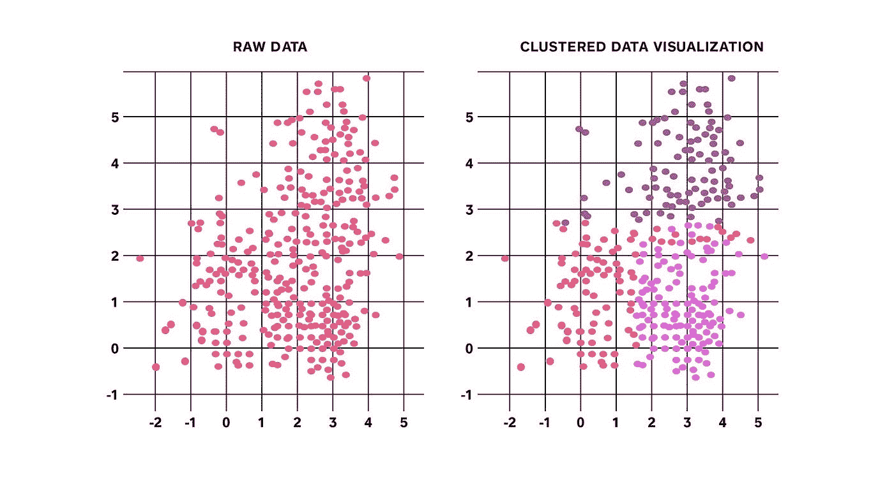
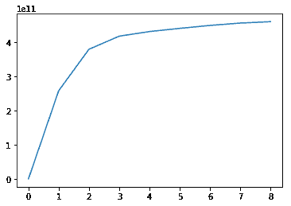
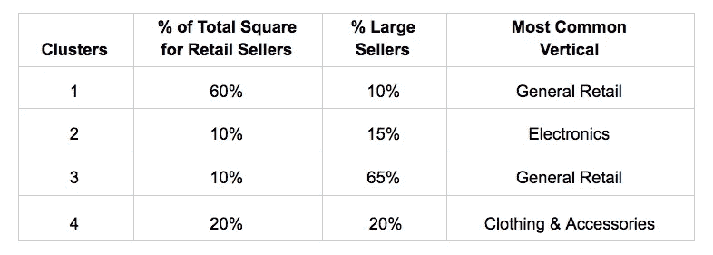
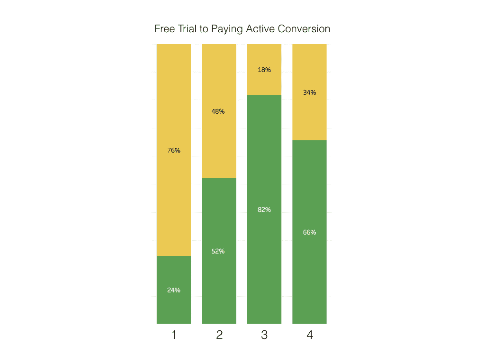
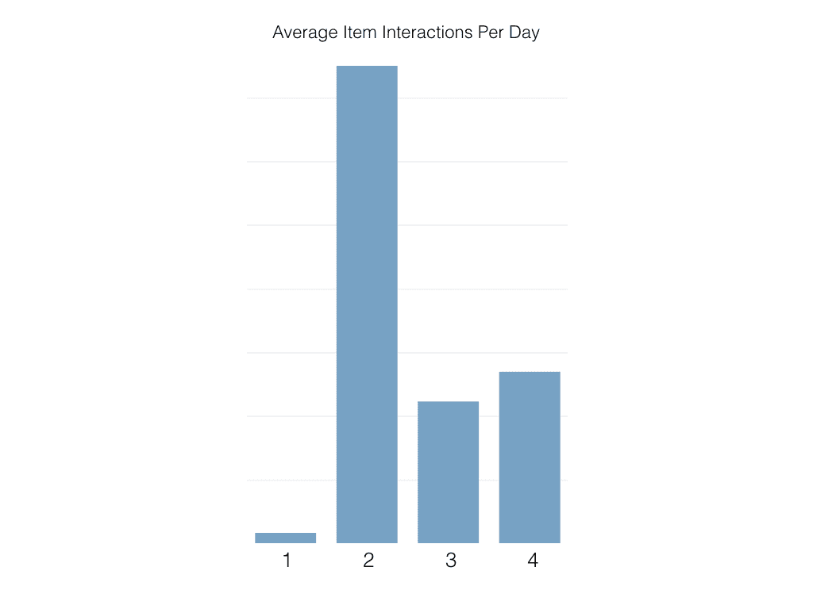
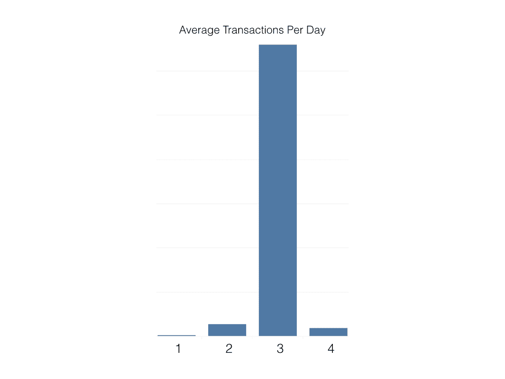

# k-打造更好产品体验的方法

> 原文：<https://medium.com/square-corner-blog/k-means-for-building-better-product-experiences-60069eaf10e3?source=collection_archive---------0----------------------->

> 注意，我们已经行动了！如果您想继续了解 Square 的最新技术内容，请访问我们的新家[https://developer.squareup.com/blog](https://developer.squareup.com/blog)

Square for Retail 于 2017 年发布，是 Square 的第一个垂直销售点，是面向特定卖家群体的解决方案。 [Square for Retail](http://squareup.com/retail) 通过提供强大的库存管理和专为零售体验设计的应用程序等功能，专门满足零售商的需求。

随着团队继续迭代和改进 Square for Retail，我们希望了解导致一些卖家从免费试用转为付费订阅的行为。我们还想了解他们如何使用 Square 的一些零售关键功能。

按个人特征(如行业或业务规模)划分关键指标非常简单，有助于解决产品团队的具体问题。然而，当这些指标变得过于复杂和狭隘时(例如，按行业、企业规模和城市划分的平均每日交易量)，这种做法很容易陷入“分析瘫痪”的状态，最终无法解释。

为了更好地了解我们的卖家，我们使用产品使用信号建立了一个 [K 均值聚类](https://en.wikipedia.org/wiki/K-means_clustering)模型。这让我们能够根据卖家彼此之间的相似程度来识别卖家的自然分组。基于每组的“代表”，我们能够清楚地了解谁是我们的原型客户。我们的目标是让产品团队更好地了解产品的核心客户群，并调整路线图，最终提供更好的销售体验。

(**注意**:虽然我们的聚类模型使用方形数据，但是下面的方法和关键结果使用模拟数据来说明我们的方法。)

# 方法论+特征工程

将[无监督学习](https://en.wikipedia.org/wiki/Unsupervised_learning)应用于数据集的最常见方式之一是[聚类](https://en.wikipedia.org/wiki/Cluster_analysis)，具体来说就是[基于质心的聚类](https://en.wikipedia.org/wiki/Cluster_analysis#Centroid-based_clustering)。聚类获取大量观察值，并根据相似性将它们分成不同的组:

*Figure 1: Taking a 2-dimensional dataset and separating it into 3 distinct clusters*

用于 K-means 模型的数据包括卖家级别的信息(位置数量、员工数量、使用 Square 进行零售的设备数量等。)以及产品使用信息(包括交易、库存调整和创建/编辑/删除项目)。Square 的免费试用期和付费订阅期的数据都包括在内，适用于在该平台上至少 30 天的零售卖家。

数字数据以几种方式在卖方层面进行汇总:

*   卖家一生的平均值(在免费试用或付费订阅状态下)
*   卖方前 30 天期限的总和(实际上是他们的免费试用期)
*   卖家一生中的最高金额(在免费试用或付费订阅状态下)

“我应该使用多少个集群？”是使用 K-means 时的一个常见问题。有多种[技术](https://en.wikipedia.org/wiki/Determining_the_number_of_clusters_in_a_data_set)来确定这一点——我们采用了肘方法，该方法将方差百分比解释为集群数量的函数。本质上，Elbow 方法表明，增加另一个聚类(k+1)的聚类数(k)仅导致所解释的方差百分比的小的边际增益。

*Figure 2: Plotting the % of variance (y-axis, intervals of 10%) explained against the number of clusters*

虽然上面的图 2 表明三个集群可能是最理想的，但是我们在模型中考虑了三个和四个集群。在比较了三个和四个聚类模型中各个特性的方差后，我们最终决定四个最具代表性。

在清理数据集的过程中，我们移除了高度相关的要素(相关的要素使得解释模型的结果更加困难)，以及在聚类之间没有差异的要素。

# 解释结果

K-means 聚类需要数值数据来得到一组聚类。然而，在运行模型并得出我们的聚类之后，我们还使用分类数据(例如行业和企业规模)来开发对我们的聚类的上下文理解。在模型运行后添加这样的数据也有助于我们理解为什么数据以特定的方式分离。

我们使用 Python (pandas，sklearn)来清理数据，构建模型，并聚合我们的聚类数据、聚类分配和人口统计数据的最终特征集。对于额外的可视化，我们将最终数据集导入 Tableau。

从这里，我们探索了每个聚类的数字和分类属性，以努力从每个聚类中构建“代表性卖家”。

# 结果

如上所述，**下面详述的结果包括零售数据的模拟方块，仅供示例。**

零售卖家的大部分 Square 属于第 1 类，其他类代表较小的百分比。为了理解为什么以及如何分离这些聚类，我们通过上述各种人口统计数据来分割我们的数据集。

下面的几个例子展示了这四个分类是如何根据特定的人口统计数据而变化的:

## 企业规模

在本例中，从人口统计细分中得出的最大收获之一是，第 3 类主要包含较大的卖家。当考虑为这些更复杂的卖家开发产品功能时，从这个集群中获得的知识可能会很有用。

## 免费试用转换

下面，我们看到集群 3 和 4 在免费试用后最有可能转变为付费订阅。这可能意味着从功能角度来看，他们从 Square for Retail 中获得了最大的价值。在未来的营销活动中瞄准类似的卖家可能会导致更高的转化率。

*Sellers in Cluster 3 & 4 showed the highest conversion rate to a Square for Retail paid subscription*

## 项目互动

除了 Square 的核心销售点解决方案之外，强大的库存管理功能是 Square Retail sets 的一大特色。因为这些特性是建立在与项目交互(例如，创建、编辑和删除)的基础上的，所以我们想了解集群如何以不同的方式与项目交互。一个有趣的发现是，第 2 类卖家每天与商品的互动最为活跃:

*Cluster 2 sellers were very engaged with creating, editing, and deleting items*

## 每天平均交易量

有趣的是，在过去，我们观察到一些卖家因为 Square 的独特功能而将其用于零售，但仍继续在 Square 的核心销售点产品上处理支付。因此，我们认为对本例有用的另一个成功指标是卖家是否在 Square 上处理零售交易。我们看到，虽然集群 3 代表了零售卖家所有交易平台的一小部分，但他们在交易方面非常活跃:

When it came to average transactions per day, Cluster 3 was way ahead of other clusters

## 代表性卖家

有了上面的示例数据，当向业务利益相关者解释这些模拟发现时，我们可以强调在每个集群中观察到的关键质量:

*   **集群 1** 包含大量小型零售商，他们的特点是好奇尝试 Square 的零售。不过最终，它们显示了最低水平的项目互动和免费试用转换。
*   **聚类 2** 显示高于平均水平的项目交互，这在电子商店中很常见(该聚类中最常见的垂直行业)。
*   **集群 3** 仅代表零售卖家 Square 的 10%,但从交易角度来看，集群 3 卖家是迄今为止最活跃的。这可能是因为集群 3 主要包含较大的卖家，这些卖家更有可能拥有专门的客户经理，并在其多个地点促进推广，从而推动更深入的产品采用。
*   **集群 4** 包含 20%的卖家，服装&配件是最常见的垂直市场。该集群显示出对关键产品功能的高度参与，以及付费订阅的第二高转化率。

# 结论

使用这些模拟数据，聚类模型为零售卖家生成了四个不同的 Square 聚类。这些结果，如果是真实的，可以产生一些关键的学习，以帮助影响产品团队的路线图:

*   集群 3 拥有在多个地点大量使用 Square 进行零售的大型卖家。这可能有助于告知(1)该产品应该与 Square 的免费产品有足够的区别，足以吸引更复杂的卖家，这些卖家过去不会考虑 Square 的需求，以及(2)更多的帐户管理资源应该专用于 Square for Retail。
*   聚类 4 包含的卖家是聚类 3 的两倍。考虑到集群 4 与关键库存功能的高度契合、较高的平均交易规模以及免费试用的高转换率，在选择未来要构建/优先考虑的功能时，集群 4 可能是一个“最佳点”。

对像 Square for Retail 这样的新产品使用 K-Means 聚类有助于团队更好地了解我们为之构建的客户。这种类型的分析的一个好处是，一旦模型建立起来，当团队发布新特性或赢得更多客户时，它可以在将来被重用。值得注意的是，集群性能会因模型选择、数据聚合方式、用例等而异。

我们在团队休假前几周提交了实际结果，一位领导将这一分析描述为“提前的圣诞礼物”所以也有那种好处！