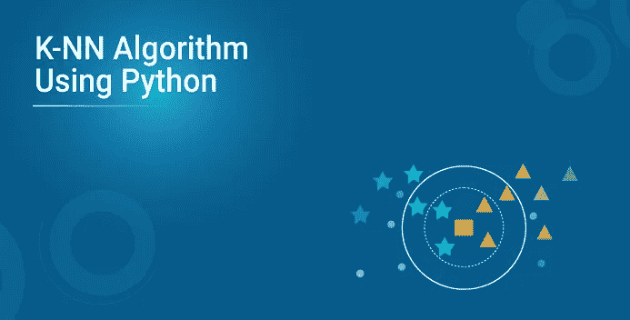
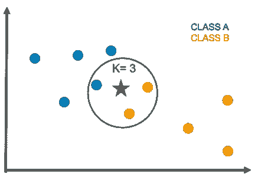
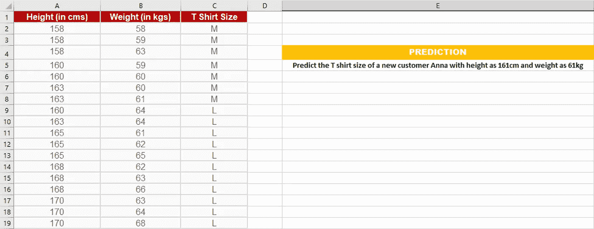
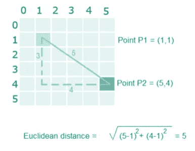
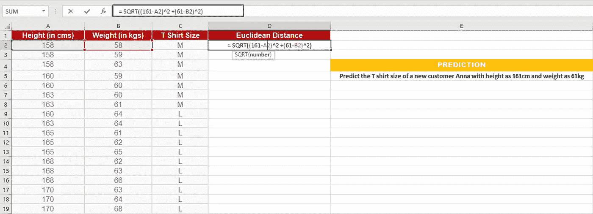
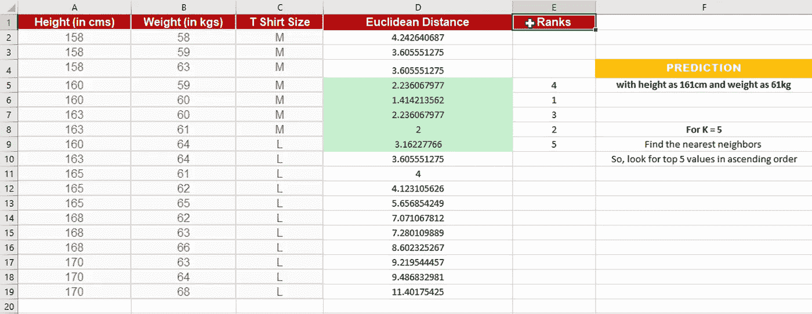
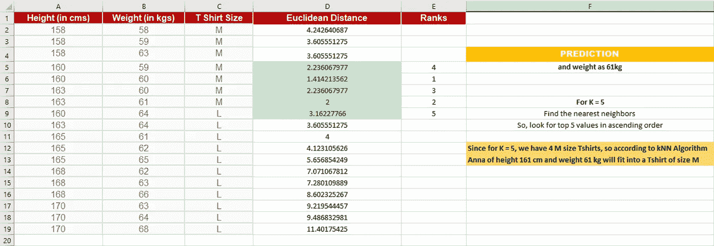

# 基于 Python 的 k-最近邻算法

> 原文：<https://medium.com/edureka/k-nearest-neighbors-algorithm-b87ee824b860?source=collection_archive---------7----------------------->



随着商业世界完全围绕着数据科学，它已经成为除了领域之外最重要的领域之一。在这篇关于 KNN 算法的文章中，您将了解 KNN 算法是如何工作的，以及如何使用 Python 来实现它。

# 什么是 KNN 算法？

“K 最近邻或 KNN 算法是一种简单的算法，在其训练阶段使用整个数据集。每当一个看不见的数据实例需要预测时，它会在整个训练数据集中搜索 k 个最相似的实例，具有最相似实例的数据最终作为预测返回。

KNN 经常用于搜索应用程序，在那里你要寻找**相似的**物品，比如**寻找与这个相似的物品。**

该算法表明，如果 ***你和你的邻居相似，那么你就是他们中的一员*** 。例如，如果苹果看起来更像桃子、梨和樱桃(水果)，而不是猴子、猫或老鼠(动物)，那么苹果很可能是一种水果。

# KNN 算法是如何工作的？

k-最近邻算法使用一种非常简单的方法来执行分类。当使用新示例进行测试时，它会查看训练数据，并找到与新示例最接近的 k 个训练示例。然后，它将最常见的类标签(在那些 k-training 示例中)分配给测试示例。

# KNN 算法中的“k”代表什么？



KNN 算法中的 k 代表投票支持新测试数据类的最近邻点的数量。

如果 k=1，则测试示例被赋予与训练集中最接近的示例相同的标签。

如果 k=3，则检查三个最接近的类的标签，并分配最常见的(即，至少出现两次)标签，对于较大的 ks，依此类推。

# KNN 算法手动实现

让我们考虑这个例子，

假设我们有几个顾客的身高和体重及其相应的 t 恤尺寸。你的任务是预测安娜的 t 恤尺寸，她的身高是 161 厘米，体重是 61 公斤。



**步骤 1:** 计算新点和现有点之间的欧几里德距离
例如，点 P1(1，1)和 P2(5，4)之间的欧几里德距离为:



**第二步:**选择 K 的值，选择 K 个邻居到新点的最近距离。
在这种情况下，选择具有最小欧几里德距离的前 5 个参数



**步骤 3:** 统计所有 K 个邻居/预测值的投票
因为对于 K = 5，我们有 4 件尺寸为 M 的 t 恤衫，因此根据 kNN 算法，身高 161 cm、体重 61kg 的 Anna 将适合尺寸为 M 的 t 恤衫。



# 用 Python 实现 kNN 算法

*   处理数据
*   计算距离
*   找到 k 个最近点
*   预测班级
*   检查准确性

“不要光看，要实践！”

**第一步:**处理数据

第一步是使用[虹膜数据集](https://archive.ics.uci.edu/ml/machine-learning-databases/iris/iris.data)处理笔数据集。O *打开功能*，用 csv 模块下的*读取功能*读取数据线。

```
**import** csv
with open(r'C:UsersAtul HarshaDocumentsiris.data.txt') as csvfile:
     lines **=** csv.reader(csvfile)
     **for** row **in** lines:
          print (', '.join(row))
```

现在，您需要将数据分为训练数据集(用于进行预测)和测试数据集(用于评估模型的准确性)。

在继续之前，请将作为字符串加载的 flower measures 转换为数字。接下来，将数据集随机分为训练数据集和测试数据集。通常，67/33 的标准比率用于测试/训练分割

综上所述，让我们定义一个函数 ***handleDataset*** ，当提供了确切的文件名时，该函数将加载 CSV，并使用提供的拆分比率将其随机拆分为训练和测试数据集。

```
**import** csv
**import** random
**def** handleDataset(filename, split, trainingSet**=**[] , testSet**=**[]):
    with open(filename, 'r') as csvfile:
         lines **=** csv.reader(csvfile)
         dataset **=** list(lines)
         **for** x **in** range(len(dataset)**-**1):
             **for** y **in** range(4):
                 dataset[x][y] **=** float(dataset[x][y])
         **if** random.random() < split:
            trainingSet.append(dataset[x])
         **else**:
            testSet.append(dataset[x])
```

让我们检查一下上面的函数，看看它是否工作正常，

测试 **handleDataset** 函数

```
trainingSet**=**[]
testSet**=**[]
handleDataset(r'iris.data.', 0.66, trainingSet, testSet)
print ('Train: ' **+** repr(len(trainingSet)))
print ('Test: ' **+** repr(len(testSet)))
```

**步骤 2:** 计算距离
为了进行任何预测，你必须计算新点和现有点之间的距离，因为你将需要 k 个最近的点。

在这种情况下，为了计算距离，我们将使用欧几里得距离。这被定义为两个数字数组的平方差之和的*平方根*

具体来说，我们只需要前 4 个属性(特征)来计算距离，因为最后一个属性是类标签。因此，其中一种方法是将欧几里得距离限制为固定长度，从而忽略最终维数。

综上所述，我们定义 ***欧几里德距离*** 函数如下:

```
**import** math
**def** euclideanDistance(instance1, instance2, length):
    distance **=** 0
    **for** x **in** range(length):
        distance **+=** pow((instance1[x] **-** instance2[x]), 2)
    **return** math.sqrt(distance)
```

测试 ***欧几里德距离*** 函数，

```
data1 **=** [2, 2, 2, 'a']
data2 **=** [4, 4, 4, 'b']
distance **=** euclideanDistance(data1, data2, 3)
print ('Distance: ' **+** repr(distance))
```

**第三步:**找到 k 个最近点

既然您已经计算了每个点的距离，我们可以使用它来收集给定测试数据/实例的 k 个最相似的点/实例。

这是一个简单的过程:计算所有实例之间的距离，并选择具有最小欧几里德距离的子集。

让我们创建一个***getKNeighbors***函数，它从给定测试实例的训练集中返回 k 个最相似的邻居

```
**import** operator
**def** getKNeighbors(trainingSet, testInstance, k):
    distances **=** []
    length **=** len(testInstance)**-**1
    **for** x **in** range(len(trainingSet)):
        dist **=** euclideanDistance(testInstance, trainingSet[x], length)
        distances.append((trainingSet[x], dist))
    distances.sort(key**=**operator.itemgetter(1))
    neighbors **=** []
    **for** x **in** range(k):
        neighbors.append(distances[x][0])
    **return** neighbors
```

测试 **getKNeighbors** 函数

```
trainSet **=** [[2, 2, 2, 'a'], [4, 4, 4, 'b']]
testInstance **=** [5, 5, 5]
k **=** 1
neighbors **=** getNeighbors(trainSet, testInstance, 1)
print(neighbors)
```

**第四步:**预测班级

现在您已经有了给定测试实例的 k 个最近点/邻居，下一个任务是根据这些邻居预测响应

为此，您可以允许每个邻居为其类属性投票，并将多数投票作为预测。

让我们创建一个 *getResponse* 函数来获得来自多个邻居的多数投票响应。

```
**import** operator
**def** getResponse(neighbors):
    classVotes **=** {}
    **for** x **in** range(len(neighbors)):
        response **=** neighbors[x][**-**1]
        **if** response **in** classVotes:
            classVotes[response] **+=** 1
    **else**:
            classVotes[response] **=** 1
    sortedVotes **=** sorted(classVotes.items(),   key**=**operator.itemgetter(1), reverse**=**True)
    **return** sortedVotes[0][0]
```

测试 getResponse 功能

```
neighbors **=** [[1,1,1,'a'], [2,2,2,'a'], [3,3,3,'b']]
print(getResponse(neighbors))
```

**第五步:**检查准确度

现在我们已经有了 kNN 算法的所有部分。让我们检查一下我们的预测有多准确！

评估模型准确性的一种简单方法是计算所有预测中正确预测总数的比率。

让我们创建一个 getAccuracy 函数，该函数对所有正确预测进行求和，并返回正确分类百分比的准确性。

```
**def** getAccuracy(testSet, predictions):
    correct **=** 0
    **for** x **in** range(len(testSet)):
        **if** testSet[x][**-**1] **is** predictions[x]:
            correct **+=** 1
     **return** (correct**/**float(len(testSet))) ***** 100.0
```

测试 **getAccuracy** 功能

```
testSet **=** [[1,1,1,'a'], [2,2,2,'a'], [3,3,3,'b']]
predictions **=** ['a', 'a', 'a']
accuracy **=** getAccuracy(testSet, predictions)
print(accuracy)
```

既然我们已经创建了 KNN 算法的所有部分，让我们使用 main 函数将它们连接起来。

```
# Example of kNN implemented from Scratch in Python**import** csv
**import** random
**import** math
**import** operator**def** handleDataset(filename, split, trainingSet**=**[] , testSet**=**[]):
    with open(filename, 'rb') as csvfile:
         lines **=** csv.reader(csvfile)
         dataset **=** list(lines)
         **for** x **in** range(len(dataset)**-**1):
             **for** y **in** range(4):
                  dataset[x][y] **=** float(dataset[x][y])**if** random.random() < split: trainingSet.append(dataset[x]) **else**: testSet.append(dataset[x]) **def** euclideanDistance(instance1, instance2, length): distance **=** 0 **for** x **in** range(length): distance **+=** pow((instance1[x] **-** instance2[x]), 2) **return** math.sqrt(distance) **def** getNeighbors(trainingSet, testInstance, k): distances **=** [] length **=** len(testInstance)**-**1 **for** x **in** range(len(trainingSet)): dist **=** euclideanDistance(testInstance, trainingSet[x], length) distances.append((trainingSet[x], dist)) distances.sort(key**=**operator.itemgetter(1)) neighbors **=** [] **for** x **in** range(k): neighbors.append(distances[x][0]) **return** neighbors **def** getResponse(neighbors): classVotes **=** {} **for** x **in** range(len(neighbors)): response **=** neighbors[x][**-**1] **if** response **in** classVotes: classVotes[response] **+=** 1 **else**: classVotes[response] **=** 1 sortedVotes **=** sorted(classVotes.iteritems(), key**=**operator.itemgetter(1), reverse**=**True) **return** sortedVotes[0][0] **def** getAccuracy(testSet, predictions): correct **=** 0 **for** x **in** range(len(testSet)): **if** testSet[x][**-**1] **==** predictions[x]: correct **+=** 1 **return** (correct**/**float(len(testSet))) ***** 100.0 **def** main():# prepare data trainingSet=[] testSet=[] split = 0.67 loadDataset('iris.data', split, trainingSet, testSet) print 'Train set: ' + repr(len(trainingSet)) print 'Test set: ' + repr(len(testSet))# generate predictions predictions=[] k = 3 for x in range(len(testSet)): neighbors = getNeighbors(trainingSet, testSet[x], k) result = getResponse(neighbors) predictions.append(result) print('> predicted=' + repr(result) + ', actual=' + repr(testSet[x][-1]))accuracy **=** getAccuracy(testSet, predictions)
print('Accuracy: ' **+** repr(accuracy) **+** '%')
main()
```

这都是关于使用 python 的 kNN 算法。

就这样，我们到了这篇文章的结尾。如果你对这个话题有任何疑问，请在下面留下评论，我们会尽快回复你。如果你想查看更多关于 Python、DevOps、Ethical Hacking 等市场最热门技术的文章，你可以参考 Edureka 的官方网站。

请留意本系列中的其他文章，它们将解释数据科学的各个方面。

> *1。* [*数据科学教程*](/edureka/data-science-tutorial-484da1ff952b)
> 
> *2。* [*数据科学的数学与统计*](/edureka/math-and-statistics-for-data-science-1152e30cee73)
> 
> *3。*[*R 中的线性回归*](/edureka/linear-regression-in-r-da3e42f16dd3)
> 
> *4。* [*数据科学教程*](/edureka/data-science-tutorial-484da1ff952b)
> 
> *5。*[*R 中的逻辑回归*](/edureka/logistic-regression-in-r-2d08ac51cd4f)
> 
> *6。* [*分类算法*](/edureka/classification-algorithms-ba27044f28f1)
> 
> *7。* [*随机森林中的 R*](/edureka/random-forest-classifier-92123fd2b5f9)
> 
> *8。* [*决策树中的 R*](/edureka/a-complete-guide-on-decision-tree-algorithm-3245e269ece)
> 
> *9。* [*机器学习入门*](/edureka/introduction-to-machine-learning-97973c43e776)
> 
> *10。* [*朴素贝叶斯在 R*](/edureka/naive-bayes-in-r-37ca73f3e85c)
> 
> *11。* [*统计与概率*](/edureka/statistics-and-probability-cf736d703703)
> 
> 12。 [*如何创建一个完美的决策树？*](/edureka/decision-trees-b00348e0ac89)
> 
> *13。* [*关于数据科学家角色的十大误区*](/edureka/data-scientists-myths-14acade1f6f7)
> 
> *14。* [*排名前 5 的机器学习算法*](/edureka/machine-learning-algorithms-29eea8b69a54)
> 
> 15。 [*数据分析师 vs 数据工程师 vs 数据科学家*](/edureka/data-analyst-vs-data-engineer-vs-data-scientist-27aacdcaffa5)
> 
> 16。 [*人工智能的种类*](/edureka/types-of-artificial-intelligence-4c40a35f784)
> 
> 17。[*R vs Python*](/edureka/r-vs-python-48eb86b7b40f)
> 
> *18。* [*人工智能 vs 机器学习 vs 深度学习*](/edureka/ai-vs-machine-learning-vs-deep-learning-1725e8b30b2e)
> 
> *19。* [*机器学习项目*](/edureka/machine-learning-projects-cb0130d0606f)
> 
> 20。 [*数据分析师面试问答*](/edureka/data-analyst-interview-questions-867756f37e3d)
> 
> *21。* [*面向非程序员的数据科学和机器学习工具*](/edureka/data-science-and-machine-learning-for-non-programmers-c9366f4ac3fb)
> 
> *22。* [*十大机器学习框架*](/edureka/top-10-machine-learning-frameworks-72459e902ebb)
> 
> *23。* [*用于机器学习的统计*](/edureka/statistics-for-machine-learning-c8bc158bb3c8)
> 
> *24。* [*随机森林中的 R*](/edureka/random-forest-classifier-92123fd2b5f9)
> 
> *25。* [*广度优先搜索算法*](/edureka/breadth-first-search-algorithm-17d2c72f0eaa)
> 
> *26。*[*R 中的线性判别分析*](/edureka/linear-discriminant-analysis-88fa8ad59d0f)
> 
> *27。* [*机器学习的先决条件*](/edureka/prerequisites-for-machine-learning-68430f467427)
> 
> *28。* [*互动 WebApps 使用 R 闪亮*](/edureka/r-shiny-tutorial-47b050927bd2)
> 
> 29。 [*机器学习十大书籍*](/edureka/top-10-machine-learning-books-541f011d824e)
> 
> *三十。* [*无监督学习*](/edureka/unsupervised-learning-40a82b0bac64)
> 
> *31.1* [*0 最佳数据科学书籍*](/edureka/10-best-books-data-science-9161f8e82aca)
> 
> 32。 [*监督学习*](/edureka/supervised-learning-5a72987484d0)

*原载于 2018 年 7 月 26 日*[*https://www.edureka.co*](https://www.edureka.co/blog/k-nearest-neighbors-algorithm/)*。*