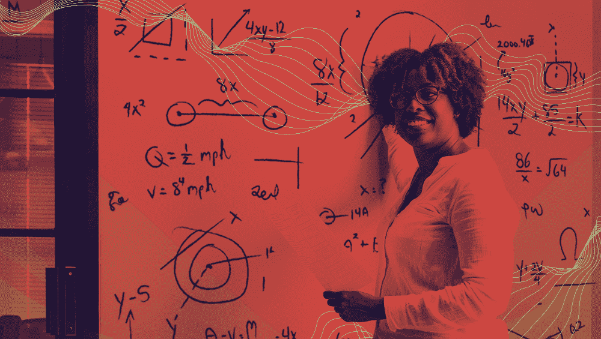
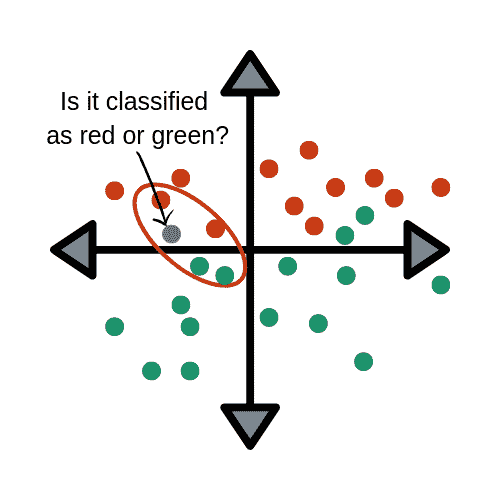
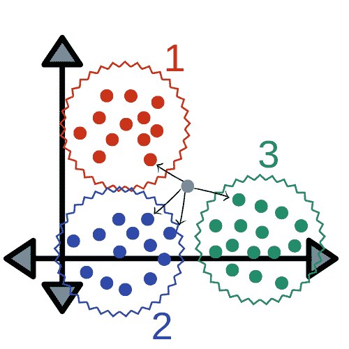
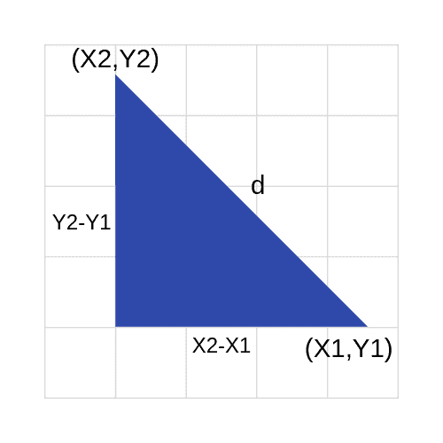

# 机器学习的 k-最近邻(KNN)算法

> 原文：<https://medium.com/capital-one-tech/k-nearest-neighbors-knn-algorithm-for-machine-learning-e883219c8f26?source=collection_archive---------1----------------------->

机器学习算法介绍系列的第 1 部分

# 介绍

如果你熟悉机器学习和该领域使用的基本算法，那么你可能听说过 k-最近邻算法，或 KNN。该算法是机器学习中使用的更简单的技术之一。这是业内许多人首选的方法，因为它易于使用且计算时间短。

什么是 KNN？KNN 是一种根据最相似的点对数据点进行分类的模型。它使用测试数据对未分类点应分类为什么做出“有根据的猜测”。

**优点:**

*   好用。
*   计算时间快。
*   不对数据做出假设。

**缺点:**

*   准确性取决于数据的质量。
*   必须找到一个最佳的 k 值(最近邻的数量)。
*   不擅长对边界内的数据点进行分类，而这些数据点可以以某种方式进行分类。

KNN 是一种被认为是非参数的算法，也是懒惰学习的一个例子。这两个术语到底是什么意思？

*   [非参数化](https://en.wikipedia.org/wiki/Nonparametric_statistics)意味着它不做任何假设。该模型完全是由提供给它的数据组成的，而不是假设它的结构是正常的。
*   懒惰学习意味着算法不进行归纳。这意味着使用这种方法时几乎不需要培训。因此，当使用 KNN 时，所有的训练数据也用于测试。

# 在哪里使用 KNN

KNN 通常用于简单的推荐系统、图像识别技术和决策模型。这是网飞或亚马逊等公司用来推荐不同电影或书籍的算法。网飞甚至发起了 Netflix 有奖竞赛，奖励创造最准确推荐算法的团队 100 万美元！

你可能想知道，*“但是这些公司是怎么做到的呢？”嗯，这些公司会将 KNN 应用到你在他们网站上看过的电影或买过的书的数据集上。然后，这些公司会输入你现有的客户数据，并将其与看过类似电影或买过类似书籍的其他客户进行比较。然后，根据他们过去使用 KNN 的情况，该数据点将被归类为某个简档。推荐的电影和书籍将取决于算法如何分类该数据点。*

上图展示了 KNN 在尝试根据给定的数据集对数据点进行分类时的工作方式。将它与其最近的点进行比较，并根据它最接近和最相似的点进行分类。在这里，您可以看到点 Xj 将根据其与每组点的距离被分类为 W1(红色)或 W3(绿色)。

# **KNN 背后的数学**

就像几乎所有其他东西一样，KNN 的工作是因为它使用了根深蒂固的数学理论。当实现 KNN 时，第一步是将数据点转换成特征向量，或者它们的数学值。然后，该算法通过找出这些点的数学值之间的距离来工作。找到这个距离最常用的方法是欧几里德距离，如下所示。

KNN 运行这个公式来计算每个数据点和测试数据之间的距离。然后，它会找出这些点与测试数据相似的概率，并根据哪些点共享最高概率对其进行分类。

为了形象化这个公式，它应该是这样的:

# 结论

现在你知道了一个最基本的机器学习算法的基本原理。当第一次学习基于不同的数据集构建模型时，这是一个很好的起点。如果你有一个包含许多不同点和准确信息的数据集，这是一个开始用 KNN 探索机器学习的好地方。

当开始使用这种算法时，请记住以下三点:

*   首先，找到一个易于使用的数据集，最好是包含大量不同点和标记数据的数据集。
*   第二，找出哪种语言最容易用来解决问题。我最熟悉的是在 R 中使用 KNN，但 Python 也是机器学习专业人士的流行语言。
*   第三，做你的研究。了解使用该算法的正确做法非常重要，这样您就可以从数据集中找到最准确的结果。

已经进行了关于如何改进该算法的各种研究。这些研究的目的是让你可以不同地衡量类别，以便进行更准确的分类。这些类别的权重根据距离的计算方式而有所不同。

总之，这是一个基本的机器学习算法，它是可靠的，因为许多原因，如易于使用和快速计算时间。在开始探索机器学习的世界时，这是一个很好的算法，但它仍有改进和修改的空间。

有关更多资源，请查看一些使用 k 近邻的项目:

*   [手写数字识别](https://www.youtube.com/watch?v=ZD_tfNpKzHY)
*   [Scikit-Learn](https://github.com/scikit-learn/scikit-learn/tree/master/sklearn/neighbors)
*   [KNN 使用 Python](https://github.com/div3125/k-nearest-neighbors)

# 相关:

*   [用于机器学习的 K-Means 聚类算法](/capital-one-tech/k-means-clustering-algorithm-for-machine-learning-d1d7dc5de882)
*   [用于机器学习的朴素贝叶斯分类器](/capital-one-tech/naives-bayes-classifiers-for-machine-learning-2e548bfbd4a1)
*   [机器学习的随机森林算法](/capital-one-tech/random-forest-algorithm-for-machine-learning-c4b2c8cc9feb)
*   [用于机器学习的人工神经网络](/capital-one-tech/artificial-neural-networks-for-machine-learning-79c67d0681e9)

披露声明:2019 首创一。观点是作者个人的观点。除非本帖中另有说明，否则 Capital One 不隶属于所提及的任何公司，也不被这些公司认可。使用或展示的所有商标和其他知识产权是其各自所有者的财产。