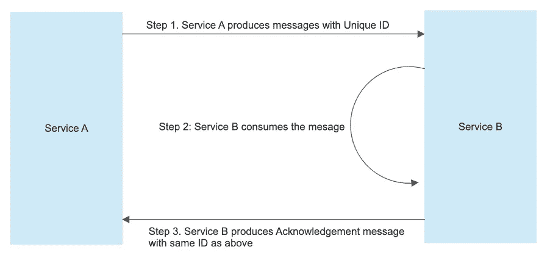
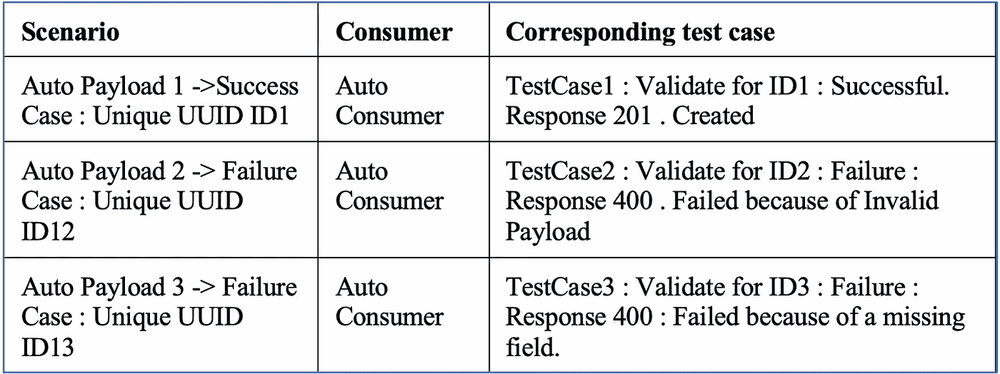
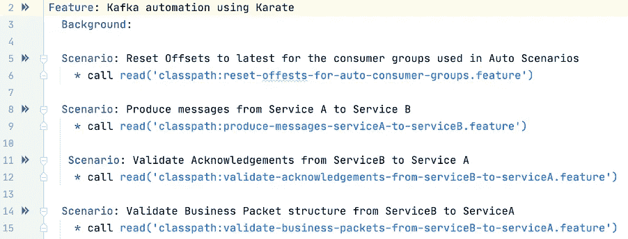
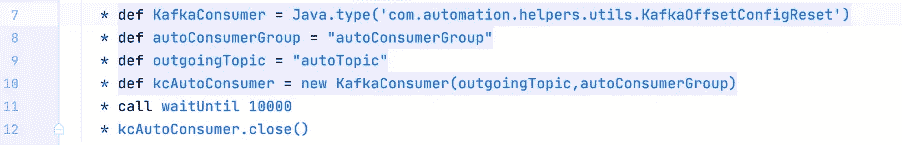
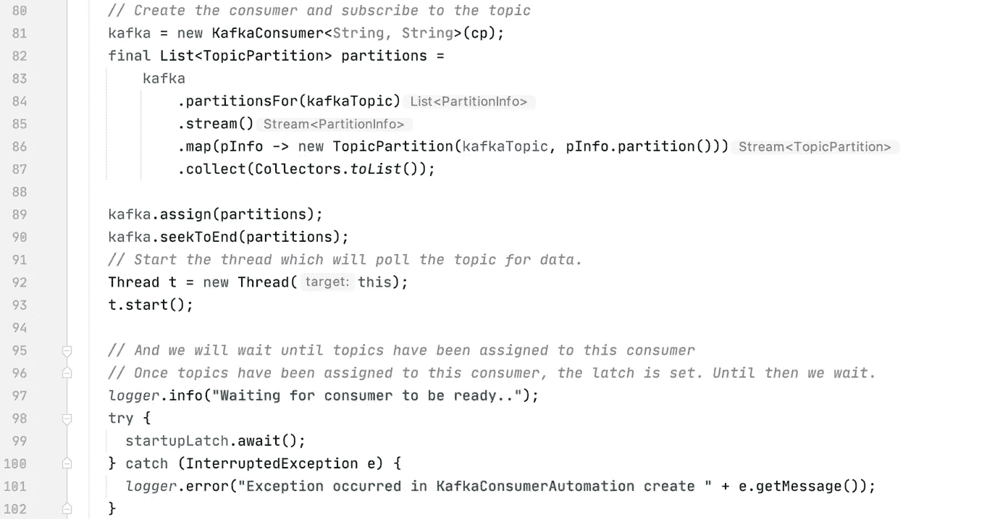
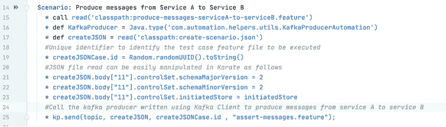
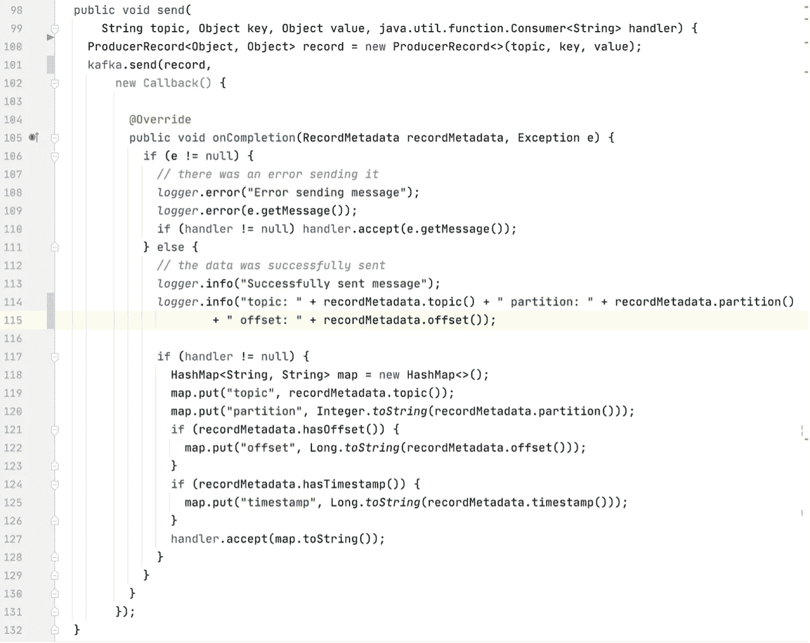
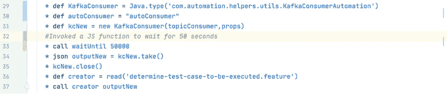
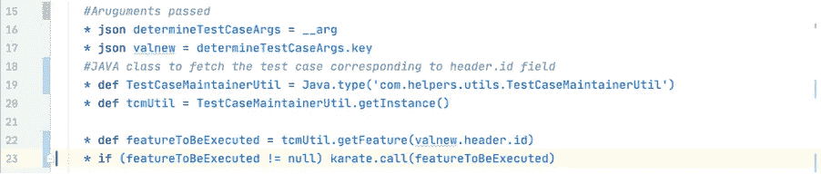

# 使用空手道的卡夫卡自动化

> 原文：<https://medium.com/walmartglobaltech/kafka-automation-using-karate-6a129cfdc210?source=collection_archive---------0----------------------->

**自动化需求:**

在持续集成(CI)中，开发团队实现小的更改，并频繁地将代码签入版本控制存储库。连续交付(CD)自动部署到选定的基础架构环境中。大多数开发人员在多个部署环境中工作，比如生产、开发和测试。这些服务器上的任何延迟或错误都会影响所有的开发部署。

自动化减少了在 CI 和 CD 的许多重复步骤中可能发生的错误数量。

一个额外的好处是，它节省了开发人员在产品开发上花费的时间，同时也降低了将错误代码交付到产品中的风险。

**空手道:**

空手道是 Intuit 开发的一个强大的自动化工具，它基于 Cucumber 推广的 BDD 语法，因此它是语言中立的，对于非程序员来说也很容易。测试执行和报告生成感觉就像任何标准的 Java 项目。你不需要编译代码。只需用简单易读的语法编写测试。

**用例:**

我们托管在 Azure private PaaS 上的服务使用 Cucumber framework 对我们的 REST APIs 进行端到端的功能测试。由于我们已经习惯了 Cucumber 并编写了测试，我们计划探索使用空手道来处理我们新引入的 Kafka 组件的自动化的可能性。幸运的是，这个决定被证明是正确的。:D

我们在运行现有 Auto 时面临的主要问题是，我们必须使用 JPA 维护一个单独的验证服务，以连接到我们的数据库并执行操作。由于大多数团队远程工作，建立了不必要数量的数据库连接，从而阻碍了开发人员，妨碍了他们的工作效率。甚至资源优化也没有到位，因为即使在没有运行的情况下也使用了大量资源。

然而，由于空手道提供了开箱即用的支持，通过特性文件连接到各种数据库/Azure Resources/Kafka (SQL、blob、cosmos 等),以在特性文件中运行 Java 类，并提供严格的方法来执行验证，我们可以取消验证服务，将所有代码转移到空手道。

探索每一步的各种优势，让我们看看我们是如何使用空手道实现 Kafka 自动化的。

**设置:**

该场景主要由两个使用 Kafka 相互交互的服务(服务 A 和服务 B)组成。

流程如下:

*   服务 A 产生消息。
*   服务 B 使用这些消息，并根据消息的使用情况生成一个确认数据包。
*   成功消费后，服务 B 也会生成一个业务包。

将使用空手道进行模拟和自动化的流程:

*   从服务 A 到服务 b 的消息生产
*   从服务 B 到服务 a 的确认包验证



Flow Simulated for our use case

**涵盖的场景**

在下表中，生产者生产的每个数据包都可以使用 ID 字段进行唯一标识。



Scenario Covered

创建一个生产者，用于为各种场景(成功的和错误的数据包)向主题填充消息

*   创建一个 singleton 类来更新 HashMap，它将包含形式为< KEY , TEST-CASE >的条目。每当生产者发布新消息时，就会调用这个函数。
    KEY →字段，通过它我们可以唯一地标识生产者-消费者对(在我们的例子中是 ID)。
    值→应该为特定场景执行的特征文件的名称。
*   使用唯一的组 id 创建另一个汽车消费者，并收听传出的话题。
*   遍历消费者选择的所有消息，并根据 ID，读取 HashMap 来确定要执行的测试用例(特性文件)。

上表中定义的场景将通过此方法以下列方式处理:

ID1 ->由自动生成器生成→条目会出现在 HashMap →
< ID1，feature file 1 . feature>
ID2->由自动生成器生成→条目会出现在 HashMap →
< ID2，feature file 2 . feature>
ID3->由自动生成器生成→条目会出现在 HashMap →
< ID3，FeatureFile3.feature >

一旦所有的信息都被公布，我们的汽车消费者将会参与进来。

ID1 →基于 ID1 从 HashMap 中读取→确定该案例的特征文件(FeatureFile1.feature)并执行验证集。
ID2 →基于 ID2 从 HashMap 中读取→确定该案例的特征文件(FeatureFile2.feature)并执行验证集。
ID3 →基于 ID3 从 HashMap 中读取→确定该案例的特征文件(FeatureFile3.feature)并执行验证集。

**使用的 Maven 依赖关系:**

空手道依赖

```
<dependency>
   <groupId>com.intuit.karate</groupId>
   <artifactId>karate-apache</artifactId>
   <version> 0.9.5</version>
</dependency>
```

Kafka 客户端依赖性:

```
<dependency>
    <groupId>org.apache.kafka</groupId>
    <artifactId>kafka-clients</artifactId>
    <version>2.5.0</version>
</dependency>
```

**使用的方法:**

这就是我们空手道特征文件的样子。



Karate feature file used

**第一步:**

将自动化场景中使用的使用者组的偏移量重置为最新值，以便选择为自动化场景发布的消息，而不是其他消息，从而确保顺利运行。



Reset offset to latest

在我们的特性文件中，我们将调用 JAVA 代码在其他步骤开始执行之前将偏移量重置为 latest。



Java code used for resetting the offset

**第二步:**

产生从服务 A 到服务 b 的消息。

在这一步中，我们将根据需要读取 JSON 或 XML 或任何其他格式，并将其发布到服务 B 的传入主题。Producer 是用 JAVA 编写的，是一个 Kafka 客户端，将记录发布到 Kafka 集群。

发布消息的空手道特征文件:



Feature file to publish messages

用于将数据发送到订阅主题的 Java 代码。



Java code for producing messages

第三步:

验证从服务 B 到服务 A 的确认数据包

这种情况下的主要步骤是:

*   从服务 B 向服务 a 获取确认包。在调用 poll()之前，消费者只是在空转。只有在调用 poll()之后，它才会启动到集群的连接，获得分配的分区并尝试获取消息。所以我们将调用 poll()，然后等待一段时间，直到分区被分配。然后发出一个信号(倒计时锁存)，让构造函数可以返回。



Fetch acknowledgement based on ID

根据我们在步骤 2 中发布消息时使用的 ID，确定要执行的测试用例。



Determine test case to be executed

执行一组验证。

**结论:**

在对 Cucumber 上运行的现有测试集进行分析并将其转移到空手道上之后，我们确实看到了测试运行所用时间的改进，因为空手道提供了并行运行，并增加了以下优势:

*   数据驱动的测试甚至可以使用 JSON 或 CSV 源代码
*   跨测试轻松重用 JSON 或 JS / Java 逻辑
*   强大而灵活的有效负载断言
*   聚合报告的并行执行
*   通过跨平台可执行文件/ CLI 轻松集成 CI

**鸣谢:**

感谢 [Mayur Patki](https://medium.com/u/e8ad3283f426?source=post_page-----6a129cfdc210--------------------------------) 帮助完成方法和设计。