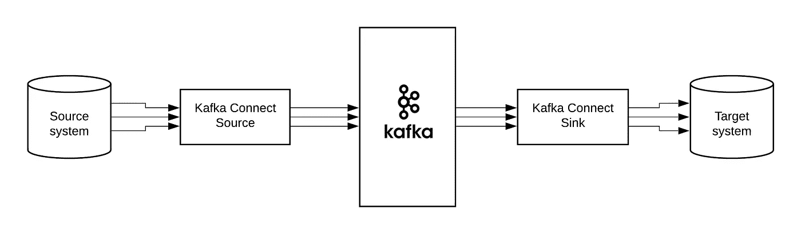
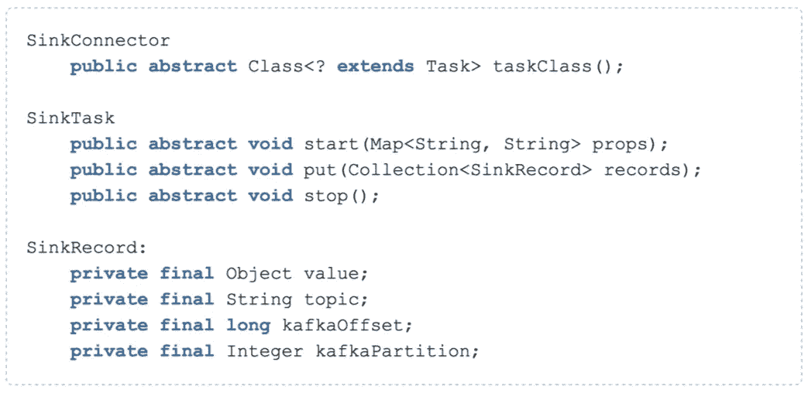
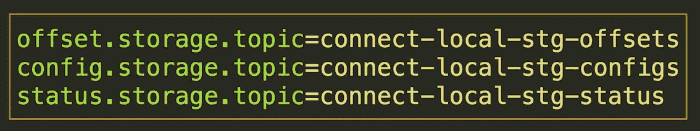

# Kafka 连接概述

> 原文：<https://medium.com/walmartglobaltech/kafka-connect-overview-a84782d96ab5?source=collection_archive---------0----------------------->

# 概观

Kafka Connect 是一个工具，用于在 Apache Kafka 和其他系统之间可扩展和可靠地传输数据。

*   Kafka 连接器的通用框架
*   分布式和独立模式
*   REST 界面有助于更好的操作
*   自动偏移管理
*   默认情况下是分布式和可扩展的
*   流式/批量集成

参赛:https://kafka.apache.org/documentation/

Kafka connect 用于向/从 Kafka 集群移动大量数据。

Kafka connect 提供了一个框架，有助于编写用于特定任务的连接器:从 Kafka 收集大量数据并发送到目标系统(Kafka connect sink ),或将从某个源系统收集的事件发送到 Kafka (Kafka connect source)

为 Kakfa 编写的连接器可以是源或接收器连接器。

*   Source connector 有助于将大量数据从源系统发送到 Kafka(即，它向 Kakfa 生成事件)
*   Sink connector 有助于从 Kafka 获取大量数据并发送到目标系统(即，它使用 Kakfa 的事件)

使用 Kafka Connect 编写这些连接器非常简单。

在使用 Kafka 集群时，与如何连接、处理 Kafka 集群特定条目、重新平衡问题相关的大部分繁重工作都由 kafka connect 负责。

因此，开发人员可以专注于特定于项目需求的任务，Kafka-Connect 将处理其余的任务。

# 履行

在这一节中，让我们详细了解一下接收连接器(源连接器可以用类似的方式构建)

下沉连接器

*   您的连接器类将扩展 SinkConnector，它是入口点，负责通过为每个任务提供给定的配置来旋转所需数量的任务。
*   关于此配置的更多信息将在本文档的后面部分介绍。

下沉任务

*   您的 SinkTask 类将扩展 sink task，它包含应用于从 Kafka cluster 接收的记录的主要逻辑。

下沉记录

*   给出从 Kafka 集群获取的每个记录的详细信息，包括值、主题、KafkaOffset、KafkaPartittion 等..

连接分布式属性

*   注意:在为生产规模运行时，kafka connect 将以分布式模式运行，存储主题将跟踪每个连接器的配置、偏移和状态。
*   这些需要在 SinkConnector 将要连接的 Kafka 集群上专门创建

# 生产部署

*   一旦构建了 Sink connector，在分布式系统上进行部署就需要一个合适的部署脚本来帮助完成与操作和维护相关的任务。
*   基于脚本的自动化部署最适合。
*   Ansible 可以提供在多个端口上运行 Kafka-connect 的选项，指定 Kafka 版本，用于完全部署或特定操作任务的选项等

# 性能和规模

*   运行生产时，性能和规模是非常重要的因素。
*   以下是我们测试的一些统计数据..在水平缩放的帮助下，甚至可以获得更高的数字
*   测试统计:每秒 100 万个事件，每秒处理 1.5GB 数据

# 我的看法

基于所提供的功能、Kafka 的本机支持、编写连接器的简易性以及规模/性能，当需要将大量数据移入/移出 Kafka 集群时，请确保将 Kafka Connect 作为选项之一

# Kafka Connect 快速入门

下一篇文章将帮助快速设置开始

希望你喜欢这篇文章，并学到一些新东西。如果是，记得按下**拍手**按钮:-)