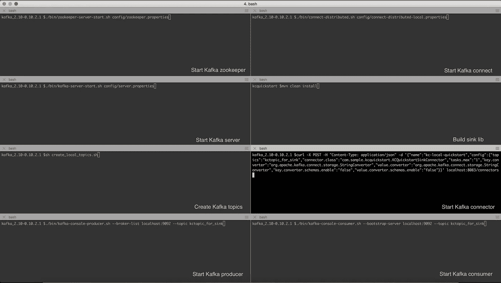
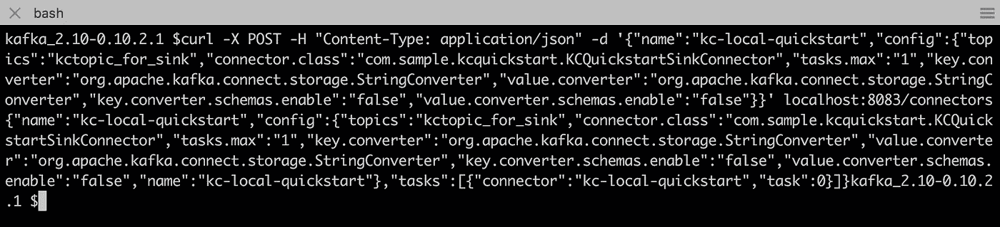
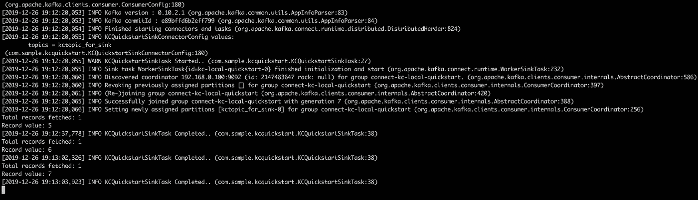

# Kafka Connect 快速入门

> 原文：<https://medium.com/walmartglobaltech/kafka-connect-quickstart-71c8a70bc454?source=collection_archive---------0----------------------->

本指南将有助于 Kafka Connect 的端到端本地设置。

接收器连接器，它将从 Kafka 主题(kctopic_for_sink)获取记录，并在控制台上输出其值。

*   假设:Java8，Maven，卡夫卡基础知识
*   本指南使用的 Kafka 版本:Kafka _ 2.10–0 . 10 . 2 . 1
*   根据具体的项目需求，随时将所需的库升级到最新版本

1.从[阿帕奇卡夫卡](https://archive.apache.org/dist/kafka/0.10.2.1/kafka_2.10-0.10.2.1.tgz)下载卡夫卡

创建这两个额外的文件

*   “Kafka _ 2.10–0 . 10 . 2 . 1/config/”下的 connect-distributed-local . properties

> bootstrap . servers = localhost:9092
> group . id = local-connect-cluster
> 
> key . converter = org . Apache . Kafka . connect . JSON . JSON converter
> value . converter = org . Apache . Kafka . connect . JSON . JSON converter
> 
> internal . key . converter = org . Apache . Kafka . connect . JSON . JSON converter
> internal . value . converter = org . Apache . Kafka . connect . JSON . JSON converter
> internal . key . converter . schemas . enable = false
> internal . value . converter . schemas . enable = false
> 
> offset . storage . topic = connect-local-stg-offsets
> config . storage . topic = connect-local-stg-configs
> status . storage . topic = connect-local-stg-status
> 
> consumer . max . poll . records = 1
> consumer . enable . auto . commit = false
> consumer . auto . offset . reset = latest

*   “Kafka _ 2.10–0 . 10 . 2 . 1/”下的 create_local_topics.sh(用于创建运行 Kafka-connect 所需的主题，也可以逐个创建这些主题，跳过此处。sh 文件)

> #!/bin/sh
> 。/bin/Kafka-topics . sh-list-zookeeper localhost:2181
> 。/bin/Kafka-topics . sh-create-zookeeper localhost:2181-replication-factor 1-partitions 1-topic connect-local-stg-offsets
> 。/bin/Kafka-topics . sh-create-zookeeper localhost:2181-replication-factor 1-partitions 1-topic connect-local-stg-configs
> 。/bin/Kafka-topics . sh—create—zookeeper localhost:2181 —复制—因子 1—分区 1—topic connect-local-stg-status
> 。/bin/Kafka-topics . sh—create—zookeeper localhost:2181 —复制—因子 1—分区 1 — topic kctopic_for_sink
> 。/bin/Kafka-topics . sh-list-zookeeper localhost:2181

这些可以单独创建，以防你从其他仓库下载 Kafka。

2.从下面给出的源代码构建 KCQuickstartSinkConnector jar

感兴趣的文件:

*   [KCQuickstartSinkConnector.java](https://github.com/luckykurhe/kcquickstart/blob/master/src/main/java/com/sample/kcquickstart/KCQuickstartSinkConnector.java)
*   【KCQuickstartSinkConnectorConfig.java】
*   [KCQuickstartSinkTask.java](https://github.com/luckykurhe/kcquickstart/blob/master/src/main/java/com/sample/kcquickstart/KCQuickstartSinkTask.java)

[源代码](https://github.com/luckykurhe/kcquickstart)

3.获取如所示的控制台设置(以便更好地查看每个屏幕上运行的命令)

4.将 KCQuickstartSinkConnector jar 复制粘贴到文件夹“Kafka _ 2.10–0 . 10 . 2 . 1/libs/”

5.启动卡夫卡动物园管理员

6.启动 Kafka 服务器

7.创建卡夫卡主题

8.启动 Kafka Conosle 制作人

9.启动 Kafka 连接

10.使用 REST API 调用`curl -X POST -H "Content-Type: application/json"` `-d '{"name":"kc-local-quickstart","config":{"topics":"kctopic_for_sink","connector.class":"com.sample.kcquickstart.KCQuickstartSinkConnector","tasks.max":"1","key.converter":"org.apache.kafka.connect.storage.StringConverter","value.converter":"org.apache.kafka.connect.storage.StringConverter","key.converter.schemas.enable":"false","value.converter.schemas.enable":"false"}}'` `localhost:8083/connectors`启动一个连接器

11.使用 Kafka 控制台生成器向 Kafka 主题“kctopic_for_sink”发送少量记录

12.由于主题上有新记录，连接器应该获取这些记录并将其发送到 SinkTask 进行处理

13.检查 Kafka-Connect 的输出控制台，记录应该显示在这里..

14。*现在，您有了一个用于完整 Kafka connect 开发和测试目的的端到端本地设置。*

希望您喜欢快速入门指南，并学到了一些新东西。如果是，记得按下**拍手**按钮:-)