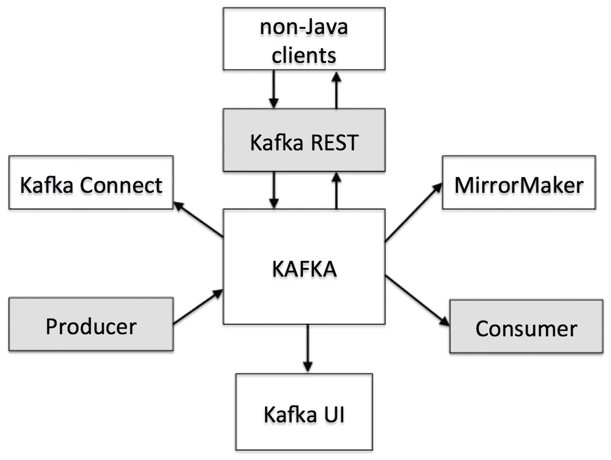
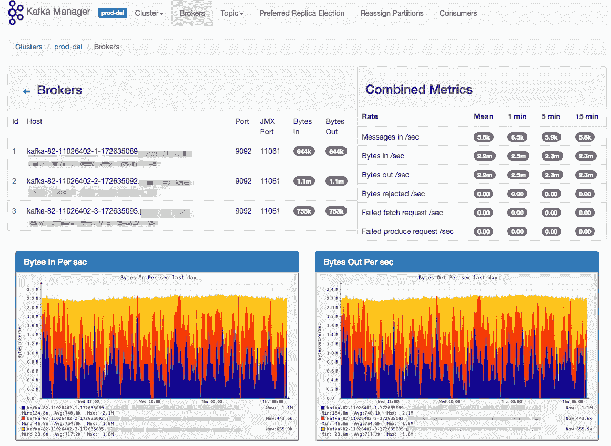
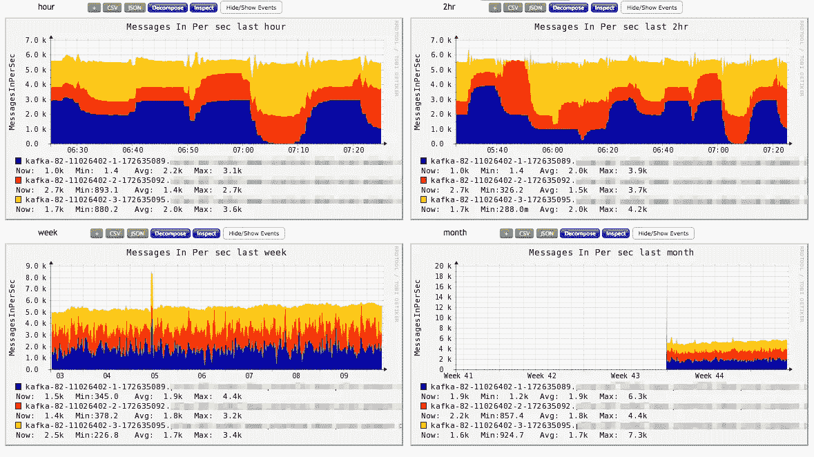
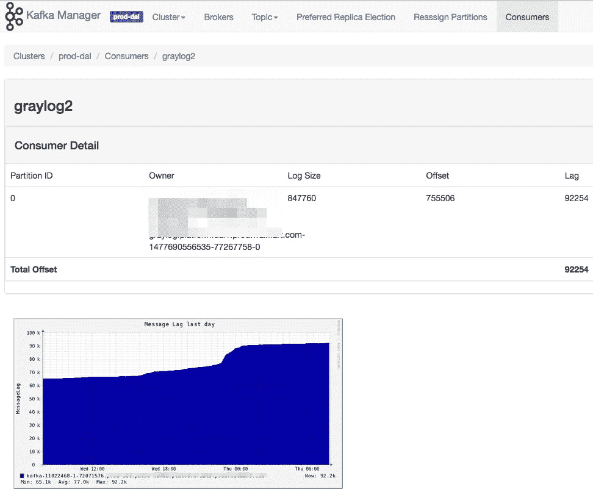
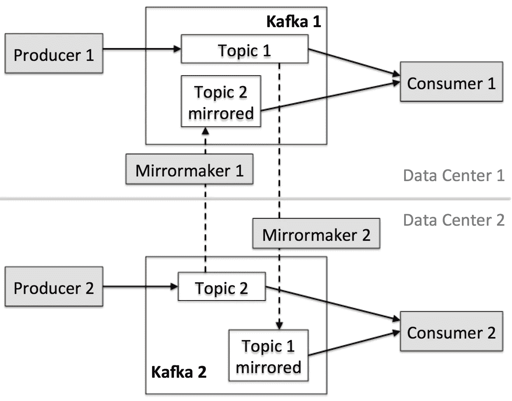

# 沃尔玛云上的卡夫卡生态系统

> 原文：<https://medium.com/walmartglobaltech/kafka-ecosystem-on-walmarts-cloud-983570dff1f2?source=collection_archive---------2----------------------->

在我们之前的[博客](/walmartlabs/tech-transformation-real-time-messaging-at-walmart-8787f5ab19e8#.p7maleepr)中，我们介绍了“为什么”我们将沃尔玛的 Kafka 服务从共享裸机迁移到新的“自助式”Kafka 部署，该部署由 [OpenStack](https://www.youtube.com/watch?v=pdWSWs08LMg) 和 [OneOps](http://www.oneops.com/) 提供支持。今天，我想介绍一下卡夫卡的生态系统是什么样子的。

Kafka Ecosystem at Walmart

上图没有完全捕捉所有实时管道，但旨在突出关键组件及其之间的关系。

## 核心服务

*   **Kafka Brokers** :我们目前正在推出 Kafka 版本 0.10.1.0，采用了[建议的 JVM 参数，](https://kafka.apache.org/documentation#java)以利用与 0.8 系列相比更好的稳定性和可靠性。
*   **MirrorMaker** :它用于将某些主题从一个 Kafka 集群复制到另一个 Kafka 集群，通常跨数据中心。我们创建了一个内部代码补丁来支持完整的主题重命名。
*   **Kafka REST 代理**:支持非 Java 客户端的基于 HTTP 的代理。这对于我们现有的系统非常有用，因为它们可能会为了方便而牺牲一点点吞吐量，例如，不用自己的编程语言编写 Kafka 客户端。
*   **Kafka Connect** :用于将 Kafka 数据存储在永久存储器中，如 HDFS。好处包括:(1)基于 Hadoop 的应用程序现在可以使用 Kafka 数据，以及(2)针对数据丢失的另一个保护级别。

## 卡夫卡 UI

Apache Kafka 没有 UI，所以我们继承了开源的 Kafka Manager ,因为它有简洁的 UI 设计和完善的操作特性。我们不足的几个地方之一是“监控”为了补救这一点，在我们自己的 Kafka Manager 分支中，我们在 Kafka Manager 的每个页面中添加了受欢迎的 Kafka 指标的监控图。例如，代理级页面:

Kafka Manager with Monitoring

通过点击监控图，我们甚至可以看到不同历史时刻的监控图。(例如，过去 1/2/4 小时、过去一天/一周/一个月，甚至是去年)。举个例子，

Monitoring Graphs across Different Historical Moments

消费者滞后，表示消费者落后于生产者的程度，也可以形象化为这张图。例如:

Kafka Consumer Lag with Monitoring Graph

## 部署

为了获得更好的性能，我们建议用户在一个数据中心部署 Kafka 集群，但是如果整个数据中心都停机，这将会有一个可用性问题。

事实上，我们的许多 Kafka 用例都有一些共性:

1.  **本地生产者**:数据源独立位于 2-3 个主要数据中心，没有重复。例如，Walmart.com[的](https://www.walmart.com/)由跨多个数据中心的许多应用程序提供支持，如果我们想要收集它们的日志，源位于 2-3 个地方，但是没有重复的日志。
2.  **全球消费者**:下游应用程序希望全面了解来自所有数据中心的数据。例如，应用程序性能监控(APM)工具需要获取所有日志，以便显示指标并提醒数据中心的哪个应用程序出现了问题。

为了满足“本地生产者”、“全球消费者”和跨数据中心的高可用性(应用程序级，例如 APM)，部署计划通常如下所示:

Kafka Deployment to achieve High Availability for Application

从上图来看，生产者只向本地 Kafka 集群生产，每个数据中心的消费者同时收听两个(甚至更多)话题:一个是“本地”话题，另一个是来自其他集群的“镜像”话题。

请注意，如果数据中心停机，Kafka 集群和 MirrorMaker 离线，应用程序的 VIP 应该切换到工作数据中心(如果需要)。暂时，工作的消费者只能看到本地消息，但是依赖于消费者的应用程序仍然在运行。

当数据中心恢复时，Kafka 群集将恢复工作，MirrorMaker 将从数据中心停机时开始复制数据。

## 监控管道

我们使用 [jmxtrans](https://github.com/jmxtrans/jmxtrans) 作为 JMX 和监控后端之间的桥梁。目前我们支持两个监控后端: [Graphite](https://graphite.readthedocs.io/en/latest/) 和 [Ganglia](http://ganglia.info/) ，这由用户在部署 Kafka 时选择。

*   Ganglia:我们使用单播模式来最小化网络“抖动”,因为网络通常是云上主机之间的“细”管道。
*   Graphite:适用于希望在 Graphite 上使用 [Grafana](http://Grafana) 构建漂亮仪表板的用户。

我们未来工作的一部分是支持用于存储指标的可伸缩时序数据存储，如 [influxdb](https://github.com/influxdata/influxdb) 、 [kariosdb](https://github.com/kairosdb/kairosdb) 。

## 沃尔玛的物流加工

随着许多开源系统的出现，流处理领域一直在蓬勃发展。在沃尔玛，我们主要使用 [Spark Streaming](http://spark.apache.org/streaming/) 和 [Storm:](http://storm.apache.org/) Storm 提供了具有巨大可扩展性的光速流处理基础设施，而 Spark 拥有 [lambda 架构](https://spark-summit.org/2014/wp-content/uploads/2014/07/Lambda-Architecture-Jim-Scott..pdf) 用于批处理/ETL 和流工作负载。Spark 和 Storm 都很好地使用了 Kafka，并且它们的用例覆盖广泛:A/B 测试、电子邮件定位、产品库存更新和监控仪表板。

## 摘要

我们计划继续致力于 Kafka core 及其生态系统。该计划是将卡夫卡置于更多更具挑战性的制作场景中，只要问题可以用“流”的概念来建模和解决。

请在 Twitter 上找到我: [@NingZhang6](https://twitter.com/NingZhang6)