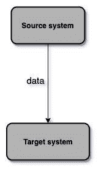
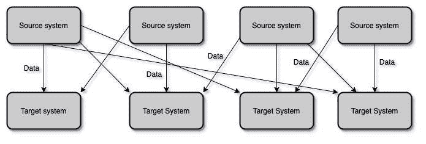
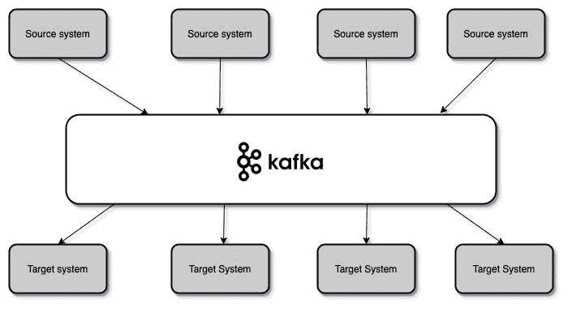
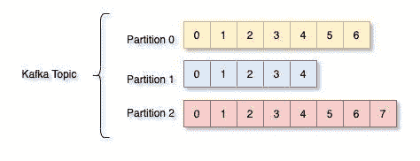
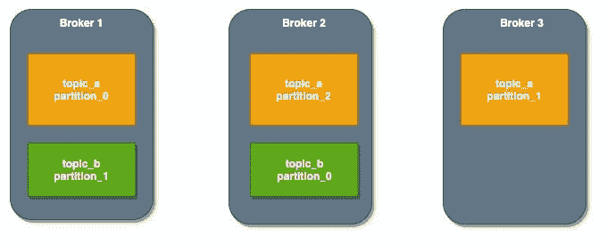
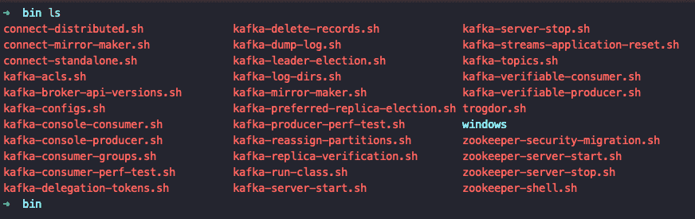
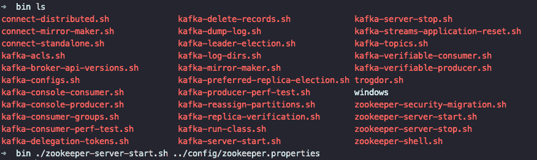
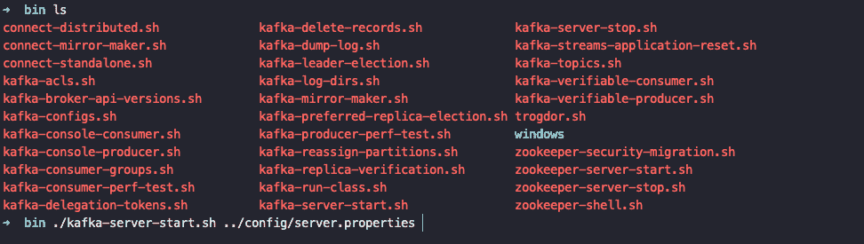

# Kafka 快速入门和 AEM 集成

> 原文：<https://medium.com/globant/kafka-quick-introduction-and-aem-integration-7797928d63a9?source=collection_archive---------0----------------------->

# **简介**

Apache Kafka 是一个开源的分布式事件[流](https://amzn.to/3jVCVfK)平台，被世界各地的许多公司使用，允许我们为关键任务应用程序提供高性能数据管道、流分析和数据集成。

公司过去常常开始使用简单的点对点集成，就像这样:

**Figure 1: Simple integration**

过了一段时间，需求发生了变化，然后公司需要集成更多的资源和更多的目标，这在将来会变得复杂。

**Figure 2.Spaghetti integration**

上述体系结构存在以下问题:

*   *如果你有 4 个源系统和 6 个目标系统，你需要写 24 个集成*
*   *每个集成都伴随着协议(TCP、HTTP、REST、FTP、JDBC 等)、数据格式(二进制、CSV、JSON 等)、数据模式(数据是如何形成的以及可能发生的变化)方面的困难。*
*   等等。

一个解决办法是使用 ***阿帕奇*卡夫卡**之类的东西:

**Figure 3\. Kafka approach**

**为什么用阿帕奇卡夫卡:**

*   *分布式，弹性架构，容错。*
*   *横向可伸缩性:可以扩展到数百个代理，可以扩展到每秒数百万条消息。*
*   *高性能(延迟小于 10 毫秒)实时*
*   *被很多公司使用，财富 500 强的 35%:Airbnb，网飞，Linked In，优步，沃尔玛等。*

**使用案例:**

*   *信息系统*
*   *活动跟踪*
*   *应用程序日志*
*   *流处理*
*   *系统集成的解耦*
*   *与大数据的融合。*

# **快速启动**

**主题、分区和偏移量**

**主题，**特定的数据流

*   *类似于数据库中的一个表。*
*   根据您的需求，您可以拥有任意多的主题。
*   主题由其名称来标识。

**分区，**主题被拆分成 ***分区*** 。

*   每个分区都是有序的
*   一个分区内的每条消息都有一个增量 id，称为 ***偏移量***

**Figure 4\. Kafka Topic**

**偏移**，每个分区中的特定消息

*   *每个偏移量只对一个特定的分区有意义，例如，分区 0 中的偏移量 3 不代表与分区 1 中的偏移量 3 相同的数据。*
*   *只能在一个分区内保证顺序(不能跨分区)。*
*   *数据只保存一周，这是默认时间。*
*   *数据一旦写入分区，就无法更改。*

# **经纪人**

Kafka 集群由多个代理(服务器)组成。让我们来看看一些特点:

*   每个代理都用其 ID(整数)来标识。
*   *每个代理包含特定的主题分区。*
*   *如果我们连接到任何代理，我们就会连接到集群。*

**Figure 5\. Brokers and topics**

# **制片人**

*   *生产者将数据写入主题，记住主题是由分区组成的。*
*   *生产者自动知道要写入哪个代理和分区，我们不必指定，因此对我们来说，这消除了许多负担，我们只需连接到 Kafka。*
*   *在代理失败的情况下，生产者将自动恢复，我们不需要实现那个特性，它已经为我们完成了。*

# **消费者**

*   *消费者从一个主题中读取数据，他们知道自动读取哪个经纪人，这已经为我们编程好了。*
*   *万一经纪人倒闭，消费者知道如何挽回，我们不用考虑这个。*
*   *数据在每个分区内被读取和排序，这意味着偏移量 3 在偏移量 2 之后被读取，而不是之前。*
*   *消费者也可以从多个分区中读取数据，但不能保证在代理、分区 1 和分区 2 之间按顺序读取数据，这是并行读取的。*

## **消费群体**

*   *消费者阅读消费群体中的数据*
*   组中的每个消费者从独占分区中读取数据。
*   *如果用户数量超过分区数量，一些用户将处于非活动状态。*
*   *消费者将自动使用 GroupCoordinator 和 ConsumerCoordinator 将消费者分配到分区，这是 Kafka 中已经实现的机制。*

# 动物园管理员

*   Zookeeper 管理经纪人(保存他们的列表)
*   Zookeeper 帮助我们进行分区的领导者选举。当一个代理关闭时，有一个新的分区成为领导者，zookeeper 帮助我们做到了这一点。
*   Zookeeper 会在发生变化时向 Kafka 发送通知，例如，新主题、新经纪人、经纪人死亡、删除主题等。…
*   卡夫卡离不开 Zookeeper，我们先启动 Zookeeper，再启动卡夫卡。

# **安装**

## **步骤一:下载阿帕奇卡夫卡**

*   从下载页面[下载最新版本阿帕奇卡夫卡](https://bit.ly/32aDtrO)。
*   提取它

**Figure 6\. Apache Kafka source**

## **第二步:与 Kafka 代理合作**

Kafka 针对基于 Unix 的平台和 Windows 平台有不同的脚本。在 Windows 平台上，使用 bin\windows\而不是 bin/

**Figure 7\. Apache Kafka source content**

**启动 ZooKeeper 服务器:**我们需要先启动一个 ZooKeeper，使用 Kafka 打包的便捷脚本，得到一个快脏的单节点 Zookeeper 实例。使用命令:

**T1。/zookeeper-server-start.sh../config/zookeeper . properties**

**Figure 8\. Start zookeeper server**

**启动 Kafka 服务器:**随着 zookeeper 服务器的启动，我们可以启动 Kafka 服务器，使用命令:

***。/kafka-server-start.sh../config/server . properties***

**Figura 9\. Start Kafka server**

随着前面步骤的执行，我们有了一个 Kafka 服务器。在下一节中，我们将看到创建消费者并将其部署在 AEM 上的主要组件。

# **AEM 演示消费者**

在某些情况下，AEM 成为处理数字内容(文档、图像、视频等)的工具，进入拥有在线业务的公司，但是，这些公司需要继续使用旧的系统和应用程序来管理这些内容，并与新平台实时同步，因此 Apache Kafka 是一个很好的选择。

我们将在 Kafka 和 AEM 之间创建一个小集成，其中一个组件将成为消费者，以便从 Kafka 读取消息。在开始编码之前，我们需要考虑一些事情，例如 Kafka 配置:

*   ***代理列表，逗号分隔的 Kafka 集群服务器，格式为 ip_hostname: port***
*   ***主题列表***
*   ***启用/禁用(真/假)消费组件***
*   ***启用自动提交(真/假)，消费者偏移量将在后台定期提交。***
*   ***等重要配置***

让我们开始写一个配置类。在按照[项目设置](https://docs.adobe.com/content/help/en/experience-manager-learn/getting-started-wknd-tutorial-develop/project-setup.html)创建 AEM 项目之后，我们需要创建一个配置类来包含所有的 Kafka 配置。我们可以创建一个名为***KafkaConfigProperties***的接口

下一步是创建一个类，它允许我们从配置类(***【KafkaConfigProperties】***)中获取属性，并可被消费者组件访问，让我们创建一个名为 ***KafkaConfig 的类。***

下一步是创建一个消费者类作业，在这种情况下，我们将使用一个线程 java API，我们可以创建一个名为***AemKafkaConsumerJob***的类来实现 Runnable，让我们开始吧

该类的第一部分初始化所有必需的属性以及来自 Kafka API 的 de***KafkaConsumer***对象:

最后一步是创建一个客户端类来启动我们的线程，我们可以把它叫做***AemKafkaConsumerImpl***让我们来编码它

通过以上步骤，我们可以在 AEM 上部署这个项目，ee 可以使用一个工具向 Kafka 集群发送消息，并在 ***AEM Kafka 消费者*** 组件中接收消息，因此我推荐使用 [Kafka 工具](https://www.kafkatool.com/)

# **结论**

系统之间的集成是现代企业架构中的一个常见问题，因此我们需要考虑行业中的所有可能性，Apache Kafka 是解决集成问题的一个很好的候选方案。这篇文章是 Apache Kafka 的概述，但是我们可以在[官方文档](https://kafka.apache.org/)中查看更多细节。