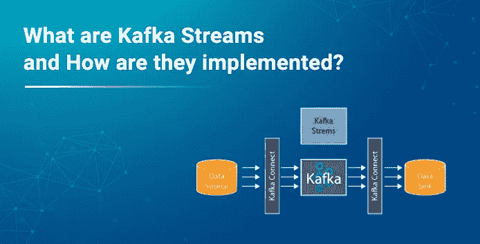
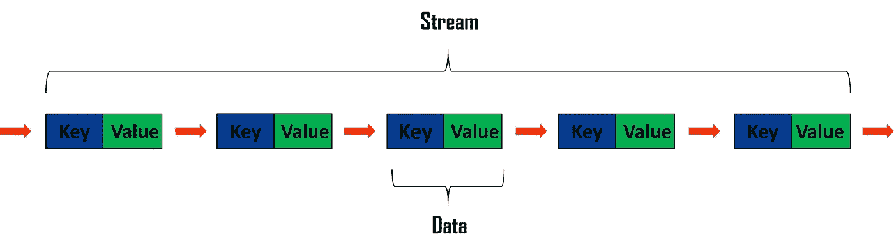
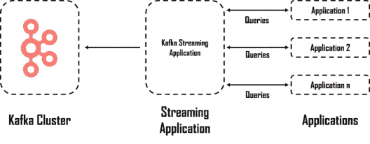
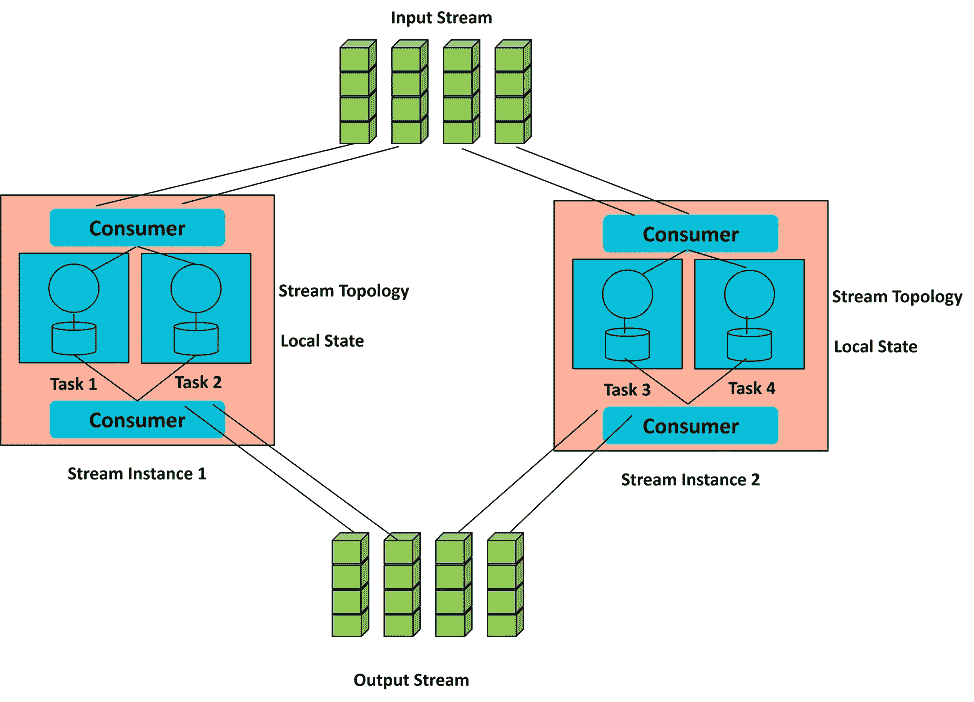
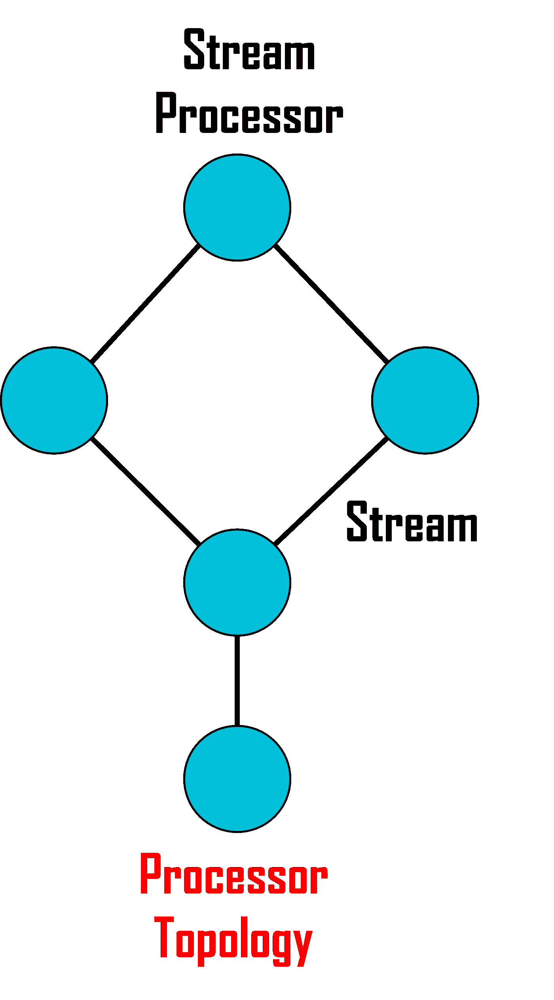
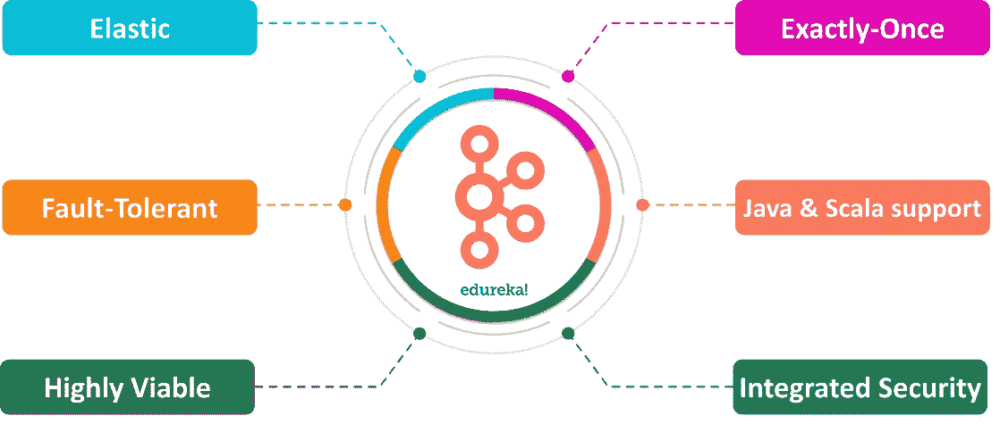

# 什么是卡夫卡流，它们是如何实现的？

> 原文：<https://medium.com/edureka/kafka-streams-c362fbf1cab6?source=collection_archive---------0----------------------->



**Apache Kafka Streams** API 是一个*开源、健壮、同类最佳、可水平扩展的*消息传递系统。通俗地说，就是在**阿帕奇 Kafka** 之上构建的升级版 Kafka 消息系统。在本文中，我们将通过下面的摘要来了解它到底是什么。

*   卡夫卡是什么？
*   什么是溪流？
*   卡夫卡流到底是什么？
*   Apache Kafka 流 API 架构
*   卡夫卡流特征
*   卡夫卡溪流的例子
*   卡夫卡与卡夫卡流的区别
*   Apache Kafka 流 API 的用例

# 卡夫卡是什么？


**Apache Kafka** 基本上是 Linkedin 开发的开源消息工具，为*实时*数据馈送提供**低延迟**和**高吞吐量**平台。它是使用 **Scala** 和 **Java** 编程语言开发的。

# 什么是溪流？



一般来说，流可以被定义为数据分组在**实时的无限和连续的流动。**数据包以**键-值**对的形式生成，这些数据包从**发布者处自动传输，**无需发出相同的请求。

# 卡夫卡流到底是什么？



Apache Kafka Stream 可以定义为用于构建应用程序和微服务的开源客户端库。这里，输入和输出数据存储在 Kafka 集群中。它将设计和部署标准 Scala 和 Java 应用程序的可理解性与 Kafka 服务器端集群技术的优势相结合。

# Apache Kafka 流 API 架构

Apache KStreams 在内部使用生产者和消费者库。它基本上与 Kafka 相结合，API 允许您通过实现数据并行、容错和许多其他强大的功能来利用 Kafka 的能力。

KStream 架构中的不同组件如下:

*   输入流
*   输出流
*   情况
*   消费者
*   地方州
*   流拓扑



*   输入流和输出流是 Kafka 集群，用于存储所提供任务的输入和输出数据。
*   在每个实例中，我们都有消费者、流拓扑和本地状态
*   流拓扑实际上是执行给定任务的流或 DAG



*   本地状态是存储给定操作(如 Map、FlatMap 等)的中间结果的内存位置。

为了增加数据并行性，我们可以直接增加实例的数量。向前看，我们会了解卡夫卡作品的特点。

# 卡夫卡流特征

现在，让我们讨论 Kafka streams 的重要特性，这些特性使它比其他类似的技术更有优势。



*   **弹性**

Apache Kafka 是一个开源项目，旨在实现高可用性和水平可伸缩性。因此，在 Kafka 的支持下，Kafka streams API 实现了它的高度弹性，并且可以轻松扩展。

*   **容错**

数据日志最初被分区，这些分区在集群中处理数据和相应请求的所有服务器之间共享。因此，Kafka 通过在多个服务器上复制每个分区来实现容错。

*   **高度可行**

由于 Kafka 集群是高度可用的，因此，无论大小如何，它们都是任何用例的首选。它们能够支持小型、中型和大型用例。

*   **综合安全**

Kafka 有三个主要的安全组件，为其集群中的数据提供同类最佳的安全性。它们如下所述:

*   使用 SSL/TLS 加密数据
*   SSL/SASL 认证
*   ACL 的授权

其次是安全性，我们有它对高端编程语言的支持。

*   **支持 Java 和 Scala**

Kafka Streams API 最棒的地方在于，它与 Java 和 Scala 等最主流的编程语言相集成，使得 Kafka 服务器端应用程序的设计和部署变得更加容易。

*   **恰好一次处理语义**

通常，流处理是一系列数据或事件的连续执行。但对卡夫卡来说，却不是这样。恰好一次意味着用户定义的语句或逻辑只执行一次，并且由 SPE(流处理元素)管理的状态更新在持久后端存储中只提交一次

# 卡夫卡溪流的例子

这个特殊的例子可以使用 Java 编程语言来执行。然而，这有几个先决条件。你需要在本地系统中安装**卡夫卡**和**动物园管理员**。

代码是为**字数**而写的，记录如下。

```
import org.apache.kafka.common.serialization.Serdes;
import org.apache.kafka.common.utils.Bytes;
import org.apache.kafka.streams.KafkaStreams;
import org.apache.kafka.streams.StreamsBuilder;
import org.apache.kafka.streams.StreamsConfig;
import org.apache.kafka.streams.kstream.KStream;
import org.apache.kafka.streams.kstream.KTable;
import org.apache.kafka.streams.kstream.Materialized;
import org.apache.kafka.streams.kstream.Produced;
import org.apache.kafka.streams.state.KeyValueStore;
import java.util.Arrays;
import java.util.Properties;

      public class WordCountApplication {
            public static void main(final String[] args) throws Exception {
                  Properties props = new Properties();
                  props.put(StreamsConfig.APPLICATION_ID_CONFIG, "wordcount-application");
                  props.put(StreamsConfig.BOOTSTRAP_SERVERS_CONFIG, "kafka-broker1:9092");
                  props.put(StreamsConfig.DEFAULT_KEY_SERDE_CLASS_CONFIG, Serdes.String().getClass());
                  props.put(StreamsConfig.DEFAULT_VALUE_SERDE_CLASS_CONFIG, Serdes.String().getClass());
                  StreamsBuilder builder = new StreamsBuilder();
                  KStream<String, String> textLines = builder.stream("TextLinesTopic");
                  KTable<String, Long> wordCounts = textLines.flatMapValues(textLine -> Arrays.asList(textLine.toLowerCase().split("W+"))).groupBy((key, word) -> word).count(Materialized.<String, Long, KeyValueStore<Bytes, byte[]>>as("counts-store"));
                  wordCounts.toStream().to("WordsWithCountsTopic", Produced.with(Serdes.String(), Serdes.Long()));
                  KafkaStreams streams = new KafkaStreams(builder.build(), props);
                  streams.start();
            }
      }
```

现在，我们将了解卡夫卡和卡夫卡流之间的一些重要差异。

**//文本给定**

欢迎来到爱德华·卡夫卡培训。

这篇文章是关于卡夫卡溪流的。

**//输出:**

```
Welcome(1)
to(1)
Edureka(1)
Kafka(2)
Training(1)
This(1)
article(1)
is(1)
about(1)
Streams(1)
```

# 卡夫卡与卡夫卡流的区别


# Apache Kafka 流 API 的用例

Apache Streams API 在多个用例中使用。下面提到了使用 Streams API 的一些主要应用程序。

《纽约时报》


《纽约时报》是美国最有影响力的媒体之一。他们使用 Apache Kafka 和 Apache Streams API 存储实时新闻，并通过各种应用程序和系统将其分发给读者。

**繁琐**


Trivago 是全球酒店搜索平台。他们使用 Kafka、Kafka Connect 和 Kafka Streams 使其开发人员能够访问各种酒店的详细信息，并以最低的价格为其用户提供一流的服务

**Pinterest**


Pinterest 在更大范围内使用 Kafka，为他们广告系统的实时预测预算系统提供动力。有了 Apache streams API 的支持，他们拥有了前所未有的精确数据。

到此，我们以这篇文章**告一段落。**我希望我已经让你对**卡夫卡流**及其实时*实现*有所了解。**

如果你想查看更多关于人工智能、Python、道德黑客等市场最热门技术的文章，那么你可以参考 [Edureka 的官方网站。](https://www.edureka.co/blog?utm_source=medium&utm_medium=content-link&utm_campaign=kafka-streams)

请留意本系列中解释大数据其他各方面的其他文章。

> *1。* [*Hadoop 教程*](/edureka/hadoop-tutorial-24c48fbf62f6)
> 
> *2。* [*蜂巢教程*](/edureka/hive-tutorial-b980dfaae765)
> 
> *3。* [*养猪教程*](/edureka/pig-tutorial-2baab2f0a5b0)
> 
> *4。* [*贴图减少教程*](/edureka/mapreduce-tutorial-3d9535ddbe7c)
> 
> *5。* [*HBase 教程*](/edureka/hbase-tutorial-bdc36ab32dc0)
> 
> *6。* [*HDFS 教程*](/edureka/hdfs-tutorial-f8c4af1c8fde)
> 
> *7。* [*Hadoop 3*](/edureka/hadoop-3-35e7fec607a)
> 
> *8。* [*Sqoop 教程*](/edureka/apache-sqoop-tutorial-431ed0af69ee)
> 
> *9。* [*水槽教程*](/edureka/apache-flume-tutorial-6f7150210c76)
> 
> *10。* [*Oozie 教程*](/edureka/apache-oozie-tutorial-d8f7bbbe1591)
> 
> *11。* [*Hadoop 生态系统*](/edureka/hadoop-ecosystem-2a5fb6740177)
> 
> *12。*[*HQL 顶级蜂巢命令与示例*](/edureka/hive-commands-b70045a5693a)
> 
> 13。 [*Hadoop 集群搭配亚马逊 EMR？*](/edureka/create-hadoop-cluster-with-amazon-emr-f4ce8de30fd)
> 
> 14。 [*大数据工程师简历*](/edureka/big-data-engineer-resume-7bc165fc8d9d)
> 
> *15。* [*Hadoop 开发人员-工作趋势和薪资*](/edureka/hadoop-developer-cc3afc54962c)
> 
> *16。* [*大数据教程*](/edureka/big-data-tutorial-b664da0bb0c8)

*原载于 2020 年 4 月 30 日 https://www.edureka.co*[](https://www.edureka.co/blog/kafka-streams/)**。**