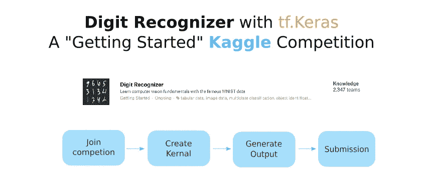
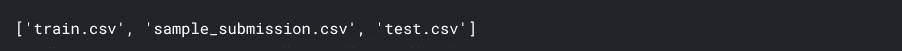
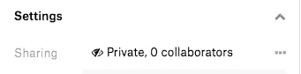
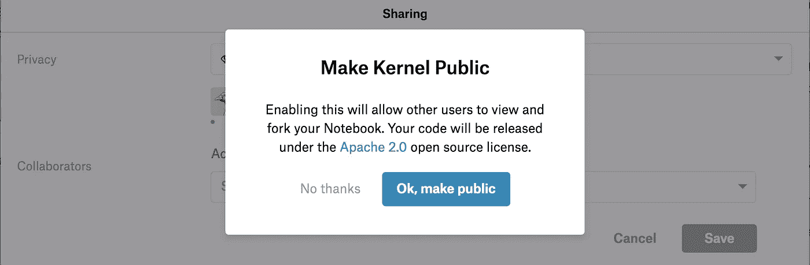

# Kaggle 竞赛:数字识别器-MNIST 与 tf。克拉斯

> 原文：<https://medium.com/google-developer-experts/kaggle-competition-digit-recognizer-mnist-with-tf-keras-86981edadded?source=collection_archive---------6----------------------->

这是一个关于如何加入“入门”Kaggle 竞赛的教程— **数字识别器** —使用 tf.Keras 对数字进行分类。在本教程中，我们将使用 Kaggle 内核创建一个带有 tf 的 CNN。Keras 对 MNIST 的手写数字进行分类。然后我们从内核创建一个输出文件提交给竞争对手。涵盖了以下主题:

*   如何参加比赛
*   如何派生或创建新的内核
*   如何生成输出文件
*   如何提交预测

我包含了一个链接到我的内核([**)MNIST 与 tf。Keras**](https://www.kaggle.com/margaretmz/mnist-with-tf-keras) **)** 附示例代码。注意:本教程的主要目标是复习**参加比赛**的过程，而不是如何赢得比赛。



# **加入竞争**

首先进入 [**Kaggle 比赛**](https://www.kaggle.com/competitions) ，滚动比赛列表，你会看到比赛 [**数字识别器**](https://www.kaggle.com/c/digit-recognizer) 。选择比赛并通读描述、评估、教程和规则，以更好地满足要求。因为这个比赛只是为了学习，所以它是一个没有截止日期的持续比赛。

点击**加入比赛**。注意:您必须登录 Kaggle 才能看到“加入竞赛”按钮。

# 创建内核

Kaggle 内核是一个浏览器内计算环境，与 Kaggle 上的大多数竞争数据集完全集成。它预装了大多数数据科学包和库。它支持脚本，R 和 Python 中的 Jupyter 笔记本，以及 RMarkdown 报告。

您可以使用内核**创建提交文件**或**探索竞赛数据**。虽然您不必使用 Kaggle 内核来编写代码，但它是一个很好的选择，可以与数据集、免费 GPU 无缝集成，并且易于提交给竞赛。

要创建一个内核，你既可以**派生**一个别人发布的现有内核，也可以**自己创建一个新内核。**

## **派生现有笔记本**

在数字识别器竞赛 [**教程**](https://www.kaggle.com/c/digit-recognizer#tutorial) 栏目**，**下，你会看到一个推荐给你试用的内核列表。点击“ **Fork Notebook** ”将创建您自己的内核副本，以探索他人编写的代码。

## 创建一个新内核

下面是创建新内核的方法:

*   在**数字识别器**竞赛中，点击**内核**标签，
*   点击**新内核**，选择**笔记本**选项。将为您创建一个新笔记本，默认为 Python 语言。
*   新的笔记本将有一些存根代码，如进口 numpy，熊猫和 os。注意所有的输入文件都在"../input/"目录和输出位置"../working/"目录

```
import os# list files from input directory
print(os.listdir("../input"))
```

您将看到这 3 个文件列在输入目录下:



sample_submission.cvs 文件包含您需要提交的数据格式。

看看[我创建的内核](https://www.kaggle.com/margaretmz/mnist-with-tf-keras)——点击 **Fork Notebook** 执行笔记本中的单元格。注意我用的是 tf。Keras 创建了一个 CNN 对数字进行分类。

> **Protip:** *您可以通过进入* ***设置*** *并从 GPU 关闭切换到* ***GPU 打开*** *，为您的内核打开 GPU* *。对于像 MNIST 这样的简单数据集，您不一定需要打开 GPU，但知道它在您需要时可用是很好的。*

## 公开内核

为了生成输出文件，您需要确保您的内核是公共的。公开你的内核也允许其他人从你的代码中学习。

有两种方法可以让你的内核公开:

1.  在内核概述页面上，单击“公开”来切换公开/私有设置。
2.  在你的笔记本中，进入**设置**，点击**分享**切换到公开。



无论哪种方式，你都会被提示并点击“ **Ok，public** ”，这将使你的内核对其他人公开。



# 生成输出文件

笔记本末尾的这几行代码将生成一个输出文件:

```
predictions = model.predict_classes(x_test, verbose=0)
submissions=pd.DataFrame({"ImageId": list(range(1,len(predictions)+1)), "Label": predictions})# Generate csv file
submissions.to_csv("submission.csv", index=False, header=True)
```

一旦你点击“**提交**”，它将保存你的代码版本，并从上到下运行你的代码。每个版本都有一个 URL，人们可以用它来查看你的内核。默认情况下，一旦您的内核公开，其他人就可以看到最新版本。

# 提交预测

要查看笔记本生成的输出文件，请单击<< icon (back to kernel page) on the top left corner of your notebook. Click on the “**输出**选项卡，您将在那里看到输出文件。点击按钮“**提交竞赛**，我们的输出文件将被提交。然后，您将进入排行榜，查看自己的排名。

**参考文献:**

*   [从内核提交](https://www.kaggle.com/dansbecker/submitting-from-a-kernel)