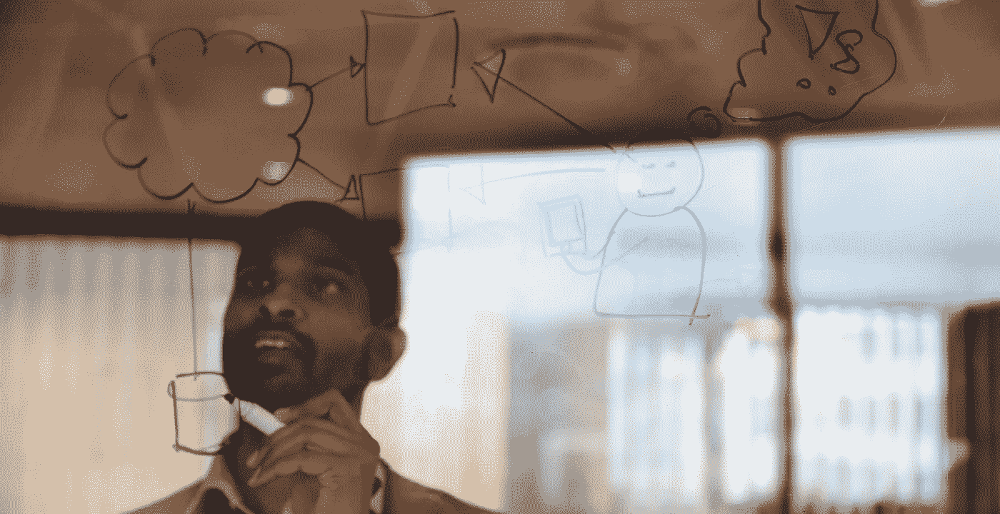

# Kan 5 enkle handlinger gjøre deg mer innovativ?

> 原文：<https://medium.com/compendium/kan-5-enkle-handlinger-gj%C3%B8re-deg-mer-innovativ-7b6467e57cd4?source=collection_archive---------3----------------------->

**Innovasjon er noe uhåndgripelig og komplekst å forholde seg til, men likevel noe banalt enkelt. Det gjelder bare å finne gode måter å ta tak i det på. I høyt anerkjente forsker- og business-miljø i USA, snakker man om at det finnes et** [**innovasjons-DNA**](https://www.amazon.com/Innovators-DNA-Mastering-Skills-Disruptive/dp/1422134814/ref=sr_1_1?keywords=the+innovator%27s+dna&qid=1558422107&s=gateway&sr=8-1) **. Noen har det sterkere tilstede enn andre, men alle kan trene seg opp.**

Det er 5 handlinger som til sammen kategoriseres som en innovatørs DNA: ***Assosiere, spørre, observere, eksperimentere og bygge nettverk.*** Innovasjon finner sin plass i iterative og komplekse prosesser av kommunikasjon, sosial interaksjon og læring. I disse prosessene er det nettopp våre handlinger som legger føringer. Og vi kan forstå det som et sosialt fenomen og et svar på et problem.

Å komme på nye ideer har aldri sett ut til å være problematisk for folk flest. Men om ikke det svarer til et problem, så er det kun et fåtall som faktisk bryr seg om ideen din. Og det er akkurat her må du starte — problemet du ønsker å løse må være kjernen i hele arbeidet.

***Jeg gjentar; ikke ideen, men problemet.***

Derfor har jeg lyst til å ta deg gjennom disse 5 enkle handlingene som kan trene opp din indre innovatør:

## **1\.** **Assosiere**

Vi assosierer enten vi vil eller ikke. Ord og informasjon assosieres med opplevelsene våre. Jo mer diversifisert våre opplevelser og kunnskap er, jo flere sammenhenger kan hjernen vår lage. Steve Jobs sa det så konsist:

> «Creativity is connecting things»

Det er en treningssak å skulle dra ut assosiasjonene til noe nytt. Men det krever at vi stimulerer oss for nye ting. Frisk input trigger nye assosiasjoner, og her kan nye løsninger få springe fram.

## **2\.** **Spørre**

Det vanskelige er ikke å finne de riktige svarene, men å stille de riktige spørsmålene. Lær deg å stille enkle og provoserende spørsmål — for de får oss til å tenke skikkelig. Hvordan kan du bli en mer effektiv spørrer? Ty til de enkle spørsmålene «Hvorfor?», «hvorfor ikke?», «hva om?». De som skaper og er tilsynelatende innovative, stiller spørsmål som utfordrer allmennkunnskap. Altså — utfordrer det ubestridelige rundt oss. De fleste av oss fokuserer på å forstå hvordan man kan forbedre eksisterende prosesser, men vi bør huske å utfordre antagelser.

## **3\.** **Observere**

Hvis man ser rundt seg, så kan man se at de oppdagelsesorienterte lederne ofte produserer ukonvensjonelle forretningsideer ved å granske vanlige fenomen. I prosessen med å finne løsninger på et problem, bør man være nøye og intensjonelle i å observere detaljer i atferd funnet i kunders handlingsmønstre, leverandører, konkurrenter. I markedet generelt. På den måten kan man tilegne seg innsikt i nye måter å gjøre ting på.

## **4\.** **Eksperimentere**

Når man snakker om å eksperimentere, så er det lett å tenke at dette hører til vitenskapsfolk i hvite frakker som tester ut nye ideer. Akkurat som vitenskapsfolk, er det viktig at du er aktivt ute og prøver nye ideer ved å lage prototyper og lansere piloter. Verden er ditt laboratorium. Og her må det være rom for å teste og feile. For i utprøving og feiling oppstår læring. En viktig form for læring. En slik holdning kan resultere i en innovativ kultur, fordi nye ideer og løsninger ikke kommer uten å teste.

## **5\.** **Bygge nettverk**

Ved å dedikere tid og energi i å finne og teste ideer via et nettverk av ulike individer, gir innovatører radikalt ulike perspektiver. I motsetning til den vanlige praksisen med å fostre nettverket sitt på bakgrunn av tilgang på ressurser, for å selge inn seg selv, eller for å gi et boost til karrieren sin, går entreprenører av banen for å finne folk med ulike ideer og perspektiver for å utvide deres egen domenekunnskap.

Kent Bowen, forsker og grunnlegger av CPS Technologies, hang opp følgende beskjed i alle kontorene til sine ansatte:

> «The insights required to solve many of our most challenging problems come from outside our industry and scientific field. We must aggressively and proudly incorporate into our work findings and advances which were not invented here»

Jeg sa det var banalt enkle handlinger. Dette er hverdagslige ting vi gjør. Men ved å bli mer bevisst på hvordan vi gjør det, kan vi øke vår evne til å få nye og flere ideer som svarer til utfordringer vi ser rundt oss eller står i. Og som en videreføring av dette, finnes det heldigvis gode [metodikker](/grensesnittet/innovation-design-sprint-a-road-map-on-why-and-how-to-start-183d4719d720) som setter arbeidet i system for oss.

Men det må starte med deg selv først.