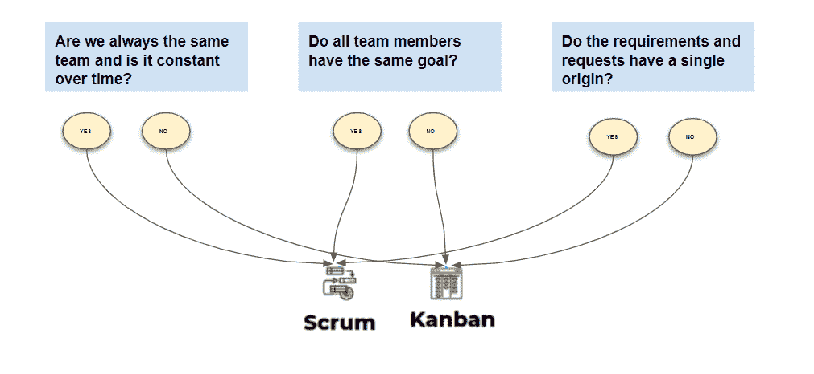
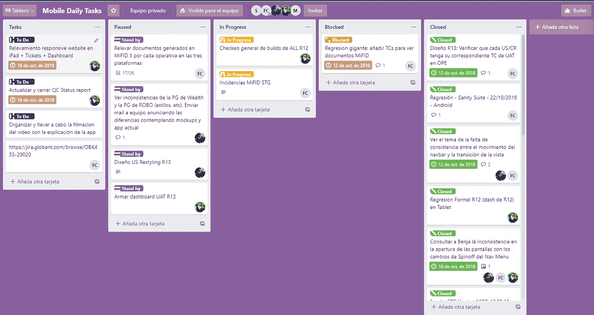
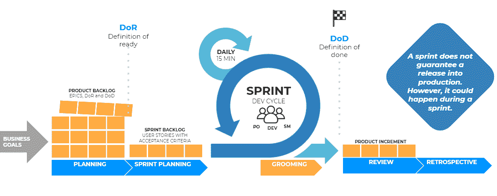

# 看板 vs Scrum

> 原文：<https://medium.com/globant/kanban-vs-scrum-26621e4ae750?source=collection_archive---------1----------------------->

***越来越多的公司正在使用敏捷方法，根据 EducacionIt 采用报告，41%的公司正在实践中走向成熟，19%的公司正在尝试敏捷实践，18%的公司正在考虑敏捷实践。***

***另一方面，CertiProf*** *(专业培训的领先机构)，*在 2019 年 12 月和 2020 年 2 月进行了一项调查，以了解劳动力市场的现状-敏捷性关系、最杰出的实践和最常用的框架。

报告中最突出的一点是敏捷方法的使用持续增长，不仅是在 IT 行业(占 72%)，而且在工程领域、人力资本、商业/金融、市场营销、销售和运营也是如此。

*一段时间以来，Globant 已经成为敏捷方法的大使，这不仅是因为它的实践和事件，还因为它将利益相关者与数字化转型计划联系起来。*

*综上所述，我认为有必要强调:*

*   *将看板和 Scrum 进行比较是不可能的，因为看板是一种方法，而 Scrum 是一种框架。*
*   *敏捷世界中最常用的两种方法的一些优势，它们的相似性和特征:*

*Scrum 是团队中选择最多的，尤其是在我们的行业中，它被认为是敏捷的同义词，而看板更多地被认为是一块板，事实是两者是完全兼容的，两者结合在一起可以实现相同的目标。*

**

*   ***看板**基于:*

> *-持续开发和交付，由同步任务组成。*
> 
> *-看板团队使用可视化规划工具，这些工具组成了一个板，在这里您可以看到用户故事以及它们如何在不同的状态下移动，每个故事都在一个列中表示，直到完成。*

## *什么时候使用看板？*

> *-当工作流是连续的时，例如在支持和维护团队中。*
> 
> *-团队中有许多优先级不同的传入请求。*

**

## ***重要的事情:***

> *- WIP limit，是对每列、每个人可以完成的任务进行限制。*
> 
> *-关键是让流程一目了然，并快速检测队列或瓶颈。*

*   *Scrum: 和看板一样，它也被分成用户故事，并显示在工作流中。*

*Scrum 团队承诺每隔一定的时间间隔交付价值，这个时间间隔是明确确定的，可以从 1 周到 4 周不等，这些迭代被称为冲刺。*

*Scrum 强调它的支柱，持续的检查，适应性和透明性，以及进行回顾和是否有必要进行任何改变来以透明的方式为团队实现目标。*

**

## *什么时候使用 Scrum？*

> *-在寻求在每个冲刺阶段持续地、增量地交付价值的团队中，团队致力于这项工作。*
> 
> *-Scrum 用于解决复杂的问题(例如，构建一个创新的产品)，这些问题需要持续的检查和调整。除了团队有一个共同的冲刺目标之外*

*Scrumban :这个术语源于将两种方法结合起来的需要，用于那些处于 Scrum 和看板中间点的团队，采用两种方法中的最佳方法来管理团队并实现目标。*