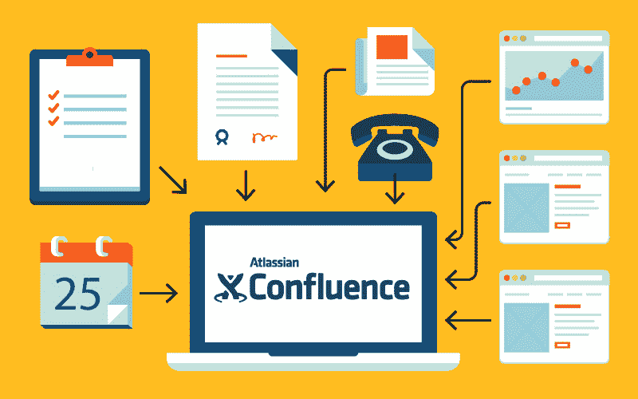
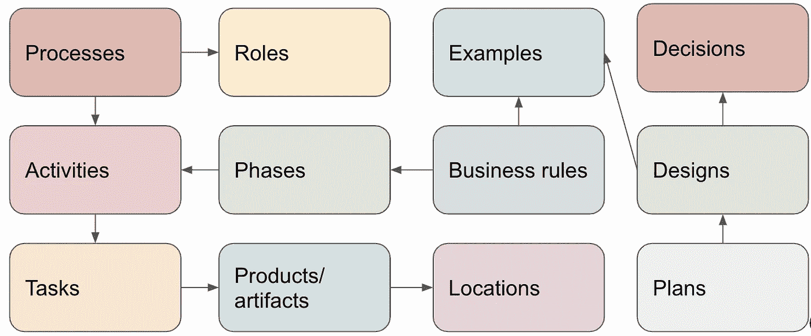
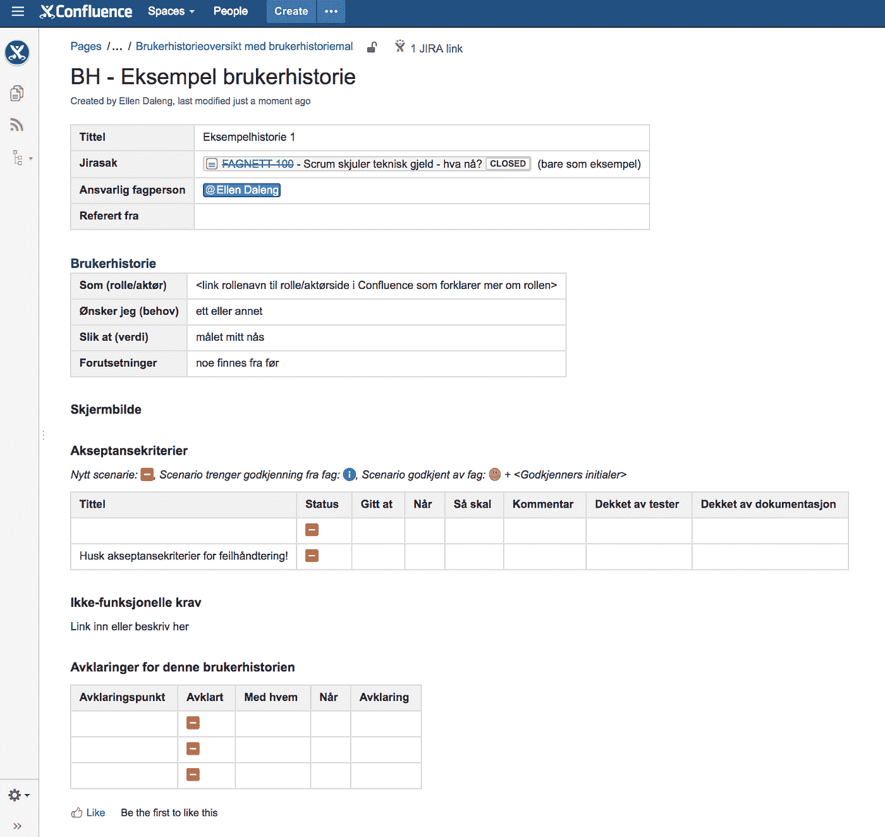

# Kaos i Confluence? Her er 12 tips for å skape orden

> 原文：<https://medium.com/compendium/kaos-i-confluence-her-er-12-tips-for-%C3%A5-skape-orden-9e3fdd354b57?source=collection_archive---------1----------------------->

*Atlassian Confluence er et fantastisk verktøy for å jobbe transparent og dele informasjon og kunnskap. Det er lett å ta i bruk uten spesielle forkunnskaper. Dessverre medfører dette ofte etter en stund at det begynner å bli veldig vanskelig å finne det man er på jakt etter, eller vite hvor man bør legge inn nye ting.*

Jeg har brukt Confluence til alt mulig siden 2006, og har i årenes løp også hjulpet en god del andre med å få skikk på informasjonskaoset sitt. Hvis du er som meg — litt over middels opptatt av *ordning och reda* — ta på deg ildsjel-hatten og ta initiativ til en god start på ny plattform, eller en felles vårrengjøring i løpet av noen stille sommeruker. Her får du mine beste tips:

# 1\. Tenk over hva slags informasjon du skal ha i Confluence

Hvilke “ting” handler forretningen din om og hvordan henger de sammen? En modell av informasjonsstrukturen på forretningsnivå er et godt hjelpemiddel. Er det f.eks. kunder, produkter, planer, prosjekter, metoder, steder, team eller andre organisasjonsenheter, krav og behov, møter, mål og virkemidler, fysiske ting, datasystemer og applikasjoner, tips og triks, regler…? Lag deg en boks-og-piler tegning som viser hvordan dette henger sammen og forsøk å definere hvilke typer space du ønsker å ha i Confluence. En mye brukt inndeling er ett space per prosjekt, per organisasjonsenhet som HR, Marked, Økonomi, Salg, per fagfelt eller metodikk, per system eller annet som dere produserer mye informasjon om og trenger å samarbeide rundt.

Illustrasjon av informasjonsstruktur

# 2\. Lag en struktur for hver type space

Når du har definert noen typer av space kan du gå videre inn på hvordan du ønsker å strukturere informasjon innenfor hver type. Gjør det lett å orientere seg ved å ha en felles struktur på nivå 1 i sidehierarkiet. I et prosjektspace kunne du hatt f.eks. «Prosjektstyring», «Behov og krav», «Utvikling», «Testing», etc. som toppnivå sider i spacet. Gjør hver toppside til en fin landingsside med mer informasjon om hva som er å finne her, ansvarlige personer etc. og la strukturen under gjenspeile behovene dere har for å skape og dele informasjon. Lag en mal for hjemmesiden for ulike typer space og hvordan innhold skal plasseres layoutmessig. Det finnes fine addons som lar deg definere både space maler og sidehierarki-maler — men ikke gå helt bananas! Folk må få bruke hodet selv også og legge til det de finner ut at de trenger. Det er vanskeligere å få folk til å slette tomme sider de ikke trengte likevel enn å få dem til å legge til nye.

# 3\. Lag et label-vokabular

Bruk labels til å betegne hvilken type informasjon en side inneholder. Lag deg et label-vokabular som brukes for å generere oversikter over informasjon på tvers av space og bruk det konsekvent (det hjelper å ha sidemaler hvor labler i utgangspunktet er satt, les videre). Alle sider av typen *møtereferat* fra et teammøte kan f.eks. ha label **_teammøte** . Bruk gjerne noen spesialtegn eller prefiks i disse lablene slik at ikke andre kommer til å bruke samme ordet av vanvare og tulle til dine fine autogenererte oversikter.

# 4\. Hierarki versus generert oversikt

Tenk at det er forskjell på lagringsstruktur (sidehierarki) og mulige views på informasjonen (labels og genererte oversikter/dashboards). Sidehierarkiet er den strukturen man naturlig tenker på når man skal *legge inn* nye sider og skal finne riktig sted for dem. Genererte oversikter er den strukturen man går til for å *få oversikt* over informasjon, kunne klikke på en link og hoppe til riktig sted. Confluence kan lett generere oversikter over samme type informasjon (label) på tvers av sidehierarkiet i et space: møtereferater i et prosjekt kan f.eks. fint lagres under ulike fag-, team eller prosessmessige toppsider og samtidig vises på en oversiktsside.

For fysisk lagring av informasjon i en hierarkisk struktur er det ofte lurt å tenke over hvilken dimensjon du ønsker å bruke sidehierarkiet til, og hvilke oversikter du kan generere på tvers av hierarkiet ved hjelp av labels. Men ikke bruk sidehierarkiet som du ville brukt en filkatalogstruktur — første bud er «Du skal ikke ha tomme wikisider bare for å lage hierarki» (legg i det minste inn en generert oversikt over alle undersider hvis du ikke har noe mer).

# 5\. Inndeling i undersider

Små informasjonsbiter som kan settes sammen er bedre enn lange sider. Tenk mulighet for plukk og miks, samt at informasjon i størst mulig skal være adresserbar, dvs. ha en URL. Worddokumenter på over 10 sider bør typisk brytes opp i flere wikisider. Når man sender noen en link til en side vil man helst ikke at de skal måtte lete gjennom mye tekst for å finne det som er relevant. Del opp i undersider når du ser at det begynner å bli veldig mange ulike temaer på en og samme side. Det gjør det lettere å søke og finne informasjon. Hvis du trenger å se alt som en lang tekst, kan du enkelt lage en sammensatt side vha *include* makroen. Korte sider gjør det også enklere å unngå duplisering av informasjon, bestem hva som er master og bruk include-makroen for å vise dette et annet sted. Er det informasjon som ofte gjenbrukes i mange sammenhenger bør denne være lett å inkludere, dvs. oppdelt i passende sider eller utdrag ( *excerpt* makroen). Så kan du vedlikeholde den på ett og bare ett sted. Ah!

# 6\. Versjonering av mange sider

Trenger du å versjonere et sett av sider som en enhet? En wiki er i utgangspunktet enkeltsider og alt innhold på en side versjoneres hver gang man endrer noe. Men hvis et *sett* av sider, f.eks. dokumentasjon for en gitt versjon av et produkt, skal versjoneres som en enhet, er ikke dette noe som støttes ut av boksen. Det finnes addons som kan hjelpe deg, eller du kan lage et opplegg med ett space per versjon. Tenk over hvordan du ønsker å håndtere dette før du har rukket å lage deg en masse dokumentasjon.

# 7\. Navnekonvensjoner

Lag en navnekonvensjon for navngiving av sider (prefiks, datoer, etc.) der hvor det vil finnes mange sider av samme type. Møtereferater kan ikke hete “Møtereferat” alle sammen. Tenk gjerne at det skal gå an å søke i wikien og skjønne hva siden handler om ut fra treff på sidenavn. Lag gode og treff-vennlige navn som tar med litt av konteksten. F.eks. ikke kall en side for “Plan”, si hva det er en plan for!

# 8\. Søke versus oppdage

Hvis du vet hva du leter etter, bruker du søk og håper at noen har kalt siden sin ett eller annet fornuftig som gir treff enten på sidenavnet eller en label. Hvis du derimot lurer på hva du kan finne i wikien, er gode oversikter alfa og omega. Lag et fornuftig Dashboard for hele installasjonen som forklarer hvordan den er strukturert, hvilke typer space den inneholder, hvem som er administratorer og link til ofte etterspurt og nyttig informasjon. Vis aktivitetsstrømmen slik at folk kan se hva som skjer.

Definer en god struktur for venstremargmeny i alle space, vurder å benytte en egen side for å definere denne med tydelige overskrifter — for å få mer kontroll over layouten. Legg inn en *livesearch* -makro på denne siden som søker i kun dette spacet. Du sier at siden skal være venstremargen ved å inkludere den i *Sidebar, Header and Footer* i spacet. Bruk **Space categories** på en konsekvent måte for å gruppere space i et tydelig og lite(!) antall ulike typer som Confluence da automatisk skaper en oversikt over (Space catalog).

# 9\. Gjør det lett å gjøre det rett

Hvis produksjon av visse typer informasjon skal følge en bestemt metode eller prosess, bør du bygge denne prosessen inn i Confluence. Legg opp space-maler og sidehierarki-maler, samt sidemaler slik at brukerne får nødvendig hjelp til å gjøre ting riktig (følge prosessen, metoden). Eks. Confluence brukes til å støtte en definert kravanalyseprosess, kundeoppfølgingsprosess, tilbudsskrivingsprosess, eller en softwareutviklingsprosess/metode som Scrum/Agile. Hvis prosesser skal bli brukt, må de bygges inn i arbeidsredskapene man bruker for å utføre trinnene i prosessen, ikke være dokumentasjon som ligger på siden. *Litt* hjelp i form av maler og strukturer er mye bedre enn *ingen* hjelp, for å sikre konsistent bruk. Gi sidemaler den labelen alle sider av denne typen skal ha, så slipper brukerne å tenke på det.

Et konkret tips for dette er å definere sidemaler som inneholder *Page Properties* og bruk *Page Properties Report* til å generere oversikter på en hovedside, der man også finner en knapp for å opprette en ny side basert på malen ( *Create From Template* ). Evt. bruk Confluence Blueprints.

Eksempel på en sidemal

# 10\. Legg opp til effektivt samarbeid

Analyser behovet for samarbeid under produksjon av informasjon: hvordan skal man klare å følge med på hverandres fremdrift, hvordan skal man få beskjed om å gjøre noe, hva er prosessen for godkjenning, hvilke ting fra andre i organisasjonen har man behov for (da ser man ofte at dette hadde det vært kjekt å ha i Confluence, og så har man en kandidat for videre utvidelse). Dette er med på å definere struktur og behovet for oversikter. Skal bloggfunksjonaliteten brukes? Av hvem og til hva, i hvilke space? Hvordan sikrer vi at informasjonen når frem (abonnementer, etc.)

I en wiki er all informasjon i utgangspunktet alltid “under arbeid.” Bestem om det er nødvendig med definerte godkjenningsprosesser før informasjon anses som “publisert” og hvordan dette skal implementeres. Det finnes addons som støtter dette, eller man kan lage sitt eget opplegg med merking av sider. Og ikke bruk *page restrictions* i utrengsmål — jobb transparent og skap en kultur for å oppdage hva andre holder på med og bidra på tvers.

# 11\. Integrer med andre informasjonskilder

De færreste organisasjoner lagrer all sin informasjon i Confluence. Hvis dere har Office 365, Google Docs eller Sharepoint i tillegg, så gjør det enkelt å hoppe fra det ene til det andre. Vær flink til å linke! Vurder behovet for spesielle addons for integrasjon mellom ulike dokument- og informasjonslagre avhengig av hva dere ser for dere å bruke Confluence til, og hvordan dere ønsker å samarbeide.

Beslutt hva slags informasjon som i dag ligger i filer, som fortsatt skal være filvedlegg, enten i Confluence eller andre dokumentlagre, og hva som skal importeres og leve videre som wikisider. Ha som arbeidshypotese at det meste kan være wikisider. En wiki har den fordelen at all informasjon inngår i en kontekst, det er ikke en samling løsrevne filer på en katalog hvor (dårlige) filnavn er det eneste holdepunktet du har for å skjønne noe om innholdets karakter og sammenheng.

# 12\. Gi nykommere litt hjelp til å komme i gang

Hold en introduksjon til Confluence for alle nyansatte. Pass på å få med alle viktige detaljer angående struktur for nettopp deres wiki inn i opplæringsopplegget slik at brukerne er kjent med dette, ikke bare hvordan Confluence benyttes rent praktisk til å skrive tekst.

Opprett et eget space for Confluence-relatert informasjon, FAQ, info om installerte addons, driftsmeldinger, nyheter i siste versjon, etc.

Til sist, og kanskje viktigst: en wiki som Confluence er ikke et oppslagsverk — det er en samarbeidsplattform. Bruk kommentarer, likes, share og tasks for alt de er verdt til å skape flyt og engasjement!