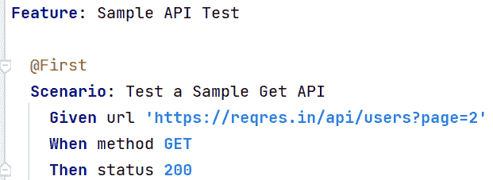

# 空手道 API 测试

> 原文：<https://medium.com/globant/karate-api-testing-9843bbe8abe?source=collection_archive---------2----------------------->

# 概观

Photo by [Leslie Jones](https://unsplash.com/@les_elizabethj?utm_source=medium&utm_medium=referral) on [Unsplash](https://unsplash.com?utm_source=medium&utm_medium=referral)

API 测试可能是所有测试人员都应该具备的最常见的技能之一；这个想法是为了测试我们的后端系统，特别是当“现代”架构正在微服务中设计和开发，并且遗留系统正在迁移到微服务和微前端系统时。

通常，当我们谈到后端测试，特别是 API 测试时，我们可以找到许多方法来实现这个测试过程，并且几乎所有的选项都包含手动方法。API 可以有不同的开发方法(get、post、delete 等。)这一点我们必须核实。例如，我们测试我们向后端生成的请求，测试响应，并比较信息是否正确。

本文旨在通过使用空手道找到另一个测试后端的选项，并在我们想要实现 API 自动化测试方法时从该工具中获得最佳收益。

也许，你会问自己，为什么我们要用空手道？当然，答案取决于应用程序的上下文、技术、架构等。然而，假设您对自动化您每天都在做的相同测试感兴趣；在这种情况下，您首先需要验证所有 API 的测试环境(冒烟测试)，或者如果您有需要验证环境并首先检查每个 API 响应的连续发布，建议您应该自动测试那些场景；空手道可以是处理它的一个很好的选择，我可以提到很多很多我们可以使用空手道的情况，但是要注意的最重要的方面是空手道真的很容易配置并且使用起来非常友好，特别是如果作为一个测试人员我们没有很多编程技能的话。

API 测试用例非常具体，它们通常被实现来与请求和响应进行交互；开发人员和 QA 只在必要的地方和时候测试它们，但是几乎没有人有好的实践来实现自动化的连续测试来覆盖这种必要性；正如我们所知，一个 API 可能会因为不同的原因而频繁更改，有时我们并没有意识到这些更改，因为我们没有及时得到有关这些更改的通知，如果我们不得不在 API 发生更改时手动检查每个 API，这将非常耗时。空手道为我们提供了一个简单的方法来解决它，如果你有可能将其与管道集成，那将会好得多。

所以，欢迎阅读这篇文章；**我们开始吧！**

[空手道](https://github.com/karatelabs/karate)是 Peter Thomas 在 2017 年创建的开源框架。这个工具有许多测试功能；它们都有不同的目的，可以根据你想自动化的东西来使用，但是根据我的经验，我认为，空手道可能对 API 测试更有益(HTTP / WebSocket Client)。

***Image****:* [*https://github.com/karatelabs/karate*](https://github.com/karatelabs/karate)

空手道 API 测试有可能与 Gherkin 和 cucumber 集成，这两个框架通常用于自动化测试。尽管空手道提供了许多测试功能，但本文的重点将是 API 测试(HTTP / WebSocket Client)。

在使用空手道开始 API 后端测试之前，我们需要配置我们的环境、工具和依赖项。为了实现这一目标，我们需要遵循以下步骤:

1.  配置本地环境变量及其路径(JDK(推荐 [Java 8](https://www.oracle.com/co/java/technologies/javase/javase8-archive-downloads.html) )和 Maven 或 Gradle(这取决于您的偏好)
2.  创建一个带有一些管理依赖项的 Java 项目(在 1 中提到过)
3.  在我的例子中，我使用 maven，所以我需要配置 pom.xml
4.  从 https://mvnrepository.com/[下载以下依赖关系](https://mvnrepository.com/)

* 空手道-核心— *还是用稳定版吧，不用 RC(发布候选)*；下面的例子:

<**依赖**依赖>

*！—*[*https://mvn repository . com/artifact/com . intuit .空手道/空手道-core*](https://mvnrepository.com/artifact/com.intuit.karate/karate-core) *→*

<**依赖**依赖>

<**groupId**>com . intuit .空手道< / **groupId** >

< **artifactId** >空手道-核心< / **artifactId** >

<**版本**版本> 1.1.0 < / **版本**版本>

**依赖**依赖>

*T73！—*[*https://mvn repository . com/神器/com.intuit .空手道/空手道-junit5*](https://mvnrepository.com/artifact/com.intuit.karate/karate-junit5) *→*

<**依赖**依赖>

<**groupId**>com . intuit .空手道< / **groupId** >

< **artifactId** >空手道-JUnit 5</**artifactId**>

<**版本** > 1.1.0 < / **版本** >

**依赖性**依赖性>

**依赖**依赖>

5.根据您的测试范围，在项目 src/test/features 中创建您将要测试的每个文件

6.开始创建测试脚本:

API 测试与测试为每个 API 开发的不同方法(GET、POST、DELETE 等)相关联。)、请求、响应、代码等。因此，通过整合[小黄瓜](https://github.com/cucumber/cucumber/tree/master/gherkin) + [黄瓜](https://cucumber.io/)，我们可以开始测试它们中的每一个。

***Image****: Taken from my local environment, directly from* [*Intellij IDE*](https://www.jetbrains.com/idea/)

a.得到

在这种情况下，我们使用方法 GET 并通过它们进行断言；如果状态不是 200，测试用例将失败。

***Image****: Taken from my local environment, directly from* [*Intellij IDE*](https://www.jetbrains.com/idea/)

在这幅图中，您可以看到我正在进行多个断言(状态、响应、响应数据长度、id、姓氏)。这将是一个很好的选择，尤其是当我们的 API 有几个业务测试用例的时候。

***Image****: Taken from my local environment, directly from* [*Intellij IDE*](https://www.jetbrains.com/idea/)

b.邮政

在这个测试用例中，我添加了一个将在不同场景中使用的背景。首先，我设置了 URL(API 所在的位置)，头部需要发送数据和预期的输出。标题和响应位于项目中另一个名为“data”的文件夹中

***Image****: Taken from my local environment, directly from* [*Intellij IDE*](https://www.jetbrains.com/idea/)

如果我们想要实现其他方法，只需改变方法名和与业务案例相关的断言就足够了。

7.生成报告

来结束这篇文章；我将谈论报告。这是我最喜欢空手道的一个方面，因为它迅速，直观，并提供详细的信息。例如，当我运行大约 15 个测试用例时，执行时间不到 7 秒；当然，这个时间取决于 API、数据和环境，但是如果您认为花费的时间太多，您可以通过使用并行测试来实现它

***Image****: Taken from my local environment, directly from* [*Intellij IDE*](https://www.jetbrains.com/idea/)

您可以单击 GET Method，并逐步找到每个特性的更多详细信息，获取响应信息，检查断言等:

***Image****: Taken from my local environment, directly from* [*Intellij IDE*](https://www.jetbrains.com/idea/)

总之，空手道可能是自动化后端 API 测试的一个有趣的选择，特别是在需要重复执行几个测试用例的项目中。此外，空手道可以帮助解决或改进上市时间、及时性、质量、技术熟练程度，并使用自动化方法实现连续的端到端测试。

**享受空手道！**

参考资料:

https://github.com/karatelabs/karate

https://cucumber.io/

https://github.com/cucumber/cucumber/tree/master/gherkin

https://automationstepbystep.com/—*特别感谢这门课程的所有者/创建者:Raghav Pal*