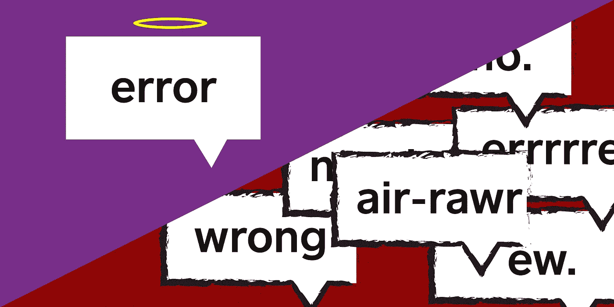

# 保持 API 错误整洁

> 原文：<https://medium.com/square-corner-blog/keeping-api-errors-clean-8f265ec3e1bc?source=collection_archive---------6----------------------->



> 注意，我们已经行动了！如果您想继续了解 Square 的最新技术内容，请访问我们的新家[https://developer.squareup.com/blog](https://developer.squareup.com/blog)

在 Caviar，我们制造了大量的原料药。我们为我们内部的服务到服务通信构建 API，为我们的移动应用构建 API，为我们的 web 应用构建 API，为外部合作伙伴构建 API，可能还有几个我都忘记了的 API。在过去的几年中，我们学到并付诸实践的一件事是结构良好的错误，这使我们能够在客户端对有意义的错误保持一致的行为。

我们从按照模式将错误定义为结构化散列的惯例开始

```
{ "type": "SomeError", "message": "Something went wrong!" }
```

然后，我们会在 Rails 控制器中以 JSON 的形式呈现这些错误。

```
**class** **CartsController** < ApplicationController
  **def** **show**
    errors, cart = CartRepository.new.fetch_cart(params.**require**(:id))
    **if** errors.none?
      render json: { content: cart }
    **else**
      render json: { errors: errors }, status: 422
    **end**
  **end**
**end**
```

虽然这种结构很好，但我们应用它时不一致，经常只是返回一个字符串数组作为错误，而不是这些结构化的错误。因此，为了提高采用率并让错误感觉良好，我们开始使用 Ruby 2.5 新的 keyword_init 参数将这些对象定义为结构。

```
ValidationError = Struct.new(:type, :message, keyword_init: **true**)
```

然后，我们将使用这个新的结构内联，使错误的创建和读取变得干净。需要注意的一件重要事情是，activesupport/json gem 使 json 结构的序列化完全按照您的期望执行，因此它将输出上面的结构。

```
**def** **fetch_cart**(id)
  cart = Cart.find_by(id: id)
  **return** [[ValidationError.new(type: 'ResourceNotFound', message: 'Cart not found')], **nil**] **if** cart.**nil**?
  [[], cart]
**end**
```

如你所见，这会使错误定义行变得很长，这些错误总是相同的，所以我们可以将它们提取为常量。

```
CART_NOT_FOUND_ERROR = ValidationError.new(type: 'ResourceNotFound', message: 'Cart not found')**def** **fetch_cart**(id)
  cart = Cart.find_by(id: id)
  **return** [[CART_NOT_FOUND_ERROR], **nil**] **if** cart.**nil**?
  [**nil**, cart]
**end**
```

现在我们的错误结构良好，易于定义，而且——额外收获！—超级容易测试。下面是这种情况的一个说明:

```
RSpec.define CartsController **do**
  it 'should return resource not found error when id does not exist' **do**
    get :show, id: -1
    expected_value = {
      errors: [CartRepository::CART_NOT_FOUND_ERROR]
    }
    expect(response.body).to eq(expected_value.to_json)
  **end**
**end**
```

现在，我们可以快速编写这些测试，而不用在消息体上浪费时间。它使我们的测试不那么脆弱，并提高了开发人员的生产率，同时强制执行标准化的错误格式。

到目前为止，我们采取的最后一步是将其提取到一个实用程序中，并添加一些额外的功能。这个宝石叫做 [clean_errors](https://www.github.com/square/clean_errors) ，我们今天公开发布它。这是它的样子:

```
# No need to define ValidationError anymore, its in the gem
# ValidationError = Struct.new(:type, :message, keyword_init: true)
CART_NOT_FOUND_ERROR = CleanErrors::ValidationError('ResourceNotFound')
```

你会立刻注意到一些事情。没有关键词论证，没有`.new`(我是不是打错字了？！)，而且没有留言！

首先，在缺乏. new 的情况下，我们使用了一种[转换方法](http://www.virtuouscode.com/2012/05/07/a-ruby-conversion-idiom/)来缩短你的使用时间，去掉一些样板文件。更少的代码意味着更少的错误，转换函数让我们做了另一件漂亮的事情。

没有消息！有，但是转换方法现在将使用 i18n 本地化来查找消息。我们这样做是因为:

1.  在我们的源代码中有很多字符串感觉是错误的，而且
2.  我们希望为国际观众提供经得起未来考验的服务。

对这样的字符串使用 i18n 通常是一个好的实践，但是错误消息是我们疏忽的地方。现在我们强制执行。但是，关键是什么呢？这是一个简单的“`errors.#{type}”`”，其“错误”名称空间是可配置的。

最后，我们缩短了关键字参数。通常我喜欢像 Ruby 这样的动态语言中关键字参数冗长、明确的特性，但是在这种情况下，我们要简洁一些。在整个代码库中对这些的一致使用应该作为它自己的文档，API 是如此的干净，我认为牺牲一点安全性是值得的。

就是这样！我们在 Caviar 使用 clean_errors 作为一个简单的工具来产生巨大的影响。我们的 API 中一致的错误格式意味着客户可以预期特定格式的错误，这些实用程序使开发人员更容易产生那些一致的错误。