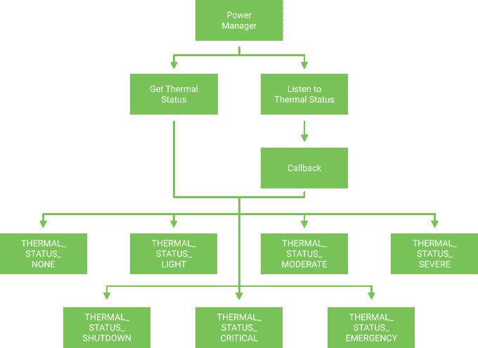

# 用热 API 在 Android Q 中保持凉爽

> 原文：<https://medium.com/google-developer-experts/keeping-cool-in-android-q-with-the-thermal-api-2fd98c5bb1fb?source=collection_archive---------3----------------------->


我们都有过这样的经历——使用我们的安卓设备，感觉东西在我们手中变得有点热。无论我们是在玩游戏还是使用执行密集型操作的应用程序，这些事情通常都需要大量资源，这使得我们的设备工作起来更加困难。

在这种情况下，应用程序应该尝试减少消耗的资源量，以使器件脱离高温区。如果我们在玩游戏，那么它可能会降低正在使用的帧速率，或者我们正在使用的流媒体应用程序可能会降低用于媒体内容的分辨率。甚至更小的事情，如禁用/减少特定硬件的使用(相机闪光灯、扬声器音量、定位服务)，也可以改变以减少资源的使用。

[](https://joebirch.us14.list-manage.com/subscribe?u=29201953105285dda07c9fdbf&id=7472a3326a)

在 Android Q 中，我们看到电源管理器 API 中增加了一个新功能，允许我们检索和监听设备的热状态。虽然我们以前可以从 BatteryManager API 中获得一些关于电池温度的数据，但 PowerManager 的这一新增功能为我们提供了设备状况的整体状态，而不仅仅关注特定的温度值，从而使其更易于理解和使用。

**注意:**为了利用这个 API，设备需要一个新的 HAL 层来提供这个功能。这目前在 Pixel 设备上得到支持，并希望在不久的将来扩展到其他设备供应商。

使用来自电源管理器的这一新的热量 API，我们能够检索和监听设备的热量状态。这两条路线中的任何一条都将为我们提供 8 个可用状态值中的一个。



当需要检索设备的当前热状态时，我们可以通过使用电源管理器中的[getCurrentThermalStatus()](https://developer.android.com/reference/android/os/PowerManager.html#getCurrentThermalStatus())函数来实现。当我们调用这个函数时，我们将返回电源管理器中的一个热状态值。

*   热量 _ 状态 _ 无
*   热量状态灯
*   热量 _ 状态 _ 中等
*   热量状态严重
*   热量 _ 状态 _ 关闭
*   热量 _ 状态 _ 临界
*   热状态紧急

当我们沿着这个状态值列表往下看时，我们可以看到它们变得越来越差。当我们收到从 Thermal API 返回的 **THERMAL_STATUS_NONE** 值时，这表明设备当前没有进行任何热节流。但是，任何其他值都表明发生了一些限制，您在应用程序中执行的操作可能需要重新考虑。虽然这里没有明确的温度指示，但这些值的名称为我们提供了一些指示，说明器件的当前温度状态有多严重。

要开始使用 Thermal API，我们需要从检索 PowerManager 的一个实例开始。一旦有了这些信息，我们就可以用它来访问当前的热量状态:

```
val powerManager = getSystemService(Context.POWER_SERVICE) 
    as PowerManagerval currentStatus = powerManager.currentThermalStatus
```

当我们检索该设备的热状态时，将返回我们之前查看过的一个热状态值。这些值实际上都是一个整数，用于表示设备的当前状态:

```
public static final int THERMAL_STATUS_NONE = 0;
public static final int THERMAL_STATUS_LIGHT = 1;
public static final int THERMAL_STATUS_MODERATE = 2;
public static final int THERMAL_STATUS_SEVERE = 3;
public static final int THERMAL_STATUS_CRITICAL = 4;
public static final int THERMAL_STATUS_EMERGENCY = 5;
public static final int THERMAL_STATUS_SHUTDOWN = 6;
```

当我们试图在设备上启动一些可能相当密集的操作时，检索这个状态是有意义的。例如，如果设备已经处于**热状态严重**状态，那么以全部资源需求开始操作可能没有意义。用户不仅可能在打开你的应用程序之前做了一些密集的事情，而且他们可能是多任务的，同时打开多个应用程序。

除了能够检索当前的热量状态，我们还可以通过使用[addThermalStatusListener()](https://developer.android.com/reference/android/os/PowerManager.html#addThermalStatusListener(android.os.PowerManager.OnThermalStatusChangedListener))来监听任何变化。该函数采用了[OnThermalStatusChangedListener](https://developer.android.com/reference/android/os/PowerManager.OnThermalStatusChangedListener.html)接口的一个实例，它提供了一个名为 [onThermalStatusChanged()](https://developer.android.com/reference/android/os/PowerManager.OnThermalStatusChangedListener.html#onThermalStatusChanged(int)) 的函数，为我们提供设备的热状态变化。

```
powerManager.addThermalStatusListener {
    // do something with status
}
```

如果你想在一个单独的线程上订阅热状态更新，也可以提供一个[执行器](https://developer.android.com/reference/java/util/concurrent/Executor.html)实例，按照[这个方法](https://developer.android.com/reference/android/os/PowerManager.html#addThermalStatusListener(java.util.concurrent.Executor,%2520android.os.PowerManager.OnThermalStatusChangedListener))。该实例用于调度回调和侦听器事件，这些事件是从对热状态的观察中提供的。

使用这个监听器，我们可以监控设备的热状态，并调整我们在应用程序中使用的资源。例如，随着热状态的增加，我们可能会减少我们提供的体验的某些方面(例如，降低帧速率、分辨率或硬件功能使用)，以降低热状态。然后，一旦设备处于更稳定的状态，可以再次使用监听器将资源恢复到更可接受的水平。

虽然可以理解 Thermal API 可能并不适用于所有的应用程序，但对于它所适用的应用程序来说，它是无价的。如果您的应用程序可能会让用户的设备在极端情况下进入热关断状态，或者如果您的应用程序经常过度消耗设备资源而没有意识到这一点，那么用户可能会在其他地方寻找考虑到这些因素的应用程序。

如果你正在开发一个可以从使用 Thermal API 中获益的应用程序，那么我很想听听你的想法。无论哪种方式，如果您有任何问题，请随时联系我们！

[](https://twitter.com/hitherejoe) [## 乔·伯奇

### 乔伯奇的最新推文(@hitherejoe)。Android Lead @Buffer。GDE 为@Android、@actionsongoogle、@FlutterIO &…

twitter.com](https://twitter.com/hitherejoe)