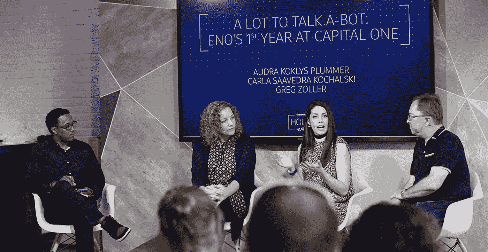
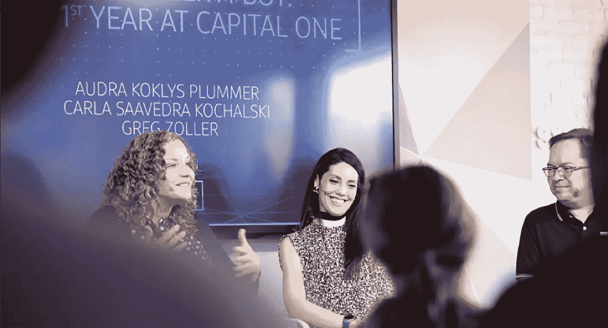
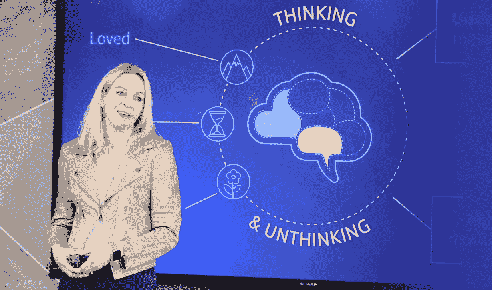

# 让人类处于人工智能发展的前沿

> 原文：<https://medium.com/capital-one-tech/keeping-humanity-at-the-forefront-of-ai-development-2b64162bc0d0?source=collection_archive---------1----------------------->

*Capital One 数字产品开发执行副总裁 Don Busick*

毫不奇怪，关于人工智能对未来社会、人类和就业的影响的辩论再次成为本周在奥斯汀 *SXSW Interactive* 讨论的中心话题。但与过去几年不同的是，在奥斯汀展出的现实世界中，实际的人工智能应用越来越普遍，这些创新背后有来自技术、设计和商业领袖的大量见解和学习。

当然，我们仍处于人工智能的早期阶段——数字革命的第一阶段，但现实世界智能应用的显著增长表明了事物加速的速度有多快。

作为商业领袖，这种转变将继续极大地改变我们构建团队、产品以及与客户互动的方式。仅仅拥有一个优秀的移动应用程序或网站已经不再被接受。我们带给客户的体验现在无处不在——这是一个非常不同的框架，适用于您构建的产品和我们带给人们生活的体验。

作为一个日益以人工智能为先的世界的建设者、创造者和创客，我们如何才能建立和领导团队，为客户解决现实问题，让人类保持在人工智能发展的最前沿？

## 从目标开始

贯穿 SXSW 演讲和小组讨论的一个一致主题是，在人工智能优先的世界中，建设者和创造者既有巨大的机会也有责任以真正造福人类的方式利用数据和技术。

重要的是，构建这些产品的团队是由目的感驱动的。作为一家公司，我们的核心使命和每天激励我们的动力是，我们有机会也有责任打造改善人们财务生活的产品和体验——为他们节省时间和金钱，并让他们感觉更自信，更能掌控自己的环境。

在一个以人工智能为先的世界里，这意味着建立更加主动和互动的智能产品，帮助人们管理他们的财务和更广泛的财务生活——而且矛盾的是，这样做的方式比金融业今天将产品带入生活的方式更像人类。

从历史上看，银行希望人们来银行查看事情进展如何。银行业的未来将越来越多地是在人们需要的时候帮助他们，无论他们在哪里，并代表他们积极主动地做事情——从帮助人们摆脱财务困境的大方法到每天节省时间并使银行业务更简单的小方法。

这是我们本周在 SXSW 发布的新数字产品功能背后的推动力。去年在 SXSW，我们宣布推出 [Eno](https://www.capitalone.com/applications/eno/) ，Capital One 的智能助手。自去年以来，我们一直在以新的方式扩展 Eno 的功能，以改善我们客户的金融生活，本周，我们宣布 Eno 已扩展其功能，为我们的客户提供更高的安全性和对其在线购物体验的控制。有了 Eno，Capital One 持卡人现在可以[在线购物，而无需使用他们的真实信用卡号码](https://www.capitalone.com/applications/eno/virtualnumbers/)——让客户对访问他们的私人信息拥有更大的控制权，并消除了信用卡丢失或被盗时的麻烦和人工操作。

我们希望为我们的客户解除一个常见的焦虑来源，让他们更加安心。正如 Eno 所知，在未来，Eno 与客户的互动将继续变得更加个性化和积极主动，就像一个智能助理一样，为我们的客户和他们的钱着想。

## 性格很重要

随着新对话界面的兴起，智能助理将越来越成为客户体验的支柱。这代表了当今公司和品牌与客户互动方式的巨大转变。你如何设计你的智能助理的角色和个性，将决定你在一个人工智能优先的世界中与客户联系的方式。

在设计 Capital One 的智能助理时，我们认识到角色发展是我们所不具备的能力，因此我们寻找了在角色发展方面具有丰富经验和多元化视角的电影制作人、人类学家、记者和用户体验设计师，以帮助定义和塑造我们的智能助理如何与我们的客户联系。

Capital One 人工智能设计负责人 Audra Koklys Plummer 曾是一名电影制作人，曾为梦工厂、卢卡斯影业和皮克斯等工作室工作，他在 SXSW 上讲述了团队如何设计 Eno。

*“作为一名电影制作人，我学到的最有价值的事情是，深思熟虑的角色设计对于与观众建立联系至关重要。让这种联系如此强烈的是这些角色的人性。我们可以将这种人性融入到我们的智能助手中。为了做到这一点，我们需要能够动态提供个性化信息的基础设施，以及一个能够感知我们与客户对话背景的系统——不仅仅是他们想做什么，还有他们的感受，”*kok Lys Plummer 说道。

有迹象表明 Eno 正在引起人们的共鸣，这让我们深受鼓舞。我们的客户给 Eno 打了 4.6 分(5 颗星)，我们的客户给 Eno 发短信最多的三个短语之一是“谢谢”这标志着我们正在取得比准确性更大的成就(这也很重要)，但我们正在以更深入、更人性化的方式与客户联系。

Koklys Plummer 说:“这种与顾客的对话旨在唤起情感，建立基于信任、同情和理解的关系，创造一种让顾客用心和用脑关注的体验。

Capital One 信用卡客户体验高级副总裁 Katya Andresen 在 SXSW 的一次强有力的演讲中探讨了神经科学、心理学和行为经济学如何为建立受欢迎、持久和改变生活的品牌和客户体验提供工具，他说:建立具有同理心的系统需要超越理性思维，进入“不思考”的思维——非理性、边缘、情绪化的思维。

*“我们都有同样的工作:深入了解人们，这样我们才能创造出对我们有深远影响的东西——产品、团队、公司。通常，我们把自己限制在建立基于思考思维的经验上。但这太有限了。扩大我们的努力范围，把不思考的头脑包括进来，这是真正的领导和创新的关键。Andresen 说:*“当我们以这种心态进行整合和创造时，我们就能建立伟大的公司，并让生活变得更好。

## 授权创新团队

从 2016 年在亚马逊 Alexa 上推出第一个[技能，允许人们与他们的金融账户互动，到 2017 年推出我们的智能助理 Eno，实现了另一个行业第一，我们的对话式人工智能团队继续在金融行业创造创新第一。](https://www.capitalone.com/applications/alexa/)

在一个快速变化的环境中，有一些核心原则激励和授权我们的团队。

*   持续学习-我们专注于帮助团队跟上宏观趋势-从机器学习到新型界面，再到不断变化的商业模式。同样重要的是，确保您的员工能够学习技术并掌握新的技术技能。通过我们的技术学院计划，Capital One 的所有员工都有机会参加由工程师设计的世界级学习计划，该计划提供专注于最新技术学科的综合课程。
*   胸怀大志——有勇气追求宏伟的抱负，但要有纪律迅速认识到并摒弃那些行不通的概念。
*   鼓励实验——鼓励你的团队进行实验，要知道他们中的许多人会失败。
*   多元化至关重要——建立和培养多元化和包容性的文化，在这种文化中，每个人的声音都被倾听和重视。每个人都有独特的观点可以分享，这是由他们的生活经历、文化和激情形成的。
*   继续发货-我们的业务是生产真实世界的产品，大规模解决真实世界的客户问题-我们做到这一点的最佳方式是将产品送到客户手中。我们喜欢每年回到 SXSW 的一个原因是，这是一个与世界分享早期产品和概念、获得反馈和交流想法的好机会。

今天，我们只是触及了我们可以通过机器学习和人工智能解决的客户问题的表面。现在是时候通过将智能与人性相结合来为未来奠定坚实的基础，以确保每一次客户体验都能发挥其改善生活的潜力。

这些是作者的观点。除非本帖中另有说明，否则 Capital One 不属于所提及的任何公司，也不被其认可。使用或展示的所有商标和其他知识产权都是其各自所有者的所有权。本文为 2018 首都一。