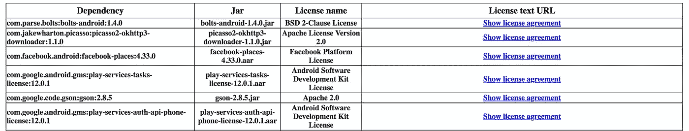
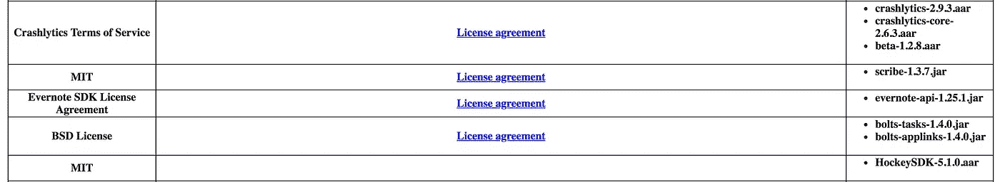

# 检查你的执照

> 原文：<https://medium.com/google-developer-experts/keeping-your-licenses-in-check-411e34a0bcb4?source=collection_archive---------1----------------------->

*快速简便地检查您的 Android 应用程序的第三方许可证*


This image, for instance, does not require any attribution. [Source](https://www.pexels.com/photo/person-holding-pen-in-front-of-contract-1076815/)

# 软件许可入门

许可证是一个棘手的野兽，但我们往往倾向于忽视它们，即使我们真的不应该。第三方库是开源的这一事实很容易欺骗我们，让我们认为我们可以用它做任何我们想做的事情，因为为什么不呢？代码是给每个人看的，我们可以复制或修改它，并且没有物理限制阻止我们这样做。但是，事实证明，从法律角度来看，许可证极其重要。

让我们看一些例子，从[改装](https://github.com/square/retrofit)开始。它是在 Apache 许可下发布的，版本 2.0，但是这到底意味着什么呢？简而言之，这是一个非常宽松的许可，允许您使用、复制、修改和分发代码，无论是私人使用还是商业使用([等等](https://tldrlegal.com/license/apache-license-2.0-(apache-2.0)))。作为回报，改造用户需要包括许可证的副本和修改的列表(如果有的话，还有更多)。

最著名的处理音频和视频的库 [ffmpeg](https://www.ffmpeg.org) 呈现了一个完全不同的情况。这个库是以 GNU 宽松通用公共许可证 2.1 发布的，简称 LGPL。同样，许可证的要点是你可以使用、修改和分发代码，即使是为了商业目的。然而，作为用户，您的义务不仅包括原始许可证，还包括或指向原始源代码。而且，如果 *ffmpeg* 被你的 app 静态链接，你必须允许一个潜在的第三方通过释放它的源代码来修改它；如果是动态链接，您必须使库的源可用。如果这一切听起来很复杂，[这一页会非常有帮助](https://tldrlegal.com/license/gnu-lesser-general-public-license-v2.1-(lgpl-2.1))。

如您所见，不同类型的许可证具有不同类型的权限和义务。为了规范源代码的使用和分发，人们应该选择更好地包含所述代码的期望用途的许可证。[这个网站](https://choosealicense.com/)可以给你一个你可以使用的不同类型许可证的概述，并帮助你选择最合适的一个。

我们可以总结一下我们从这些例子中学到的东西，从法律的角度来看，许可证很重要，有许多不同的类型，每种类型都有许可和义务。

# Android 开发者许可证

作为 Android 开发人员，我们有幸成为一个非常活跃的社区的一部分，这个社区已经发布了数量惊人的库，每个人都可以使用。我们如此习惯于要么认为它们是理所当然的，要么简单地假设一定有一个满足我们当前特定需求的。

在最开始的时候，我完全忽略了许可证。我遇到了一个问题，图书馆可以帮我解决，就这样。然而，不管你是独立开发者还是为一家公司工作，**你都要为不遵守某个特定的许可而承担法律责任**。当你有了这种意识后，你会对你使用的库更加小心，你会检查它们附带了什么许可证。

但是如果你，或者你的公司，已经有了一个有几十个第三方库的应用程序呢？你怎么能检查每个人的许可证呢？

最天真但完全有效的方法是手动检查它们中的每一个，并以某种方式检查它们的许可证，要么通过查看它们的档案，要么通过在线查找它们。这种方法虽然有效，但是非常麻烦和乏味。此外，随着时间的推移和复杂性的增加，“它不会扩展”:如果再增加 10 个库会怎样？您多久检查一次许可证是否已经变更？

# `license-gradle-plugin`去营救

在我加入 Blinkist 后，我的任务就是解决这个特殊的问题。我们需要一种方法来检查我们所依赖的许可证(通过使用第三方库)，可能按许可证类型分组。`[license-gradle-plugin](https://github.com/hierynomus/license-gradle-plugin)`看起来是完成这项任务的完美工具:在它提供的不同功能中，有一个允许扫描依赖树，获取它能找到的所有许可证，并按许可证类型对它们进行分组。听起来不错🎉

然而，该插件最近没有任何积极的发展，似乎也没有与 Gradle 的最新版本一起工作(特别是在 Gradle 3.4 之后，在那里引入了新的`api/implementation`指令)。这个 PR 似乎已经为它引入了兼容性，但它从未发布。我决定试一试，看看`master`是否有效。

多亏了 JitPack，这是一个 2 分钟的工作。我们的`build.gradle`文件中的几行代码

```
allprojects {
  repositories {
    ...
      maven { url 'https://jitpack.io' }
    }
}dependencies {
  implementation 'com.github.hierynomus:license-gradle-plugin:**master-SNAPSHOT**'
}plugins {
  id "com.github.hierynomus.**license-report**" version "0.14.0"
}
```

它已经准备好了。如你所见，我们使用的是`master`的`SNAPSHOT`版本。该插件也是模块化的，我们感兴趣的只是报告部分，因此是`license-report`。

要使用它，我们首先需要提供一个配置，它的基本版本如下所示

```
downloadLicenses {
  dependencyConfiguration **[your_build_task_here]**
  includeProjectDependencies true
}
```

`dependencyConfiguration`参数允许您指定将要检查依赖项的 Gradle 任务:只需指定用于构建应用程序的任务。`includeProjectDependencies`参数允许您在分析中包含传递依赖关系。

要运行插件，只需调用相应的 Gradle 任务，如下所示

```
$ ./gradlew downloadLicenses
```

然后，插件将分析依赖关系，获取找到的所有`LICENSE`文件，并根据依赖关系和许可证对它们进行分组。我们可以通过查看`build/reports`目录找到分析结果，其中有两个 HTML 文件(其他格式可用):`dependency-license.html`，它将每个依赖项映射到它的许可证，以及`license-dependency.html`，它将依赖项按许可证分组。它们看起来像这样



Dependency > license



License > dependencies

看起来棒极了！现在我们有了一个简单的方法来检查我们当前使用的库的许可。🤓

# 结论

这个解决方案完全符合我们的需求，但这并不意味着它不能被改进。`gradle-license-plugin` [通过分析 POM 元数据](https://github.com/hierynomus/license-gradle-plugin/blob/master/src/main/groovy/nl/javadude/gradle/plugins/license/LicenseResolver.groovy)来工作，但不是每个第三方库都有一个，所以你将获得的许可证列表可能不是详尽的(感谢[塞巴斯蒂安·波吉](https://medium.com/u/9706138c9bfb?source=post_page-----411e34a0bcb4--------------------------------)指出这一点)。此外，最好扩展插件，以便每当引入尚未列入白名单的新许可证时，它都会发出警告/错误。

Google 还发布了 [OSS Licenses Gradle 插件](https://github.com/google/play-services-plugins/tree/master/oss-licenses-plugin)，它与本文中使用的插件非常相似，可以与一个在活动中显示许可证的库配对。但是，老实说，这不是最漂亮的。

我确信还有更多结构化的解决方案，我很好奇你是否/如何解决这个问题。随时在 Twitter 上打我[或者回复这篇文章。同时，我希望这有所帮助！](https://twitter.com/@rotxed)

# 附录

或者，你知道，你可以避免所有这些，只使用 [WTFPL](http://www.wtfpl.net/) (一个可爱的缩写，代表"*[Do]What F * * k You Want to Public License*")，正如我可爱的同事[Thiago " Fred " porciúncula](https://medium.com/u/99617bfaf07e?source=post_page-----411e34a0bcb4--------------------------------)所指出的😂