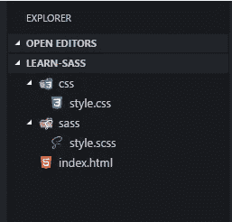

# Kenalan & Belajar Penggunaan Dasar SASS

> 原文：<https://medium.easyread.co/kenalan-belajar-penggunaan-dasar-sass-9453ca64c991?source=collection_archive---------5----------------------->


image from [https://upload.wikimedia.org](https://upload.wikimedia.org/wikipedia/commons/thumb/9/96/Sass_Logo_Color.svg/2000px-Sass_Logo_Color.svg.png)

Pada kesempatan kali ini kita akan kenalan dan belajar tentang sebuah CSS preprocessor yang bernama Sass, kalo ada yang belum tau dengan Sass nih tak kasi apa itu mahluk yang bernama sass itu, Sass (Syntactically Awesome StyleSheets) adalah bahasa yang diadopsi dari CSS, tapi memiliki fitur yang lebih banyak dari CSS , eits bentar dulu jangan salah paham, SASS ini dibuat bukan untuk mengantikan CSS, tapi Sass ini lebih tepat nya adalah sebuah tools yang bisa membuat pengerjaan CSS jadi lebih mudah, jadi di website kita yang kita gunakan bukan file sass nya langsung melainkan file CSS itu sendiri yg mana merupakan hasil dari compilelan si file sass yang telah kita buat.

# Keuntungan Pakai SASS apa daripada menggunakan CSS secara langsung tanpa SASS ?

Untungnya banyak banget terutama kalo ngerjain proyek skala menengah sampai ke besar itu kerasa banget manfaatnya pake Sass ini contohnya aja kita bisa manfaatin fitur-fitur seperti yang ada di bahasa pemrograman seperti variable, fungsi, perulangan, pewarisan dan masih banyak lagi fiturnya.

Ok mungkin cukup segitu aja tentang pengenalan Sass nya dan waktunya kita mulai aja lah belajarnya dimulai dengan instalasi Sass nya dulu di komputer kita masing-masing.

# Instalasi Ruby

Untuk menginstal Sass di komputer kita, kita butuh untuk menginstal Ruby terlebih dahulu karena Sass ini dibangun menggunakan bahasa Ruby jadi untuk bisa menggunakanya kita harus menginstall ruby nya terlebih dahulu, silahkan unduh ruby di link berikut: [https://rubyinstaller.org/downloads/](https://rubyinstaller.org/downloads/) setelah proses selesai anda bisa mencoba untuk menjalankan perintah ini terlebih dahulu untuk memastikan apakah Ruby sudah benar-benar terinstal di komputer kita, ketikan perintah berikut pada Terminal/cmd:

```
ruby -v
```

Jika berhasil maka akan memunculkan versi dari ruby tersebut.

# Instalasi SASS

Nah saetelah berhasil memasang ruby di komputer selanjutnya adalah dengan menginstall sass itu sendiri, ketikan perintah berikut pada terminal/cmd :

```
gem install sass
```

Tunggu sampai proses instalasi selesai, setelah proses selesai cek apakah sass sudah berhasil di install apa belum dengan mengetikan perintah berikut :

```
sass -v
```

Jika proses instalasi berhasil maka akan memunculkan versi dari Sass nya.

Ok saatnya kita mulai ngoding dan melihat fitur-fitur apa saja yang ada pada Sass ini, pertama buatlah sebuah folder project untuk meletakan file-file yang kita butuhkan dalam belajar kali ini, setelah itu masuk ke dalam folder tersebut melalui terminal/cmd, dan buatlah satu file index.html dan dua folder di dalam folder project utama kita yg bernama sass dan css dimana folder itu berfungsi untuk menaruh file sass dan file css kita selama belajar kali ini, lalu di dalam folder sass buatlah satu buah file bernama style.scss dan di dalam folder css buat juga file bernama style.css, berikut tampilan struktur foldernya :



Struktur folder

Setelah membuat folder sekarang ketikan perintah berikut pada teminal/cmd untuk mulai menjalankan SASS nya dan bisa mulai ngoding :

```
sass --watch sass/style.scss:css/style.css
```

Fungsi dari perintah diatas adalah untuk menjalankan sass dan mengcompilenya ke file css dan kita juga menggunakan fungsi *watch* disana untuk mengawasi jika ada perubahan pada file style.scss maka file style.css juga akan langsung ikut berubah.

# Variables

Pertama kita akan kenalan dengan fitur variable yang ada pada Sass, ok sekarang buka teks editor dan buka file style.scss lalu ketikan script berikut :

```
$font-stack: Helvetica**,** sans-serif;
$primary-color: #333;

body {
  **font**: 100% $font-stack;
  **color**: $primary-color;
}
```

Pada kode di atas, kita mendeklarasikan variabel $font-stack & $primary-color yang menyimpan jenis font dan nilai warna dalam format hex. Variabel tersebut kita gunakan untuk mengisi atribut font dan color pada tag body.

Setelah kita menyimpan *file* di atas, maka Sass akan langsung mengcompile sintaks Sass tersebut dan dan file style.css juga akan otomatis berubah, jika tidak percaya, coba buka file css nya maka otomatis sudah terisi dengan script hasil compilean dari file sass nya tersebut.

# Mixins

Mixin ini penggunaannya mirip dengan **function** pada bahasa pemograman. Karena sifatnya yang sama seperti sebuah function jadi kita dapat mengunakannya berulang-ulang pada script Sass kita sesuai kebutuhan, berikut contoh penulisanya :

```
**@mixin** **border-radius**($radius) {
  -webkit-border-radius: $radius;
  -moz-border-radius: $radius;
  -ms-border-radius: $radius;
   **border-radius**: $radius;
}

**.box** { **@include** **border-radius**(5px); }
```

Maka hasil css nya akan seperti berikut :

```
.box {
  -webkit-border-radius: 5px;
  -moz-border-radius: 5px;
  -ms-border-radius: 5px;
   border-radius: 5px;
}
```

Bagaimana keren bukan, jika ingin menggunakanya di elemen yang lain kita hanya tinggal memanggil fungsinya saja seperti berikut `**@include** **border-radius**(nilai)`

# Extend/Inheritance

Dengan extend ini kita dapat membagikan/menggunakan suatu properti CSS dari sebuah *selector* ke *selector* yang lainnya tanpa harus menulisnya secara lengkap, dimana fungsinya hampir sama seperti inherintance dalam pemrograman dimana property2 yang ada pada parent bisa diturunkan ke childnya. Berikut ini contoh scriptnya :

```
**.message** {
  **border**: 1px solid #ccc;
  **padding**: 10px;
  **color**: #333;
}

**.success** {
  **@extend** **.message**;
  **border-color**: green;
}

**.error** {
  **@extend** **.message**;
  **border-color**: red;
}

**.warning** {
  **@extend** **.message**;
  **border-color**: yellow;
}
```

Maka hasilnya akan seperti berikut :

```
**.message,** **.success,** **.error,** **.warning** {
  **border**: 1px solid #cccccc;
  **padding**: 10px;
  **color**: #333;
}

**.success** {
  **border-color**: green;
}

**.error** {
  **border-color**: red;
}

**.warning** {
  **border-color**: yellow;
}
```

Wow mantap, dengan fitur extend ini kita tidak perlu lagi capek2 menuliskan property berulang-ulang pada masing-masing selector.

# Operator

Operator ini sama seperti operator pada bahasa pemrograman dimana kita bisa melakukan operasi matematika seperti **+,-, *, / , dan %** pada SASS. Berikut contoh scriptnya :

```
**.container** { **width**: 100%; }

article**[**role**=**"main"**]** {
  **float**: left;
  **width**: 600px **/** 960px ***** 100%;
}

aside**[**role**=**"complementary"**]** {
  **float**: right;
  **width**: 300px **/** 960px ***** 100%;
}
```

Maka hasilnya akan diterjemahkan seperti berikut :

```
**.container** {
  **width**: 100%;
}

article**[**role**=**"main"**]** {
  **float**: left;
  **width**: 62.5%;
}

aside**[**role**=**"complementary"**]** {
  **float**: right;
  **width**: 31.25%;
}
```

Bagaimana keren bukan ?

Nah untuk menggunakanya pada file html yang sudah kita buat sebelumnya sama saja caranya seperti biasa kita tinggal memanggil file style.css yang ada folder css dengan menggunakan tag *< link rel=”stylesheet” type=”text/css” href=”css/style.css” >* bagaimana mudah kan ?

Mungkin hanya itu saja yg bisa saya tulis pada artikel kali ini, oh ya yang saya tulis ini baru hanya beberapa beberapa fitur dari SASS saja untuk lebih jauh teman-teman bisa mengikuti dan mempelajari nya lebih jauh pada dokumentasi resminya pada link berikut [http://sass-lang.com/guide](http://sass-lang.com/guide) .

Ok sekian semoga tulisan yang singkat ini bisa bermanfaat dan membantu teman-teman semua dan jangan lupa tekan tombol claps 👏 nya jika anda merasa tulisan ini membantu, Sekian dan Terimakasih. ☺

Dokumentasi Sass :

 [## Sass: Sass Basics

### Syntatically Awesome Style Sheets

sass-lang.com](http://sass-lang.com/guide)  [## File: SASS_REFERENCE - Sass Documentation

### Sass is an extension of CSS that adds power and elegance to the basic language. It allows you to use variables, nested…

sass-lang.com](http://sass-lang.com/documentation/file.SASS_REFERENCE.html)