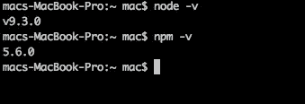
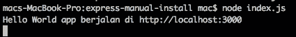
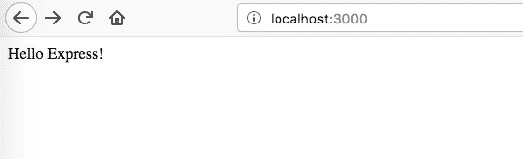
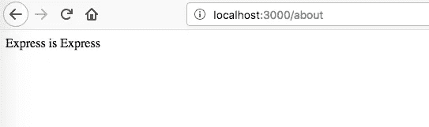
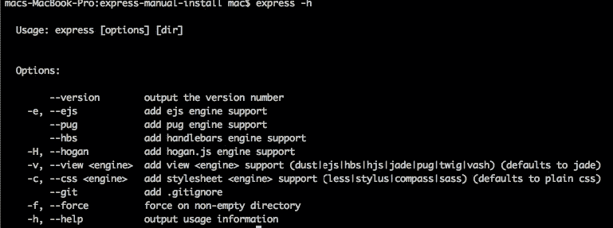
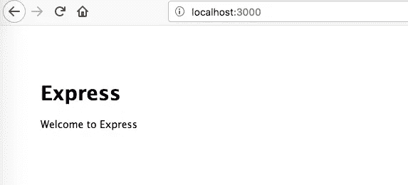
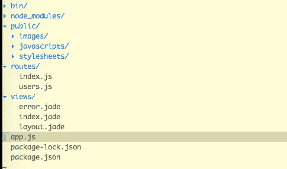

# Kenalan dengan Nodejs dan Expressjs

> 原文：<https://medium.easyread.co/kenalan-dengan-nodejs-dan-expressjs-e1e8887ad4ad?source=collection_archive---------0----------------------->


Node JS

kalau kita mau membuat web app pasti tidak cukup hanya menggunakan satu bahasa saja.

misal kita harus pakai html, javascript sebagai front-end dan php sebagai back-end.

tapi sekarang, cukup satu bahasa yaitu : **javascipt** yang akan menghandle front-end dan back-end.

bukannya javascript itu kegunaannya untuk nangani logic di halaman browser ya, kok bisa jalan di backend?

berkat chrome v8 javascript engine akhirnya javascript bisa juga jalan di backend dan lahirlah **nodejs**

Kesan pertama saya saat pertama kali koding dengan node js ini serasa di permudah banget dalam urusan environment nya.

ya secara , kalau kita ngoding php , gak bisa cuma install php terus php nya bisa jalan gitu aja. php butuh apache sebagai web server nya, jadi harus install apache web server juga.

tapi dengan nodejs ini , dia juga akan bertindak sebagai web server. jadi untuk menjalankan web app nya kita hanya butuh **nodejs.**

kita gak perlu lagi ngatur-ngatur webserver apache nya hehe , udah di urusin sama nodejs nya.

oke jadi gimana cara ngebuat web app dengan nodejs ini?

pertama tentu kita butuh nodejs terinstall di komputer kita, untuk cara install nya silahkan lihat dokumentasi nodejs , oh ya gak usah khawatir soal os apa yang support , karena nodejs ini bisa jalan di windows, dan unix

[](https://nodejs.org/en/) [## Node.js

### Node.js® is a JavaScript runtime built on Chrome's V8 JavaScript engine. Node.js uses an event-driven, non-blocking I/O…

nodejs.org](https://nodejs.org/en/) 

pastikan nodejs sudah terinstall dengan jalankan command berikut di terminal.



node version and npm version

oh ya mulai sekarang kita sudah harus familiar dengan terminal ya, karena kalau udah nyentuh fullstack javascript pasti sering banget command pakai terminal. kalau di windows di kenalnya command prompt

npm itu singkatan dari node package manager , dia itu manajer package nya node. kalau di php , saya sering pakai composer untuk ngatur package php, nah fungsi nya itu sama, tapi ini khusus package javascript aja.

karena kita akan membuat website dengan nodejs, maka kita butuh satu framework yaitu express js , node.js web application framework.

 [## Express - Node.js web application framework

### Express is a minimal and flexible Node.js web application framework that provides a robust set of features for web and…

expressjs.com](https://expressjs.com/) 

sebenernya bisa aja buat web app dengan murni hanya nodejs saja. tapi dengan expressjs ini akan mempercepat pembuatan web app nya.

ada dua cara penginstallan untuk menggunakan expressjs , saya nyebutnya cara manual dan cara automatis:

kita bahas yang cara manual dulu

1.  buka terminal, buat direktori baru misal : express-manual-install

```
$ mkdir express-manual-install 
```

2\. lalu masuk ke direktori tadi dan jalankan command npm init untuk menjadikan direktori tersebut menjadi projek nodejs

```
$ cd express-manual-install && npm init
```

3\. ketika menjalankan npm init , dia akan menanyakan beberapa hal seperti apa nama projectnya, alamat github nya, versi nya , entry point js nya . jawab aja seada nya , kalau enggak di enter terus aja.

4\. install expressjs nya dengan command berikut

```
$ npm install --save express
```

5\. Sekarang express kita sudah siap dipakai

untuk web nya kita akan buat web menampilkan hello world dengan dua route “/” dan “/about”

```
const express = require('express')
const app = express()app.get('/', (req, res) => res.send('Hello Express!'))
app.get('/about', (req, res) => res.send('Express is Express'))app.listen(3000, () => console.log('Hello World app berjalan di [http://localhost:3000](http://localhost:3000)'))
```

simpan kode di atas dengan nama index.js , lalu jalankan dengan node

```
$ node index.js
```



node index.js

buka alamat [http://localhost:3000](http://localhost:3000) di browser dan lihat web app express berhasil berjalan!



itu cara manual, cara otomatis nya yaitu dengan express generator.

dari nama nya aja udah ketahuan ya apa fungsinya express generator , dengan tools ini kita akan di buat satu paket project express lengkap dengan direktori yang sudah di susun rapi agar kita mudah untuk mengerjakan web dengan express serta depedency package dasar yang sudah terinstall

1.  install express generator

```
$ npm install express-generator -g
```

2\. pastikan sudah terinstall dengan command :

```
$ express -h
```



express help

3\. untuk membuat express app baru jalankan command berikut :

```
$ express myapp 
```

4\. command di atas akan membuatkan kita sebuah direktori baru dengan nama **myapp** yang sudah berisi kode nodejs dan express serta package depedency siap install. pindah ke direktori **myapp** tadi dan install.

```
$ cd myapp && npm install
```

5\. jalankan express web app nya dengan command :

```
npm start
```



express hello world page



express app directory

siip, express app sudah jadi dan siap di utak-atik.

Artikel ini hanya sedikit pengenalan dan cara install, untuk artikel yang lebih advance silahkan pantau terus di medium saya.

Jika tulisan ini bermanfaat buat kalian silahkan beri claps 👏 👏 👏, dan share ke teman kalian siapa tahu ada yang membutuhkan.

*Artikel ini di tulis oleh* [*Haidar Afif Maulana*](https://medium.com/u/631846fabf4?source=post_page-----e1e8887ad4ad--------------------------------) *, beliau adalah proffesional Full Stack Developer sejak 2014, beliau sering menulis artikel mengenai Software Engineering dan Programming. Follow profilnya untuk mendapatkan update-an terbaru artikel-artikel beliau.*

*Jika anda merasa artikel ini menarik dan bermanfaat, bagikan ke lingkaran pertemanan anda, agar mereka dapat membaca artikel ini.*