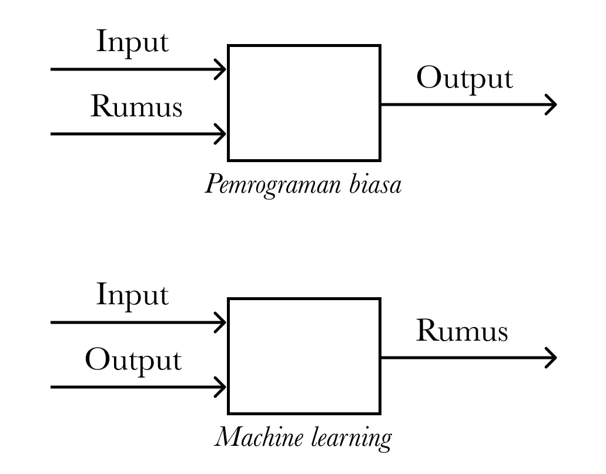

# Mengapa Kita Menggunakan Machine Learning?

> 原文：<https://medium.easyread.co/kenapa-kita-menggunakan-machine-learning-ae2a1d05433e?source=collection_archive---------3----------------------->

## Belajar dari contoh code Machine Learning yang paling sederhana dengan Python dan TensorFlow


Photo by [Cookie the Pom](https://unsplash.com/@cookiethepom?utm_source=medium&utm_medium=referral) on [Unsplash](https://unsplash.com?utm_source=medium&utm_medium=referral)

# Brainstorming

Sebelum terjun ke dunia coding, kita bisa menguji diri kita dengan soal matematika sederhana, seperti berikut.
*Coba tentukan nilai y pada soal berikut:*

```
**x adalah input, dan y adalah output**Jika x=5 maka y=11
Jika x=0 maka y=1
Jika x=-2 maka y=-3
Jika x=7 maka y= ... ?
```

Ketemu? Yes, ***y* = 15**

Pertama yang kita lakukan adalah mempelajari tiga contoh yang ada. Kemudian otak kita akan mencoba mencari hubungan dari ketiga persamaan tersebut dan akhirnya menemukan polanya yaitu `**y = x * 2 + 1**` . Setelah menemukan pola ini maka jika ada *x* berikutnya maka kita akan mampu untuk menentukan nilai *y* nya.

# Mulai Ngoding

Sekarang kita akan membuat komputer juga mampu menemukan pola ini. Kita akan buat program *machine learning* untuk memprediksi persamaan seperti contoh diatas sebelumnya. Disini kita akan menggunakan bahasa pemrograman *Python* dan *library ML TensorFlow* .

Pertama kita import dulu *library* yang diperlukan

```
**import tensorflow as tf
import numpy as np**
```

Kemudian kita buat model *machine learningnya* . Disini kita menggunakan 1 *neuron* input dan 1 *neuron* output.

```
model = tf.keras.Sequential()
model.add(tf.keras.layers.Dense(units=1, input_shape=[1]))
model.compile(optimizer='sgd', loss='mean_squared_error')
```

Selanjutnya kita berikan contoh-contoh untuk dipelajari oleh *machine learning* , dan kita mulai proses trainingnya sebanyak 100 kali iterasi ( *epoch* ).

```
x = np.array([5, 3, 2, 8, 0, 9, 1, 4, 6, 7], dtype=float)
y = np.array([11, 7, 5, 17, 1, 19, 3, 9, 13, 15], dtype=float)**model.fit(x, y, epochs=100, verbose=0)**
```

Sekarang machine learning sudah selesai belajar. Kita bisa uji dengan memberikan nilai yang belum pernah dilihat sebelumnya oleh si program.

```
**print(model.predict([11]))**outputnya:
**[[23.20875]]**
```

Bisa kita lihat *machine learning* yang kita buat berhasil dalam memprediksi nilai *y* , meskipun belum pernah diberikan data belajar angka 11 sebelumnya.

> Tapi kok ada koma nya ya?

Perlu kita pahami bahwa hasil dari *machine learning* adalah berupa perkiraan. Selain itu beberapa hal akan mempengaruhi akurasi dari model *machine learning* yang kita buat. Salah satunya adalah jumlah data training. Pada contoh diatas kita hanya menggunakan 10 data saja.

Pada model *machine learning* yang sebenarnya data training haruslah banyak. Pada contoh machine learning di [**artikel kami sebelumnya**](https://muhammad-arnaldo.medium.com/how-to-build-a-multi-class-image-classification-model-without-cnns-in-python-660f0f411764) , data training yang digunakan adalah sebanyak 60.000 data.

# Masalah Yang Tidak Membutuhkan Machine Learning

Masalah diatas sebenarnya tidak memerlukan *machine learning* . Karena kita bisa buat solusi yang lebih sederhana, seperti ini:

```
x = 11
y = x * 2 + 1
print(y)
```

> Pada permasalahan yang rumus atau aturannya masih bisa kita tentukan maka kita tidak memerlukan machine learning.

# Jadi, Kapan Kita Menggunakan Machine Learning?


Photo by [Erik-Jan Leusink](https://unsplash.com/@ejleusink?utm_source=medium&utm_medium=referral) on [Unsplash](https://unsplash.com?utm_source=medium&utm_medium=referral)

Misal kita ingin membuat program yang dapat menentukan gambar diatas merupakan gambar kucing atau anjing. Rumus apa yang akan kita tulis pada kode kita? Rulesnya seperti apa? Tentunya akan sangat sulit sekali menentukannya. Backgroundnya bisa pohon, jalanan, kasur, orang. Lalu kucingnya bisa menghadap kedepan, samping, guling-guling. Warna hewannya bisa kuning, loreng, putih dan masih banyak lagi faktor lainnya.

*Nah,* dalam permasalahan yang rulesnya terlalu sulit untuk ditentukan seperti inilah kita menggunakan *machine learning* . Dengan *machine learning* kita bisa memecahkan masalah yang dimana rules atau rumus untuk menentukan outputnya terlalu rumit (bahkan tidak mungkin) untuk kita tulis secara manual. Lihat ilustrasi berikut:



Perbedaan pemrograman biasa dan machine learning. Gambar oleh penulis.

Bisa kita lihat bahwa pada *machine learning* yang harus kita siapkan adalah contoh-contoh input beserta outputnya atau kita sebut *label* . Seperti pada contoh kita diawal.

Dalam contoh kucing dan anjing, yang kita siapkan adalah gambar kucing sebanyak-banyaknya dan kita beri label “kucing”, begitu juga dengan gambar anjing.

# Kesimpulan

Kita sudah berhasil membuat program *machine learning* yang sangat sederhana. Kita juga sudah mengetahui bagaimana konsep dasar cara kerja *machine learning,* serta masalah apa yang membutuhkan dan tidak membutuhkan *machine learning* .

# Selanjutnya?

*   *Machine learning* yang kita bahas diatas adalah masalah klasifikasi, penggunaan masih banyak dan masih luas lagi, kamu bisa eksplorasi lagi tentang hal ini
*   Kamu juga bisa lanjut dengan belajar *Artificial Neural Network* pada artikel berikut ini:

[](https://muhammad-arnaldo.medium.com/how-to-build-a-multi-class-image-classification-model-without-cnns-in-python-660f0f411764) [## How to build a multi-class image classification model without CNNs in Python

### The beginners guide to build a simple Artificial Neural Network model.

muhammad-arnaldo.medium.com](https://muhammad-arnaldo.medium.com/how-to-build-a-multi-class-image-classification-model-without-cnns-in-python-660f0f411764)