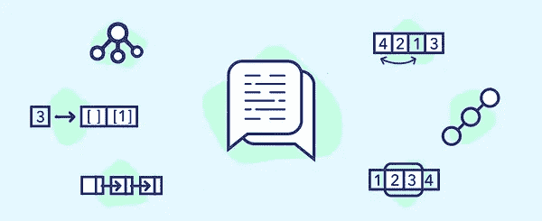

# Kerberos:加密

> 原文：<https://medium.com/double-pointer/kerberos-encryption-d46e229d1dc5?source=collection_archive---------0----------------------->

本课简要介绍加密和加密密钥。

> 别忘了买你那本畅销书 [**卡莉 Linux 黑客**](https://amzn.to/3K4hQzp)

## [上一张](https://bit.ly/3IMPN46) | [首页](https://bit.ly/3CoSIO2) | [下一张](https://bit.ly/35JWsOa)

*在这里* *获得完整的* [*Kerberos 课程。*](https://bit.ly/3vL8qSy)

> **别忘了拿你那本** [**网络安全必备**](https://amzn.to/3BFWeEI) **。请考虑支持我们的** [**中型**](https://bit.ly/3OvimpR) **或结帐我们的合作伙伴之一**[**uda city**](https://bit.ly/3JIpvl4)**|**[**Coursera**](https://imp.i384100.net/zaYBB0)**|**[**plural sight**](https://pluralsight.pxf.io/Ao7GGK)

Work smart, [learn coding patterns to solve interview questions](https://bit.ly/3agTSNt) rather work hard and waste endless hours on LeetCode