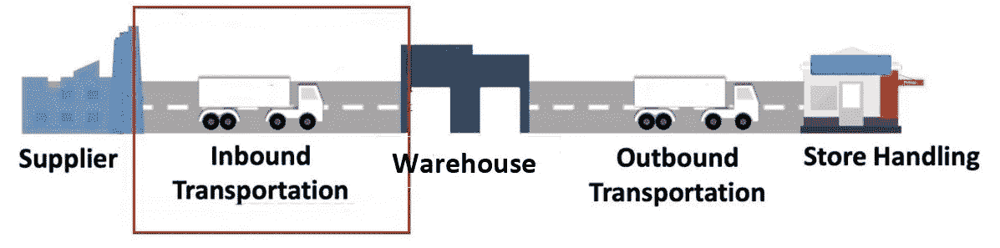
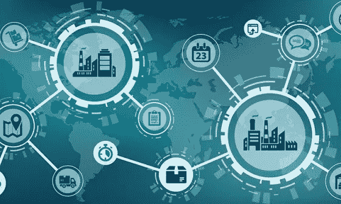
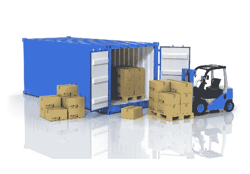
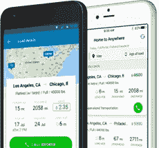
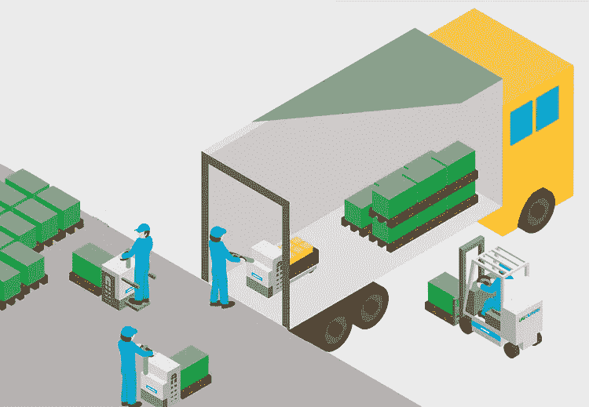
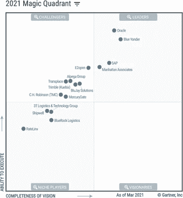

# 供应链入站货运管理的关键因素

> 原文：<https://medium.com/walmartglobaltech/key-factors-of-supply-chain-inbound-freight-management-951548bc8ea8?source=collection_archive---------1----------------------->

合著者:[苏菲·朱利菲卡](https://medium.com/u/837715dcfe6c?source=post_page-----951548bc8ea8--------------------------------)

[source](https://pixabay.com/photos/production-facility-logistic-4408573/)

*供应链的货运管理可以分为 2 个部分，入库和出库。我们将介绍入站货运管理的基础知识以及管理这一管理的关键因素。*

**什么是入库货运管理？**

入站货运管理处理各种组合的入站运输管理，如供应商/供应商到仓库/配送中心/履行中心/直接运输到零售站点/多个运输点(或整合中心)等。下图*仅指一个组合*。

如果入站货运管理得当，那么它可以提高准时交付、减少浪费、降低货运成本、提高客户服务等。

***管理入站货物时需要重点关注的关键因素，有助于入站物流的顺利进行:***

**供应商/卖主:**

从哪一个来源&你把货物带到哪里。它可以是本地的、国内的和国际的。本地是指离你的配送中心 50 英里以内，这意味着你的运输成本将是最低的。

[Source](https://www.pymnts.com/news/b2b-payments/2018/acquisition-merger-supply-chain-connectivity/)

> *这里最重要的考虑是绘制货源和仓库之间的所有运输路线，以预见问题。*

**货物合并:**

许多组织会考虑 FTL(满载)，要实现这种数据透明对供应商来说很重要。

货物是如何合并的，因为你将带进各种类型的货物，这些货物需要额外的注意，比如有些需要冷藏/冷冻、冷冻。

[Source](http://seagoldlimited.com/services/consolidation/)

有些拖车包括常温、冷藏/冷冻、冷冻在一个拖车中，拖车有多个车厢，尺寸和其他细节对供应商有助于计划、优先接受订单。

**运输方式选择:**

你用什么方式运进货物，通过公路、铁路、海运还是空运？大多数时候，我们至少会使用两种模式。这些运输方式对供应链管理有着强烈的影响。

[Source](https://www.tatti.in/blog/importance-and-future-trends-logistics-and-supply-chain-industry/)

这个决定很难做出，但考虑到某些因素，如物品大小、耐用性以及何时到达/交付，我们可以选择运输方式。

**载具类型选择:**

在去找第三方或征求建议书之前，对承运商的交付周期做一些基本分析；要覆盖的位置；旅行的频率；除一般要求外的任何其他要求。这些数据可以由运输管理部门收集。

[Source](https://www.transportation.gov/grants)

如果需要特定地理区域的保险或任何额外服务，请计划额外费用。

清楚地给出你的要求，如准时性能、设备类型、可用性等。，而且最好有能力把运费分摊给承运人。

**距离:**

托运人通常每年向承运人发送一次航线。车道详细信息主要由始发地邮政编码+目的地邮政编码+预计数量组成。

[Source](https://truckerpath.com/truckloads/free-load-board/)

> 运营商以“每英里费率/成本”的形式提供费率。
> 
> 激增/现货定价涵盖了超额承诺的容量。

根据[的最新数据](https://www.paragonrouting.com/en-us/blog/post/want-optimize-your-fleet-know-your-average-trucking-cost-mile/)，美国平均每英里货运成本为 1.82 美元。因此，如果你的一辆卡车去年行驶了 100，000 英里，你要花 182，000 美元来保持这辆卡车在路上行驶。

当企业手动规划车辆路线时，问题就来了。这种手动规划经常忽略关键因素，如历史路况和平均速度等。最好有自动车辆路线，这有助于减少路线时间和距离。

**驾驶员及其驾驶行为:**

一些技术可以用来提高每加仑英里数，

> *通过监控驾驶员挂到最高档位的时间来优化行为&空闲时间。*
> 
> *培训驾驶员更有效地换挡，以减少发动机的压力，以及如何在巡航控制中花费最多的时间。*

最好使用最新技术，如先进的车辆体验卡车，这样可以有效地利用它们。这里最重要的强烈推荐是，选择 sleeper Flex Studio 配备折叠床和必要的其他功能，为驾驶者提供更多舒适和便利。

**货运类型:**

主要有两种运费类型，一种是预付，另一种是到付。许多人开始从预付转向拥有配件、长途运输、燃油附加费的所有权。

在收集中，组织有更多的权利，不依赖于任何供应商/第三方物流(第三方)

当在尽职调查的情况下执行预付和收取时，在正确的情况下使用它可以节省时间，因为它仍然是运费的持续影响因素，并且可以显著降低成本和进行总体控制。

**卸载:**

根据拖车的到达来管理入站装运，给它们分配卸载货物的通道，有很好的机会控制获得更精确的过程。

[Source](https://blog.unicarrierseurope.com/material-handling-blog/loading-unloading-lorry-warehouse-pallet-trucks-or-counterbalance-forklifts-advice-analysis)

当选择预付费/第三方物流时，最好有集成的软件，这样运输公司自己就可以注册一个方便他们装卸材料的时间段。这也提醒我们，如果任何卡车错过或延迟，所以它可以被计划为以后到达码头。

从“卸货”这一步开始，DC(配送中心)的入站运营之旅就开始了。

> 有几种方法可以优化上述因素，因为我们必须有准确、及时和全面的数据。
> 
> 我们还必须有明确的目标，即我们希望通过物流优化实现什么。

模型是我们将操作需求和约束转化为计算机可以理解并在算法中使用的东西的方式。我们需要模型来表示如何将货物组合成卡车的货物。一个非常简单的模型，如货物的总重量/体积，将忠实地代表一些装载要求。

必须明确考虑可变性，因为它几乎出现在所有供应链和物流过程中。举个例子，

1.  旅行时间因旅行而异。
2.  在 DC 要挑选的商品数量每天都不一样。
3.  装载卡车的时间因卡车而异。

数据整合必须完全自动化，因为物流优化必须考虑大量数据。例如，优化每天从仓库到商店的配送需要关于订单、客户、卡车、司机和道路的数据。除了非常少量的数据之外，手动输入任何内容都非常耗时，并且容易出错，不支持优化。

**交通管理系统(TMS):**

Credit: [Gartner](https://www.gartner.com/en/supply-chain/insights/supply-chain-risk-readiness)

TMS 套件/供应商在任何组织的入站货运管理中扮演着重要角色。你可以看到 Gartner 的 2021 年运输管理系统魔力象限。TMS 套件像 Blue Yonder，Oracle 等。都在领袖象限。大多数 TMS 套件/供应商提供在途计划、执行、跟踪和追踪、负载设计、基于资产/基于车队的路线和调度、多式联运能力等。

大多数 TMS 供应商支持所有基本功能，它们支持高级功能的能力，例如详细的规划/优化和模型覆盖，差别很大。并不是所有的 TMS 供应商都能支持复杂的运输网络，尤其是对于需要在全球多个地点提供强大支持的企业。

根据您组织的需求和业务类型选择您的 TMS 供应商。

## **数据和技术实现—参考架构:**

下面我们将展示供应链货运管理的高级数据和技术实施架构。可能存在多种技术解决方案，我们已经展示了一个这样的实现作为通用示例。您可以根据自己的需求选择工具，每个工具都有自己的价值主张。

在上图中，我们显示了数据接收的快速和慢速路径，您可以根据需要选择采用哪种路径。

1.  在快速路径中，或者更确切地说，在流路径中，您必须首先根据您的需要选择标准和协议。业界存在各种标准，如 MQTT、HTTP2、HTTP、Profinet、Modbus、Websocket、SNMP 等等。
2.  对于流接收，您可以根据您的需求和使用案例选择融合托管服务或独立 Kafka 或任何其他服务。如果您使用融合云或独立 Kafka 服务，那么您需要为下游系统配置 Kafka 连接器。
3.  这一层分为暂存层和 ETL 层。您需要一个消费者来消费数据生产者(流层)。ETL 工具可以进一步处理原始数据，根据需要清理和整理数据。根据您的适合性，随意选择任何 ETL 工具。
4.  根据您使用的云服务，最终处理和消费的数据可以以任何格式存储。不要忘记实施适当的数据质量(DQ)和数据生命周期管理(DLM)规则来适当地管理这一层中的数据。此外，您可以通过行业中可用的各种工具来衡量数据就绪性。
5.  整个第 3 层和第 4 层计划在云生态系统中推出，请根据您的适合性选择任何云提供商。这将被视为你的真实(SSOT)数据湖的单一来源。
6.  整个数据摄取如果通过批处理模式(非流模式)完成，那么您可以使用任何 JDBC/ODBC 服务从 ODS 层获取数据。在少数情况下，您可能找不到 ODS 层，因此您可以直接访问事务系统(但在许多情况下这不是首选方式)。
7.  要协调整个解决方案，您可以从头到尾使用一个协调工具。
8.  为传输中的数据和静态数据实施数据安全层。
9.  原始数据和经过处理的数据都可以暴露给数据可视化层。您可以根据需要选择任何工具。基于所选的工具架构，您必须通过数据联合或数据水合方法。一些工具还允许下推优化，以加快响应时间。
10.  与数据可视化工具类似，有很多服务或工具用于数据查询，您可以根据自己的需要从行业中选择任何工具。主要是数据分析师、数据管家、业务分析师大量利用这一层。
11.  出于数据科学和分析目的，您可以从各种现有工具中进行选择。根据该工具的发布地点，您必须选择 DataLake 的数据联合还是数据水合。