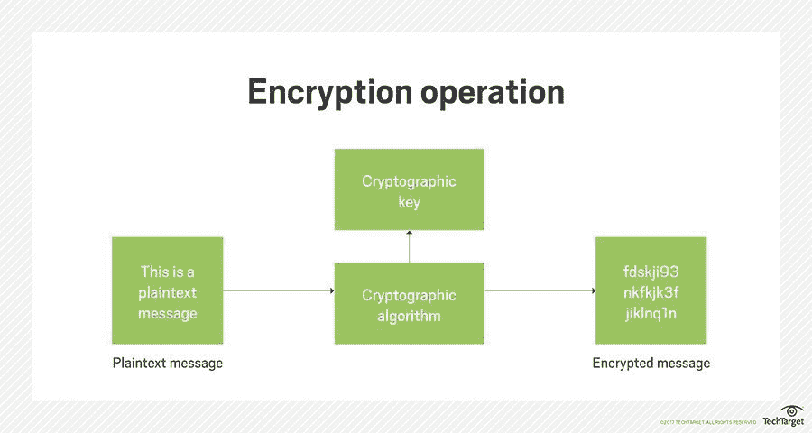
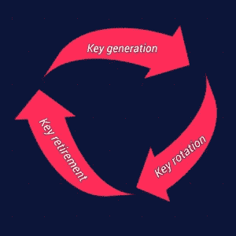

# 硬编码加密密钥管理

> 原文：<https://medium.com/globant/key-management-hardcoded-encryption-key-6417578df577?source=collection_archive---------0----------------------->

Photo by [regularguy.eth](https://unsplash.com/es/@moneyphotos?utm_source=medium&utm_medium=referral) on [Unsplash](https://unsplash.com?utm_source=medium&utm_medium=referral)

> ***什么是加密密钥？***

使用算法将数据编码为密码文本的过程。只有当访问信息的人或应用程序拥有解码密码文本所需的加密密钥时，该密码文本才能再次变得有意义。因此，如果信息被盗或意外共享，它会受到保护，因为它是无法破译的，因为加密。由于加密密钥的保护，加密策略也同样有效。

> ***需要进行密钥管理:***

由于网络犯罪分子可以使用加密密钥将加密数据恢复到最初的未加密形式，因此控制和管理这些密钥对于任何加密策略都是至关重要的。加密密钥的创建、交换、存储、使用、销毁和替换都是加密密钥管理系统的一部分。因此，我们必须进行改进并遵循一定的程序来保证加密密钥的有效管理。

> **主要考虑事项**

***加密算法和大小* :**

必须为每个密钥集选择适当的算法和密钥大小。这可能取决于预期的用途，并可能考虑各种因素，如性能、安全性、互操作性、寿命等。

*   *算法选择*:如果适用，应选择对称算法(如 AES)或非对称算法(如 RSA 或 ECDSA)。
*   *密钥大小*:应谨慎选择密钥大小(AES 密钥通常为 128 或 256 位，RSA 密钥通常为 2048 或 4096 位)。密钥越大，越安全，因此它提供保护的时间越长，但是性能也会受到影响(尤其是对于大的非对称密钥)
*   *灵活性*:随着时间的推移，算法会变得越来越差，要准备好改变它们和密钥大小。

***安全存储:***

鉴于加密密钥及其存储的重要性，如果不安全地维护它们，可能会吸引黑客，尤其是当几个密钥存储在同一位置时。如果必须物理存储密钥，建议使用硬件安全模块( **HSM** )，该模块提供非常强大的物理和逻辑安全保护。KMS 是在云系统上虚拟保护和管理密钥的另一个极好的方法。

***关键生命周期管理:***

每个加密密钥都有一个生存期。因此，必须按照以下概述的方法小心调节:

*   密钥生成
*   密钥旋转
*   密钥删除/报废

Encryption key lifecycle

***集中用户角色&访问:***

钥匙应该只对那些需要知道的人开放。您应该在集中式密钥管理中指定这些职责，以便只有授权用户有权访问与特定用户配置文件相关的加密数据，从而降低有害活动的风险和/或影响。此外，我们应该采用双重控制概念，这要求至少有两个批准人来批准关键活动，如密钥轮换、使用或删除。

***安全分配*** *:*

密钥通常从它们的原点传送到它们将被使用的系统。这最好通过使用专门构建的安全 API 来执行，例如密钥管理互操作性协议(KMIP)。如果必须离线传输密钥，则应将其包装在安全的传输密钥中，并且/或者分成两个或三个组件—这采用了“知识分割原则”，以确保没有人能够访问仅一个组件，如果没有相反的组件，该组件将毫无用处。

***按键用法:***

仅使用指定功能的按键。建议限制每个密钥的权限，使其仅用于该目的(例如，加密、解密、签名、验证、包装、解包等)。).如果必须将权限传递给另一个系统，如 ASC X9 TR-31(用于支付行业)，可以使用几种“密钥块”格式将权限与密钥联系起来。

***可用性:***

然而，密钥被保存在某个地方，当需要加密工作时，它们必须总是可访问的。因此，高可用性可能是一个重要的设计因素。同样，必须防止密钥意外丢失，因为这可能会导致数据永久不可访问；因此，安全备份是另一个关键特性。

***审计日志:***

应该保留审计日志，包括每个密钥的创建、使用和删除的完整历史记录。每项操作都应记录在案，包括采取的行动、采取行动的人或物以及行动发生的时间。如果密钥被泄露，这将有助于合规性审计和法庭调查。与 SIEM 技术的集成有利于合并大量日志以及进行额外的分析和报告。

***集中式密钥管理系统:***

当我们有成百上千的加密密钥时，一个集中的 KMS 就变得必要了。为了提高加密密钥的可维护性，我们可以使用第三方加密密钥管理服务。这些服务将所有加密密钥和数字证书安全地保存在密钥库中，与加密的数据和系统分开。从安全的角度来看，这通常是有用的，因为不管信息是否被黑客攻击，密钥都是安全的。因为加密密钥集中保存，所以密钥可能暴露给攻击者的站点的数量减少了。集中式方法在安全性方面更好，但它也提高了效率，因为加密-解密过程发生在保存信息的本地

AWS KMS

AWS KMS

## 外部 KMS:最佳实践是使用专用的外部 KMS。有四种类型:

1.  使用 HSM 或其他硬件密钥管理设备，提供最高级别的物理安全性
2.  密钥管理虚拟设备
3.  密钥管理软件，可以在专用服务器或虚拟/云服务器上运行
4.  关键管理软件即服务(SaaS)

## 总结:

> 拥有硬编码的空加密密钥或将加密密钥放在文件中并保存在服务器或本地并不能保证数据或加密密钥的安全性。基于上述主要考虑，我们始终建议使用基于云的加密解决方案。以下是一些基于云的加密解决方案:

*   [*AWS KMS*](https://aws.amazon.com/kms/)
*   [*天蓝色钥匙拱顶*](https://docs.microsoft.com/en-us/azure/architecture/)
*   [*AWS CloudHSM*](https://aws.amazon.com/cloudhsm/)
*   [*Google cloud HSM*](https://cloud.google.com/kms/docs/hsm)
*   [*谷歌云密钥管理服务*](https://cloud.google.com/security-key-management)