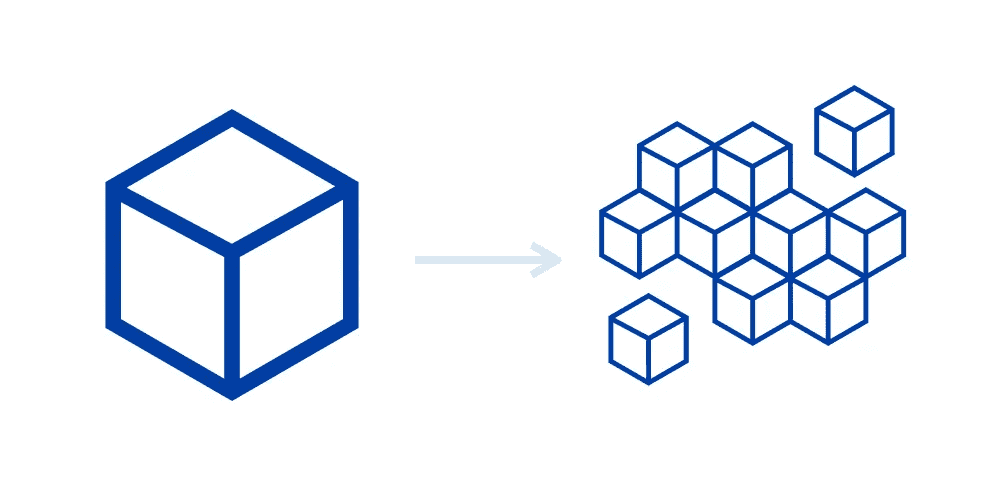

# 启动您的微服务(第 1 部分)

> 原文：<https://medium.com/walmartglobaltech/kick-starting-your-microservices-part-1-d067abf56b35?source=collection_archive---------3----------------------->

# 为什么选择微服务架构？为什么不是单体建筑？

> 当服务松散耦合时，对一个服务的更改不应该要求对另一个服务进行更改。
> 
> *—* **萨姆·纽曼**

我将发布这个系列的两个部分。这个博客是为中级软件开发人员准备的，让他们了解构建微服务的最佳实践和指南。在一个微服务的世界里，大多数人仍然会错误地编写紧耦合的服务，这比一个单片系统好不了多少！

在深入研究微服务架构之前，人们应该了解单片架构、它的缺点以及为什么所有的科技巨头都迅速采用微服务架构。

**单片建筑**

**单片**应用程序描述了一个单层**软件**应用程序，其中不同的组件从一个平台组合成一个程序。像业务逻辑、数据库层、帖子、通知模块等组件。

整体架构很难扩展。新的需求、语言、技术更新变得非常困难，难以转换，并且不可能添加新的技术，限制了创新。

单片架构的优势不多——对于较小的应用程序，编写、测试和部署都很简单！

**缺点**

让我们举一个例子，有一个包含交易/支付服务和用户档案更新服务的单片银行应用程序。

一家银行在一天内可能不会有很多更新用户资料请求，但在一天内可能会有数千或数十万的支付/交易请求！现在，银行需要扩展交易服务，以便能够处理相当大的负载。但是这里有一个问题！

我们不能在单一架构中扩展单个服务，我们必须扩展整个应用程序(扩展包含事务和配置文件的整个包)。现在，在扩展整个应用程序时，假设有 10 个实例，而不是 1 个，那么配置文件服务也有不必要的扩展，这本来是不需要的。

这是一项开销，会增加成本。你不想为主机支付更多的费用，是吗？

更多缺点-

*   很难理解一个大型复杂的应用程序是高度依赖和紧密耦合的。
*   应用程序越大，启动、加载依赖项的时间就越长。
*   在一些代码更新/修复的情况下，必须重新部署整个应用程序。
*   难以调试，会破坏整个应用程序，因为所有东西都是紧密耦合的

# 摘要

因为整体方法最适合轻量级应用。理解整体架构很重要，因为它是微服务架构的基础，其中每个服务本身都是根据整体架构实现的。

微服务方法完全是为了处理复杂的系统，但是为了做到这一点，该方法引入了自己的一系列复杂性和实现挑战。我们将在本系列的下一部分中学习！