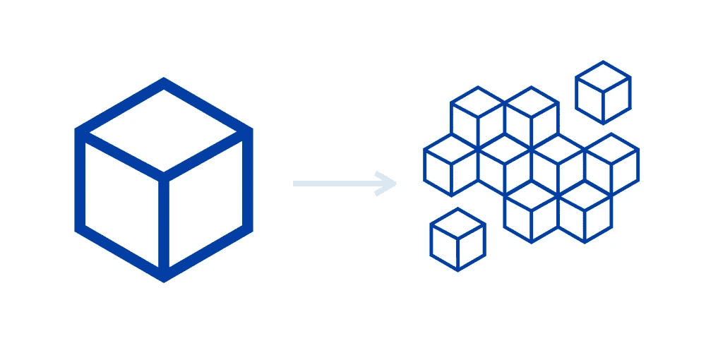
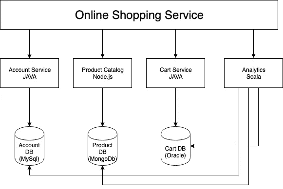

# 启动您的微服务(第 2 部分)

> 原文：<https://medium.com/walmartglobaltech/kick-starting-your-microservices-part-2-cf5968033092?source=collection_archive---------2----------------------->

欢迎来到本系列的第二部分！如果你还没有参观过第 1 部分，我建议你去参观一下，然后再回来。

到目前为止，我们已经讨论了在单芯片环境中扩展的困难，让我们从微服务架构的巨大优势开始。

例如，如果一个应用程序中有 5 个微服务，您可以根据需要自由选择使用哪种编码语言。那可能一样也可能不一样！是的，一个用 Java，另一个用 Scala，Python，甚至 PHP(eww old)。在微服务以相同的格式相互交互之前，您不必担心，只需选择最适合您的用例的语言。例子- **Rest Api** Java，对于**大数据**或者**数据科学**可能是 Scala/Python。只需保持每个服务的交互机制相同即可！在我的例子中，我将每个服务的响应和请求主体保存为 JSON。

要构建一个完全符合行业标准、良好的代码库和安全性的 web 应用程序，应该通过[https://12factor.net/](https://12factor.net/)。这篇博文太简短，无法涵盖 12 个因素，也不会重复已经存在的内容。

**微服务架构的优势:**

*   高度可维护和可测试
*   松散耦合
*   可独立部署
*   围绕业务能力组织
*   由一个小团队拥有(多个敏捷团队，每个团队将拥有微服务)
*   新功能的快速发布和部署。

让我们再举一个例子，我们在之前的博客中讨论过伸缩性。让我们看看这个问题是如何解决的，以及我们为什么称微服务架构**易扩展**、**松耦合**和**可独立部署**！

当我们期望在任何功能或创建的任何微服务上加载时，我们可以对该服务进行水平扩展。假设搜索服务比其他服务期望更高的负载，我们只为搜索服务扩展(增加运行的实例),这会导致低成本，而不是扩展整个应用程序(扩展冗余服务),这会导致更高的成本！

不同团队可以敏捷的方式处理不同的服务，让他们对自己的服务负责。这导致了适当的可交付性，并且每个服务可以单独部署，而不完全相互依赖。

**为什么松耦合不完全解耦？**

那些在阅读时问这个问题的人，拍拍你的背！松耦合基本上是最小化两个或更多组件之间的依赖性。当使用简单的代码库或仅仅依赖 Rest 调用时，我们可能会对其他数据或交互服务产生线性依赖！虽然这也可以使用消息系统来解决，如**企业消息系统**、 **RabbitMQ** 、 **JMS** 或 **Apache Kafka** 。一个简单的例子——我们将来自一个服务的消息放入消息队列，另一个服务可以随时从队列中取出该消息，而不是直接与另一个服务通信！

这是一个全新的话题，所以也许我会在下一篇博客中写消息传递系统。

> 如果你不能构建一个整体，你凭什么认为微服务就是答案
> 
> 西蒙·布朗

**何时使用微服务架构**

可能有这样一种情况，构建一个单一的应用程序会更好。当您有一个代码基数小且没有多少可伸缩性的小应用程序时，就是这种情况！比如造一个计算器？

当开发应用程序的第一个版本时，您通常不会遇到这种方法解决的问题。此外，使用复杂的分布式架构会降低开发速度。这对初创公司来说可能是一个主要问题，他们最大的挑战往往是如何快速发展商业模式和伴随的应用程序。然而，后来，当挑战在于如何扩展，并且您需要使用功能分解时，错综复杂的依赖关系可能会使您难以将整体应用程序分解为一组服务。

**总结**

微服务的目标是松耦合。精心设计的微服务架构允许您使用一组微服务来实现项目，其中每个微服务都是独立管理、开发和发布的。