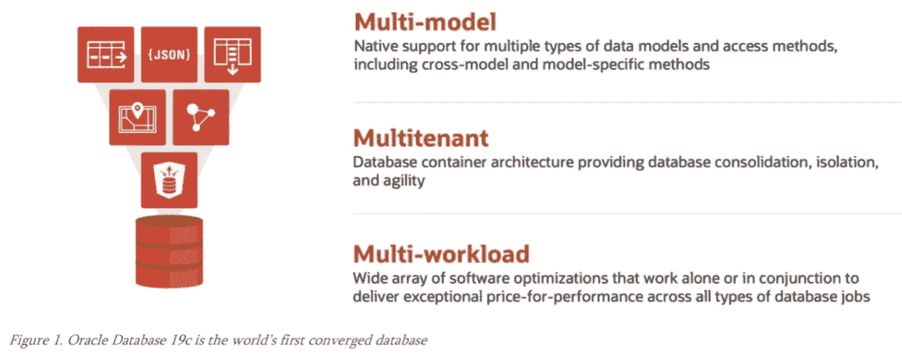
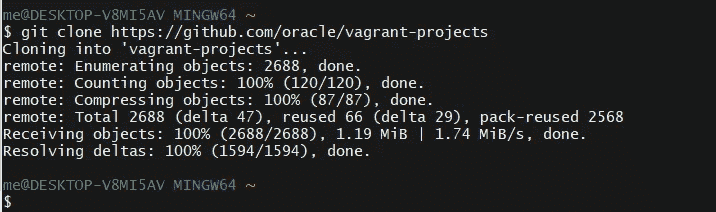
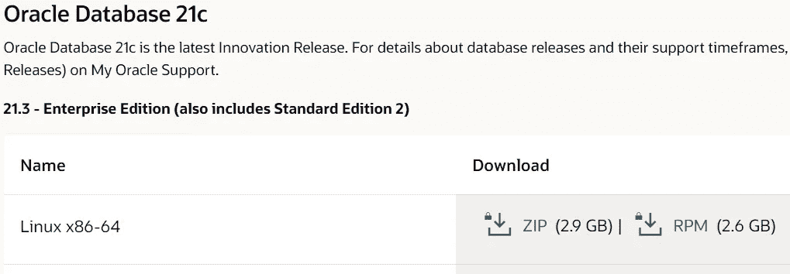
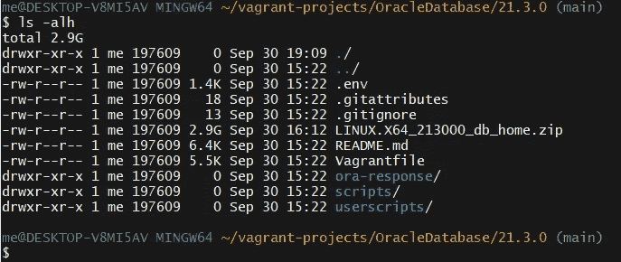
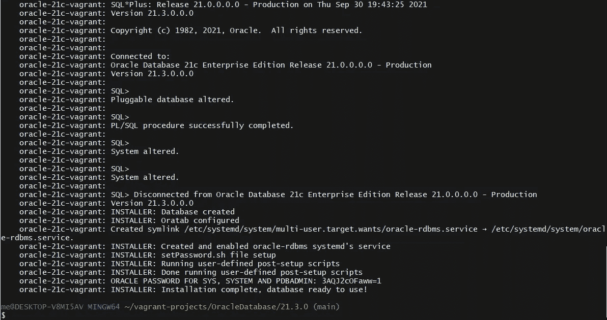
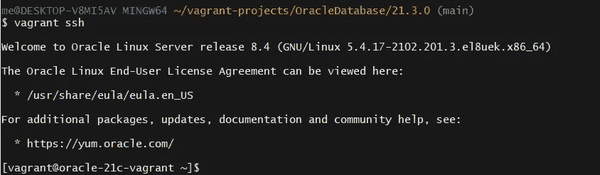
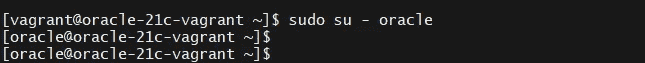
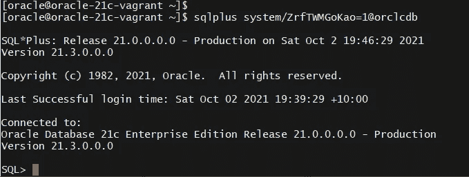
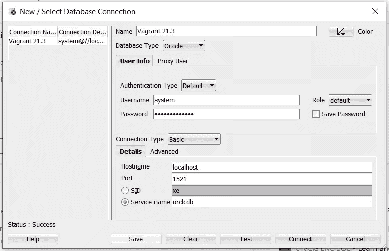
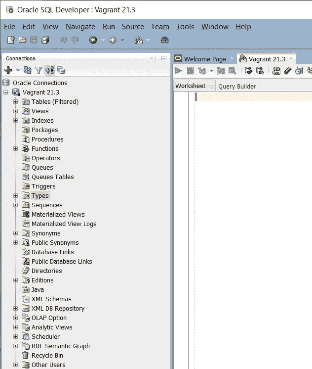

# 借助 Oracle 数据库 21c 启动创新

> 原文：<https://medium.com/oracledevs/kickstart-innovation-with-oracle-database-21c-bb4bcb6930ab?source=collection_archive---------0----------------------->



Oracle 数据库 19c 是世界上第一个融合数据库。

Oracle 数据库 19c 也是一个长期版本。

在长期版本之间，Oracle 现在推出了创新版本:

> Oracle 发布了**创新版本**，引入了新的特性和增强功能，这些特性和增强功能将包含在 Oracle 数据库的下一个长期版本中。

关于长期版本和创新版本之间差异的更多详细信息，请参见以下博客:

[](https://blogs.oracle.com/database/post/icymi-oracle-database-releases-and-support-coverage) [## ICYMI — Oracle 数据库版本和支持范围

### 如果您错过了，我的 Oracle Support (MOS)最近推出了一些重大更改，以支持以下方面的策略…

blogs.oracle.com](https://blogs.oracle.com/database/post/icymi-oracle-database-releases-and-support-coverage) 

创新版本的理念是让客户为新的用例开发新的和增强的功能。

Oracle Database 21c 是一个创新版本，具有区块链表等创新特性。

那么下一个问题是，您从哪里获得 Oracle Database 21c？

**甲骨文云**

Oracle 数据库 21c 在 Oracle 云中可用。

[](https://blogs.oracle.com/database/post/introducing-oracle-database-21c) [## Oracle 数据库 21c 简介

### 世界上最受欢迎的数据库 Oracle Database 21c 的最新创新版本现已正式推出…

blogs.oracle.com](https://blogs.oracle.com/database/post/introducing-oracle-database-21c) 

如果您在正确的地区，Oracle Database 21c 在免费层中可用。

> 在阿什本(IAD)、菲尼克斯(PHX)、法兰克福(法国)和伦敦(LHR)地区的[自治数据库自由层服务](https://www.oracle.com/cloud/free/)中也有提供。

因此，对于以下地区的人来说，你已经来对地方了:

*   阿什伯恩(IAD)
*   凤凰城(PHX)
*   法兰克福(法国)
*   伦敦(LHR)

问题是，如果您所在的地区不在上述四个地区之一，您如何免费获得 Oracle Database 21c？

**甲骨文流浪项目**

Oracle Database 21c 最近被添加到 Github 的 Oracle vagger 项目中。

[](https://github.com/oracle/vagrant-projects/tree/main/OracleDatabase/21.3.0) [## 主 Oracle/vagger-projects 上的 vagger-projects/Oracle database/21 . 3 . 0

### 这个流浪者项目自动供应 Oracle 数据库，使用流浪者，一个 Oracle Linux 8 框和一个外壳脚本…

github.com](https://github.com/oracle/vagrant-projects/tree/main/OracleDatabase/21.3.0) 

设置 Oracle vagger 项目很容易。

通过 git 克隆从 Github 获得最新的 Oracle vagger 项目:

```
> git clone https://github.com/oracle/vagrant-projects
```



下载后，将目录更改为 Oracle 数据库 21.3:

```
> cd ~/vagrant-projects/OracleDatabase/21.3.0
```

接下来，还需要下载 Oracle 数据库 21.3 的 zip 文件。即 LINUX。X64_213000_db_home.zip (2.89 GB)。

[http://www . Oracle . com/tech network/database/enterprise-edition/downloads/index . html](http://www.oracle.com/technetwork/database/enterprise-edition/downloads/index.html)



不幸的是，我们不能使用 Curl 下载 zip 文件，因为许可协议需要在浏览器中确认。

下载完成后，确认 zip 文件是否在 vargot-projects/Oracle database/21 . 3 . 0 目录下。



现在启动虚拟机很简单:

```
> vagrant up
```

输出的尾部将如下所示:



Oracle 数据库 21.3 构建于 OEL8 之上。

输出的最后几行将列出您的登录密码，所以现在请注意这一点，因为稍后需要这些信息。

现在登录到虚拟机。

```
> vagrant ssh
```



登录到虚拟机后，使用以下命令切换到 Oracle 帐户:

```
> sudo su — oracle
```



使用您之前记下的密码，您现在可以登录到 Oracle Database 21c。



**SQL 开发人员**

SQL Developer 是从主机连接到 Oracle Database 21c 虚拟环境的绝佳工具。

默认情况下，Oracle Database 21c 虚拟环境具有从客户机到主机的本地端口转发设置:

*   端口 1521 到主机端口 1521。
*   端口 5500 到主机端口 5500。
*   端口 22 到主机端口 2222。

现在，通过 SQL Developer 连接到 Oracle Database 21c 虚拟环境变得很容易。



主机名是 localhost，我们将使用主机端口 1521，因为我们知道对应的来宾端口是 1521。



现在我们加入了—让创新从 Oracle Database 21c 开始吧！

*Paul Guerin 是一名专注于 Oracle 数据库的国际顾问。此外，他还出席了一些世界领先的甲骨文会议，包括甲骨文 2013 年世界开放大会。自 2015 年以来，他的工作一直是 IOUG 最佳实践技巧小册子以及 AUSOUG、Oracle Technology Network、Quest 和 Oracle Developers (Medium)出版物的主题。2019 年，他被授予 My Oracle 支持社区最有价值贡献者。他是一名 DBA OCP，并将继续参与 Oracle ACE 计划。*