# 如何在 Python 中使用 Kivy 制作简单的移动应用？

> 原文：<https://medium.com/edureka/kivy-tutorial-9a0f02fe53f5?source=collection_archive---------0----------------------->

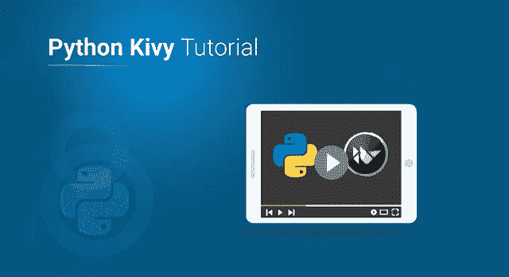

Python Kivy Tutorial — Edureka

谈到编程语言，Python 编程语言名列榜首。原因之一是出色的库支持构建世界级的应用程序。python 中的 Kivy 就是这样一个库，它是一个跨平台的库，用于构建多点触控应用。我们将在本 Kivy 教程中详细了解各个方面，本文涵盖了以下主题:

*   什么是 Kivy？

1.  基维建筑

*   使用 Python Kivy 制作简单的应用程序
*   Kivy 部件
*   更多的小部件交互
*   什么是基维语？
*   Python 和 Kivy 语言
*   基维物业
*   动画片
*   Kivy 的设置面板
*   构建一个安卓 APK

# 什么是 Kivy？

Kivy 是一个跨平台的免费开源 python 库，用于创建具有自然用户界面的多点触控应用程序。Kivy 运行在支持的平台上，如 windows、OS X、Linux、Raspberry Pi、Android 等。

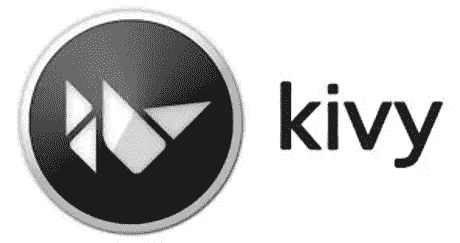

它受麻省理工学院的许可，可以 100%免费使用。kivy 框架是稳定的，并且有一个记录良好的 API。

图形引擎构建于 OpenGL ES2 之上，使用快速而现代的管道。该工具包附带了 20 多个小部件，并且都是高度可扩展的。

## 基维建筑

Kivy 架构包括以下内容:

*   核心提供商和输入提供商
*   制图法
*   核心
*   UIX
*   模块
*   输入事件
*   小部件和输入调度

让我们来看一个使用 Python kivy 和一些基本小部件(如 label 和 FloatLayout)的简单应用程序。

# 使用 Python Kivy 制作简单的应用程序

在这个应用程序中，标签将随着多点触摸而移动，你甚至可以调整标签的大小。

```
from kivy.app import App
from kivy.uix.scatter import Scatter
from kivy.uix.label import Label
from kivy.uix.floatlayout import FloatLayout

class SimpleApp(App):
    def build(self):
        f = FloatLayout()
        s = Scatter()
        l = Label(text="Edureka!", font_size=150)

        f.add_widget(s)
        s.add_widget(l)
        return f

if __name__ == "__main__":
    SimpleApp().run()
```

**输出:**


# Kivy 部件

让我们来看看各种 kivy 小部件。kivy 小部件可以按以下方式分类。

*   UX 部件
*   布局
*   复杂的 UX 部件
*   行为部件
*   屏幕管理器

# UX 部件

*   标签
*   纽扣
*   检验盒
*   图像
*   滑块
*   进度条
*   文本输入
*   开关按钮
*   转换
*   录像

## **标签**

标签小部件用于呈现文本。它支持 ascii 和 unicode 字符串。这里有一个简单的例子来展示我们如何在我们的应用程序中使用标签小部件。

```
from kivy.app import App
from kivy.uix.label import Label

class SimpleApp(App):
    def build(self):
        l = Label(text="Edureka!",font_size=150)
        return l

if __name__ == "__main__":
    SimpleApp().run()
```

**输出:**


## **按钮**

按钮是一个标签，其动作在按钮被按下时被触发。要配置按钮，使用与标签相同的设置。这里有一个简单的例子来展示按钮小部件。它在被点击时改变状态，我们甚至可以添加属性或者绑定一些动作到按钮上。

```
from kivy.app import App
from kivy.uix.button import Button

class SimpleApp(App):
    def build(self):
        def a(instance,value):
            print("welcome to edureka")
        btn = Button(text="Edureka!",font_size=150)
        btn.bind(state=a)
        return btn

if __name__ == "__main__":
    SimpleApp().run()
```

**输出:**


## 检验盒

复选框是两种状态的按钮，可以选中也可以不选中。这里有一个小例子来展示我们如何在 kivy 应用程序中使用 checkbox。

```
from kivy.app import App
from kivy.uix.checkbox import CheckBox

class SimpleApp(App):
    def build(self):
        def on_checkbox_active(checkbox, value):
            if value:
                print('The checkbox', checkbox, 'is active')
            else:
                print('The checkbox', checkbox, 'is inactive')

        checkbox = CheckBox()
        checkbox.bind(active=on_checkbox_active)
        return checkbox

if __name__ == "__main__":
    SimpleApp().run()
```

**输出:**

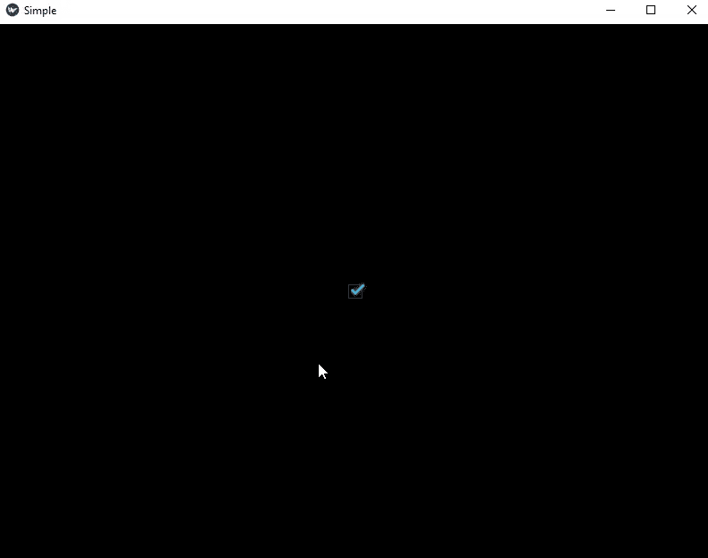

## **图像**

这个小部件用于显示图像。当你运行这个程序时，它会在应用程序中显示一个图像。

```
from kivy.app import App
from kivy.uix.image import Image

class SimpleApp(App):
    def build(self):
        img = Image(source="logo.png")
        return img

if __name__ == "__main__":
    SimpleApp().run()
```

**输出:**

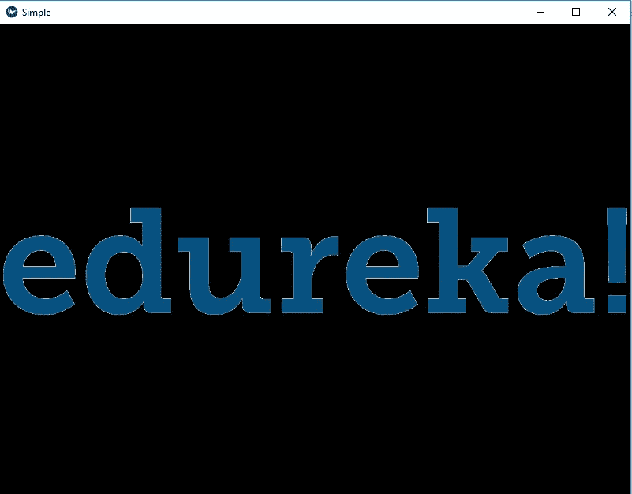

## **滑块**

slider 小部件支持水平和垂直方向，并用作滚动条。下面是一个简单的例子，展示了 kivy 应用程序中的滑块。

```
from kivy.app import App
from kivy.uix.slider import Slider

class SimpleApp(App):
    def build(self):
        slide = Slider(orientation='vertical', value_track=True, value_track_color=(1,0,0,1))
        return slide

if __name__ == "__main__":
    SimpleApp().run()
```

**输出:**


**进度条**

它用于跟踪任何任务的进度。这里有一个简单的例子来展示我们如何在 kivy 应用程序中使用进度条。

```
from kivy.app import App
from kivy.uix.progressbar import ProgressBar

class SimpleApp(App):
    def build(self):
        Progress  = ProgressBar(max=1000)
        Progress.value = 650
        return Progress

if __name__ == "__main__":
    SimpleApp().run()
```

**输出:**

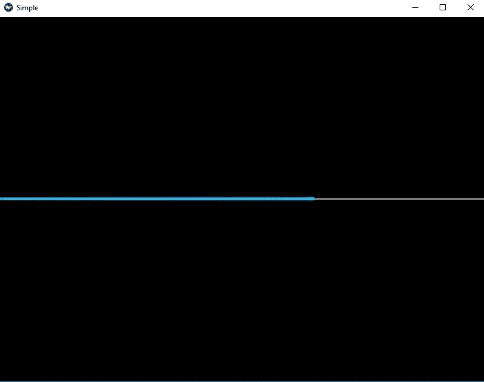

**文本输入**

它为可编辑的纯文本提供了一个框。

```
from kivy.app import App
from kivy.uix.textinput import TextInput

class SimpleApp(App):
    def build(self):
        t = TextInput(font_size=150)
        return t

if __name__ == "__main__":
    SimpleApp().run()
```

**输出:**


## 开关按钮

它就像一个复选框，当你触摸或点击它，状态切换。下面的例子展示了 kivy 应用程序中的切换按钮。当您单击切换按钮时，它会将状态从“正常”更改为“关闭”。

```
from kivy.app import App
from kivy.uix.togglebutton import ToggleButton
from kivy.uix.floatlayout import FloatLayout

class SimpleApp(App):
    def build(self):

        b = ToggleButton(text="python", border=(26,26,26,26), font_size=200)
        return b

if __name__ == "__main__":
    SimpleApp().run()
```

**输出:**

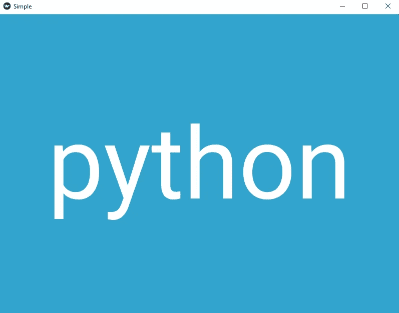

## **开关**

它就像一个机械开关，不是开就是关。这里有一个简单的例子来展示如何在 kivy 应用程序中使用它。

```
from kivy.app import App
from kivy.uix.switch import Switch

class SimpleApp(App):
    def build(self):

        s = Switch(active=True)
        return s

if __name__ == "__main__":
    SimpleApp().run()
```

**输出:**

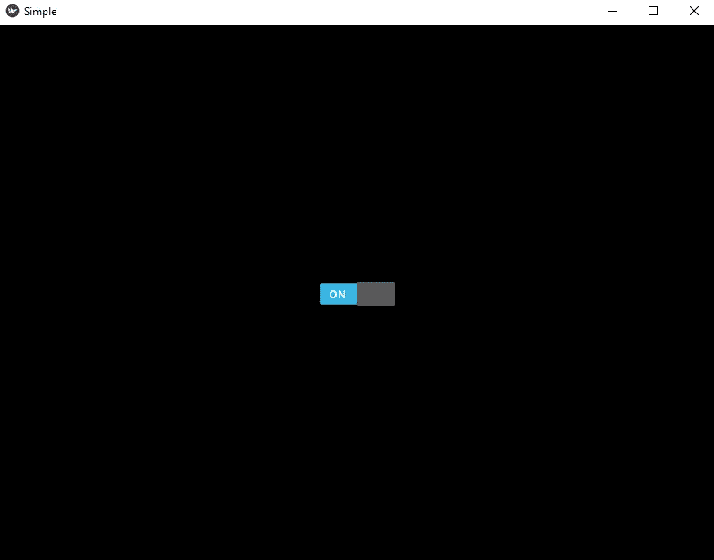

**视频**

它用于显示视频文件或视频流。这里有一个简单的例子来展示它是如何在 kivy 应用程序中工作的。

```
from kivy.app import App
from kivy.uix.video import Video

class SimpleApp(App):
    def build(self):

        s = Video(source="abc.mp4", play=True)
        return s

if __name__ == "__main__":
    SimpleApp().run()
```

**输出:**播放文件链接中给出的视频。

# 布局

布局小部件不进行渲染，只是作为一个触发器，以特定的方式排列其子部件。

*   锚点布局
*   方框布局
*   浮动布局
*   网格布局
*   页面布局
*   相对布局
*   分散布局
*   堆栈布局

## 锚点布局

它将子部件与边框(左、右、上、下)或中心对齐。这是一个简单的例子，展示了当锚被设置为中心位置时，锚布局是如何在 kivy 应用程序中使用的，我们可以将它设置为不同的位置，如左下、自下而上等。

```
from kivy.app import App
from kivy.uix.button import Button
from kivy.uix.anchorlayout import AnchorLayout

class SimpleApp(App):
    def build(self):
        layout = AnchorLayout(
            anchor_x='center', anchor_y='center')
        btn = Button(text='Hello World')
        layout.add_widget(btn)
        return layout

if __name__ == "__main__":
    SimpleApp().run()
```

**输出:**

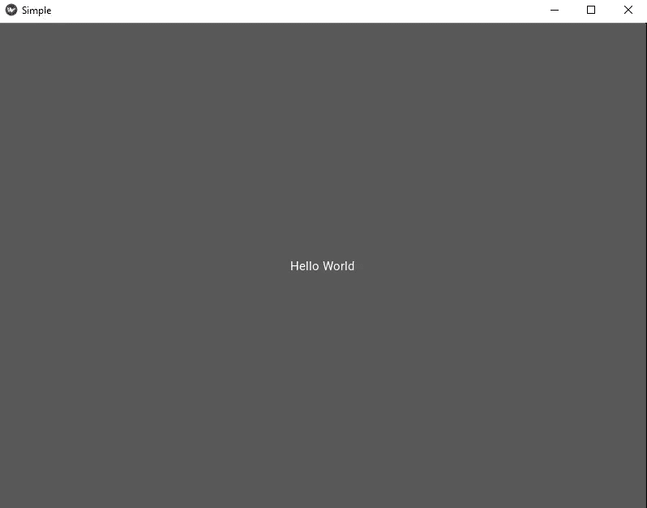

## **方框布局**

它将子部件排列在水平或垂直的框中。在示例中，box 布局将小部件存储在两个框中，如下所示。

```
from kivy.app import App
from kivy.uix.button import Button
from kivy.uix.boxlayout import BoxLayout

class SimpleApp(App):
    def build(self):
        layout = BoxLayout(orientation='vertical')
        btn = Button(text='Hello World')
        btn1 = Button(text="Welcome to edureka")
        layout.add_widget(btn)
        layout.add_widget((btn1))
        return layout

if __name__ == "__main__":
    SimpleApp().run()
```

**输出:**


## **浮动布局**

它遵循其子部件的 size_hint 和 pos_hint 属性。

```
from kivy.app import App
from kivy.uix.scatter import Scatter
from kivy.uix.label import Label
from kivy.uix.floatlayout import FloatLayout

class SimpleApp(App):
    def build(self):
        f = FloatLayout()
        s = Scatter()
        l = Label(text="Edureka!", font_size=150)

        f.add_widget(s)
        s.add_widget(l)
        return f

if __name__ == "__main__":
    SimpleApp().run()
```

**输出:**


## **网格布局**

它将子部件排列在一个框中。

```
from kivy.app import App
from kivy.uix.button import Button
from kivy.uix.gridlayout import GridLayout

class SimpleApp(App):
    def build(self):
        layout = GridLayout(cols=2)
        layout.add_widget(Button(text='hello'))
        layout.add_widget(Button(text='world'))
        layout.add_widget(Button(text='welcome to'))
        layout.add_widget(Button(text='edureka'))
        return layout

if __name__ == "__main__":
    SimpleApp().run()
```

**输出:**


## **页面布局**

它用于创建多页布局。

```
from kivy.app import App
from kivy.uix.button import Button
from kivy.uix.pagelayout import PageLayout

class SimpleApp(App):
    def build(self):
        layout = PageLayout()
        layout.add_widget(Button(text='hello',background_color=(1,0,0,1)))
        layout.add_widget(Button(text='world',background_color=(0,1,0,1)))
        layout.add_widget(Button(text='welcome to',background_color=(1,1,1,1)))
        layout.add_widget(Button(text='edureka',background_color=(0,1,1,1)))
        return layout

if __name__ == "__main__":
    SimpleApp().run()
```

**输出:**

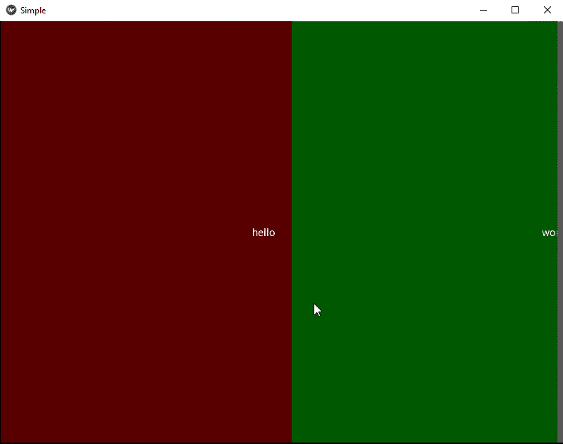

## **相对布局**

它允许你为子部件设置相对坐标。

```
from kivy.app import App
from kivy.uix.relativelayout import RelativeLayout
from kivy.uix.boxlayout import BoxLayout
from kivy.uix.button import Button
from kivy.uix.label import Label
from kivy.lang import Builder

res = Builder.load_string('''BoxLayout:
    Label:
        text: 'Left'
    Button:
        text: 'Middle'
        on_touch_down: print('Middle: {}'.format(args[1].pos))
    RelativeLayout:
        on_touch_down: print('Relative: {}'.format(args[1].pos))
        Button:
            text: 'Right'
            on_touch_down: print('Right: {}'.format(args[1].pos))''')

class SimpleApp(App):
    def build(self):
        return res

if __name__ == "__main__":
    SimpleApp().run()
```

我们在本课程中使用了 KV 语言方法，这将在本节课的稍后部分介绍。

**输出:**

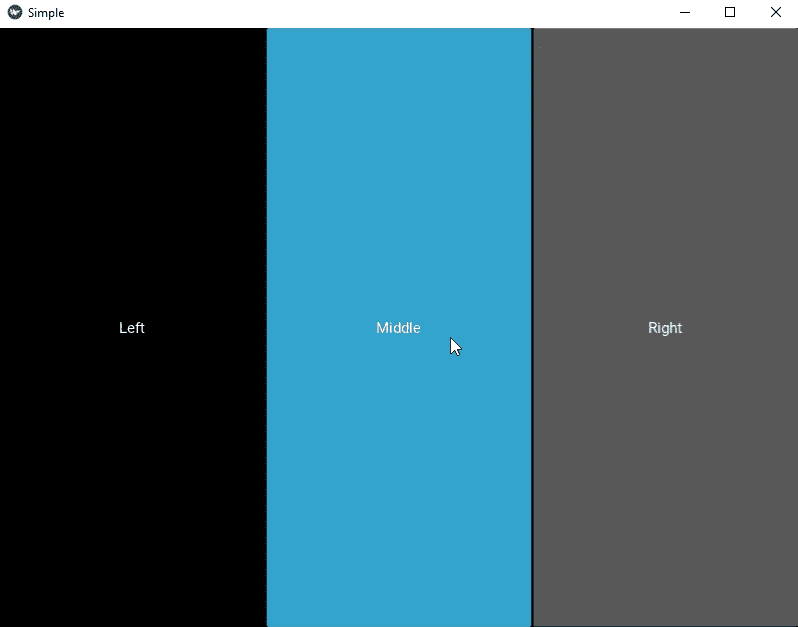

## **散点布局**

它被实现为散点中的浮动布局。您可以使用分散布局来重新定位小部件。

```
from kivy.app import App
from kivy.uix.scatterlayout import ScatterLayout
from kivy.uix.label import Label

class SimpleApp(App):
    def build(self):
        s = ScatterLayout()
        l = Label(text='edureka')
        s.add_widget(l)
        return s

if __name__ == "__main__":
    SimpleApp().run()
```

**输出:**

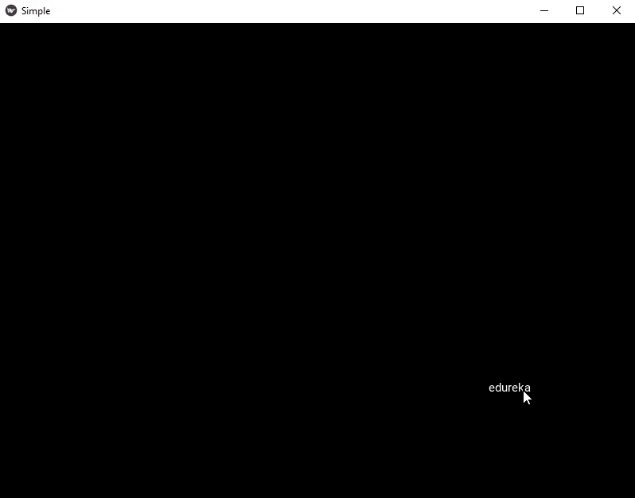

## **堆栈布局**

它水平或垂直排列部件，并且尽可能多。

```
from kivy.app import App
from kivy.uix.stacklayout import StackLayout
from kivy.uix.button import Button

class SimpleApp(App):
    def build(self):
        root = StackLayout()
        for i in range(25):
            btn = Button(text=str(i), width=100 + i * 5, size_hint=(None, 0.15))
            root.add_widget(btn)
        return root

if __name__ == "__main__":
    SimpleApp().run()
```

**输出:**


现在我们已经完成了布局，让我们看看 Kivy 中的行为部件。

# **行为微件**

这些小部件不进行渲染，而是根据其子部件的图形指令或交互(触摸)行为进行操作。

*   分散
*   模具视图

## **散开**

分散用于构建交互式小部件，可以在多点触摸系统上用两个或更多手指旋转和缩放。

```
from kivy.app import App
from kivy.uix.scatter import Scatter
from kivy.uix.image import Image

class SimpleApp(App):
    def build(self):
        s = Scatter()
        s.add_widget(Image(source="logo.png"))
        return s

if __name__ == "__main__":
    SimpleApp().run()
```

**输出:**

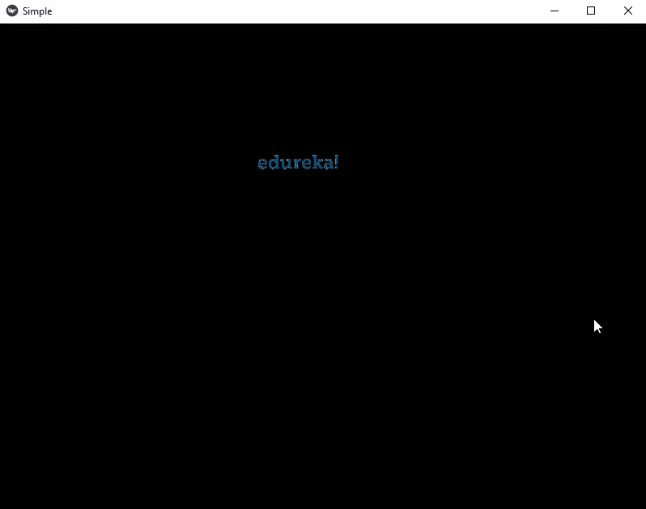

## **模板视图**

模具视图将子部件的绘制限制在模具视图的边界框内。在这个例子中，我们使用了一个简单的标签小部件。当我们在画布上绘图时，最好使用模板视图，它将活动限制在应用程序中的有限区域，而不是整个窗口。

```
from kivy.app import App
from kivy.uix.stencilview import StencilView
from kivy.uix.label import Label
from kivy.uix.scatter import Scatter

class SimpleApp(App):
    def build(self):
        s = StencilView()
        sc = Scatter()
        s.add_widget(sc)
        sc.add_widget(Label(text='edureka'))
        return s

if __name__ == "__main__":
    SimpleApp().run()
```

**输出:**


# 屏幕管理器

它是一个小部件，用于管理应用程序的多个屏幕。它使用过渡底座从一个屏幕切换到另一个屏幕。

```
from kivy.app import App
from kivy.base import runTouchApp
from kivy.lang import Builder
from kivy.properties import ListProperty
from kivy.uix.boxlayout import BoxLayout

from kivy.uix.screenmanager import ScreenManager, Screen, FadeTransition

import time
import random

class FirstScreen(Screen):
    pass

class SecondScreen(Screen):
    pass

class ColourScreen(Screen):
    colour = ListProperty([1., 0., 0., 1.])

class MyScreenManager(ScreenManager):
    def new_colour_screen(self):
        name = str(time.time())
        s = ColourScreen(name=name,
                         colour=[random.random() for _ in range(3)] + [1])
        self.add_widget(s)
        self.current = name

root_widget = Builder.load_string('''
#:import FadeTransition kivy.uix.screenmanager.FadeTransition
MyScreenManager:
    transition: FadeTransition()
    FirstScreen:
    SecondScreen:
<FirstScreen>:
    name: 'first'
    BoxLayout:
        orientation: 'vertical'
        Label:
            text: 'first screen!'
            font_size: 30
        Image:
            source: 'logo.png'
            allow_stretch: False
            keep_ratio: False
        BoxLayout:
            Button:
                text: 'goto second screen'
                font_size: 30
                on_release: app.root.current = 'second'
            Button:
                text: 'get random colour screen'
                font_size: 30
                on_release: app.root.new_colour_screen()
<SecondScreen>:
    name: 'second'
    BoxLayout:
        orientation: 'vertical'
        Label:
            text: 'second screen!'
            font_size: 30
        Image:
            source: 'logo1.jpg'
            allow_stretch: False
            keep_ratio: False
        BoxLayout:
            Button:
                text: 'goto first screen'
                font_size: 30
                on_release: app.root.current = 'first'
            Button:
                text: 'get random colour screen'
                font_size: 30
                on_release: app.root.new_colour_screen()
<ColourScreen>:
    BoxLayout:
        orientation: 'vertical'
        Label:
            text: 'colour {:.2},{:.2},{:.2} screen'.format(*root.colour[:3])
            font_size: 30
        Widget:
            canvas:
                Color:
                    rgba: root.colour
                Ellipse:
                    pos: self.pos
                    size: self.size
        BoxLayout:
            Button:
                text: 'goto first screen'
                font_size: 30
                on_release: app.root.current = 'first'
            Button:
                text: 'get random colour screen'
                font_size: 30
                on_release: app.root.new_colour_screen()
''')

class ScreenManagerApp(App):
    def build(self):
        return root_widget

ScreenManagerApp().run()
```

**输出:**

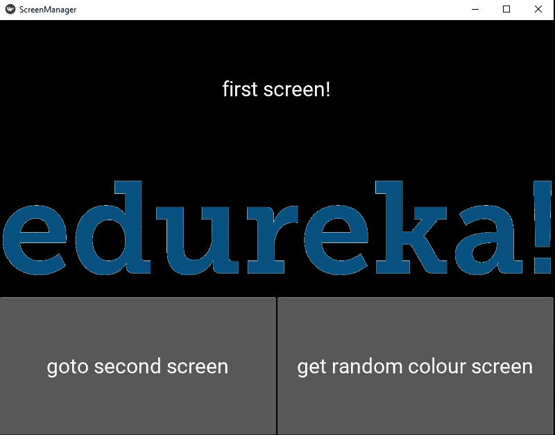

# 更多的小部件交互

让我们来看一个非常有趣的例子，我们将使用 bind 方法将两个小部件的交互绑定在一起。

```
from kivy.app import App
from kivy.uix.scatter import Scatter
from kivy.uix.label import Label
from kivy.uix.floatlayout import FloatLayout
from kivy.uix.boxlayout import BoxLayout
from kivy.uix.textinput import TextInput

class SimpleApp(App):
    def build(self):
        b = BoxLayout(orientation="vertical")
        t = TextInput(font_size=100,text="default",size_hint_y=None, height=100)
        f = FloatLayout()
        s = Scatter()
        l = Label(text="default", font_size=150)

        t.bind(text=l.setter("text"))
        f.add_widget(s)
        s.add_widget(l)
        b.add_widget(t)
        b.add_widget(f)
        return b

if __name__ == "__main__":
    SimpleApp().run()
```

# 什么是基维语？

随着我们的应用程序变得越来越复杂，维护小部件树的构造和绑定的显式声明变得越来越困难。为了克服这些缺点，kv 语言是一种替代语言，也称为 kivy 语言或 kvlang。

kv 语言允许你以声明的方式创建窗口小部件树，它允许非常快速的原型和对 UI 的敏捷改变。它还将应用程序的逻辑与用户界面分离开来。

## **如何加载 KV 文件？**

有两种方法可以将 kv 文件加载到应用程序中。

1.  根据命名约定 kivy 查找与您的应用程序同名的文件，如果它出现在您的应用程序名称中，则从小写字母减去“app”开始。

```
SimpleApp **-** simple.kv
```

如果这定义了一个根部件，它将作为应用程序的基础添加到部件树中。

2.构建器——您可以直接告诉 kivy 使用构建器加载 kv 文件。

```
Builder.load_file("filename.kv")
#or
Builder.load_string('''
''') #you can directly put your kv file as string using this approach.
```

## **KV 语言规则**

根是通过声明根小部件的类来声明的

```
Widget:
```

由< >之间的小部件类的名称声明的类规则定义了该类的实例的外观和行为

```
<Widget>:
```

KV 语言有三个特定的关键字。

1.  **app:** 是指 app 的实例
2.  **根:**是指基础小部件或根小部件
3.  **自我:**指当前的 widget

让我们举一个简单的例子来理解我们如何在应用程序中使用 KV 语言。

```
from kivy.app import App

from kivy.uix.scatter import Scatter
from kivy.uix.label import Label
from kivy.uix.floatlayout import FloatLayout
from kivy.uix.textinput import TextInput
from kivy.uix.boxlayout import BoxLayout

class ScatterTextWidget(BoxLayout):
    pass

class SimpleApp(App):
    def build(self):
        return ScatterTextWidget()

if __name__ == "__main__":
    SimpleApp().run()
```

**。KV 文件**

```
<ScatterTextWidget>:
    orientation: 'vertical'
    TextInput:
        id: my_textinput
        font_size: 150
        size_hint_y: None
        height: 200
        text: 'default'
    FloatLayout:
        Scatter:
            Label:
                text: my_textinput.text
                font_size: 150
```

**输出:**

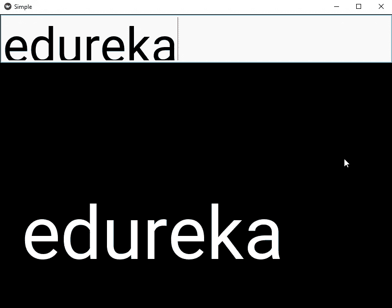

# Python 和 Kivy 语言

Python 和 kivy 语言使得任何开发人员为任何应用程序编写可读代码变得更加容易，并且在为各种小部件定义属性和绑定时也变得不那么复杂。

让我们在下面的例子中尝试混合使用 python 和 kivy 语言。

```
from kivy.app import App

from kivy.uix.scatter import Scatter
from kivy.uix.label import Label
from kivy.uix.floatlayout import FloatLayout
from kivy.uix.textinput import TextInput
from kivy.uix.boxlayout import BoxLayout
import random

class Text(BoxLayout):
    def change_label_colour(self, *args):
        colour = [random.random() for i in range(3)] + [1]
        label = self.ids['my_label']
        label.color = colour

class SimpleApp(App):
    def build(self):
        return Text()

if __name__ == "__main__":
    SimpleApp().run()
```

**。KV 文件**

```
#:import color random
<Text>:
    orientation: 'vertical'
    TextInput:
        id: my_textinput
        font_size: 150
        size_hint_y: None
        height: 200
        text: 'default'
        on_text: my_label.color = [color.random() for i in range(3)] + [1]
    FloatLayout:
        Scatter:
            Label:
                id: my_label
                text: my_textinput.text
                font_size: 150
```

**输出:**

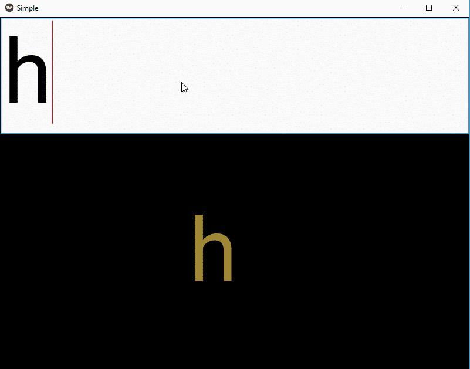

# 基维物业

属性是定义事件并将它们绑定在一起的一种更简单的方法。有不同类型的属性来描述您想要处理的数据类型。

*   字符串属性
*   数字属性
*   BoundedNumericProperty
*   对象属性
*   字典属性
*   ListProperty
*   选项属性
*   AliasProperty
*   布尔属性
*   ReferenceListProperty

## **如何申报财产？**

我们必须在类级别声明属性。这里有一个简单的例子来说明我们如何在应用程序中使用属性。

```
from kivy.app import App
from kivy.uix.widget import Widget
from kivy.uix.button import Button
from kivy.uix.boxlayout import BoxLayout
from kivy.properties import ListProperty

class RootWidget(BoxLayout):

    def __init__(self, **kwargs):
        super(RootWidget, self).__init__(**kwargs)
        self.add_widget(Button(text='btn 1'))
        cb = CustomBtn()
        cb.bind(pressed=self.btn_pressed)
        self.add_widget(cb)
        self.add_widget(Button(text='btn 2'))

    def btn_pressed(self, instance, pos):
        print('pos: printed from root widget: {pos}'.format(pos=pos))

class CustomBtn(Widget):
    pressed = ListProperty([0, 0])

    def on_touch_down(self, touch):
        if self.collide_point(*touch.pos):
            self.pressed = touch.pos
            # we consumed the touch. return False here to propagate
            # the touch further to the children.
            return True
        return super(CustomBtn, self).on_touch_down(touch)

    def on_pressed(self, instance, pos):
        print('pressed at {pos}'.format(pos=pos))

class TestApp(App):

    def build(self):
        return RootWidget()

if __name__ == '__main__':
    TestApp().run()
```

**输出:**

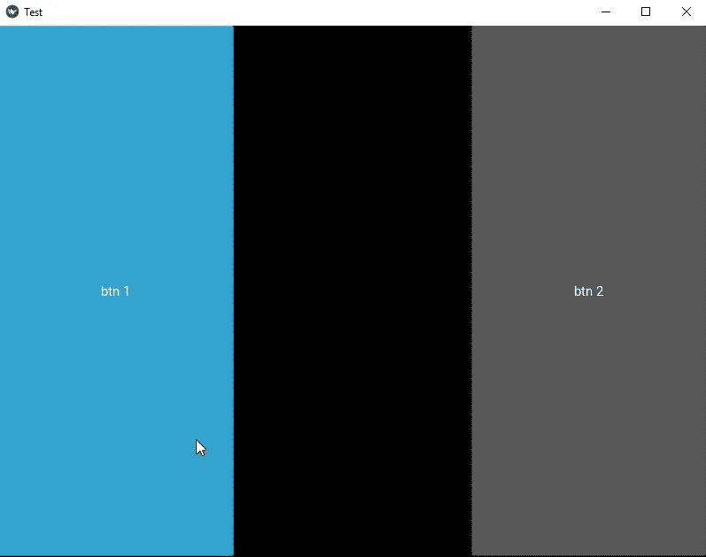

我们的 CustomBtn 没有可视化表示，因此显示为黑色。您可以触摸/点击黑色区域，查看控制台上的输出。

# 动画片

我们可以使用 animation 或 animationTransition 在 kivy 应用程序中添加动画来制作小部件属性的动画。在本例中，每次单击矩形时，矩形都会移动到一个随机位置。

```
from kivy.base import runTouchApp
from kivy.lang import Builder
from kivy.uix.widget import Widget
from kivy.animation import Animation
from kivy.core.window import Window
from random import random

Builder.load_string('''
<Root>:
    ARect:
        pos: 500, 300
<ARect>:
    canvas:
        Color:
            rgba: 0, 0, 1, 1
        Rectangle:
            pos: self.pos
            size: self.size
''')

class Root(Widget):
    pass

class ARect(Widget):
    def circle_pos(self):
        Animation.cancel_all(self)
        random_x = random() * (Window.width - self.width)
        random_y = random() * (Window.height - self.height)

        anim = Animation(x=random_x, y=random_y,
                         duration=4,
                         t='out_elastic')
        anim.start(self)

    def on_touch_down(self, touch):
        if self.collide_point(*touch.pos):
            self.circle_pos()

runTouchApp(Root())
```

**输出:**


# Kivy 的设置面板

kivy 中的设置面板基本上提供了各种选项，我们可以从中选择来配置应用程序。以下示例显示了释放后打开设置面板的按钮。

```
from kivy.app import App
from kivy.lang import Builder

from kivy.uix.boxlayout import BoxLayout

Builder.load_string('''
<Interface>:
    orientation: 'vertical'
    Button:
        text: 'Settings'
        font_size: 100
        on_release: app.open_settings()
''')

class Interface(BoxLayout):
    pass

class SettingsApp(App):
    def build(self):
        return Interface()

SettingsApp().run()
```

**输出:**

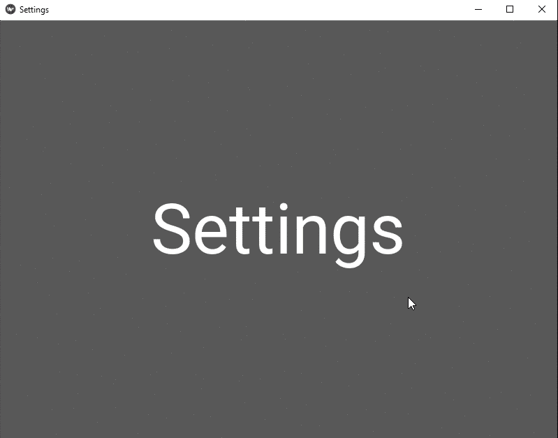

# 构建一个安卓 APK

我们可以使用 [Buildozer](https://kivy.org/doc/stable/guide/packaging-android.html) 工具来制作一个独立的全功能 android APK。首先，在安装工具之后，应该注意依赖关系。如果您在 windows 上使用 kivy，可能会有一些冗余，所以最好使用 Linux 或任何其他平台。相反，你也可以使用虚拟盒子在 windows 上制作 APK。

下面是为 kivy 应用程序制作一个独立的 android APK 需要遵循的步骤。

1.  安装后的第一步是使用 buildozer 创建一个. spec 文件。该文件将包含构建应用程序时所需的所有参数。以下命令将使用默认值创建一个. spec 文件。

```
buildozer init
```

2.在你创建了一个. spec 文件之后，你需要做一些修改，比如标题、包名、方向、版本、需求等等。

3.下一步，在对。规格文件是为了建立你的 APK。以下命令将使 android APK 处于构建模式。

```
buildozer android debug
```

4.最后一个参数“deploy”告诉 buildozer 在构建过程结束时自动在您的设备上安装 APK。

```
buildozer android debug deploy
```

这就把我们带到了本文的结尾，在这里我们学习了如何使用 python 的 kivy 库来制作多点触控应用程序。我希望你清楚本教程中与你分享的所有内容。

如果你想查看更多关于人工智能、DevOps、道德黑客等市场最热门技术的文章，你可以参考 Edureka 的官方网站。

请留意本系列中的其他文章，它们将解释 Python 和数据科学的各个方面。

> 1.[Python 中的机器学习分类器](/edureka/machine-learning-classifier-c02fbd8400c9)
> 
> 2.[Python Scikit-Learn Cheat Sheet](/edureka/python-scikit-learn-cheat-sheet-9786382be9f5)
> 
> 3.[机器学习工具](/edureka/python-libraries-for-data-science-and-machine-learning-1c502744f277)
> 
> 4.[用于数据科学和机器学习的 Python 库](/edureka/python-libraries-for-data-science-and-machine-learning-1c502744f277)
> 
> 5.[Python 中的聊天机器人](/edureka/how-to-make-a-chatbot-in-python-b68fd390b219)
> 
> 6. [Python 集合](/edureka/collections-in-python-d0bc0ed8d938)
> 
> 7. [Python 模块](/edureka/python-modules-abb0145a5963)
> 
> 8. [Python 开发者技能](/edureka/python-developer-skills-371583a69be1)
> 
> 9.[哎呀面试问答](/edureka/oops-interview-questions-621fc922cdf4)
> 
> 10.一个 Python 开发者的简历
> 
> 11.[Python 中的探索性数据分析](/edureka/exploratory-data-analysis-in-python-3ee69362a46e)
> 
> 12.[带 Python 的乌龟模块的贪吃蛇游戏](/edureka/python-turtle-module-361816449390)
> 
> 13. [Python 开发者工资](/edureka/python-developer-salary-ba2eff6a502e)
> 
> 14.[主成分分析](/edureka/principal-component-analysis-69d7a4babc96)
> 
> 15. [Python vs C++](/edureka/python-vs-cpp-c3ffbea01eec)
> 
> 16.[刺儿头教程](/edureka/scrapy-tutorial-5584517658fb)
> 
> 17. [Python SciPy](/edureka/scipy-tutorial-38723361ba4b)
> 
> 18.[最小二乘回归法](/edureka/least-square-regression-40b59cca8ea7)
> 
> 19. [Jupyter 笔记本备忘单](/edureka/jupyter-notebook-cheat-sheet-88f60d1aca7)
> 
> 20. [Python 基础知识](/edureka/python-basics-f371d7fc0054)
> 
> 21. [Python 模式程序](/edureka/python-pattern-programs-75e1e764a42f)
> 
> 22.[Python 中的生成器](/edureka/generators-in-python-258f21e3d3ff)
> 
> 23. [Python 装饰器](/edureka/python-decorator-tutorial-bf7b21278564)
> 
> 24. [Python Spyder IDE](/edureka/spyder-ide-2a91caac4e46)
> 
> 25.[Python 中什么是套接字编程](/edureka/socket-programming-python-bbac2d423bf9)
> 
> 26.[十大最佳学习书籍&练习 Python](/edureka/best-books-for-python-11137561beb7)
> 
> 27.[用 Python 实现的机器人框架](/edureka/robot-framework-tutorial-f8a75ab23cfd)
> 
> 28.[使用 PyGame 的 Python 中的贪吃蛇游戏](/edureka/snake-game-with-pygame-497f1683eeaa)
> 
> 29. [Django 采访问答](/edureka/django-interview-questions-a4df7bfeb7e8)
> 
> 30.[十大 Python 应用](/edureka/python-applications-18b780d64f3b)
> 
> 31.[Python 中的哈希表和哈希表](/edureka/hash-tables-and-hashmaps-in-python-3bd7fc1b00b4)
> 
> 32. [Python 3.8](/edureka/whats-new-python-3-8-7d52cda747b)
> 
> 33.[支持向量机](/edureka/support-vector-machine-in-python-539dca55c26a)
> 
> 34. [Python 教程](/edureka/python-tutorial-be1b3d015745)

*原载于 2019 年 10 月 14 日*[*https://www.edureka.co*](https://www.edureka.co/blog/kivy-tutorial/)*。*