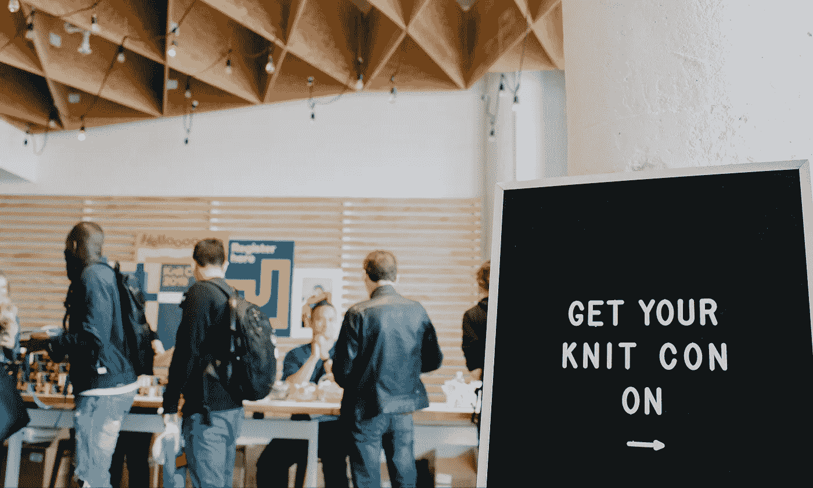
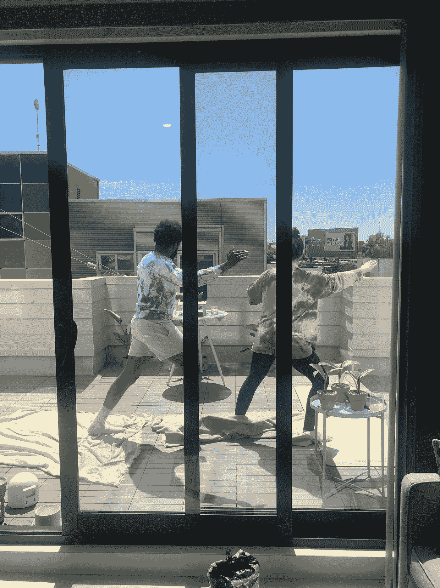

# 从员工的角度看针织骗局

> 原文：<https://medium.com/pinterest-engineering/knit-con-through-an-employees-eyes-17fc35eca1e5?source=collection_archive---------4----------------------->

鸢·奥贡奈克|软件工程师，工程生产力

*原载于鸢的* [*个人博客*](/@TobiOgunnaike/d1b52db718bb) *。*

我不是每天都有机会花两天时间和我的同事一起做煎饼，练习太极，学习如何装盘，跟着六个不同的 DJ 跳舞。两天来，我沉浸在跨越大洲、流派和领域的人才最深处。全部由公司出资。

话说回来，每天都不是针织骗局。

Knit Con at Pinterest HQ in 2019

我第一次体验针织大会是在三年前。我从招聘人员和队友那里听说过很多关于这种所谓的针织骗局的事情。当她描述时，我的招聘人员面露喜色。你知道有人如何描述他们多年前吃的一顿不可思议的饭，这顿饭永远铭刻在他们的记忆中。他们回忆细节时的微笑，每一口食物，每一种味道，以及当一切结束时随之而来的悲伤。是的，她那样做了，但是为了针织大会。我不明白。

Slack 的员工询问了那一年针织大展的确切日期。他们想知道，这样他们就可以改变他们的夏季旅行日期，这样他们就不会错过这次经历。我想，这东西能有多好？

针织大赛是我们为期两天的年度员工激励马拉松。当公司停止工作两天，鼓励员工教学并参与创造性的互动课程和鼓舞人心的谈话时，就会发生这种情况。这是 Pinterest 产品的真实再现，参与者被鼓励探索他们的创造力和想象力。在 Pinterest 之前从事过其他行业，这种“停止工作进行创造性探索”的概念有点陌生。我想这可能意味着日历上没有严肃的会议，但是如果你有截止日期，你最好工作。你知道，就像学校里的老师会说作业是“可有可无”的，但实际上不是。但是我的经历完全不同。在我在这里的四年里，我的所有经理都全力支持员工花时间体验针织大展，以至于我在活动期间总是把笔记本电脑留在家里。

每个针织骗局都不一样，但都是一样的。同样的，在这之前的几个星期里，这种期待也在增加。员工在日历上做标记，老师开始设计如何发挥他们的才能。当你很久没有见到你最好的朋友，然后他们来访，你就从你结束的地方开始，这种熟悉的感觉是一样的。不需要说明书，都一样。就像你在组装家具的时候，某样东西突然到位了。它完全吻合。

每个骗局都是不同的，因为没有两个人的经历是相同的。这是设计好的。你可以花一整天听才华横溢的 DJ 们的音乐。就在西海岸的 DJ 晚上打烊的时候，你可以收听 APAC 的 DJ。这就是为国际公司工作的美妙之处。音乐从未停止。如果你还想吃更多，你可以参加任意数量的开胃课程来犒劳你的味蕾。无论你参加哪一系列的课程，你都将感受到鼓舞，充满活力，你的创造性肌肉得到锻炼。

当然，今年的针织大展将是独一无二的。2020 年是悲剧的一年。我们失去了人，我们失去了人际关系，我们失去了控制。也许奇怪的是，去年我最喜欢的针织大会是在我们不同的大楼之间奔跑，看到朋友和同事都兴奋地试图去上他们的下一堂课。每个人都在嗡嗡作响。这和你在拥挤的足球场、节日或首次公开募股日的感觉是一样的。一些课程可能会太满，然后员工会自发地在其他领域召集起来——制作美味的鸡尾酒，编织和制作纱线和油漆，成为独立的乐趣，或者与你昨天 ping 的那个人玩 FIFA，要求访问 Figma。如果你去上课，你会看到有人袒露他们灵魂深处的激情。你会找到一个能让四百年前的画听起来有趣的人。这个人对毒药知道得有点多，但却能以如此吸引人的方式编织它的历史，让你目瞪口呆。用剥离美食术语的方式盛食物的人，会提醒你用眼睛和鼻子吃东西的原始本能。

但今年没有办公大楼，所以没有楼间通勤聊天。没有面对面的午餐，所以你无法知道你的朋友去了什么很酷的课程。有限的自发性，因为我们从笔记本电脑上观看。

还能特别吗？我知道我不是唯一一个对此感到疑惑的人。

的确是这样。

今年，我上了一门课，在那里我们学习了如何制作委内瑞拉煎饼。有一会儿，我们被送到了南美朋友的家里。我们了解到阿雷帕人非常多才多艺。你决定你想要它有多厚，你想要什么馅料。这完美地概括了针织大会的精神。针织大会带来了基地，基础，或玉米粉，如果你愿意。而我们，人民带来了馅料。它是你创造的。

喜欢听讲座？你本可以收听本的主题演讲，或者加来道雄博士(他让我们对科技的未来感到欣喜和恐惧)，或者[阿伦·罗斯顿](https://en.wikipedia.org/wiki/Aron_Ralston)(他煞费苦心地讲述了他如何设法切断自己的手臂以挽救自己的生命)。

热爱美食？你可以去上一堂很棒的披萨制作课，安德鲁会教我们如何做一个你会想吃的披萨饼皮。或者是波莉·桑(Polly Sang)的一堂课，她教学员如何在没有食谱的情况下烹饪。这种烹饪风格令人毛骨悚然地想起了我的童年，我母亲经常问我“我们有什么，我们能做什么”，然后开始自由发挥(或者用科技术语来说，创新)以达到美味的效果。

在“一个职业扑克玩家的脑子里在想些什么”中，我对心理学和博弈论如何被应用并结合起来产生毁灭性的效果有了一个很好的理解。从压力的一端开始，我选择了更平静的方式。我学习了太极的基础知识，这是一种古老的武术练习，鼓励我们专注于我们的呼吸。鉴于我们刚刚度过的这一年，还有什么课程比鼓励我们关注身心健康更有意义吗？

Knit Con 代表了 Pinterest 有意识、有目的地投资员工的创造力和想象力。这是一种理解，即创造力是值得庆祝和认可的。作为成年人，我们都有账单要付，有税收要申报。因此，重要的是花时间和空间来磨练和表达我们多种多样的创造力。Knit Con 让我们能够跨越不同的国界、时区、政治倾向、种族和性别，与同事建立联系。它提醒我们，我们都应该以开放的心态去尝试新的想法或爱好，无论是做戈登·拉姆齐的威灵顿牛肉还是尝试一门非洲舞蹈课。走出你的舒适区去尝试新的东西是很好的，因为你可能会给自己带来惊喜！

我满怀希望地离开了针织博览会。充满希望是因为尽管经历了 2020 年的巨大痛苦，人类的聪明才智和创造力并没有消亡。尽管事实上我们都缩小了，但我们出现在彼此面前是为了激励、娱乐、教导、兴奋地喘息，以及彼此分享。我很幸运在一家投资创造力的公司工作。我知道这不正常。当我在生物技术领域工作时，作为一名化学工程师，不可能有这样的经历。对于数百万人来说，Pinterest 是互联网中充满希望、积极向上的一部分。我希望我们继续投资于我们员工的创造力，这样我们就能继续达到如此高的标准。

直到 2022 年。

*要在 Pinterest 了解更多关于工程的信息，请查看我们的* [*工程博客*](https://medium.com/pinterest-engineering) *，并访问我们的*[*Pinterest Labs*](https://labs.pinterest.com/)*网站。要查看和申请空缺职位，请访问我们的* [*职业*](https://www.pinterestcareers.com/homepage) *页面。*