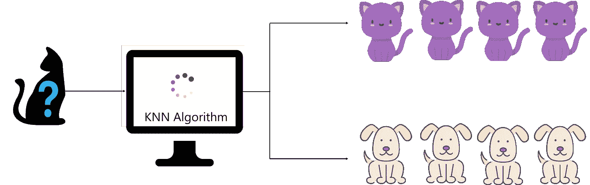
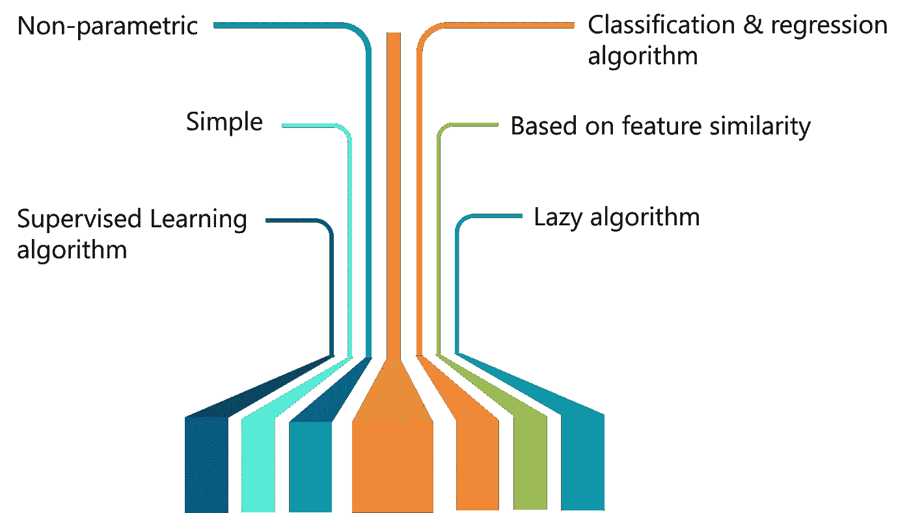
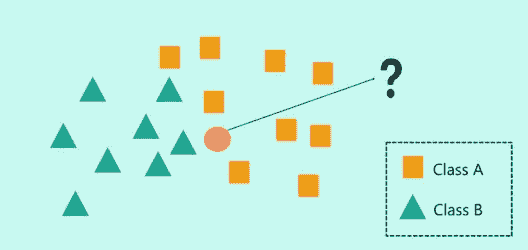
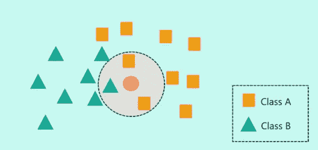
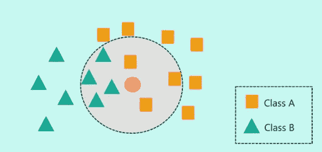
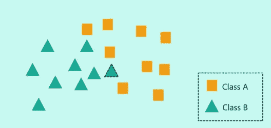
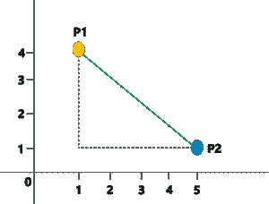
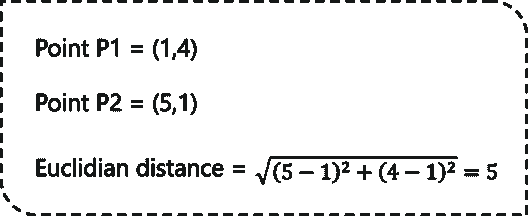
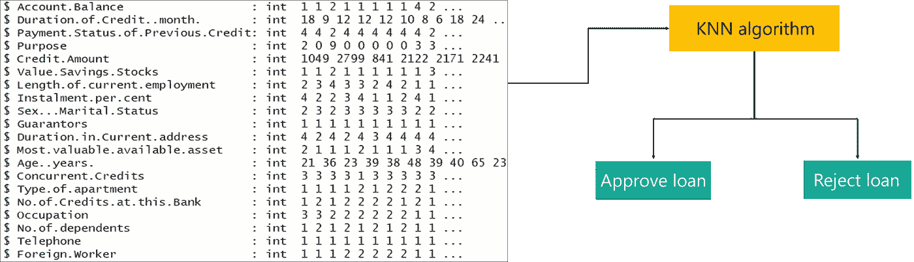
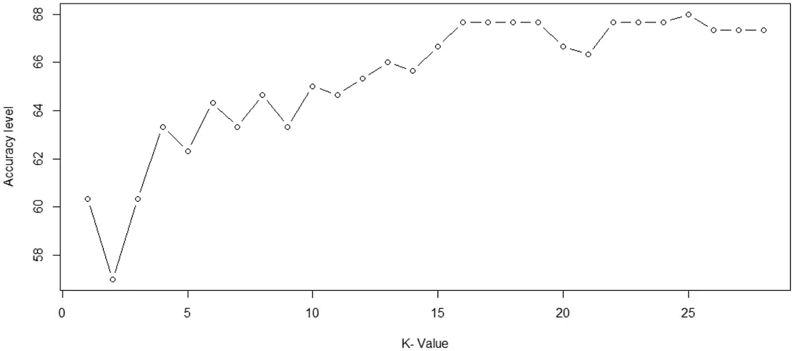

# KNN 算法:KNN 算法在 R 语言中的实际实现

> 原文：<https://medium.com/edureka/knn-algorithm-in-r-a2d657bca691?source=collection_archive---------3----------------------->


随着我们生成的数据量的增加，对高级机器学习算法的需求也在增加。一种这样的算法是 K 最近邻算法。在这篇关于 R 语言中的 KNN 算法的博客中，你将理解 KNN 算法是如何工作的，以及它是如何用 R 语言实现的。

R 博客中的 KNN 算法将涉及以下主题:

1.  什么是 KNN 算法？
2.  KNN 算法的特点
3.  KNN 算法是如何工作的？
4.  KNN 算法用例
5.  KNN 算法伪代码
6.  KNN 算法在 R 语言中的实际实现

# 什么是 KNN 算法？

> 代表 K 最近邻的 KNN 是一种受监督的机器学习算法，它根据相邻数据点的特征将新数据点分类到目标类中。

让我们用一个简单的例子来理解 KNN 算法。假设我们想要一台机器来区分猫和狗的图像。要做到这一点，我们必须输入一个猫和狗的图像数据集，我们必须训练我们的模型根据某些特征来检测动物。例如，尖耳朵等特征可以用来识别猫，类似地，我们可以根据狗的长耳朵来识别狗。



*什么是 KNN 算法？—R—edu reka 中的 KNN 算法*

在训练阶段研究数据集后，当一张新图像被赋予模型时，KNN 算法将根据其特征的相似性将其分类为猫或狗。因此，如果新图像有尖耳朵，它会将该图像归类为猫，因为它与猫图像相似。以这种方式，KNN 算法基于数据点与其相邻数据点的相似程度来分类数据点。

现在让我们讨论一下 KNN 算法的特点。

# KNN 算法的特点

KNN 算法具有以下特点:

*   KNN 是一种监督学习算法，它使用带标签的输入数据集来预测数据点的输出。
*   它是最简单的机器学习算法之一，可以很容易地实现各种各样的问题。
*   主要是基于特征相似度。KNN 检查一个数据点与其相邻数据点的相似程度，并将该数据点分类到与其最相似的类别中。



*Features of KNN — KNN Algorithm In R — Edureka*

*   与大多数算法不同，KNN 是一个非参数模型，这意味着它不对数据集做任何假设。这使得算法更有效，因为它可以处理现实的数据。
*   KNN 是一种惰性算法，这意味着它记忆训练数据集，而不是从训练数据中学习判别函数。
*   KNN 可用于解决分类和回归问题。

## KNN 算法示例

为了让你理解 KNN 算法是如何工作的，让我们考虑下面的场景:



*   在上图中，我们有两类数据，即 A 类(正方形)和 B 类(三角形)
*   问题陈述是通过使用 KNN 算法将新的输入数据点分配给两个类中的一个
*   KNN 算法的第一步是定义“K”的值。但是 KNN 算法中的“K”代表什么呢？
*   “K”代表最近邻的数量，因此得名“K 最近邻”(KNN)。



*   在上图中，我将“K”的值定义为 3。这意味着该算法将考虑最接近新数据点的三个邻居，以便决定该新数据点的类别。
*   数据点之间的接近程度是通过使用欧几里德距离和曼哈顿距离来计算的，我将在下面解释。
*   在 K = 3 时，邻居包括两个正方形和一个三角形。因此，如果我基于“K”= 3 对新数据点进行分类，那么它将被分配到 A 类(正方形)。



*   但是如果‘K’值设置为 7 呢？在这里，我基本上是告诉我的算法寻找七个最近的邻居，并将新的数据点分类到它最相似的类别中。
*   在 K = 7 时，邻居包括三个正方形和四个三角形。因此，如果我基于“K”= 7 对新数据点进行分类，那么它将被分配到 B 类(三角形)，因为它的大多数邻居都属于 B 类。



实际上，在实现 KNN 算法时，需要考虑更多的因素。这将在博客的演示部分讨论。

前面我提到过，KNN 使用欧几里得距离作为一种度量来检查新数据点与其邻居之间的距离，让我们看看如何进行。



*   考虑上面的图像，这里我们将使用欧几里德距离度量来测量 P1 和 P2 之间的距离。
*   P1 和 P2 的坐标分别是(1，4)和(5，1)。
*   欧几里德距离可以这样计算:



就这么简单！KNN 利用简单的措施来解决复杂的问题，这就是为什么 KNN 是这样一个常用算法的原因之一。

总而言之，让我们看看 KNN 算法的伪代码。

# KNN 算法伪代码

考虑一下布景，(Xi，Ci)，

*   其中 Xi 表示特征变量，而‘I’是范围从 i=1，2，…的数据点..，n
*   Ci 表示每个 I 的 Xi 的输出类

假设类的总数由‘c’表示，条件 *Ci ∈ {1，2，3，…，c}* 对于‘I’的所有值都是可接受的。

现在让我们假设有一个数据点“x ”,它的输出类需要预测。这可以通过使用 K-最近邻(KNN)算法来完成。

**KNN 算法伪代码:**

```
head(loan.subset)Creditability Age..years. Sex...Marital.Status Occupation Account.Balance Credit.Amount1             1          21                    2          3               1          10492             1          36                    3          3               1          27993             1          23                    2          2               2           8414             1          39                    3          2               1          21225             1          38                    3          2               1          21716             1          48                    3          2               1          2241Length.of.current.employment Purpose1                            2       22                            3       03                            4       94                            3       05                            3       06                            2       0
```

上述伪代码可用于通过使用 KNN 算法来解决分类问题。

在我们进入 KNN 的实际实现之前，让我们看看 KNN 算法的一个真实世界的用例。

# KNN 算法用例

你肯定在亚马逊购物过！你有没有注意到，当你购买一个产品时，亚马逊会根据你的购买情况给你一个推荐列表？不仅如此，亚马逊还展示了一个部分，上面写着，“购买了这件商品的顾客也购买了这件商品”。

机器学习在亚马逊的推荐系统中发挥着巨大的作用。推荐引擎背后的逻辑是根据具有相似购物行为的其他客户向客户推荐产品。


考虑一个例子，假设一个热爱推理小说的客户 A 买了《权力的游戏》和《指环王》系列图书。现在，几个星期后，另一个阅读相同类型书籍的顾客 B 购买了《指环王》。他没有购买《权力的游戏》系列图书，但亚马逊推荐给客户 B，因为他的购物行为和书籍选择与客户 a 非常相似。

因此，亚马逊根据顾客购物行为的相似程度向顾客推荐产品。这种相似性可以通过实现主要基于特征相似性的 KNN 算法来理解。

现在你已经知道了 KNN 是如何工作的，以及它是如何在现实世界的应用程序中使用的，让我们来讨论使用 R 语言实现 KNN。如果你不熟悉 R 语言，你可以看看我们的机器学习专家录制的这个视频。

# KNN 算法在 R 语言中的实际实现

**问题陈述:** *研究一个银行信贷数据集，建立一个机器学习模型，根据申请人的社会经济概况预测其贷款是否能被批准。*

**数据集描述:**银行信贷数据集包含约 1000 名申请人的信息。这包括他们的账户余额、信用额度、年龄、职业、贷款记录等。通过使用这些数据，我们可以预测是否批准申请人的贷款。



**逻辑:**这个问题陈述可以使用 KNN 算法来解决，该算法将申请人的贷款请求分为两类:

现在你知道了这个项目的目标，让我们从编码部分开始。

***第一步:导入数据集***

```
#Import the dataset loan <- read.csv("C:/Users/zulaikha/Desktop/DATASETS/knn dataset/credit_data.csv")
```

导入数据集后，让我们看看数据集的结构:

```
str(loan) 'data.frame': 1000 obs. of 21 variables: $ Creditability : int 1 1 1 1 1 1 1 1 1 1 ... $ Account.Balance : int 1 1 2 1 1 1 1 1 4 2 ... $ Duration.of.Credit..month. : int 18 9 12 12 12 10 8 6 18 24 ... $ Payment.Status.of.Previous.Credit: int 4 4 2 4 4 4 4 4 4 2 ... $ Purpose : int 2 0 9 0 0 0 0 0 3 3 ... $ Credit.Amount : int 1049 2799 841 2122 2171 2241 3398 1361 1098 3758 ... $ Value.Savings.Stocks : int 1 1 2 1 1 1 1 1 1 3 ... $ Length.of.current.employment : int 2 3 4 3 3 2 4 2 1 1 ... $ Instalment.per.cent : int 4 2 2 3 4 1 1 2 4 1 ... $ Sex...Marital.Status : int 2 3 2 3 3 3 3 3 2 2 ... $ Guarantors : int 1 1 1 1 1 1 1 1 1 1 ... $ Duration.in.Current.address : int 4 2 4 2 4 3 4 4 4 4 ... $ Most.valuable.available.asset : int 2 1 1 1 2 1 1 1 3 4 ... $ Age..years. : int 21 36 23 39 38 48 39 40 65 23 ... $ Concurrent.Credits : int 3 3 3 3 1 3 3 3 3 3 ... $ Type.of.apartment : int 1 1 1 1 2 1 2 2 2 1 ... $ No.of.Credits.at.this.Bank : int 1 2 1 2 2 2 2 1 2 1 ... $ Occupation : int 3 3 2 2 2 2 2 2 1 1 ... $ No.of.dependents : int 1 2 1 2 1 2 1 2 1 1 ... $ Telephone : int 1 1 1 1 1 1 1 1 1 1 ... $ Foreign.Worker : int 1 1 1 2 2 2 2 2 1 1 ...
```

注意,“可信度”变量是我们的输出变量或目标变量。可信度变量的值表示申请人的贷款是被批准还是被拒绝。

***第二步:数据清理***

从数据集的结构中，我们可以看到有 21 个预测变量将帮助我们决定是否必须批准申请人的贷款。

其中一些变量在预测申请人的贷款时并不重要，例如，诸如电话、并发等变量。学分、持续时间、当前地址、公寓类型等。这样的变量必须去除，因为它们只会增加机器学习模型的复杂性。

```
loan.subset<-loan[c('Creditability','Age..years.','Sex...Marital.Status','Occupation','Account.Balance','Credit.Amount','Length.of.current.employment','Purpose')]
```

在上面的代码片段中，我过滤了预测变量。现在，让我们看看我们的数据集是什么样子的:

```
str(loan.subset)
'data.frame': 1000 obs. of 8 variables:
$ Creditability : int 1 1 1 1 1 1 1 1 1 1 ...
$ Age..years. : int 21 36 23 39 38 48 39 40 65 23 ...
$ Sex...Marital.Status : int 2 3 2 3 3 3 3 3 2 2 ...
$ Occupation : int 3 3 2 2 2 2 2 2 1 1 ...
$ Account.Balance : int 1 1 2 1 1 1 1 1 4 2 ...
$ Credit.Amount : int 1049 2799 841 2122 2171 2241 3398 1361 1098 3758 ...
$ Length.of.current.employment: int 2 3 4 3 3 2 4 2 1 1 ...
$ Purpose : int 2 0 9 0 0 0 0 0 3 3 ...
```

现在，我们已经将 21 个变量缩减为 8 个对构建模型有重要意义的预测变量。

***第三步:数据归一化***

您必须始终对数据集进行归一化，以使输出保持无偏。为了解释这一点，让我们来看看我们的数据集中的前几个观察结果。

```
head(loan.subset)Creditability Age..years. Sex...Marital.Status Occupation Account.Balance Credit.Amount1             1          21                    2          3               1          10492             1          36                    3          3               1          27993             1          23                    2          2               2           8414             1          39                    3          2               1          21225             1          38                    3          2               1          21716             1          48                    3          2               1          2241Length.of.current.employment Purpose1                            2       22                            3       03                            4       94                            3       05                            3       06                            2       0
```

请注意信用额变量，它的值范围是 1000，而其余的变量是个位数或两位数。如果数据没有标准化，将会导致不良的结果。

```
#Normalization
normalize <- function(x) {
return ((x - min(x)) / (max(x) - min(x))) }
```

在下面的代码片段中，我们将规范化数据集存储在“loan.subset.n”变量中，并且我们还删除了“credential”变量，因为它是需要预测的响应变量。

```
loan.subset.n <- as.data.frame(lapply(loan.subset[,2:8], normalize))
```

这是标准化的数据集:

```
head(loan.subset.n)Age..years. Sex..Marital Occupation Account.Balance Credit.Amount1  0.03571429   0.3333333   0.6666667    0.0000000      0.043963902  0.30357143   0.6666667   0.6666667    0.0000000      0.140255313  0.07142857   0.3333333   0.3333333    0.3333333      0.032518984  0.35714286   0.6666667   0.3333333    0.0000000      0.103004295  0.33928571   0.6666667   0.3333333    0.0000000      0.105700456  0.51785714   0.6666667   0.3333333    0.0000000      0.10955211Length.of.current.employment Purpose0.25                0.20.50                0.00.75                0.90.50                0.00.50                0.00.25                0.0
```

清理数据集并格式化后，下一步就是数据拼接。数据拼接基本上包括将数据集分成训练数据集和测试数据集。这是在下面的代码片段中完成的:

```
set.seed(123)
dat.d <- sample(1:nrow(loan.subset.n),size=nrow(loan.subset.n)*0.7,replace = FALSE) #random selection of 70% data.
train.loan <- loan.subset[dat.d,] # 70% training data
test.loan <- loan.subset[-dat.d,] # remaining 30% test data
```

在获得训练和测试数据集后，下面的代码片段将为“可信度”变量创建一个单独的数据框架，以便我们的最终结果可以与实际值进行比较。

```
#Creating seperate dataframe for 'Creditability' feature which is our target.
train.loan_labels <- loan.subset[dat.d,1]
test.loan_labels <-loan.subset[-dat.d,1]
```

***第五步:建立机器学习模型***

在这个阶段，我们必须使用训练数据集建立模型。因为我们使用 KNN 算法来构建模型，所以我们必须首先安装 r 提供的“类”包。这个包中有 KNN 函数:

```
#Install class package
install.packages('class')
# Load class package
library(class)
```

接下来，我们将计算训练数据集中的观察次数。我们这样做的原因是我们想初始化 KNN 模型中“K”的值。寻找最佳 K 值的方法之一是计算数据集中观察值总数的平方根。这个平方根会给你 K 值。

```
#Find the number of observation
NROW(train.loan_labels)
[1] 700
```

因此，我们的训练数据集中有 700 个观察值。700 的平方根约为 26.45，因此我们将创建两个模型。一个“K”值为 26，另一个“K”值为 27。

```
knn.26 <- knn(train=train.loan, test=test.loan, cl=train.loan_labels, k=26)
knn.27 <- knn(train=train.loan, test=test.loan, cl=train.loan_labels, k=27)
```

***第六步:模型评估***

建立模型后，是时候计算所创建模型的准确性了:

```
#Calculate the proportion of correct classification for k = 26, 27
ACC.26 <- 100 * sum(test.loan_labels == knn.26)/NROW(test.loan_labels)
ACC.27 <- 100 * sum(test.loan_labels == knn.27)/NROW(test.loan_labels)
ACC.26
[1] 67.66667
ACC.27
[1] 67.33333
```

如上所示，K = 26 时的精度为 67.66，K = 27 时的精度为 67.33。我们还可以用表格形式对照实际值检查预测结果:

```
# Check prediction against actual value in tabular form for k=26table(knn.26 ,test.loan_labels) test.loan_labels
knn.26   0     1
0        11    7
1        90   192
knn.26
[1] 1 1 1 1 1 1 1 1 1 1 1 1 1 1 1 1 1 1 1 1 1 1 1 1 1 1 1 1 1 1 1 1 1 1 1 1 1 1 1 1 1 1 1 1 1 1 1 0 1 1[51] 1 1 1 1 1 1 1 1 1 1 1 0 0 1 1 1 1 1 1 1 1 1 1 1 1 1 1 1 1 1 1 1 1 1 1 1 1 1 1 1 1 1 1 1 1 1 1 1 1 1[101] 1 1 1 1 1 0 1 1 1 1 1 1 1 1 1 1 1 1 1 1 1 1 1 1 1 1 1 1 1 1 1 1 1 1 1 1 1 1 1 1 1 1 1 1 1 1 1 1 1 1[151] 1 0 1 1 1 1 1 1 1 1 1 1 1 1 1 1 1 1 1 1 1 1 1 1 1 1 1 1 1 1 1 1 0 1 1 1 0 1 1 1 1 1 1 1 1 1 1 1 1 1[201] 1 1 1 1 1 1 1 1 1 1 1 1 0 1 1 1 1 1 1 1 0 1 1 1 1 1 1 1 1 1 1 1 1 1 1 1 1 1 0 1 1 1 1 1 1 1 1 1 1 1[251] 0 1 1 0 1 1 1 1 1 1 1 1 1 0 1 0 1 1 1 1 1 1 1 1 0 1 1 1 1 1 0 1 1 1 1 0 1 1 1 1 1 1 0 1 1 1 1 1 1 1Levels: 0 1# Check prediction against actual value in tabular form for k=27 table(knn.27 ,test.loan_labels) test.loan_labels knn.27 0 1 0 11 8 1 90 191 knn.27
[1] 1 1 1 1 1 1 1 1 1 1 1 1 1 1 1 1 1 1 1 1 1 1 1 1 1 1 1 1 1 1 1 1 1 1 1 1 1 1 1 1 1 1 1 1 1 1 1 0 1 1
[51] 1 1 1 1 1 1 1 1 1 1 1 0 1 1 0 1 1 1 1 1 1 1 1 1 1 1 1 1 1 1 1 1 1 1 1 1 1 1 1 1 1 1 1 1 1 1 1 1 1 1
[101] 1 1 1 1 1 0 1 1 1 1 1 1 1 1 1 1 1 1 1 1 1 1 1 1 1 1 1 1 1 1 1 1 1 1 1 1 1 1 1 1 1 1 1 1 1 1 1 1 1 1
[151] 1 0 1 1 1 1 1 1 1 1 1 1 1 1 1 1 1 1 1 1 1 1 1 1 1 1 1 1 1 1 1 1 0 1 1 1 0 1 1 1 1 1 1 1 1 1 1 1 1 1
[201] 1 1 1 1 1 0 1 1 1 1 1 1 0 1 1 1 1 1 1 1 0 1 1 1 1 1 1 1 1 1 1 1 1 1 1 1 1 1 0 1 1 1 1 1 1 1 1 1 1 1
[251] 0 1 1 0 1 1 1 1 1 1 1 1 1 0 1 0 1 1 1 1 1 1 1 1 0 1 1 1 1 1 0 1 1 1 1 0 1 1 1 1 1 1 0 1 1 1 1 1 1 1
Levels: 0 1
```

你也可以用混淆矩阵来计算准确度。为此，我们必须首先安装臭名昭著的 Caret 包:

```
install.packages('caret')
library(caret)
```

现在，让我们使用混淆矩阵来计算 K 值设置为 26 的 KNN 模型的准确性:

```
confusionMatrix(table(knn.26 ,test.loan_labels))
Confusion Matrix and Statistics
test.loan_labels
knn.26   0   1
0  11   7
1  90 192
Accuracy : 0.6767
95% CI : (0.6205, 0.7293)
No Information Rate : 0.6633
P-Value [Acc > NIR] : 0.3365
Kappa : 0.0924
Mcnemar's Test P-Value : <2e-16
Sensitivity : 0.10891
Specificity : 0.96482
Pos Pred Value : 0.61111
Neg Pred Value : 0.68085
Prevalence : 0.33667
Detection Rate : 0.03667
Detection Prevalence : 0.06000
Balanced Accuracy : 0.53687
'Positive' Class : 0
```

因此，从输出中，我们可以看到我们的模型预测结果的准确率为 67.67%，这是很好的，因为我们使用的是一个小数据集。需要记住的一点是，你提供给机器的数据(最优数据)越多，模型的效率就越高。

***第七步:优化***

为了提高模型的精确度，可以使用 n 种技术，如肘法和最大百分比精确度图。在下面的代码片段中，我创建了一个循环，用于计算从 1 到 28 的“K”值的 KNN 模型的精确度。这样，您可以检查哪个“K”值将产生最准确的模型:

```
i=1k.optm=1for (i in 1:28){+ knn.mod <- knn(train=train.loan, test=test.loan, cl=train.loan_labels, k=i)+ k.optm[i] <- 100 * sum(test.loan_labels == knn.mod)/NROW(test.loan_labels)+ k=i+ cat(k,'=',k.optm[i],'')+ }1 = 60.333332 = 58.333333 = 60.333334 = 615 = 62.333336 = 627 = 63.333338 = 63.333339 = 63.3333310 = 64.6666711 = 64.6666712 = 65.3333313 = 6614 = 6415 = 66.6666716 = 67.6666717 = 67.6666718 = 67.3333319 = 67.6666720 = 67.6666721 = 66.3333322 = 6723 = 67.6666724 = 6725 = 6826 = 67.6666727 = 67.3333328 = 66.66667
```

从输出中可以看出，对于 K = 25，我们实现了最高精度，即 68%。我们也可以用图形来表示，就像这样:

```
#Accuracy plot
plot(k.optm, type="b", xlab="K- Value",ylab="Accuracy level")
```



*Accuracy Plot — KNN Algorithm In R — Edureka*

上图显示，对于 25 的“K”值，我们获得了最高的精度。现在您已经知道了如何构建 KNN 模型，我将让您来构建一个“K”值为 25 的模型。

这就把我们带到了本文的结尾，在这里我们学习了机器学习中的分类。我希望你清楚本教程中与你分享的所有内容。

如果你想查看更多关于 Python、DevOps、Ethical Hacking 等市场最热门技术的文章，你可以参考 Edureka 的官方网站。

请留意本系列中的其他文章，它们将解释数据科学的各个方面。

> *1。* [*数据科学教程*](/edureka/data-science-tutorial-484da1ff952b)
> 
> *2。* [*数据科学的数学与统计*](/edureka/math-and-statistics-for-data-science-1152e30cee73)
> 
> *3。*[*R 中的线性回归*](/edureka/linear-regression-in-r-da3e42f16dd3)
> 
> *4。* [*机器学习算法*](/edureka/machine-learning-algorithms-29eea8b69a54)
> 
> *5。*[*R 中的逻辑回归*](/edureka/logistic-regression-in-r-2d08ac51cd4f)
> 
> *6。* [*分类算法*](/edureka/classification-algorithms-ba27044f28f1)
> 
> *7。* [*随机森林中的 R*](/edureka/random-forest-classifier-92123fd2b5f9)
> 
> *8。* [*决策树中的 R*](/edureka/a-complete-guide-on-decision-tree-algorithm-3245e269ece)
> 
> *9。* [*机器学习入门*](/edureka/introduction-to-machine-learning-97973c43e776)
> 
> *10。* [*朴素贝叶斯在 R*](/edureka/naive-bayes-in-r-37ca73f3e85c)
> 
> *11。* [*统计与概率*](/edureka/statistics-and-probability-cf736d703703)
> 
> 12。 [*如何创建一个完美的决策树？*](/edureka/decision-trees-b00348e0ac89)
> 
> *13。* [*关于数据科学家角色的十大误区*](/edureka/data-scientists-myths-14acade1f6f7)
> 
> *14。* [*顶级数据科学项目*](/edureka/data-science-projects-b32f1328eed8)
> 
> 15。 [*数据分析师 vs 数据工程师 vs 数据科学家*](/edureka/data-analyst-vs-data-engineer-vs-data-scientist-27aacdcaffa5)
> 
> 16。 [*人工智能的种类*](/edureka/types-of-artificial-intelligence-4c40a35f784)
> 
> 17。[*R vs Python*](/edureka/r-vs-python-48eb86b7b40f)
> 
> *18。* [*人工智能 vs 机器学习 vs 深度学习*](/edureka/ai-vs-machine-learning-vs-deep-learning-1725e8b30b2e)
> 
> *19。* [*机器学习项目*](/edureka/machine-learning-projects-cb0130d0606f)
> 
> 20。 [*数据分析师面试问答*](/edureka/data-analyst-interview-questions-867756f37e3d)
> 
> *21。* [*面向非程序员的数据科学和机器学习工具*](/edureka/data-science-and-machine-learning-for-non-programmers-c9366f4ac3fb)
> 
> *22。* [*十大机器学习框架*](/edureka/top-10-machine-learning-frameworks-72459e902ebb)
> 
> *23。* [*用于机器学习的统计*](/edureka/statistics-for-machine-learning-c8bc158bb3c8)
> 
> *24。* [*随机森林中的 R*](/edureka/random-forest-classifier-92123fd2b5f9)
> 
> *25。* [*广度优先搜索算法*](/edureka/breadth-first-search-algorithm-17d2c72f0eaa)
> 
> *26。*[*R 中的线性判别分析*](/edureka/linear-discriminant-analysis-88fa8ad59d0f)
> 
> *27。* [*机器学习的先决条件*](/edureka/prerequisites-for-machine-learning-68430f467427)
> 
> *28。* [*互动 WebApps 使用 R 闪亮*](/edureka/r-shiny-tutorial-47b050927bd2)
> 
> 29。 [*机器学习十大书籍*](/edureka/top-10-machine-learning-books-541f011d824e)
> 
> *三十。* [*监督学习*](/edureka/supervised-learning-5a72987484d0)
> 
> *31。* [*10 本最好的数据科学书籍*](/edureka/10-best-books-data-science-9161f8e82aca)
> 
> 32。 [*机器学习使用 R*](/edureka/machine-learning-with-r-c7d3edf1f7b)

*原载于 2019 年 4 月 16 日*[*https://www.edureka.co*](https://www.edureka.co/blog/knn-algorithm-in-r/)*。*