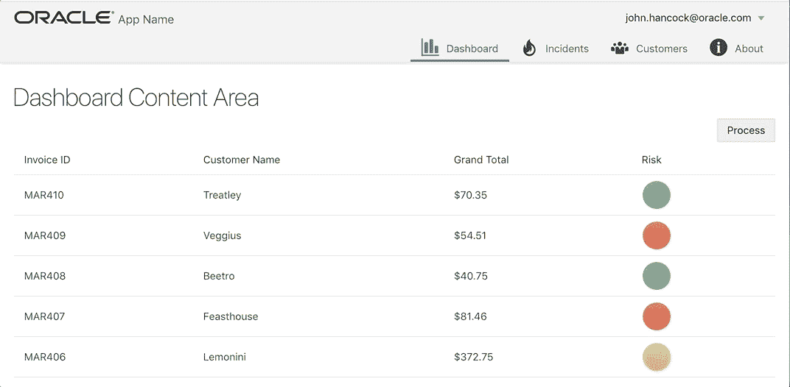
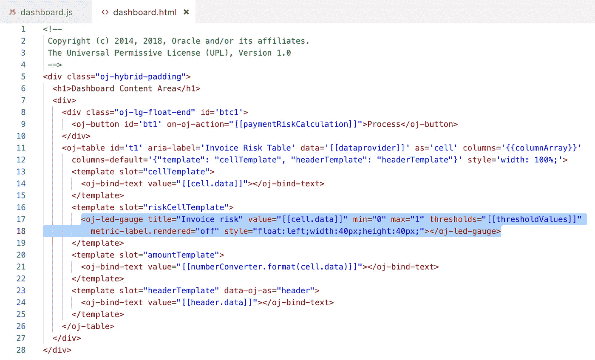
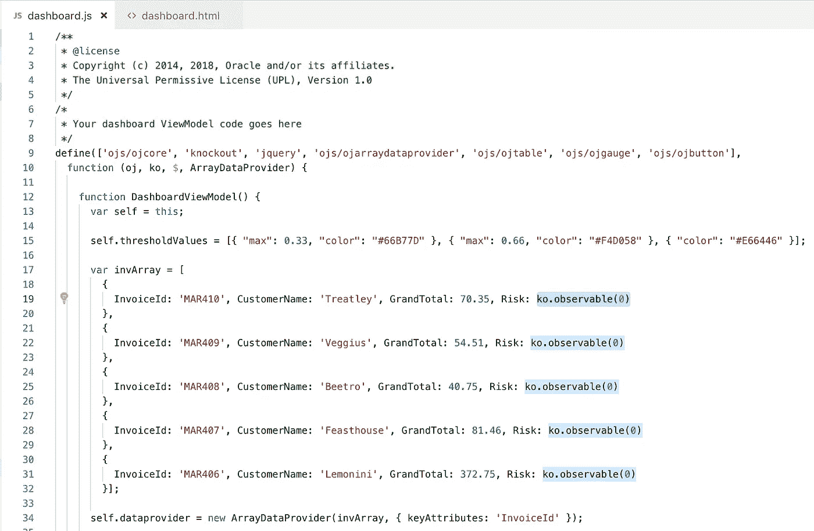
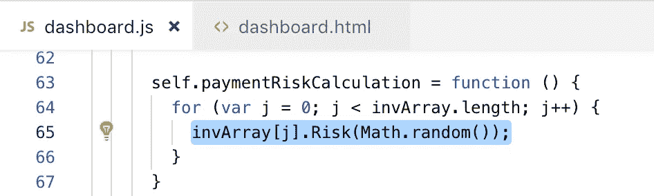

# Knockout.js 更新单个数组元素(Oracle JET)

> 原文：<https://medium.com/oracledevs/knockout-js-updating-single-array-element-oracle-jet-45ebf87071a1?source=collection_archive---------0----------------------->

如果您实现表并使用 Knockout.js 将数据更新从 js 推送到 HTML——您可能会遇到这样的情况:推一个列的更新不起作用。我的意思是您可以替换整个可观察数组元素——这将导致整行刷新。但是从视觉上看，这并不好看，如果只有一个(或几个)元素必须刷新，为什么要刷新整行。

如果您需要刷新一个特定的数组元素(或者换句话说，行列)，您必须将该列的值定义为可观察的。

刷新将进行得更加顺利，而不是刷新整行。查看单击“处理”按钮后风险列值的变化速度:

表是用 [Oracle JET](https://www.oracle.com/webfolder/technetwork/jet/index.html) 表组件实现的。JET 表允许定义模板槽，这有助于为表列实现创建更好的结构:

风险列—正在刷新的列被定义为数组中的可观察变量:

风险列的新值是通过迭代数组元素直接设置的。UI 上的刷新通过可观察的挖空自动发生:

示例应用程序源代码可以在我的 [GitHub](https://github.com/abaranovskis-redsamurai/tablecolumnupdatejet) repo 上获得。

*原载于 2018 年 12 月 27 日*[*andrejusb.blogspot.com*](https://andrejusb.blogspot.com/2018/12/knockoutjs-updating-single-array.html)*。*