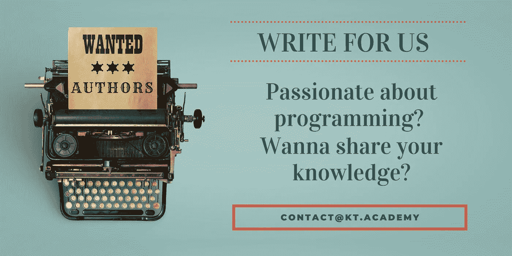

# 了解应用程序安全的主要类型、主要趋势和未来

> 原文：<https://blog.kotlin-academy.com/know-what-are-major-types-major-trends-and-the-future-of-application-security-d764eb218e4c?source=collection_archive---------0----------------------->

今天，web 应用程序和 API 已经成为人们之间交流的主要来源。群聊决定是否计划度假，Instagram 页面为业务增长铺平道路。移动应用程序有可能提高一个人的生活水平，也有可能在某些方面毁掉它。因此，公司投入数十亿美元来确保 API 和 web 应用程序的安全性。

一个突发故障或一个有缺陷的应用程序可能会对客户体验产生负面影响，并永远损害公司的声誉。此外，应用程序中的安全漏洞会暴露公司、客户的私人信息和法律问题。因此，保护资源和提高应用程序的安全性是公司安全策略的重中之重。

根据 Allied Market Research 的数据，全球 [**应用安全市场**](https://www.alliedmarketresearch.com/application-security-market-A10348) 预计到 2030 年将达到 339.4 亿美元，2021 年至 2030 年的 CAGR 增长率为 18.7%。针对业务应用程序的安全漏洞的增加、向云访问应用程序转变的激增以及对应用程序安全性的严格合规性和监管要求推动了市场增长。

**应用安全的主要类型有哪些？**

**1。** **关键基础设施和网络安全**

网络物理系统提供了至关重要的基础设施，如水净化、电网和金融服务系统等。这些系统需要部署额外的安全层。此外，企业管理此类应用并投资于网络安全至关重要。

**2。** **移动和网络应用安全**

任何公司，无论是内部应用还是公共应用，都需要一个测试和修复安全漏洞的正式流程。此外，为了保护隐私，如果应用程序提供移动或远程访问，应该建立加密。包括防病毒和防火墙在内的传统保护层必须存在于每个连接的节点上。

威胁监控系统和网络入侵工具对于保护公司内部系统和提升整体安全性至关重要。多年来，网络管理员负责这个过程。然而，随着部署方法的进步，网络安全已经成为每个参与启动新应用程序的开发人员的工作。

如今，大多数较新的应用程序都是基于云的。因此，为云应用提供保护的基于软件的安全工具变得越来越重要。云服务提供商不断审查他们的平台，并增强他们的安全解决方案。几项研究表明，与云环境相比，内部部署面临更多的安全漏洞。

物联网(IoT)在全球的采用鼓励公司投资于应用安全，并控制其联网设备的风险。从生物扫描仪到建筑管理系统，如果不加以保护，一切都可能导致违规。由于连接到公司网络的任何设备都可以通过互联网访问，因此需要额外的保护。这种保护层可以防止黑客使用物联网设备进行攻击。更重要的是，使用物联网设备，很难发现安全攻击，这使得物联网安全变得更加重要。

多年来，公司已经升级了应用程序安全策略，以解决安全漏洞和网络威胁。网络犯罪的威胁迫使许多公司采取激烈措施来提高各种工作负载部署环境(包括无服务器、容器或其他微服务)的安全性。

**以下是应用安全行业的一些主要趋势:**

**1。** **从 DevOp 转到 DevSecOp**

敏捷环境下的应用开发越来越多，因此需要提高开发运维的安全性。在敏捷环境中，软件开发要快得多，也更有效率。然而，如果没有适当的安全措施，未被发现的安全漏洞将是不可控的。有了应用程序的功能，黑客就有了多个攻击的入口。在过去的几年里，网络攻击增加了。

另一方面，术语 DevSecOps 指的是集成跨职能的组织结构，并在发布后的生命周期中提高应用程序的安全性。DevSecOps 漏洞率更低，同时保持产品故障率最低。因此，DevSecOps 框架被广泛用于安全和威胁的早期检测。此外，它已经成为应用程序安全开发中至关重要的一步。

**2。** **采用云就绪安全解决方案**

云的采用席卷了整个世界。越来越多的公司已经将他们的工作负载转移到了云上，新冠肺炎疫情公司更是推动了这一转变。云提供了前所未有的疫情时代所需的灵活性、可伸缩性和敏捷性，大多数公司都采用了在家工作的文化。对 DevSecOps 的需求急剧增加，进入市场的新应用程序需要云的优势。因此，安全解决方案必须跟上。必须为云设计和开发应用程序安全性要求。此外，安全解决方案必须匹配与云相同级别的灵活性、可扩展性和敏捷性。然而，这需要大量的人工智能(AI)和自动化。

**3。****API 成为面向互联网的重要服务**

在当今世界，web 应用程序防火墙(waf)不足以保护面向互联网的资产免受网络犯罪分子的侵害。因此，公司必须使用 web 应用程序和 web APIs。这样的 web APIs 也面临着几个挑战，包括不适当的资产管理、错误配置、注入和破坏授权。这些挑战推动了 API 保护(WAAP)和 Web 应用解决方案的发展，以取代传统的 WAF 技术。

**4。** **机器人即服务的出现**

通常，机器人被用来与网站互动和自动化网络攻击。例如，机器人可以是分布式拒绝服务(DDoS)的一部分，以执行或攻击凭证填充，防止外部未经授权的访问。另一方面，恶意机器人更容易通过“机器人即服务”提供商获得。这使得网络罪犯更容易攻击。因此，应用安全公司必须想出新颖的解决方案来对抗它们。最近，bot 管理解决方案获得了关注，因为它们对于抗击对公司应用程序或 API 的攻击以及保护其资源至关重要。

**5。** **由人工智能支持的自动化安全解决方案**

安全运营中心(SOC)团队经常面临一些常见的问题，例如威胁环境的增加、基础架构的扩展、资源的有限以及法规遵从性要求。这些挑战难以应对，也难以应对。因此，由人工智能支持的应用安全解决方案变得更加流行，以解决这些问题。人工智能的进步为自动化数据收集、事件响应和威胁识别提供了独特的机会。此外，自动化安全解决方案可以在有限的安全人员和资源下运行，同时为公司提供最大的利益。

**6。** **整合以改进事件检测**

安全运营中心(SOC)平均每天会收到大约 10，000 个警报来检测安全威胁。这对安全团队来说太过沉重，难以有效地进行分类、补救和调查。此外，随着安全团队关注误报威胁，真正的威胁很有可能会被忽略，安全漏洞也会扩大。

这种警惕疲劳可以通过整合来解决。各公司可以相互合作，更新他们的 IT 基础设施，改善安全架构。此外，他们可以合作应对多种威胁，这可以简化操作，安全团队可以快速检测潜在的威胁。

应用安全的未来会是怎样的？

云安全是指用于保持基于云的系统和应用程序安全的策略、协议和一系列技术。随着越来越多的公司将工作负载转移到云上，并为员工提供远程工作设施，人们对云的信任也在增加。因此，应用程序安全性仍然非常重要。虽然有新技术进入市场，但总会有漏洞的空间。此外，在大多数情况下，人为错误是安全漏洞的主要原因。因此，这里有一些应用程序安全性的建议，以保护企业。

**1。** **多因素认证**

这听起来可能太基础了，但是多因素身份验证可以大大提高应用程序的安全性。它提供了针对网络罪犯的额外一层防御。有了 MFA，黑客在访问私人账户之前需要通过至少两个验证过程。在设备、生物识别和其他安全密钥上使用一次性密码可以显著提高应用程序的安全性。

云到云指的是将存储在一个云中的数据传输到另一个云服务。此过程类似于异地备份，如果您的公司涉及软件即服务应用程序，这一点至关重要。在系统出现故障时，云到云备份可以提供帮助。由于云到云备份是自动化的，因此可以安全地检测未经授权的访问和勒索软件。

**3。** **应用安全方面的常规员工培训**

如上所述，大多数安全漏洞都是人为错误造成的。因此，为了减少责任，对员工进行网络安全措施培训至关重要。员工经常遭受网络钓鱼攻击，每个人都必须保持警惕，继续对抗网络攻击。

记住这一点，公司必须重新审视他们的安全措施和在改进应用程序方面的投资。未来网站应用和 API 的使用。因此，应用程序安全性对于 IT 部门的任何公司都将变得至关重要。

**作者简历-**

Swamini Kulkarni 拥有浦那大学仪器仪表和控制工程学士学位，并在 Allied Market Research 担任内容撰稿人。她深深着迷于科技对人类生活的影响，喜欢谈论科学和神话。当她不粘在电脑上时，她喜欢阅读、旅行和做她感兴趣领域的白日梦。

*原载于 2022 年 8 月 22 日*[*【https://medium.com】*](https://medium.com/@shikha.barve/know-what-are-major-types-major-trends-and-the-future-of-application-security-563831ccb1bc?source=your_stories_page-------------------------------------)*。*

