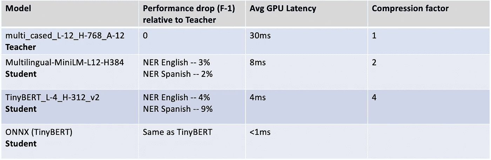

# 面向沃尔玛对话式人工智能助理的多语言 BERT 知识提炼

> 原文：<https://medium.com/walmartglobaltech/knowledge-distillation-of-multilingual-bert-for-walmarts-conversational-ai-assistant-98ca7c2c3835?source=collection_archive---------1----------------------->

Walmart’s askSam AI assistant

## 介绍

沃尔玛的对话式人工智能助手已经通过谷歌助手和 Siri 平台实现语音购物两年多了。我们为我们的[商店员工](https://corporate.walmart.com/newsroom/2020/07/29/helping-associates-succeed-at-work-while-elevating-customer-service-safety)扩展了人工智能助手，因为他们可以极大地受益于其自然语言理解(NLU)能力，并更好地为我们的客户服务。商店经理一直在使用该助手来获取产品在商店中的位置，检查不同商品的库存，查询各部门的最高销售额，甚至检查同事的日程安排。

我们的 askSam AI 助手的核心组件是 NLU 管道，这是一个强大的、最先进的机器学习模型的集合。意图分类和[命名实体识别](https://en.wikipedia.org/wiki/Named-entity_recognition) (NER)是至关重要的 NLU 任务，能够理解我们同事的意图，并从他们的文本和语音查询中提取相关实体。

Product Entity tagging in the Walmart askSam app

语音助手最近也被我们的国际商场员工所采用。我们必须扩展助理的 NLU 能力，以便能够理解美国和墨西哥讲西班牙语的同事并与之交谈。这导致了多语言零售语音助手的开发，使我们能够在更多国家如加拿大和智利扩展业务。下表总结了我们的助理常见的一些西班牙语语音查询及其对应的 NER 标签。

Walmart askSam voice queries and NER tags

我们的对话助手是一个对延迟极其敏感的应用程序。对我们来说，研究针对延迟和内存占用进行优化的深度学习模型架构非常重要，这样我们就可以高效地扩展和服务全球超过一百万个多语言查询。在这篇博客中，我们讨论了我们如何针对西班牙语和英语查询启用快速 NER，重点关注多语言 [BERT](https://blog.google/products/search/search-language-understanding-bert/) [知识提炼](https://en.wikipedia.org/wiki/Knowledge_distillation)。

大多数开源[多语言 transformer](https://arxiv.org/abs/1911.02116) 模型都是海量的，有超过 1.1 亿个参数，计算成本很高。缺少西班牙语标记的零售数据、沃尔玛墨西哥目录中大量未标记的数据、母语口音的多样性、部署基础设施的成本是我们在为多语言下游 NER 任务选择架构时考虑的几个因素。多语言 BERT 的知识提炼帮助我们提出了一个轻量级、超快速的生产友好版本，与大多数产品属性相关实体的教师模型相比，该版本保留了超过 97%的 F1 分数，并显示了大约 4 倍的推理加速和 2 倍的压缩。

## 微调多语言 BERT

我们最初根据我们的西班牙语和英语对话数据微调了 Google research 发布的预先训练好的[多语言 BERT](https://github.com/google-research/bert/blob/master/multilingual.md) 。对于西班牙语数据，我们准备了一个数据集，其中包含手动筛选的语音查询模板，反映了我们的员工在商店中的使用模式。使用墨西哥沃尔玛目录提供的沃尔玛产品和品牌、释义技术和语言翻译 API，我们能够生成大约一百万个英语和西班牙语标签样本。这被认为是我们多语言 NER 任务的基线实验。尽管这种模型架构对于实时日志中看不见的西班牙语查询表现得非常好，但我们看到，与为我们的英语 NLU 系统部署的生产提炼的 BERT 模型相比，模型延迟仍然非常高。

在研究了几种蒸馏技术和云产品后，我们发现由微软研究院[发表的研究报告 xtremediate](https://arxiv.org/pdf/2004.05686.pdf)在多语言 NER 任务的性能、模型压缩和加速方面显示了有希望的结果。通过与微软研究团队的密切合作，我们将多级蒸馏技术应用于大规模变压器模型，为我们的沃尔玛助理的西班牙 NLU 用例衍生出学生变压器模型。

## 变压器蒸馏架构

本文详述的蒸馏过程提供了选择以下配置的灵活性:

1.  教师模型的架构(姆伯特，XLM-罗伯塔等。)
2.  学生模型的架构(TinyBERT、miniLM、BiLSTM 等)。)
3.  分词器(BERT WordPiece tokenizer，SentencePiece tokenizer 等。)

我们对教师模型的 [mBERT](https://huggingface.co/bert-base-multilingual-cased) 和[XLM-罗伯塔](https://huggingface.co/transformers/model_doc/xlmroberta.html)以及学生模型的 [TinyBERT](https://arxiv.org/abs/1909.10351) 和 [miniLM](https://arxiv.org/abs/2002.10957) 进行了实验，以权衡蒸馏造成的性能损失和可允许的推理延迟增益。

教师的训练目标、深度网络的层数、注意头的数量、教师模型预先训练的数据、教师模型可以保持的上下文量、嵌入大小和其他超参数极大地影响了学生模型的提取目标。

## 标记化

我们用 mBERT 作为教师模型，用[单词块](https://www.tensorflow.org/tutorials/tensorflow_text/subwords_tokenizer#applying_wordpiece)分词器和 S [单词块](https://arxiv.org/pdf/1808.06226.pdf)分词器进行了实验。我们也用句子标记器评估了 XLM-罗伯塔。内部标准化也在零售特定标点符号化器之前执行，忽略特定语言的重音和大小写。

## 资料组

我们在 NER 的三个不同的内部标记的沃尔玛对话数据集上执行了我们的蒸馏实验，即购物的搜索细化、文本购物的多产品实体识别和 askSam 产品搜索用例。由于注释器可用性、零售数据的语言翻译 API 的不准确性以及首次启动我们的西班牙语理解助手等限制，标记的英语数据的百分比高于标记的西班牙语数据。我们的实体被广泛地分为特定于产品属性的实体，如产品、品牌，以及通用实体，如邮政编码、时间参考。我们还利用了沃尔玛墨西哥目录中扩展产品组合和当天交付商品的大量未标记数据，用于特定实体的产品。

## 蒸馏特征

领域特定的标记数据帮助教师模型适应零售领域 NER 任务。学生模型也被训练为使用标记数据最小化 c [罗斯熵](https://en.wikipedia.org/wiki/Cross_entropy)损失。未标记的数据用于通过优化以下约束使学生能够向老师学习。

1.最小化教师和学生的内部表征之间的 [KL](https://en.wikipedia.org/wiki/Kullback%E2%80%93Leibler_divergence) 差异——未标记数据上的表征损失。

2.通过比较学生相对于教师的分类分数来最小化 [MSE](https://en.wikipedia.org/wiki/Mean_squared_error) 损失——未标记数据的 MSE logit 损失。

3.利用教师的 mBERT 嵌入、非线性投影和嵌入上的 [SVD](https://en.wikipedia.org/wiki/Singular_value_decomposition) 来对齐教师和学生的输出空间。

上一节中讨论的损失函数在蒸馏过程中以逐步解冻的逐级方式进行了优化，以便某一级学习以前一级学习的参数为条件的参数。这样，我们利用标记和未标记的数据来最好地学习学生模型参数。

Distillation architecture

## 蒸馏实验结果

下表总结了对经过提炼的学生模型的性能和延迟测量。

*教师模型:Bert-base-multilingual-cased with word piece tokenizer*

*数据集:沃尔玛内部对话式人工智能数据集*

*学生型号:TinyBERT_L-4_H-312_v2 和多语种-MiniLM-L12-H384。*

Teacher, Student Model Metrics Comparison

## 学生模型性能

教师和学生模型是根据我们的实时日志中的一组看不见的查询进行评估的。我们看到，对于我们的大多数产品和通用实体，TinyBERT 学生的英语查询的性能下降平均不到 4%。对于西班牙语查询，我们注意到 TinyBERT 学生模型上的产品实体的性能下降了大约 9%。在 MiniLM 学生模型中，我们看到产品实体的 F1 分数仅下降了约 2%,而我们仍处于允许的延迟裕量范围内。我们看到西班牙语的通用实体的性能下降更多，这可能是由于数据集和我们的实时生产日志中对这些实体的低表示和支持。

## 学生模型延迟

TinyBERT 模型的 GPU (Tesla V100)推理延迟约为 4 毫秒，miniLM 模型约为 8 毫秒。通过生成一个 [ONNX](https://onnx.ai/) 运行时，我们能够进一步将延迟减少到 1 毫秒以下，而与经过提炼的学生模型相比，性能没有任何下降。

## 学生模型足迹

在内存占用方面，与最初的 12 层 mBERT 模型相比，我们能够使用 TinyBERT student 将模型的大小减少 4 倍，使用 miniLM student 将模型的大小减少 2 倍。

## 摘要

借助多语言 transformer 蒸馏流程和 miniLM 学生模型，我们能够将多语言伯特 NER 模型架构的推理延迟降低到几毫秒以内，同时保留超过 97%的 F1 分数。这也为我们的多语言下游 NER 任务的计算和部署基础设施带来了显著的成本优势，使我们能够扩展并服务于全球客户。

## 未来的工作

随着我们在更多地区的扩张，我们希望在我们的助手上启用更多语言。从蒸馏的角度来看，我们希望通过试验以下技术来弥补学生模型的性能下降:

1.  针对本地语言，试验任务特定的标记数据与未标记数据的比率。
2.  从更大的多语言模型和表现更好的教师模型中提取精华。
3.  改进了学生模型的初始化。
4.  调查特定语言的句子片断标记器。
5.  提取注意力。
6.  NER 联合分类任务和其他深度学习模型架构的自定义提取。

## 参考

 [## XtremeDistil:大规模多语言模型的多阶段提取

### 深度和大型预训练语言模型是各种自然语言处理任务的最新技术…

arxiv.org](https://arxiv.org/abs/2004.05686)  [## 蒸馏伯特，伯特的蒸馏版本:更小，更快，更便宜，更轻

### 随着大规模预训练模型的迁移学习在自然语言处理(NLP)中变得越来越普遍…

arxiv.org](https://arxiv.org/abs/1910.01108)  [## 提取神经网络中的知识

### 提高几乎任何机器学习算法的性能的一个非常简单的方法是训练许多不同的模型…

arxiv.org](https://arxiv.org/abs/1503.02531) 

## 承认

沃尔玛全球技术对话人工智能团队和[伊曼·米雷扎伊](https://medium.com/u/ce33163d1ee?source=post_page-----98ca7c2c3835--------------------------------)、[阿德里安·桑切斯](https://medium.com/u/42dcc11aa043?source=post_page-----98ca7c2c3835--------------------------------)和[西姆拉尔·乔德里](https://medium.com/u/4f942b6a9cd4?source=post_page-----98ca7c2c3835--------------------------------)在这项工作中帮助进行了多次实验。

[微软研究团队的 Subho Mukherjee](https://www.microsoft.com/en-us/research/people/submukhe/) 和 [Steven Shi](https://www.linkedin.com/in/yukaishi/) 分享大规模多语言模型提炼的经验和最佳实践。