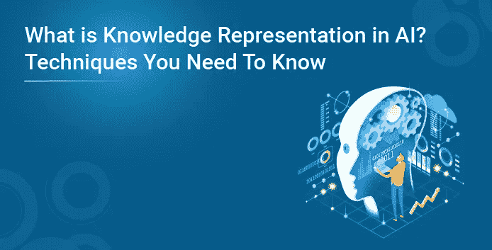
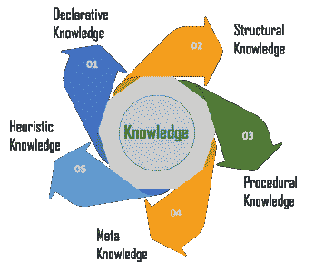
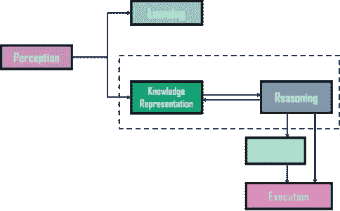
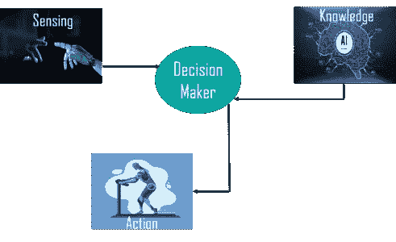
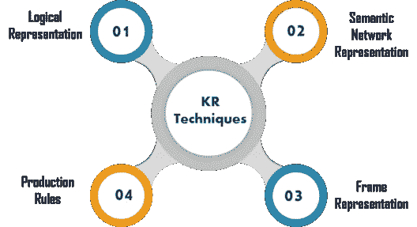
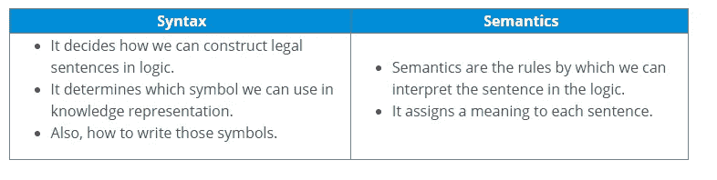
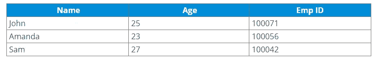
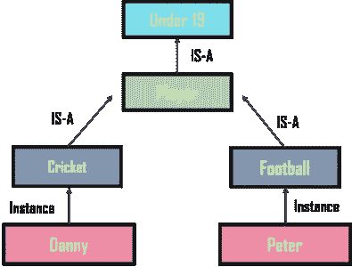

# AI 中的知识表示是什么？你需要知道的技巧

> 原文：<https://medium.com/edureka/knowledge-representation-in-ai-553b5eb3026a?source=collection_archive---------1----------------------->

人类善于理解、推理和解释知识。利用这些知识，他们能够在现实世界中执行各种动作。但是机器是如何做到同样的呢？在本文中，我们将学习人工智能中的知识表示，以及它如何帮助机器使用人工智能按照以下顺序执行推理和解释:

*   什么是知识表征？
*   不同类型的知识
*   知识表征的循环
*   知识和智力之间的关系是什么？
*   知识表示技术
*   代表要求
*   基于实例的知识表示方法

# 什么是知识表征？

**知识表示**在 AI 中描述了知识的表示。基本上，它是一门研究如何将**智能代理**的**信念、意图**和**判断**恰当地表达为自动推理的学科。知识表示的主要目的之一包括为代理人的智能行为建模。

知识表示和推理( **KR，KRR** )表示来自真实世界的信息，供计算机理解，然后利用这些知识解决**复杂的现实生活问题**比如用自然语言与人类交流。人工智能中的知识表示不仅仅是在数据库中存储数据，它允许机器从这些知识中学习，并像人类一样智能地行为。

需要在人工智能中表现的不同种类的知识包括:

*   **对象**
*   **事件**
*   **性能**
*   **事实**
*   **元知识**
*   **知识库**

现在你知道了人工智能中的知识表示，让我们继续了解不同类型的知识。

# 不同类型的知识

有 5 种类型的知识，例如:

*   **陈述性知识** —它包括概念、事实和对象，并用陈述句表达。
*   **结构知识** —是描述概念与对象关系的基本解题知识。
*   **程序知识**——负责知道如何做某事，包括规则、策略、程序等。
*   **元知识** —元知识定义了关于其他类型知识的知识。
*   **启发式知识** —这代表某个领域或主题中的一些专家知识。

这些是人工智能中知识表示的重要类型。现在，让我们来看看知识表示的循环以及它是如何工作的。

# 人工智能中知识表示的循环

人工智能系统通常由各种组件组成，以显示它们的智能行为。这些组件包括:

*   **感知**
*   **学习**
*   **知识表示&推理**
*   **策划**
*   **执行**

下面的示例展示了系统的不同组件及其工作原理:

## 例子

上图显示了一个人工智能系统与**真实世界**和**组件**的交互，这些组件涉及到显示智能。

*   **感知组件**从环境中检索数据或信息。在这个组件的帮助下，你可以从环境中检索数据，找出噪音的来源，并检查 AI 是否被任何东西损坏。此外，它还定义了当检测到任何感觉时如何响应。
*   然后是**学习组件**，它从感知组件捕获的数据中学习。目标是建造可以被教授的计算机，而不是给它们编程。学习重在自我提升的过程。为了学习新事物，系统需要知识获取、推理、启发式获取、更快的搜索等。
*   循环中的主要组成部分是**知识表示和推理**，它显示了机器中类似人类的智能。知识表示都是关于理解智能的。它的目标不是试图自下而上地理解或构建大脑，而是自上而下地理解和构建智能行为，并专注于智能体需要知道什么才能智能地行为。此外，它还定义了自动推理过程如何根据需要提供这些知识。
*   **计划和执行**组件依赖于对知识表示和推理的分析。在这里，规划包括给出一个初始状态，找到它们的前提条件和效果，以及一系列的行动，以达到一个特定目标的状态。现在，一旦计划完成，最后一个阶段就是整个过程的执行。

所以，这些是人工智能中知识表达周期的不同组成部分。现在，让我们来理解知识和智力的关系。

# 知识和智力之间的关系是什么？

在现实世界中，知识在智能中扮演着至关重要的角色，同时也创造了人工智能。它展示了**人工智能代理或系统**的智能行为。只有当代理或系统具有关于输入的知识或经验时，它才有可能对某些输入做出准确的动作。

让我们举个例子来理解这种关系:

在这个例子中，有一个**决策者**，他的行为通过感知环境和运用知识得到了证明。但是，如果我们在这里去掉知识部分，它将不能显示任何智能行为。

既然你知道了知识和智能之间的关系，让我们继续讨论人工智能中的知识表示技术。

# 人工智能中的知识表示技术

有四种表示知识的技术，例如:

现在，让我们详细讨论这些技术。

# 逻辑表示

逻辑表示是一种有一些**明确规则**的语言，处理命题，在表示上没有歧义。它代表了基于各种条件的结论，并制定了一些重要的**沟通规则**。此外，它由精确定义的语法和语义组成，支持合理的推理。每个句子都可以用语法和语义翻译成逻辑。

**Advantages:**

**优点**

*   逻辑表示有助于执行逻辑推理。
*   这种表示是编程语言的基础。

**缺点:**

*   逻辑表示有一些限制，很难使用。
*   这种技术可能不是很自然，推理可能不是很高效。

# 语义网络表示

语义网络作为知识表示的**谓词逻辑**的**替代**。在语义网络中，你可以用图形网络的形式来表示你的知识。这个网络由代表对象的节点和描述这些对象之间关系的弧线组成。此外，它以不同的形式对对象进行分类，并链接这些对象。

这种表示由两种类型关系组成:

*   **是——一种关系(继承)**
*   **一种关系**

**优点:**

*   语义网络是知识的自然表示。
*   此外，它以透明的方式传达意义。
*   这些网络简单易懂。

**缺点:**

*   语义网络在运行时需要更多的计算时间。
*   此外，这些是不够的，因为它们没有任何等价的量词。
*   这些网络不是智能的，并且依赖于系统的创建者。

.

# 框架表示

一个帧是一个类似于记录的结构，它由描述世界上一个实体的属性和值的 T2 集合组成。这些是人工智能数据结构，它通过表示原型情况将知识分成子结构。基本上，它由任意类型和大小的槽和槽值的集合组成。槽有名字和值，叫做刻面。

**优点:**

*   通过对相关数据进行分组，编程变得更加容易。
*   框架表示易于理解和可视化。
*   为新的属性和关系添加槽是非常容易的。
*   此外，包含默认数据和搜索缺失值也很容易。

**缺点:**

*   在框架系统推理中，该机制不容易处理。
*   框架表示不能顺利地进行推理机制。
*   它有一个非常通用的方法。

# 生产规则

在产生式规则中，代理检查**条件**，如果条件存在，则产生式规则触发，并执行相应的操作。规则的条件部分决定了哪个规则可以应用于某个问题。然而，行动部分执行相关的问题解决步骤。这个完整的过程被称为认知-行动循环。

产生式规则系统由三个主要部分组成:

*   **生产规则集**
*   **工作记忆**
*   **识别-行动-循环**

**优点:**

*   产生式规则用自然语言表达。
*   产生式规则是高度模块化的，可以很容易地删除或修改。

**缺点:**

*   它不显示任何学习能力，也不存储问题的结果以备将来使用。
*   在程序执行期间，许多规则可能是活动的。因此，基于规则的生产系统效率低下。

因此，这些是人工智能中知识表示的重要技术。现在，让我们看看对这些表示的要求。

# 代表要求

一个好的知识表示系统必须具有如下特性:

*   **具象准确性:**应该代表各种需要的知识。
*   **推理充分性**:应该能够操纵表征结构，产生与现有结构相对应的新知识。
*   **推理效率**:通过存储适当的指南，将推理知识机制引向最高效方向的能力。
*   获取效率:使用自动方法轻松获取新知识的能力。

现在，让我们看看人工智能中知识表示的一些方法以及不同的例子。

# 人工智能中的知识表示方法

知识表示有不同的方法，例如:

## 1.简单的关系知识

使用关系方法是**存储事实**的最简单方式。在这里，关于一组物体的所有事实都被系统地列了出来。此外，这种知识表示方法在 [**数据库**](https://www.edureka.co/blog/what-is-a-database/) **系统**中也很有名，其中不同实体之间的关系被表示。因此，几乎没有推断的机会。

**举例:**

这是一个表示简单关系知识的例子。

## 2.可继承的知识

在可继承知识方法中，所有数据都必须存储在类的**层次结构中，并且应该以通用形式或层次方式进行排列。此外，这种方法包含了表示实例和类之间关系的可继承知识，称为实例关系。在这种方法中，对象和值在装箱的节点中表示。**

**示例:**

## 3.推理知识

推理知识方法以**形式逻辑**的形式表示**知识**。因此，它可以用来推导更多的事实。而且，它保证了正确性。

**示例:**

陈述 1 :约翰是板球运动员。

**说法二**:所有板球运动员都是运动员。

那么可以表示为；

**板球运动员(约翰)**
**∀x =板球运动员(x)——>运动员(x)s**

这些是人工智能中知识表示的一些方法和例子。说到这里，我们的文章就到此为止了。我希望你明白什么是人工智能中的知识表示及其不同类型。

如果你想查看更多关于 Python、DevOps、Ethical Hacking 等市场最热门技术的文章，你可以参考 Edureka 的官方网站。

请留意本系列中解释数据科学各个方面的其他文章。

> *1。* [*数据科学教程*](/edureka/data-science-tutorial-484da1ff952b)
> 
> *2。* [*数据科学的数学与统计*](/edureka/math-and-statistics-for-data-science-1152e30cee73)
> 
> *3。*[*R 中线性回归*](/edureka/linear-regression-in-r-da3e42f16dd3)
> 
> *4。* [*机器学习算法*](/edureka/machine-learning-algorithms-29eea8b69a54)
> 
> *5。*[*R 中的逻辑回归*](/edureka/logistic-regression-in-r-2d08ac51cd4f)
> 
> *6。* [*分类算法*](/edureka/classification-algorithms-ba27044f28f1)
> 
> 7。 [*随机森林中 R*](/edureka/random-forest-classifier-92123fd2b5f9)
> 
> *8。* [*决策树中的 R*](/edureka/a-complete-guide-on-decision-tree-algorithm-3245e269ece)
> 
> *9。* [*机器学习入门*](/edureka/introduction-to-machine-learning-97973c43e776)
> 
> *10。* [*朴素贝叶斯在 R*](/edureka/naive-bayes-in-r-37ca73f3e85c)
> 
> *11。* [*统计与概率*](/edureka/statistics-and-probability-cf736d703703)
> 
> *12。* [*如何创建一个完美的决策树？*](/edureka/decision-trees-b00348e0ac89)
> 
> *13。* [*关于数据科学家角色的十大神话*](/edureka/data-scientists-myths-14acade1f6f7)
> 
> *14。* [*顶级数据科学项目*](/edureka/data-science-projects-b32f1328eed8)
> 
> *15。* [*数据分析师 vs 数据工程师 vs 数据科学家*](/edureka/data-analyst-vs-data-engineer-vs-data-scientist-27aacdcaffa5)
> 
> *16。* [*人工智能的种类*](/edureka/types-of-artificial-intelligence-4c40a35f784)
> 
> *17。*[*R vs Python*](/edureka/r-vs-python-48eb86b7b40f)
> 
> *18。* [*人工智能 vs 机器学习 vs 深度学习*](/edureka/ai-vs-machine-learning-vs-deep-learning-1725e8b30b2e)
> 
> *19。* [*机器学习项目*](/edureka/machine-learning-projects-cb0130d0606f)
> 
> *20。* [*数据分析师面试问答*](/edureka/data-analyst-interview-questions-867756f37e3d)
> 
> *21。* [*面向非程序员的数据科学和机器学习工具*](/edureka/data-science-and-machine-learning-for-non-programmers-c9366f4ac3fb)
> 
> 22。 [*十大机器学习框架*](/edureka/top-10-machine-learning-frameworks-72459e902ebb)
> 
> *23。* [*用于机器学习的统计*](/edureka/statistics-for-machine-learning-c8bc158bb3c8)
> 
> *24。* [*随机森林中的 R*](/edureka/random-forest-classifier-92123fd2b5f9)
> 
> 25。 [*广度优先搜索算法*](/edureka/breadth-first-search-algorithm-17d2c72f0eaa)
> 
> *二十六。*[*R 中的线性判别分析*](/edureka/linear-discriminant-analysis-88fa8ad59d0f)
> 
> 27。 [*机器学习的先决条件*](/edureka/prerequisites-for-machine-learning-68430f467427)
> 
> *28。* [*互动 WebApps 使用 R 闪亮*](/edureka/r-shiny-tutorial-47b050927bd2)
> 
> *29。* [*机器学习十大书籍*](/edureka/top-10-machine-learning-books-541f011d824e)
> 
> 30。 [*监督学习*](/edureka/supervised-learning-5a72987484d0)
> 
> *31。* [*10 本数据科学最佳书籍*](/edureka/10-best-books-data-science-9161f8e82aca)
> 
> *32。* [*机器学习使用 R*](/edureka/machine-learning-with-r-c7d3edf1f7b)

*原载于 2019 年 12 月 18 日*[*https://www.edureka.co*](https://www.edureka.co/blog/knowledge-representation-in-ai/)*。*