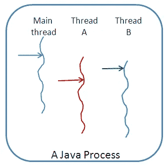

# Konsep AsyncTask dan AsyncTaskLoader pada Android

> 原文：<https://medium.easyread.co/konsep-asynctask-dan-asynctaskloader-pada-android-b5ba2744dcdb?source=collection_archive---------0----------------------->


*Hello Coders!* Pada kesempatan yang bagus disela-sela waktu pekerjaan saya, saya mau membagi kepada kalian tentang *AsyncTask* dan *AsyncTaskLoader* pada Android.

Ada dua cara untuk melakukan pemrosesan latar belakang Android yaitu menggunakan kelas *AsyncTask* atau menggunakan kerangka kerja *Loader* yang menyertakan kelas *AsyncTaskLoader* yang menggunakan *AsyncTask* . Di sebagian besar situasi anda akan lebih memilih kerangka kerja *Loader* namun penting juga untuk mengetahui cara kerja *AsyncTask* sehingga anda bisa membuat pilihan yang bagus ketika mengerjakan proyek anda.

# Thread UI

*Thread* adalah sekumpulan perintah (instruksi) yang dapat dilaksanakan (eksekusi) secara bersamaan dengan t *hread* lainnya. Hal ini dicapai dengan menggunakan mekanisme *Time Slice (* ketika satu *CPU/Central Processing Unit* melakukan perpindahan antara satu t *hread* ke t *hread* lainnya) atau mekanisme *multiprocess* (ketika t *hread-thread* tersebut dilaksanakan oleh *CPU/Central Processing Unit* yang berbeda dalam satu sistem.

Berikut adalah gambaran kerja *Thread* :



*Thread A* dan *Thread B* masih tetap berjalan bersamaan dengan *Main Thread* .

Bila aplikasi Android dimulai, aplikasi membuat *Thread UI* atau *Main Thread* atau biasa disebut *Thread Utama. Thread UI* akan mengirimkan kejadian ke *widget* antarmuka pengguna ( *user interface* ) yang sesuai dan ini merupakan tempat aplikasi anda berinteraksi dengan komponen dari *Toolkit UI* Android (komponen dari paket *android.widget* dan *android.view* ).

## *Thread* pada Android mempunyai dua aturan yaitu :

*   Jangan memblokir *Thread UI*

*Thread UI* perlu memusatkan perhatiannya untuk menyusun *UI* dan menjaga aplikasi untuk tetap responsif terhadap masukan pengguna. Jika semuanya terjadi di *Thread UI* , operasi panjang seperti akses jaringan atau *query* *database/* basis data bisa memblokir seluruh *UI* atau tampilan aplikasi. Dari perspektif pengguna, aplikasi tersebut akan berhenti. Lebih buruk lagi jika *Thread UI* diblokir selama lebih dari beberapa detik (saat ini sekitaran 5 detik) pengguna akan ditampilkan dialog “ *Application Not Responding* ” atau disingkat ANR maka kemungkinan besar pengguna bisa keluar dari aplikasi dan mencopot pemasangan aplikasi atau disebut *Uninstall* .

*   Lakukan pekerjaan *UI* hanya pada *Thread* *UI*

Jangan menggunakan *Thread* latar belakang untuk memanipulasi tampilan aplikasi anda, karena *Toolkit UI* Android bukan *Thread-safe* .

# AsyncTask

Gunakan kelas *AsyncTask* untuk mengimplementasikan tugas asinkron yang berjalan lama di *Worker Thread/Thread Pekerja* . *Worker Thread* adalah *Thread* yang bukan *Thread UI/Main Thread* . *AsyncTask* memungkinkan anda menjalankan operasi latar belakang dan mempublikasikan hasil di *Thread UI* tanpa memanipulasi *thread* .

Bila *AsyncTask* dieksekusi, maka akan melalui empat langkah :

1.  *onPreExecute()* , dipanggil di *Thread UI* sebelum tugas di eksekusi. Langkah ini biasanya digunakan untuk mempersiapkan tugas misalnya dengan menampilkan bilah kemajuan di *UI* .
2.  *doInBackground(Params…)* , dipanggil pada *Background Thread* setelah *onPreExecute()* selesai dijalankan. Langkah ini menjalankan komputasi latar belakang, mengembalikan hasil dan meneruskan hasilnya ke *onPostExecute()* . Metode *doInBackground()* juga bisa memanggil *publishProgress(Progress…)* untuk mempublikasikan satu atau beberapa unit kemajuan.
3.  *onProgressUpdate(Progress…)* , berjalan di *Thread UI* setelah *publishProgress(Progress…)* dipanggil *.* Gunakan *onProgressUpdate()* untuk melaporkan suatu bentuk kemajuan ke *Thread UI* sewaktu komputasi latar belakang dieksekusi. Misalnya, anda bisa menggunakannya untuk meneruskan data guna menganimasikan bilah kemajuan atau menampilkan *log* di bidang teks.
4.  *onPostExecute(Result)* , berjalan di *Thread UI* setelah komputasi latar belakang selesai.

Untuk selengkapnya bisa dilihat di artikel ini [AsyncTask](https://developer.android.com/reference/android/os/AsyncTask.html) .

# Menggunakan AsyncTask

Untuk menggunakan kelas *AsyncTask* , definisikan subkelas *AsyncTask* yang menggantikan metode *doInBackground(Params…)* dan biasanya juga metode *onPostExecute(Result)* . Bagian ini menjelaskan parameter dan penggunaan *AsyncTask* .

# Parameter AsyncTask

Di subkelas *AsyncTask* , sediakan tipe data untuk tiga jenis parameter.

*   “ *Params* ” menetapkan tipe parameter yang diteruskan ke *doInBackground()* sebagai larik.
*   “ *Progress* ” menetapkan tipe parameter yang diteruskan ke *publishProgress()* di *Thread latar belakang/Background Thread* . Parameter ini selanjutnya diteruskan ke metode *onProgressUpdate()* di *Thread Utama/Main Thread* .
*   “ *Result* ” menetapkan tipe parameter yang dikembalikan *doInBackground()* . Parameter ini secara otomatis diteruskan ke *onPostExecute()* di *Thread Utama/Main Thread* .

Tetapkan tipe data untuk setiap tipe parameter ini, atau gunakan kata *Void* jika tipe parameter tidak akan digunakan. Misalnya :

```
**public class** MyAsyncTask **extends** AsyncTask<String, Void, Bitmap>{}
```

Dalam deklarasi kelas ini :

*   Tipe parameter “ *Params* ” adalah *String* , yang berarti bahwa *MyAsyncTask* memerlukan satu atau beberapa string sebagai parameter di *doInBackground()* , misalnya untuk digunakan di kueri.
*   Tipe parameter “ *Progress* ” adalah *Void* , yang berarti bahwa *MyAsyncTask* tidak akan menggunakan metode *publishProgress()* atau *onProgressUpdate()* .
*   Tipe parameter “ *Result* ” adalah *Bitmap* . *MyAsyncTask* mengembalikan Bitmap di *doInbackground()* , yang diteruskan ke dalam *onPostExecute()* .

# Contoh AsyncTask

```
**private class** DownloadFilesTask **extends** AsyncTask<URL, Integer, Long> {
    **protected** Long doInBackground(URL... urls) {
        **int** count = urls.**length**;
        **long** totalSize = 0;
        **for** (**int** i = 0; i < count; i++) {
            totalSize += Downloader.downloadFile(urls[i]);
            publishProgress((**int**) ((i / (**float**) count) * 100));
*// Escape early if cancel() is called* **if** (isCancelled()) **break**;
        }
        **return** totalSize;
    }
    **protected void** onProgressUpdate(Integer... progress) {
        setProgressPercent(progress[0]);
    }
    **protected void** onPostExecute(Long result) {
        showDialog(**"Downloaded "** + result + **" bytes"**);
    }
}
```

Contoh kode diatas berikut penjelasannya :

*   *doInBackground()* mengunduh materi, tugas yang berjalan lama. Langkah ini menghitung persentase file yang di unduh dari indeks loop *for* dan meneruskannya ke *publishProgress()* . Pemeriksaan untuk *isCancelled()* di dalam loop *for* memastikan bahwa tugas telah dibatalkan, sistem tidak menunggu hingga loop selesai.
*   *onProgressUpdate()* memperbarui kemajuan persentase. Ini dipanggil setiap kali metode *publishProgress()* dipanggil di dalam *doInBackground()* , yang memperbarui kemajuan persentase.
*   *doInBackground()* menghitung jumlah total *byte* yang diunduh dan mengembalikannya. *onPostExecute()* menerima hasil yang dikembalikan dan meneruskannya ke dalam *onPostExecute()* , yang ditampilkan di dialog.

Tiga parameter yang digunakan pada contoh kode di atas yaitu :

*   *URL* untuk tipe parameter “ *Params* ”. Tipe *URL* berarti anda bisa meneruskan sejumlah *URL* ke dalam panggilan, dan *URL* secara otomatis diteruskan ke dalam metode *doInBackground()* sebagai larik.
*   *Integer* untuk tipe parameter “ *Progress* ”.
*   *Long* untuk tipe parameter “ *Result* ”.

Contoh kode diatas menggunakan tiga metode ( *doInBackground()* , *onProgressUpdate()* , *onPostExecute()* ) dari empat metode yang sudah kita bahas sebelumnya.

# Mengeksekusi AsyncTask

Setelah anda mendefinisikan subkelas *AsyncTask* , buat *instance* -nya di *Thread UI* / *Main Thread* . Kemudian panggil *execute()* di *instance* , dengan meneruskan sejumlah parameter. (Parameter tersebut sesuai dengan tipe parameter “ *Params* ” yang telah dibahas di atas).

Misalnya, untuk mengeksekusi tugas *DownloadFilesTask* yang didefinisikan di atas, gunakan baris kode berikut:

```
**new** DownloadFilesTask().execute(url1, url2, url3);
```

# Membatalkan AsyncTask

Anda bisa membatalkan tugas kapan saja, dari *Thread* apa pun, dengan memanggil metode *cancel()* .

*   Metode *cancel()* akan mengembalikan nilai *false* jika tugas tidak bisa dibatalkan, biasanya karena sudah diselesaikan secara normal. Jika tidak, *cancel()* akan mengembalikan nilai *true* .
*   Untuk mengetahui apakah tugas sudah dibatalkan, periksa nilai yang dikembalikan *isCancelled()* secara berkala dari *doInBackground(Object[])* , misalnya dari dalam loop seperti yang ditampilkan dalam contoh kode di atas. Metode *isCancelled()* akan mengembalikan *true* jika tugas dibatalkan sebelum diselesaikan secara normal.
*   Setelah tugas *AsyncTask* dibatalkan, *onPostExecute()* tidak akan digunakan setelah *doInBackground()* dikembalikan. Sebagai gantinya, *onCancelled(Object)* akan dipanggil. Implementasi default *onCancelled(Object)* cukup memanggil *onCancelled()* dan mengabaikan hasil.
*   Secara default, tugas yang sedang diproses boleh diselesaikan. Untuk memperbolehkan *cancel()* menyela *Thread* yang sedang mengeksekusi tugas, teruskan *true* untuk nilai *mayInterruptIfRunning* .

# Keterbatasan AsyncTask

*AsyncTask* tidak praktis untuk beberapa kasus penggunaan :

*   Perubahan pada konfigurasi perangkat menyebabkan masalah

Bila konfigurasi perangkat berubah sewaktu *AsyncTask* berjalan, misalnya jika pengguna mengubah orientasi layar, aktivitas yang membuat *AsyncTask* akan dimusnahkan dan dibuat ulang. Metode *AsyncTask* tidak dapat mengakses aktivitas yang baru saja dibuat dan hasil *AsyncTask* tidak akan dipublikasikan.

*   Objek *AsyncTask* lama tetap ada, dan aplikasi Anda bisa kehabisan memori atau mogok

Jika aktivitas yang membuat *AsyncTask* dimusnahkan, *AsyncTask* tidak akan dimusnahkan bersamanya. Misalnya, jika pengguna keluar dari aplikasi setelah *AsyncTask* dimulai, *AsyncTask* akan terus menggunakan sumber daya kecuali jika Anda memanggil *cancel()* .

Bila menggunakan *AsyncTask* :

*   Tugas singkat atau yang bisa disela.
*   Tugas yang tidak perlu untuk melaporkan kembali ke UI atau pengguna.
*   Tugas dengan prioritas rendah yang bisa ditinggalkan sebelum proses selesai.

Untuk semua situasi lainnya, gunakan *AsyncTaskLoader* . *AsyncTaskLoader* adalah bagian dari kerangka kerja *Loader* yang akan kita bahas di bawah ini.

# Loader

Gunakan kelas *LoaderManager* untuk mengelola satu atau beberapa *instance Loader* dalam *activity* atau *fragment* . Gunakan *initLoader()* untuk melakukan inisialisasi dan mengaktifkannya. Biasanya, anda melakukan ini dalam metode *onCreate()* dalam *activity* .

```
*// Prepare the loader. Either reconnect with an existing one,
// or start a new one.* getLoaderManager().initLoader(0, **null**, **this**);
```

Jika anda menggunakan [*Library*](https://developer.android.com/topic/libraries/support-library/index.html) , buat panggilan ini menggunakan *getSupportLoaderManager()* sebagai ganti *getLoaderManager()* . Misalnya :

```
getSupportLoaderManager().initLoader(0, **null**, **this**);
```

Metode initLoader() memerlukan tiga parameter, yaitu :

*   ID unik yang mengidentifikasi loader. ID ini bisa berupa apa saja yang anda inginkan.
*   Argumen opsional yang disediakan ke loader saat pembuatan, dalam bentuk *Bundle* . Jika loader sudah ada, parameter ini akan diabaikan.
*   Implementasi *LoaderCallbacks* , yang dipanggil oleh *LoaderManager* untuk melaporkan kejadian loader. Dalam contoh ini, kelas lokal mengimplementasikan antarmuka *LoaderManager.LoaderCallbacks* , sehingga meneruskan referensi ke dirinya sendiri, yaitu *this* .

Panggilan initLoader() memiliki dua kemungkinan hasil :

*   Jika loader yang ditetapkan melalui ID sudah ada, maka loader yang dibuat terakhir menggunakan ID itu akan digunakan kembali.
*   Jika loader yang ditetapkan melalui ID tidak ada, *initLoader()* akan memicu metode *onCreateLoader()* . Di sinilah anda mengimplementasikan kode untuk membuat *instance* dan mengembalikan loader baru.

**Note:** Bila *initLoader()* membuat loader atau menggunakan kembali loader yang ada, implementasi *LoaderCallbacks* yang diberikan akan dikaitkan dengan loader dan dipanggil bila keadaan loader berubah. Jika loader yang diminta sudah ada dan sudah menghasilkan data, maka sistem segera memanggil *onLoadFinished()* (selama *initLoader()* ), jadi bersiaplah jika hal ini terjadi.

Masukan panggilan ke *initLoader()* di *onCreate()* sehingga aktivitas bisa dihubungkan kembali ke loader yang sama bila konfigurasi berubah. Dengan cara itu, loader tidak kehilangan data yang sudah dimuatnya.

# Memulai Ulang Loader

Bila *initLoader()* menggunakan kembali loader yang ada, maka data yang telah dimuat loader tidak akan diganti, namun kadang-kadang Anda perlu menggantinya. Misalnya, bila Anda menggunakan kueri pengguna untuk melakukan penelusuran dan pengguna memasukkan kueri baru, Anda perlu memuat ulang data dengan menggunakan istilah penelusuran baru. Dalam situasi ini, gunakan metode *restartLoader()* dan teruskan ID loader yang ingin dimulai ulang. Hal ini akan memaksa muatan data lain dengan data masukan baru.

Tentang metode *restartLoader()* :

*   *restartLoader()* menggunakan argumen yang sama dengan *initLoader()* .
*   *restartLoader()* akan memicu metode *onCreateLoader()* , seperti yang dilakukan *initLoader()* saat membuat loader baru.
*   Jika sudah ada loader dengan ID yang diberikan, *restartLoader()* akan memulai ulang loader yang diidentifikasi dan mengganti datanya.
*   Jika tidak ada loader dengan ID yang diberikan, *restartLoader()* akan memulai loader baru.

# Callback LoaderManager

Objek *LoaderManager* secara otomatis memanggil *onStartLoading()* saat membuat loader. Setelah itu, *LoaderManager* akan mengelola keadaan loader berdasarkan pada keadaan aktivitas dan data, misalnya dengan memanggil *onLoadFinished()* bila data telah dimuat.

Untuk berinteraksi dengan loader, gunakan salah satu callback *LoaderManager* di aktivitas yang memerlukan data :

*   Panggil *onCreateLoader()* agar bisa membuat *instance* dan mengembalikan loader baru untuk ID yang diberikan.
*   Panggil *onLoadFinished()* bila loader yang dibuat sebelumnya selesai memuat. Di sinilah anda biasanya ingin memindahkan data ke dalam tampilan aktivitas.
*   Panggil *onLoaderReset()* bila loader yang dibuat sebelumnya sedang disetel ulang, sehingga datanya tidak tersedia. Di sinilah aplikasi harus membuang semua referensi apa pun yang dimilikinya ke data loader.

Subkelas *Loader* bertanggung jawab atas pemuatan data sebenarnya. Subkelas *Loader* yang anda gunakan bergantung pada tipe data yang dimuat, namun salah satu yang paling mudah adalah *AsyncTaskLoader* , yang akan kita bahas berikutnya. *AsyncTaskLoader* menggunakan *AsyncTask* untuk menjalankan tugas pada *Thread Pekerja* / *Worker Thread* / *Background Process* .

# AsyncTaskLoader

*AsyncTaskLoader* adalah loader yang setara dengan *AsyncTask* . *AsyncTaskLoader* menyediakan metode, *loadInBackground()* yang dijalankan di *Thread* terpisah. Hasil *loadInBackground()* secara otomatis dikirimkan ke *Thread UI* / *Main Thread* , melalui *onLoadFinished()* *LoaderManager callback* .

# Menggunakan AsyncTaskLoader

Untuk mendefinisikan subkelas *AsyncTaskLoader* , buat kelas yang memperluas *AsyncTaskLoader < D >* , dalam hal ini *D* adalah tipe data yang sedang anda muat. Misalnya, *AsyncTaskLoader* ini akan memuat daftar string :

```
**public static class** StringListLoader **extends** AsyncTaskLoader<List<String>> {}
```

Berikutnya, implementasikan konstruktor yang cocok dengan implementasi super kelas :

*   Konstruktor menggunakan konteks aplikasi sebagai argumen dan meneruskannya ke panggilan untuk super().
*   Jika loader Anda memerlukan informasi tambahan untuk melakukan pemuatan, konstruktor bisa mengambil argumen tambahan. Dalam contoh yang ditampilkan di bawah ini, konstruktor menggunakan sebuah istilah kueri.

```
**public** StringListLoader(Context context, String queryString) {
    **super**(context);
    mQueryString = queryString;
}
```

Untuk melakukan pemuatan, gunakan metode penggantian *loadInBackground()* , akibat metode *doInBackground()* dari *AsyncTask* . Misalnya :

```
@Override
**public** List<String> loadInBackground() {
    List<String> data = **new** ArrayList<String>;
    *//****TODO: Load the data from the network or from a database* return** data;
}
```

# Menginplementasikan Callback

Gunakan konstruktor di callback *onCreateLoader()* *LoaderManager* , yang merupakan tempat membuat loader baru. Misalnya, callback *onCreateLoader()* ini menggunakan konstruktor *StringListLoader* yang didefinisikan di atas :

```
@Override
**public** Loader<List<String>> onCreateLoader(**int** id, Bundle args) {
    **return new** StringListLoader(**this**, args.getString(**"queryString"**));
}
```

Hasil *loadInBackground()* secara otomatis diteruskan ke dalam callback *onLoadFinished()* , di sinilah anda bisa menampilkan hasil di *UI* . Misalnya :

```
**public void** onLoadFinished(Loader<List<String>> loader, List<String> data) {
    mAdapter.setData(data);
}
```

Callback *onLoaderReset()* hanya dipanggil bila loader akan dimusnahkan, sehingga seringkali anda bisa mengosongkan *onLoaderReset()* , karena anda tidak akan mencoba mengakses data setelah loader ini dimusnahkan.

Bila anda menggunakan *AsyncTaskLoader* , data anda akan bertahan bila ada perubahan konfigurasi perangkat. Jika aktivitas anda dmusnahkan secara permanen, loader ini akan dimusnahkan bersamanya, tanpa tugas yang menanti dan mengonsumsi sumber daya sistem.

Loader juga memiliki manfaat lain, misalnya loader bisa memantau perubahan sumber data dan memuat ulang data jika terjadi perubahan.

*   [Referensi AsyncTask](https://developer.android.com/reference/android/os/AsyncTask.html)
*   [Referensi AsyncTaskLoader](https://developer.android.com/reference/android/content/AsyncTaskLoader.html)
*   [Referensi LoaderManager](https://developer.android.com/reference/android/app/LoaderManager.html)
*   [Proses dan Thread](https://developer.android.com/guide/components/processes-and-threads.html)
*   [Panduan loader](https://developer.android.com/guide/components/loaders.html)

Sekian dari saya, apabila dalam penulisan terdapat salah-salah kata, mohon di maafkan :). Terima kasih.

*Salam Coders!*

*Artikel ini di tulis oleh* [*Mahesa Iqbal Ridwansyah*](https://medium.com/u/423a2702de9a?source=post_page-----b5ba2744dcdb--------------------------------) *beliau sering menulis artikel mengenai Software Engineering dan Programming. Follow profilnya untuk mendapatkan update-an terbaru artikel-artikel beliau.*

*Jika anda merasa artikel ini menarik dan bermanfaat, bagikan ke lingkaran pertemanan anda, agar mereka dapat membaca artikel ini.*