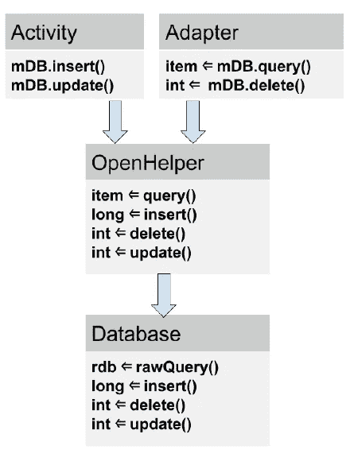
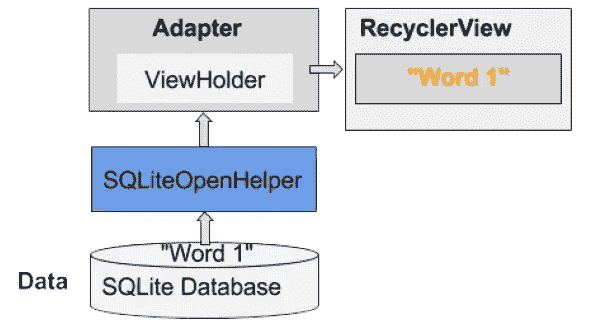

# Konsep Dasar Database SQLite pada Android

> 原文：<https://medium.easyread.co/konsep-dasar-database-sqlite-pada-android-e9445558f494?source=collection_archive---------0----------------------->


***Hello Coders!*** Udah sekian lama nih saya *gak* nulis lagi, maklum kerjaan semakin hari semakin menumpuk dan harus diprioritaskan hehe.

*Nah* , untuk sekarang, saya sudah memiliki waktu untuk berbagi pengetahuan lagi bagi para pembaca yang antusias dengan teknologi pengembangan Android. Salah satunya mengenai konsep dasar database SQLite pada Android.

Banyak opsi media penyimpanan yang bisa kita pakai untuk menyimpan data ke dalam aplikasi Android, menggunakan database SQLite adalah salah satu opsi yang paling serbaguna dan praktis untuk kita implementasikan.

Database [**SQLite**](https://developer.android.com/reference/android/database/sqlite/SQLiteDatabase) adalah solusi penyimpanan yang baik jika anda memiliki data terstruktur yang perlu diakses dan disimpan secara persisten serta sering ditelusuri dan diubah. Anda juga bisa menggunakan SQLite sebagai media penyimpanan utama untuk data aplikasi atau pengguna, atau anda juga bisa menggunakannya untuk proses *caching* serta menyediakan data yang diambil dari *cloud* .

Jika anda bisa menyatakan data berupa baris dan kolom, pertimbangkan untuk memakai database SQLite. Jika anda menggunakan database SQLite, yang dinyatakan sebagai objek [**SQLiteDatabase**](https://developer.android.com/reference/android/database/sqlite/SQLiteDatabase) adalah semua interaksi dengan database adalah melalui *instance* dari kelas [**SQLiteOpenHelper**](https://developer.android.com/reference/android/database/sqlite/SQLiteOpenHelper) yang akan mengeksekusi permintaan dan pengelolaan database. Aplikasi anda hanya boleh berinteraksi dengan SQLiteOpenHelper, yang akan kita bahas bersama-sama dibawah ini.

Ada dua tipe data yang dikaitkan secara khusus dengan penggunaan database SQLite, yaitu [**Cursor**](https://developer.android.com/reference/android/database/Cursor) dan [**ContentValues**](https://developer.android.com/reference/android/content/ContentValues) .

# Cursor

SQLiteDatabase selalu menyajikan hasil berupa Cursor dalam format tabel yang menyerupai database SQL. Anda bisa menganggap data sebagai larik baris dan cursor adalah pointer ke dalam satu baris data terstruktur. Kelas Cursor menyediakan metode untuk menggerakan cursor melalui struktur data, dan metode untuk mendapatkan data dari bidang-bidang setiap baris.

Kelas Cursor memiliki sejumlah subkelas yang mengimplementasikan cursor untuk tipe data tertentu, yaitu:

*   [**SQLiteCursor**](https://developer.android.com/reference/android/database/sqlite/SQLiteCursor) untuk mengekspos hasil *query* dari sebuah SQLiteDatabase. SQLiteCursor tidak disinkronkan secara internal, sehingga kode yang menggunakan SQLiteCursor dari beberapa *thread* harus melakukan sinkronisasi sendiri saat menggunakan SQLiteCursor.
*   [**MatrixCursor**](https://developer.android.com/reference/android/database/MatrixCursor) adalah implementasi cursor lengkap dan tidak tetap, yang didukung oleh larik objek yang secara otomatis meluaskan kapasitas internal bila diperlukan.

Beberapa operasi umum yang ada pada cursor adalah :

*   [**getCount()**](https://developer.android.com/reference/android/database/AbstractCursor#getCount()) , mengembalikan jumlah baris dalam cursor.
*   [**getColumnNames()**](https://developer.android.com/reference/android/database/AbstractCursor#getColumnNames()) , mengembalikan larik string yang berisi nama semua kolom dalam rangkaian hasil dalam urutan pencantumannya dalam hasil/result.
*   [**getPosition()**](https://developer.android.com/reference/android/database/AbstractCursor#getPosition()) , mengembalikan posisi cursor saat ini dalam rangkaian baris.
*   **Getter** tersedia untuk tipe data tertentu, seperti [**getString(int column)**](https://developer.android.com/reference/android/database/AbstractCursor#getString(int)) dan [**getInt(int column)**](https://developer.android.com/reference/android/database/AbstractCursor#getInt(int)) .
*   Operasi seperti [**moveToFirst()**](https://developer.android.com/reference/android/database/AbstractCursor#moveToFirst()) dan [**moveToNext()**](https://developer.android.com/reference/android/database/AbstractCursor#moveToNext()) akan menggerakan cursor.
*   [**close()**](https://developer.android.com/reference/android/database/AbstractCursor#close()) , membebaskan semua sumber daya dan membuat cursor menjadi tidak valid. Ingat, untuk menutup panggilan, guna membebaskan sumber daya!

## Memproses Cursor

Jika panggilan metode mengembalikan ulangi pada hasil, ekstrak data, lakukan sesuatu dengan data, dan terakhir harus menutup cursor untuk membebaskan memori. Jika tidak dilakukan, maka aplikasi anda bisa saja terhenti saat kehabisan memori.

Cursor dimulai sebelum baris hasil pertama, sehingga pada pengulangan pertama gerakkan *cursor* ke hasil pertama jika ada. Jika cursor kosong, atau baris terakhir sudah diproses, maka akan keluar dari *loop* (perulangan). Jangan lupa untuk menutup cursor bila anda telah selesai menggunakannya. (Ini tidak boleh diulang terlalu sering)

```
// Perform a query and store the result in a Cursor
Cursor cursor = db.rawQuery(...);
try {
   while (cursor.moveToNext()) {
   // Do something with the data
   }
} finally {
   cursor.close();
}
```

Jika menggunakan database SQL, anda bisa mengimplementasikan kelas SQLiteOpenHelper untuk mengembalikan cursor ke aktivitas pemanggil atau adapter, atau anda bisa mengonversi data ke format yang lebih cocok untuk adapter. Manfaat dari yang terakhir itu adalah pengelolaan cursor (dan penutupannya) ditangani oleh helper terbuka, dan antarmuka pengguna anda tidak tergantung pada apa yang terjadi di *backend* .

# ContentValues

Serupa dengan cara ekstra menyimpan data, instance ContentValues menyimpan data sebagai pasangan nilai kunci, dalam ini kuncinya adalah nama kolom dan nilainya untuk *cell* . Satu instance ContentValues menyatakan satu baris tabel.

Metode **insert()** untuk database memerlukan nilai untuk mengisi baris yang diteruskan sebagai instance ContentValues.

```
ContentValues values = new ContentValues();
// Insert one row. Use a loop to insert multiple rows.
values.put(KEY_WORD, "Android");
values.put(KEY_DEFINITION, "Mobile operating system.");
db.insert(WORD_LIST_TABLE, null, values);
```

## Mengimplementasikan Database SQLite

Untuk mengimplementasikan SQLite, anda perlu melakukan ini :

1.  Buat model data.
2.  Jadikan SQLiteOpenHelper sebagai subkelas

*   Gunakan konstanta untuk nama tabel dan query pembuatan database.
*   Implementasikan **onCreate()** untuk membuat SQLiteDatabase bersama tabel untuk data anda.
*   Implementasikan **onUpgrade()** .
*   Implementasikan metode **opsional** .

3\. Implementasikan metode **query(), insert(), delete(), update(), count()** dalam SQLiteOpenHelper.

4\. Dalam MainActivity anda, buat *instance* SQLiteOpenHelper.

5\. Panggil metode SQLiteOpenHelper untuk digunakan bersama database anda.

*Objection* :

*   Bila anda mengimplementasikan metode, selalu masukan operasi database ke dalam blok *try/catch* .
*   Aplikasi contoh tidak memvalidasi data pengguna. Bila anda menulis aplikasi untuk dipublikasikan, selalu pastikan data pengguna sesuai harapan untuk menghindari penyuntikan data buruk atau eksekusi perintah SQL yang berbahaya ke dalam database Anda.

## Pembuatan Model Data

Praktik yang baik adalah dengan membuat kelas yang menyatakan data Anda dengan *getter* dan *setter* . Untuk database SQLite, *instance* kelas ini dapat menyatakan satu catatan, dan untuk database sederhana, satu baris dalam tabel.

```
public class WordItem {
   private int mId;
   private String mWord;
   private String mDefinition; // Getters and setters and more
}
```

## Jadikan SQLiteOpenHelper sebagai subkelas

Open helper apa pun yang Anda buat harus meng- *extends* *SQLiteOpenHelper* .

```
public class WordListOpenHelper extends SQLiteOpenHelper {
   public WordListOpenHelper(Context context) {
      super(context, DATABASE_NAME, null, DATABASE_VERSION);
      Log.d(TAG, "Construct WordListOpenHelper");
   }
}
```

## Definisikan konstanta untuk nama tabel

Walaupun tidak diwajibkan, biasakan untuk mendeklarasikan nama tabel, kolom, dan baris sebagai konstanta. Hal ini akan membuat kode lebih terbaca, lebih mudah saat mengubah nama, dan *query* akan terlihat lebih mirip dengan SQL. Anda bisa melakukannya dalam kelas open helper, atau dalam kelas publik tersendiri.

```
private static final int DATABASE_VERSION = 1;
// has to be 1 first time or app will crash
private static final String WORD_LIST_TABLE = "word_entries";
private static final String DATABASE_NAME = "wordlist";// Column names...
public static final String KEY_ID = "_id";
public static final String KEY_WORD = "word";// ... and a string array of columns.
private static final String[] COLUMNS = {KEY_ID, KEY_WORD};
```

## Definisikan *query* untuk membuat database

Anda memerlukan *query* yang membuat tabel untuk membuat database. Ini biasanya juga didefinisikan sebagai konstanta string. Contoh dasar ini membuat satu tabel dengan satu kolom untuk ID bertambah-otomatis/auto increment dan kolom untuk menampung kata.

```
private static final String WORD_LIST_TABLE_CREATE =
        "CREATE TABLE " + WORD_LIST_TABLE + " (" +
         KEY_ID + " INTEGER PRIMARY KEY, " +
         // will auto-increment if no value passed
         KEY_WORD + " TEXT );";
```

## Implementasikan onCreate() dan buat database

Metode **onCreate()** hanya dipanggil jika tidak ada database. Buat tabel Anda dalam metode, dan boleh menambahkan data awal.

```
[@Override](http://twitter.com/Override)
public void onCreate(SQLiteDatabase db) { // Creates new database
   db.execSQL(WORD_LIST_TABLE_CREATE); // Create the tables
   fillDatabaseWithData(db); // Add initial data
   // Cannot initialize mWritableDB and mReadableDB here, because
   // this creates an infinite loop of on Create()
   // being repeatedly called.
}
```

## Implementasikan onUpgrade()

Ini adalah metode yang diperlukan. Jika database hanya berfungsi sebagai cache untuk data yang juga disimpan online, Anda bisa menghapus tabel dan membuat ulang setelah peningkatan versi selesai.

**Catatan** : Jika database adalah *storage* utama, Anda harus mengamankan data pengguna sebelum melakukannya karena operasi ini akan memusnahkan semua data.

```
[@Override](http://twitter.com/Override)
public void onUpgrade(SQLiteDatabase db, int oldVersion, int newVersion) {
   // SAVE USER DATA FIRST!!!
   Log.w(WordListOpenHelper.class.getName(),
         "Upgrading database from version " + oldVersion + " to "
          + newVersion + ", which will destroy all old data");
   db.execSQL("DROP TABLE IF EXISTS " + WORD_LIST_TABLE);
   onCreate(db);
}
```

## Metode opsional

Kelas open helper menyediakan metode tambahan yang bisa Anda ganti bila diperlukan.

*   [**onDowngrade()**](https://developer.android.com/reference/android/database/sqlite/SQLiteOpenHelper#onDowngrade(android.database.sqlite.SQLiteDatabase,%20int,%20int)) , Implementasi default menolak penurunan versi.
*   [**onConfigure()**](https://developer.android.com/reference/android/database/sqlite/SQLiteOpenHelper#onConfigure(android.database.sqlite.SQLiteDatabase)) , dipanggil sebelum onCreate. Gunakan ini hanya untuk memanggil metode yang mengonfigurasi parameter koneksi database.
*   [**onOpen()**](https://developer.android.com/reference/android/database/sqlite/SQLiteOpenHelper#onOpen(android.database.sqlite.SQLiteDatabase)) **,** pekerjaan apa pun selain konfigurasi yang harus dilakukan sebelum database dibuka.

## Operasi Database

Walaupun bisa memanggil metode dalam open helper yang diinginkan dan mengembalikan yang Anda pilih ke aktivitas pemanggil, lebih baik lanjutkan dengan metode **query(), insert(), delete(), update(), count()** standar yang sesuai dengan API database dan penyedia materi/ *content provider* . Menggunakan format ini akan mempermudah penambahan penyedia materi/ *content provider* atau pemuat di masa mendatang, dan memudahkan orang lain dalam memahami kode Anda.

Diagram berikut menampilkan cara mendesain API yang berbeda agar konsisten dan jelas.



## query()

Metode kueri yang diimplementasikan dalam kelas open helper Anda bisa mengambil dan mengembalikan tipe data apa pun yang diperlukan antarmuka pengguna. Karena open helper menyediakan metode praktis untuk menyisipkan, menghapus, dan memperbarui baris, metode query anda tidak perlu generik dan mendukung operasi ini.

Secara umum, metode query Anda hanya boleh mengizinkan query yang diperlukan oleh aplikasi dan bukan untuk keperluan umum.

Database menyediakan dua metode untuk mengirimkan query: SQLiteDatabase.rawQuery() dan SQLiteDatabase.query(), bersama sejumlah opsi untuk argumen/parameter.

## SQLiteDatabase.rawQuery()

Metode kueri open helper bisa membentuk kueri SQL dan mengirimkannya sebagai rawQuery ke database yang mengembalikan kursor. Jika data disediakan oleh aplikasi dan dikontrol penuh, Anda bisa menggunakan rawQuery().

```
rawQuery(String sql, String[] selectionArgs)
```

*   Parameter pertama untuk db.rawQuery() adalah string query SQLite.
*   Parameter kedua berisi argumen.

```
cursor = mReadableDB.rawQuery(queryString, selectionArgs);
```

## SQLiteDatabase.query()

Jika Anda memproses data yang disediakan pengguna, bahkan setelah validasi, lebih aman membentuk query dan menggunakan versi metode SQLiteDatabase.query() untuk database. [Argumen di sini](https://developer.android.com/reference/android/database/sqlite/SQLiteDatabase#query(boolean,%20java.lang.String,%20java.lang.String[],%20java.lang.String,%20java.lang.String[],%20java.lang.String,%20java.lang.String,%20java.lang.String,%20java.lang.String)) adalah yang Anda harapkan dalam SQL dan didokumentasikan dalam dokumentasi SQLiteDatabase.

```
Cursor query (boolean distinct, String table, String[] columns,   
              String selection, String[] selectionArgs, String    
              groupBy, String having, String orderBy,String limit)
```

Seperti ini contoh dasarnya :

```
String[] columns = new String[]{KEY_WORD};
String where = KEY_WORD + " LIKE ?";
searchString = "%" + searchString + "%";
String[] whereArgs = new String[]{searchString};
cursor = mReadableDB.query(WORD_LIST_TABLE, columns, where, whereArgs, null, null, null);
```

Contoh lengkap open helper query()

```
public WordItem query(int position) {
   String query = "SELECT * FROM " + WORD_LIST_TABLE +
                  " ORDER BY " + KEY_WORD + " ASC " +
                  "LIMIT " + position + ",1"; Cursor cursor = null;
   WordItem entry = new WordItem(); try {
      if (mReadableDB == null) {mReadableDB = getReadableDatabase();}
      cursor = mReadableDB.rawQuery(query, null);
      cursor.moveToFirst();
      entry.setId(cursor.getInt(cursor.getColumnIndex(KEY_ID)));
      entry.setWord(cursor.getString(cursor
                    .getColumnIndex(KEY_WORD)));
   } catch (Exception e) {
      Log.d(TAG, "EXCEPTION! " + e);
   } finally {
      // Must close cursor and db now that we are done with it.
      cursor.close();
      return entry;
   }
}
```

## insert()

Metode insert() open helper memanggil [SQLiteDatabase.insert()](https://developer.android.com/reference/android/database/sqlite/SQLiteDatabase#insert(java.lang.String,%20java.lang.String,%20android.content.ContentValues)) , yaitu metode SQLiteDatabase praktis yang digunakan untuk menyisipkan baris ke dalam database. (Metode ini praktis, karena Anda tidak perlu menulis kueri SQL sendiri)

```
long insert(String table, String nullColumnHack, ContentValues values)
```

*   Argumen pertama adalah nama tabel.
*   Argumen kedua adalah sebuah String nullColumnHack . Ini adalah solusi yang memungkinkan Anda untuk menyisipkan baris kosong. Lihat dokumentasi untuk insert(). Gunakan null.
*   Argumen ketiga harus berupa kontainer [ContentValues] bersama nilai-nilai untuk mengisi baris. Contoh ini hanya memiliki satu kolom; untuk tabel dengan banyak kolom, tambahkan
*   Metode database mengembalikan ID item yang baru disisipkan, dan Anda harus meneruskannya ke aplikasi.

Contoh :

```
newId = mWritableDB.insert(WORD_LIST_TABLE, null, values);
```

## delete()

Metode delete dari open helper memanggil metode [delete()](https://developer.android.com/reference/android/database/sqlite/SQLiteDatabase#delete(java.lang.String,%20java.lang.String,%20java.lang.String[])) database, yang praktis digunakan untuk menghapus data sehingga anda tidak perlu menulis query SQL seluruhnya.

```
int delete (String table, String whereClause, String[] whereArgs)
```

*   Argumen pertama adalah nama tabel.
*   Argumen kedua adalah sebuah klausa WHERE.
*   Argumen ketiga adalah argumen untuk klausa WHERE.

Anda bisa menghapus menggunakan kriteria apa pun, dan metode akan mengembalikan jumlah item yang sebenarnya dihapus, yang juga harus dikembalikan oleh open helper.

Contoh:

```
deleted = mWritableDB.delete(WORD_LIST_TABLE,
                 KEY_ID + " =? ", new String[]{String.valueOf(id)});
```

## **update()**

Metode update dari open helper memanggil metode [update()](https://developer.android.com/reference/android/database/sqlite/SQLiteDatabase#update(java.lang.String,%20android.content.ContentValues,%20java.lang.String,%20java.lang.String[])) database, yang praktis digunakan sehingga Anda tidak perlu menulis query SQL seluruhnya. Argumen tersebut sudah familiar dari metode sebelumnya, dan onUpdate mengembalikan jumlah baris yang diperbarui.

```
int update(String table, ContentValues values,
           String whereClause, String[] whereArgs)
```

*   Argumen pertama adalah nama tabel.
*   Argumen kedua harus berupa ContentValues bersama nilai-nilai baru untuk baris tersebut.
*   Argumen ketiga adalah klausa WHERE.
*   Argumen keempat adalah argumen untuk klausa WHERE.

Contoh :

```
ContentValues values = new ContentValues();
values.put(KEY_WORD, word);
mNumberOfRowsUpdated = mWritableDB.update(WORD_LIST_TABLE,
values, // new values to insert
KEY_ID + " = ?",
new String[]{String.valueOf(id)});
```

## count()

Metode count() mengembalikan jumlah entri dalam database. Jika menggunakan RecyclerView.Adapter, Anda harus mengimplementasikan getItemCount(), yang perlu mendapatkan sejumlah baris dari open helper, yang perlu didapat dari database.

Contoh kode yang bisa di impelemtasikan di adapter untuk tampilan RecyclerView :

```
[@Override](http://twitter.com/Override)
public int getItemCount() {
   return (int) mDB.count();
}
```

Di open helper :

```
public long count(){
if (mReadableDB == null) {mReadableDB = getReadableDatabase();}
   return DatabaseUtils.queryNumEntries(mReadableDB,
          WORD_LIST_TABLE);
}
```

[queryNumEntries()](https://developer.android.com/reference/android/database/DatabaseUtils#queryNumEntries(android.database.sqlite.SQLiteDatabase,%20java.lang.String,%20java.lang.String) adalah metode di kelas [DatabaseUtils](https://developer.android.com/reference/android/database/DatabaseUtils) publik, yang menyediakan banyak metode praktis untuk digunakan bersama kursor, database, dan juga penyedia materi/content provider.

# Buat Instance Open Helper

Untuk menangani database, dalam MainActivity, di onCreate, panggil :

```
mDB = new WordListOpenHelper(this);
```

## Bekerja dengan Database

Mengombinasikan backend SQLiteDatabase dengan RecyclerView untuk menampilkan data merupakan pola yang umum.



Misalnya :

*   Menekan FAB (Float Action Button) bisa memulai aktivitas/activity yang akan mendapatkan masukan dari pengguna dan menyimpannya ke dalam database sebagai item baru atau diperbarui.
*   Menggesek suatu item bisa menghapusnya setelah pengguna mengonfirmasi penghapusan.

## Transaksi

Gunakanlah transaksi jika:

*   Saat melakukan beberapa operasi yang semuanya harus diselesaikan agar database konsisten, misalnya, memperbarui penetapan harga item terkait untuk kejadian penjualan.
*   Untuk *batch* beberapa operasi independen guna meningkatkan kinerja, seperti penyisipan massal.

Transaksi bisa disarangkan, dan kelas SQLiteDatabase menyediakan metode tambahan untuk mengelola transaksi tersarang. Lihat dokumentasi referensi SQLiteDatabase.

Idiom Transaksi

```
db.beginTransaction();
try {
   ...
   db.setTransactionSuccessful();
} finally {
   db.endTransaction();
}
```

## Mencadangkan Database

Ada baiknya Anda mencadangkan database aplikasi. Anda bisa melakukannya menggunakan opsi [Cloud Backup](https://developer.android.com/guide/topics/data/backup) .

## Mengirim Database bersama aplikasi anda

Kadang-kadang Anda mungkin ingin menyertakan database yang sudah terisi bersama aplikasi. Ada sejumlah cara untuk melakukannya, dan konsekuensi dari setiap cara tersebut:

*   Sertakan perintah SQL bersama aplikasi dan perintahkan untuk membuat database dan menyisipkan data pada penggunaan pertama. Inilah yang pada dasarnya akan Anda lakukan dalam praktik menyimpan data. Jika jumlah data yang ingin dimasukkan dalam database kecil, hanya satu contoh agar pengguna bisa melihat sesuatu, Anda bisa menggunakan metode ini.
*   Kirimkan data bersama APK sebagai sumber daya, dan bangun database saat pengguna membuka aplikasi untuk pertama kali. Metode ini sama dengan metode pertama, namun sebagai ganti mendefinisikan data dalam kode, Anda memasukkannya dalam sumber daya, misalnya, dalam format CSV. Selanjutnya Anda bisa membaca data dengan aliran masukan dan menambahkannya ke database.
*   Bangun dan isi dahulu database SQLite lalu sertakan dalam APK. Dengan metode ini, tulis aplikasi yang akan membuat dan mengisi database. Anda bisa melakukan ini pada emulator. Selanjutnya Anda bisa menyalin file tersebut di tempat penyimpanan database sebenarnya (direktori “/data/data/YOUR_PACKAGE/databases/”) dan menyertakannya sebagai aset bersama aplikasi. Saat aplikasi dimulai untuk pertama kali, salin kembali file database ke dalam direktori “/data/data/YOUR_PACKAGE/databases/”.

Kelas [SQLiteAssetHelper](https://github.com/jgilfelt/android-sqlite-asset-helper) , yang bisa Anda unduh dari Github, memperluas SQLiteOpenHelper untuk membantu Anda melakukannya. Dan [entri blog Stackoverflow](https://stackoverflow.com/questions/513084/ship-an-application-with-a-database) akan membahas topik ini lebih detail.

**Ingat!** Untuk database yang lebih besar, mengisi database harus dilakukan di *background thread* (materi Thread sudah saya bahas sebelumnya di Konsep AsyncTask pada Android), dan aplikasi Anda tidak akan terhenti jika belum ada database, atau database masih kosong.

Nah seperti itu konsep dari *Database SQLite* pada Android. Keep reading, keep learning!

Salam Coders!