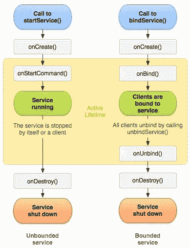

# Konsep Service pada Android

> 原文：<https://medium.easyread.co/konsep-service-pada-android-4b37b2402a9e?source=collection_archive---------1----------------------->


*Hello Coders!* pada kesempatan yang kali ini, saya ingin *sharing* lagi tentang *service* pada Android.

# Apa itu Service pada Android?

*Service* adalah komponen aplikasi yang menjalankan operasi tertentu yang bisa berjalan lama pada sistem Android, biasanya *service* itu berjalan di latar belakang. *Service* ini tidak menyediakan antarmuka pengguna (UI).

Ada dua macam *service* pada Android, yaitu :

*   ***Started***

*Service* yang komponen aplikasinya dimulai dengan memanggil *startService()* . *Service* ini akan berjalan selama belum dimatikan atau proses yang dijalankan selesai. *Service* akan tetap berjalan walaupun komponen yang lain dimatikan oleh sistem Android. *Service* ini digunakan untuk melakukan proses yang tidak memberikan nilai balik ke komponen yang memanggil. Contohnya seperti mengunduh atau mengunggah berkas.

*   ***Bound***

*Service* jenis ini merupakan tipe *service* yang dijalankan oleh komponen lain, namun saling mengikat satu sama lain. Hubungan yang terjadi antar kedua komponen tersebut seperti *client-server* . Bisa saling menerima *response* dan menerima *request* yang ada. Pada *service* ini dimungkinkan terjadi proses IPC ( *Interprocess Communication* ). *Service* ini akan tetap berjalan di background selama masih ada komponen lain yang mengikatnya. Jika tidak, maka *Service* akan dimatikan oleh sistem. Aplikasi pemutar musik merupakan salah satu jenis aplikasi yang mengimplementasikan *Service* jenis ini.

Perlu diingat, *Service* berjalan di *Thread* Utama dari proses hostingnya. *Service* tidak membuat *Thread* sendiri dan tidak berjalan di proses terpisah. Kecuali jika anda menetapkannya.

Jika *service* anda akan melakukan pekerjaan yang banyak membutuhkan *CPU* atau operasi pemblokiran (seperti pemutaran MP3 atau jaringan), buat *Thread* baru dalam layanan untuk melakukan pekerjaan itu. Dengan menggunakan *Thread* terpisah, anda akan mengurangi risiko kesalahan Aplikasi Tidak Merespons (Application Not Responding/ANR) dan *Thread* utama aplikasi bisa terus disediakan untuk interaksi pengguna.

# Deklarasikan Service di AndroidManifest.xml

Sebagaimana dengan *activity* dan komponen lainnya, Anda harus mendeklarasikan semua *service* dalam file *AndroidManifest.xml* . Untuk mendeklarasikan *service* , tambahkan elemen *< service >* sebagai anak dari elemen *< application >* . Contohnya :

```
*<?***xml version="1.0" encoding="utf-8"***?>* <**manifest ...**>

    <**application ... >
        ...**
        **<service
            android:name=".DownloadIntentService"
            android:exported="false"/>**
    </**application**>

</**manifest**>
```

Untuk memblokir akses ke *service* dari aplikasi lainnya, deklarasikan *service* sebagai privat. Caranya, setel atribut *android:exported* ke *false* . Ini akan menghentikan aplikasi lain dari memulai layanan anda, bahkan bila menggunakan *Intent* eksplisit.

# **Started Services**

1.  Komponen aplikasi seperti *activity* memanggil *startService()* dan meneruskannya di *Intent* . Dalam hal ini *Intent* menetapkan *service* dan menyertakan data yang akan digunakan oleh *service* .
2.  Sistem akan memanggil metode *onCreate()* dan *callback* lainnya yang sesuai di *thread* utama. Tergantung *service* untuk mengimplementasikan *callback* tersebut dengan perilaku yang sesuai, seperti membuat *thread* sekunder yang akan digunakan.
3.  Sistem akan memanggil metode *onStartCommand()* , dengan meneruskan *Intent* yang disediakan oleh klien di langkah 1\. (Klien dalam konteks ini adalah komponen aplikasi yang memanggil *service* ).

Setelah dimulai, *service* bisa berjalan di latar belakang tanpa dibatasi waktu, bahkan jika komponen yang memulainya telah dimusnahkan. Biasanya, *service* yang dimulai menjalankan operasi tunggal dan tidak mengembalikan hasil ke pemanggil. Misalnya, layanan dapat mengunduh atau mengunggah file melalui jaringan. Bila operasi selesai, *service* harus berhenti sendiri dengan memanggil *stopSelf()* , atau komponen lain bisa menghentikannya dengan memanggil *stopService()* .

Misalnya, anggaplah aktivitas perlu menyimpan data ke database online. Aktivitas akan memulai layanan pendamping dengan meneruskan Intent ke *startService()* . Layanan menerima maksud di *onStartCommand()* , menghubungkan ke Internet, dan menjalankan transaksi database. Bila transaksi selesai, layanan akan menggunakan *stopSelf()* untuk menghentikan dirinya sendiri dan dimusnahkan. (Ini adalah contoh layanan yang ingin Anda jalankan di *thread pekerja/worker thread* , sebagai ganti *thread utama* ).

**IntentService**

Sebagian besar *service* yang dimulai tidak perlu menangani beberapa permintaan secara bersamaan, dan jika *service* melakukannya, maka akan mengakibatkan skenario multi-threading yang berbahaya. Karena itu, sebaiknya Anda mengimplementasikan *service* menggunakan kelas *IntentService* .

*IntentService* adalah subkelas yang berguna dari *Service* :

*   *IntentService* secara otomatis menyediakan *thread pekerja/worker thread* untuk menangani *Intent* .
*   *IntentService* menangani beberapa kode *boilerplate* yang diperlukan layanan umum (seperti memulai dan menghentikan layanan).
*   *IntentService* bisa membuat antrian pekerjaan yang meneruskan satu *intent* untuk setiap kalinya ke implementasi *onHandleIntent()* , sehingga Anda tidak perlu mengkhawatirkan multi-threading.

Untuk mengimplementasikan *IntentService* :

1.  Sediakan konstruktor untuk *service* .
2.  Buat implementasi *onHandleIntent()* untuk melakukan pekerjaan yang disediakan *client* .

Inilah contoh dari implementasi *IntentService* :

```
**public class** HelloIntentService **extends** IntentService {
    */**
     * A constructor is required, and must call the super IntentService(String)
     * constructor with a name for the worker thread.
     */* **public** HelloIntentService() {
        **super**(**"HelloIntentService"**);
    }
    */**
     * The IntentService calls this method from the default worker thread with
     * the intent that started the service. When this method returns, IntentService
     * stops the service, as appropriate.
     */* @Override
    **protected void** onHandleIntent(Intent intent) {
        *// Normally we would do some work here, like download a file.
        // For our sample, we just sleep for 5 seconds.* **try** {
            Thread.*sleep*(5000);
        } **catch** (InterruptedException e) {
            *// Restore interrupt status.* Thread.*currentThread*().interrupt();
        }
    }
}
```

# Bound Services

“ *Bound* ” *Services* bila komponen aplikasi mengikatnya dengan memanggil *bindService()* . Bound Servicesmenawarkan antarmuka *client-server* yang memungkinkan komponen berinteraksi dengan *service* , mengirim *request* , dan mendapatkan *response* , kadang-kadang menggunakan komunikasi interproses (IPC) untuk mengirim dan menerima informasi di seluruh proses. *Service* ini hanya berjalan selama komponen aplikasi terikat padanya. Beberapa komponen bisa diikat ke *service* sekaligus, namun bila semuanya telah dilepas, *service* akan dimusnahkan. *Service* ini umumnya tidak mengizinkan memulai komponen dengan memanggil *startService()* .

**Implementasi Bound Services**

Untuk mengimplementasikan *Bound Services* , definisikan antarmuka yang menetapkan cara klien bisa berkomunikasi dengan *service* . Antarmuka ini, yang dikembalikan *service* Anda dari metode callback *onBind()* , harus berupa implementasi *IBinder* . Untuk mengambil antarmuka *IBinder* , komponen aplikasi klien memanggil *bindService()* . Setelah klien menerima *IBinder* , klien berinteraksi dengan *service* melalui antarmuka itu.

Ada sejumlah cara untuk mengimplementasikan *Bound Services* , dan implementasi tersebut lebih rumit daripada *Started Services* . Untuk detail selengkapnya tentang *Bound Services* , lihat [*Bound Services*](https://developer.android.com/guide/components/bound-services.html) .

**Mengikat ke Service**

Untuk mengikat ke *service* yang dideklarasikan di file *AndroidManifest.xml* dan diimplementasikan oleh komponen aplikasi, gunakan *bindService()* dengan *Explicit* *Intent* .

**Perhatian** : Jangan gunakan *Implicit Intent* untuk mengikat ke *service* . Melakukannya adalah bahaya keamanan, karena Anda tidak bisa memastikan *service* yang akan merespons *Intent* tersebut, dan pengguna tidak bisa melihat *service* mana yang dimulai. Mulai dengan Android 5.0 ( *API level 21* ), sistem membuat *exception* jika Anda memanggil *bindService()* dengan *Implicit Intent* .

# Life Cycle Service

Daur hidup *service* lebih sederhana daripada *activity* . Akan tetapi, ini jauh lebih penting karena Anda memerhatikan dari dekat cara *service* dibuat dan dimusnahkan. Karena tidak memiliki *UI* , *service* bisa terus berjalan di latar belakang tanpa diketahui pengguna, bahkan jika pengguna beralih ke aplikasi lain. Ini menghabiskan sumber daya dan menguras baterai. Seperti *activity* , *service* memiliki metode callback daur hidup yang bisa Anda implementasikan untuk memantau perubahan keadaan *service* dan melakukan pekerjaan pada waktu yang sesuai. Berikut kerangka *service* yang memperagakan setiap metode daur hidup :

```
**public class** ExampleService **extends** Service {
    **int mStartMode**; *// indicates how to behave if the service is killed* IBinder **mBinder**; *// interface for clients that bind* **boolean mAllowRebind**; *// indicates whether onRebind should be used* @Override
    **public void** onCreate() {
        *// The service is being created* }
    @Override
    **public int** onStartCommand(Intent intent, **int** flags, **int** startId) {
        *// The service is starting, due to a call to startService()* **return mStartMode**;
    }
    @Override
    **public** IBinder onBind(Intent intent) {
        *// A client is binding to the service with bindService()* **return mBinder**;
    }
    @Override
    **public boolean** onUnbind(Intent intent) {
        *// All clients have unbound with unbindService()* **return mAllowRebind**;
    }
    @Override
    **public void** onRebind(Intent intent) {
        *// A client is binding to the service with bindService(),
        // after onUnbind() has already been called* }
    @Override
    **public void** onDestroy() {
        *// The service is no longer used and is being destroyed* }
}
```

**Daur Hidup *Started Service* dan *Bound Service***

*Bound Service* hanya tersedia untuk menyajikan komponen aplikasi yang terikat padanya, sehingga bila tidak ada lagi komponen yang diikat ke *service* tersebut, sistem akan memusnahkannya. *Bound Service* tidak perlu dihentikan secara eksplisit seperti halnya *Started Service* (menggunakan *stopService()* atau *stopSelf()* ).

Gambar dibawah ini adalah menampilkan perbedaan daur hidup dari keduanya :



**Foreground Service**

Walaupun sebagian besar layanan berjalan di latar belakang, sebagian lagi ada yang berjalan di latar depan ( *Foreground* ). *Foreground Service* adalah *service* yang diketahui pengguna, jadi ini bukan layanan yang bakal dimatikan sistem bila memori tinggal sedikit.

Misalnya, pemutar musik yang memutar musik dari *service* harus disetel untuk berjalan di latar depan, karena pengguna mengetahui operasinya. Notifikasi di bilah status dapat menunjukkan lagu saat ini dan memungkinkan pengguna meluncurkan aktivitas untuk berinteraksi dengan pemutar musik.

Untuk meminta agar layanan berjalan di latar depan, panggil *startForeground()* sebagai ganti *startService()* . Metode ini menggunakan dua parameter: integer yang secara unik mengidentifikasi notifikasi dan Notification untuk bilah status. Notifikasi ini sedang berlangsung, artinya tidak bisa ditutup. Notifikasi tetap berada di bilah status hingga *service* dihentikan atau dibuang dari latar depan. Misalnya :

```
NotificationCompat.Builder **mBuilder** =
        **new** NotificationCompat.Builder(**this**)
                .setSmallIcon(R.drawable.notification_icon)
                .setContentTitle(**"My notification"**)
                .setContentText(**"Hello World!"**);
startForeground(ONGOING_NOTIFICATION_ID, **mBuilder**.build());
```

Catatan: ID integer yang Anda berikan ke *startForeground()* tidak boleh 0.

Untuk membuang layanan dari latar depan, panggil *stopForeground()* . Metode ini memerlukan *boolean* , yang menunjukkan apakah akan membuang notifikasi bilah status atau tidak. Metode ini tidak menghentikan *service* . Akan tetapi, jika Anda menghentikan *service* sewaktu masih berjalan di latar depan, maka notifikasi juga akan dibuang.

# Scheduled services

Untuk *API* level 21 dan yang lebih tinggi, Anda bisa meluncurkan service menggunakan *JobScheduler API* . Untuk menggunakan *JobScheduler* , Anda perlu mendaftarkan tugas dan menetapkan persyaratannya untuk jaringan dan pengaturan waktu. Sistem menjadwalkan tugas untuk dieksekusi di waktu yang tepat.

Antarmuka *JobScheduler* menyediakan banyak metode untuk mendefinisikan ketentuan eksekusi layanan. Untuk detailnya, lihat [*JobScheduler reference*](https://developer.android.com/reference/android/app/job/JobScheduler.html) .

Nah seperti itu konsep dari *Service* pada Android :D Jangan menyerah untuk terus belajar ya :) Saya sendiri awalnya pusing mengerti konsep yang sebenarnya lebih banyak dari ini :D Mudah-mudahan dengan postingan kali ini yang sedikit ringkas ini bisa membuat anda mengerti tentang *Service* . Sekian dari saya, apabila terdapat kesalahan dalam penulisan, mohon dimaafkan :D

*Salam Coders!*

*Artikel ini di tulis oleh* [*Mahesa Iqbal Ridwansyah*](https://medium.com/u/423a2702de9a?source=post_page-----4b37b2402a9e--------------------------------) *beliau sering menulis artikel mengenai Software Engineering dan Programming. Follow profilnya untuk mendapatkan update-an terbaru artikel-artikel beliau.*

*Jika anda merasa artikel ini menarik dan bermanfaat, bagikan ke lingkaran pertemanan anda, agar mereka dapat membaca artikel ini.*