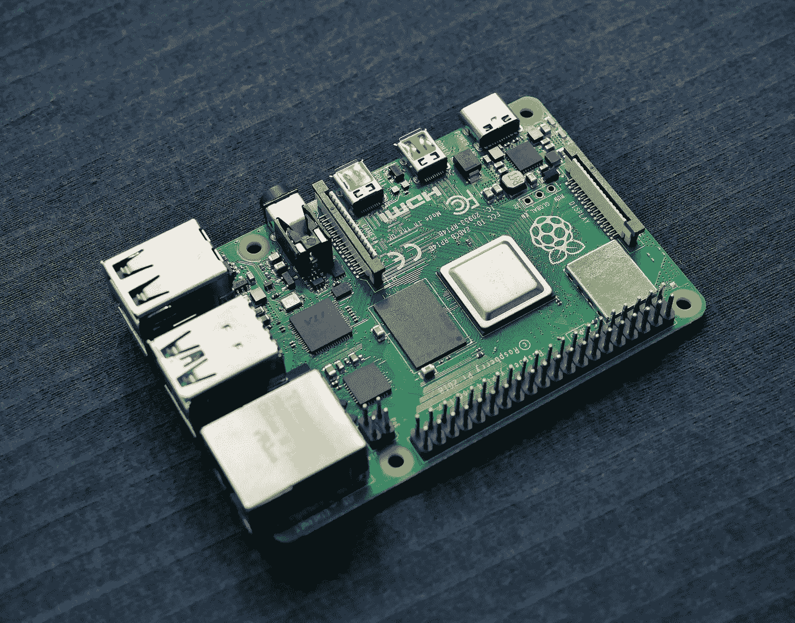
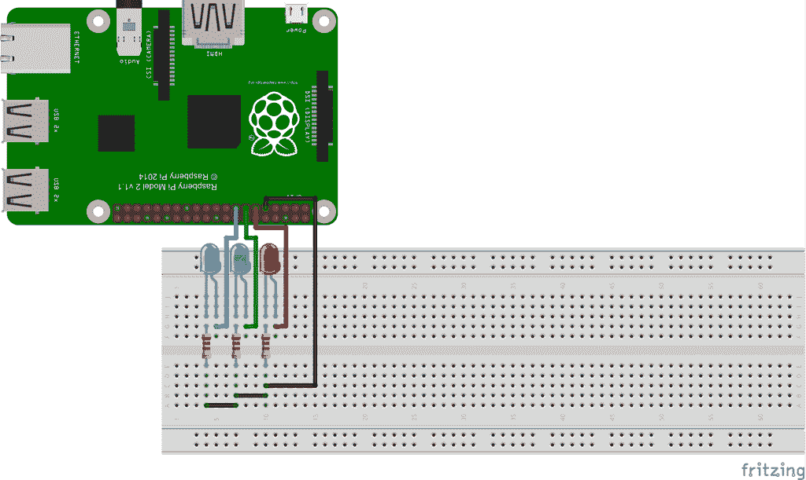
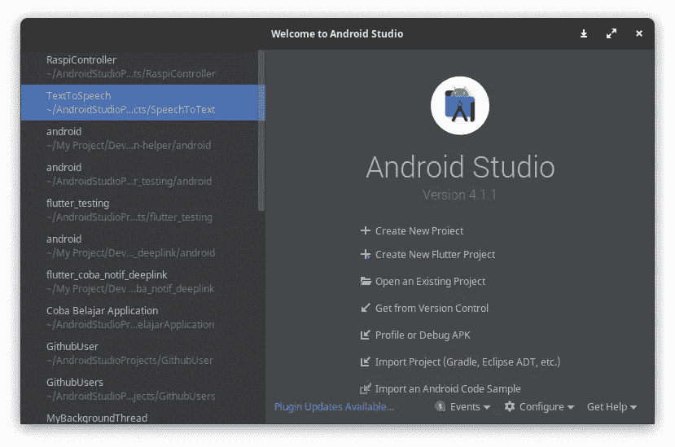
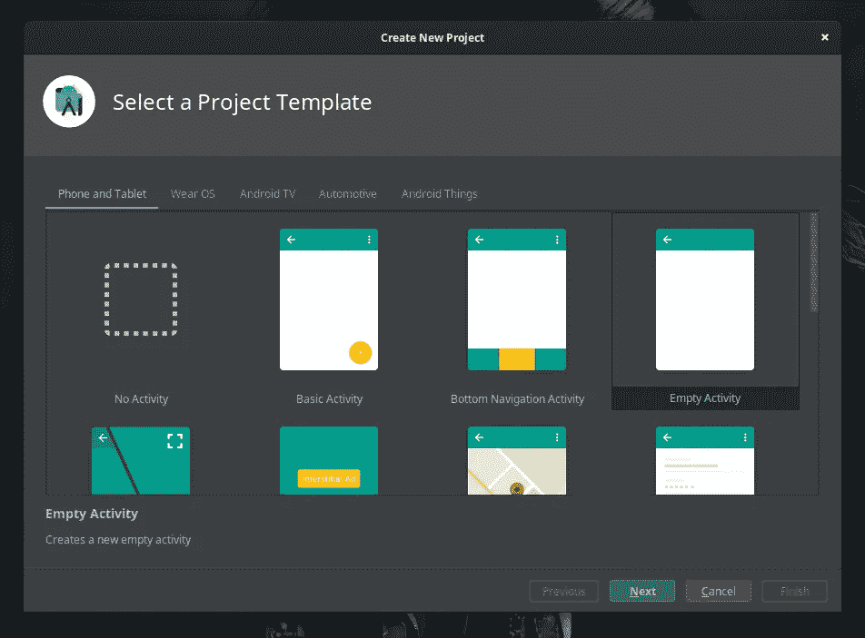
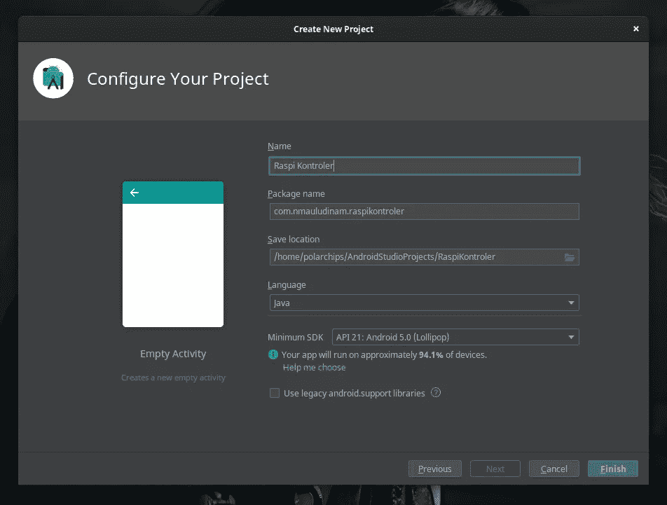
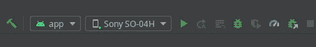
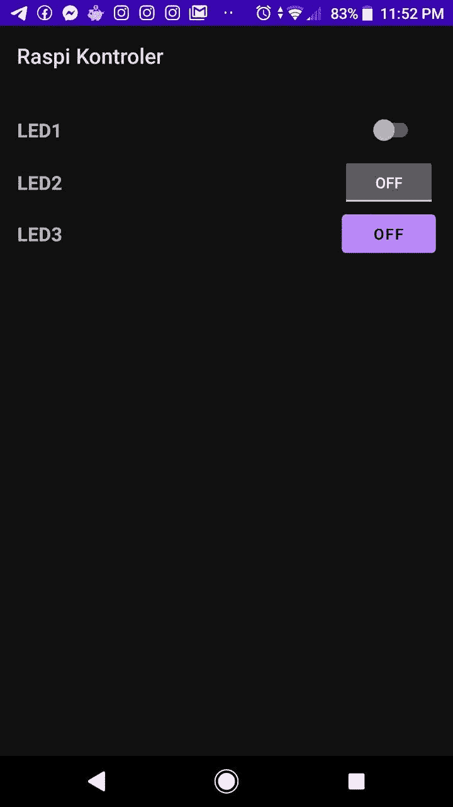
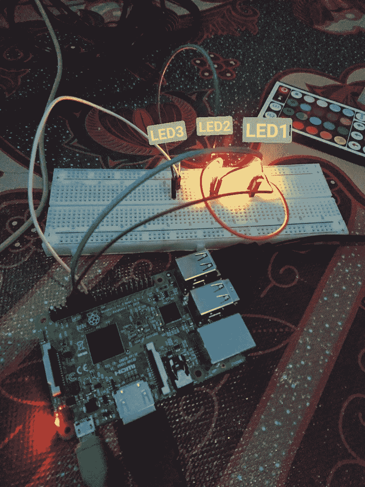

# Kontrol GPIO Raspberry Pi dengan Android Native

> 原文：<https://medium.easyread.co/kontrol-gpio-raspberry-pi-dengan-android-native-bca386b5f2fb?source=collection_archive---------0----------------------->

## Tutorial yang tepat untuk membuat kontrol Raspberry Pi dari Aplikasi Android buatan sendiri



Photo by [Vishnu Mohanan](https://unsplash.com/@vishnumaiea?utm_source=medium&utm_medium=referral) on [Unsplash](https://unsplash.com?utm_source=medium&utm_medium=referral)

Di dalam tutorial ini, digunakan 3 buah LED agar tutorial terlihat sederhana tapi ‘konsep kontrol’-nya tetap dapat. Tak perlu berbasa-basi, langsung saja kita mulai dari prakteknya ya!

Persiapkan alat yang dibutuhkan, seperti:

1.  Raspberry Pi (saya menggunakan Raspi 3 B)
2.  Smartphone Android
3.  PC untuk memprogram Aplikasi Android
4.  3 buah LED
5.  4 pcs kabel jumper male-female
6.  2 pcs kabel jumper male-male

# Rangkaian Alat



Source: [www.instructables.com](http://www.instructables.com) oleh Laurens-Wuyts

> Pin 9 (GND) terhubung ke semua led (Pin ke 5 dari kanan)

> Pin 11 terhubung ke LED1 (Pin ke 6dari kanan)

> Pin 13 terhubung ke LED2 (Pin ke 7dari kanan)

> Pin 15 terhubung ke LED3 (Pin ke 8dari kanan)

# Yang dibutuhkan untuk Raspberry Pi

Di dalam Raspberry Pi, pastikan kamu sudah menginstall **Wiring Pi** dan **apache2** beserta **PHP5**

**Wiring Pi** digunakan untuk mengontrol Pin dari halaman PHP.

Untuk cek apakah sudah ada Wiring Pi atau belum kamu bisa lakukan perintah di Terminal Raspberry Pi:

```
gpio -v
```

Jika belum, lakukan penginstalan dengan perintah:

```
sudo apt-get install wiringpi
```

Tutorial lengkap untuk instalasi Wiring Pi bisa kamu dapatkan [disini](http://wiringpi.com/download-and-install/) .

Lalu pastikan juga kamu memiliki apache2 dan PHP. Untuk menginstall apache2 bisa dengan melakukan perintah:

```
sudo apt install apache2 -y
```

Sedangkan untuk menginstall PHP:

```
sudo apt install php libapache2-mod-php -y
```

# Membuat File index.php di **Web Page Filesystem Raspberry Pi**

Setelah Wiring Pi, Apache2 dan PHP5 sudah terdownload, hal yang perlu dilakukan adalah mengubah default web page filesystem Raspberry Pi di direktori **/var/www/html** . Secara default di dalam direktori **/var/www/html** terdapat file bernama index.html. Hapus file tersebut, dan buat file baru bernama index.php.

Di dalam file index.php, tambahkan kode berikut:

```
<?php 
  exec("gpio mode 0 out");
  exec("gpio mode 2 out");
  exec("gpio mode 3 out");
  if (isset($_GET['led1'])) { 
      if($_GET['led1'] == 1) {
          exec("gpio write 0 1");
      } else {
          exec("gpio write 0 0");
      }
  }
  if(isset($_GET['led2'])) {
      if($_GET['led2'] == 1) {
          exec("gpio write 2 1");
      } else {
          exec("gpio write 2 0");
      }
  }
  if(isset($_GET['led3'])) {
      if($_GET['led3'] == 1) {
          exec("gpio write 3 1");
      } else {
          exec("gpio write 3 0");
      }
  }
?>
```

# Membuat Aplikasi Android Sendiri Sebagai Kontrol Raspberry Pi

Untuk membuat aplikasi Android Native kamu bisa menggunakan Android Studio atau Intellij IDEA. Link download Android Studio ada [disini](https://developer.android.com/studio) dan Intellij IDEA ada [disini](https://www.jetbrains.com/idea/) . Tapi di tutorial ini saya hanya akan menggunakan **Android Studio** .

## Create Project

Buka Android Studio, pilih **+ Create New Project**



Android Studio 4.1 Welcome Screen

Klik **Empty Activity** , lalu **Next** .



Create New Project Screen

Beri nama aplikasi, boleh bebas. Disini saya beri nama Raspi Kontroler. Untuk Package Name, tidak harus **com.nmauludinam.raspikontroler** ya! Secara default Package Name itu **com.example. < nama aplikasi >** . Untuk bagian example juga bebas diberi nama apa, tidak diubah juga tidak apa apa.

Location saya biarkan default dan untuk Language saya pilih Java.

Kosongkan saja centang untuk **Use Legacy android.support libraries** , lalu klik **Finish** .



## Membuat Tampilan User Interface Aplikasi

Untuk membuat User Interface, lakukan perubahan pada file layout **activity_main.xml** file ini terletak di **app/res/layout** . Berikut isi dari file **activity_main.xml** :

Source Code activity_main.xml

# Membuat Program Aplikasi

Setelah itu, ubah kode di dalam file **MainActivity.java** di **app/java/ < nama package >** . Berikut isi program di dalam MainActivity.java:

Source Code MainActivity.java

## Tambahkan Permission

Agar aplikasimu bisa mengakses jaringan lain, kamu perlu menambahkan **Internet Permission** ke dalam file **AndroidManifest.xml** . Kode nya simple:

`<uses-permission android:name=”android.permission.INTERNET” />`

Taruh kode tersebut di dalam Tag <manifest>, tepat di atas Tag <application>. Sehingga AndroidManifest.xml akan terlihat sebagai berikut:</application></manifest>

Source Code AndroidManifest.xml

Setelah itu sambungkan perangkat Android ke PC, sehingga Aplikasi bisa di install dan di running.



Running Aplikasi ke Perangkat Android

# **Hasil Aplikasi dan Percobaan Kontrol LED**



Tampilan UI Apliaksi

Tampilan terlihat sederhana karena ini hanya untuk percobaan pemahaman komunikasi Android Native-Raspberry Pi. Jika background aplikasi kamu terlihat berbeda (berwarna putih), itu karena perangkat saya menggunakan Night Mode (background menjadi warna hitam).



Hasil Percobaan Kontrol LED

Pada gambar LED3 terlihat mati. Hal itu terjadi karena untuk menghidupkannya tombol LED3 harus di sentuh. Saya tidak bisa menyentuh tombol LED3 ketika saya harus memfoto percobaan ini.

# Kesimpulan

Sekian tutorial yang bisa saya tulis, saya harap tutorial ini telah menjelaskan sejelas-jelasnya. Tutorial ini hanya menyuguhkan praktek saja, untuk teori mengapa harus menggunakan kode ini atau kode itu, akan saya buat di story yang lain. Semoga tutorial ini bermanfaat :)

Jika kamu pikir story ini bermanfaat, ada baiknya untuk mengklik tombol claps. Claps yang kamu berikan membuat saya semakin bersemangat untuk terus menebarkan manfaat melalui story Medium. Terima kasih :)