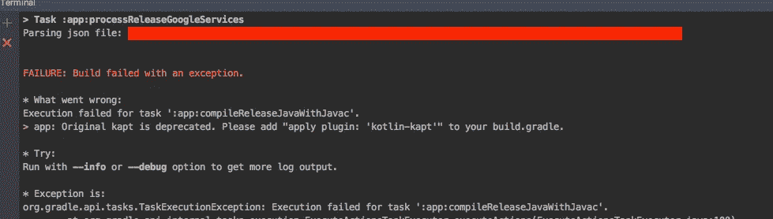

# 科特林——很多陷阱

> 原文：<https://medium.easyread.co/kotlin-a-lot-of-gotchas-e4534c529ffb?source=collection_archive---------0----------------------->


## 你在旅途中会遇到的另一种恐慌

> 嗯，向前看很难。而且很难学习新的东西，独自拥抱恐慌。

希望这篇文章能拯救我们的生活！

# 我们开始吧

Kotlin 中的静态对象

[](https://blog.egorand.me/where-do-i-put-my-constants-in-kotlin/) [## 我应该在 Kotlin 的什么地方保存我的常量？

### 最近网上有一个关于存储全局常量或公共静态的最佳方法的讨论…

blog.egorand.me](https://blog.egorand.me/where-do-i-put-my-constants-in-kotlin/) [](https://kotlinlang.org/docs/reference/java-to-kotlin-interop.html) [## 从 Java 调用 kot Lin-kot Lin 编程语言

### 拥有多个生成的 Java 类名相同的文件(相同的包和相同的名称或相同的…

kotlinlang.org](https://kotlinlang.org/docs/reference/java-to-kotlin-interop.html) [](https://stackoverflow.com/a/38122742/3763032) [## 如何在 Java 中访问 Kotlin companion 对象？

### 我把我的一个 Java 类转换成 Kotlin 和下面的类。类 main Application:Application(){ companion…

stackoverflow.com](https://stackoverflow.com/a/38122742/3763032) [](https://antonioleiva.com/kotlin-from-java/) [## 从 Java 调用 Kotlin:今天就开始使用 kot Lin-Antonio Leiva

### Kotlin 的一大奇迹是它完全集成了 Java。这意味着尽管你所有的…

antonioleiva.com](https://antonioleiva.com/kotlin-from-java/) 

## Kotlin 中的静态方法

[](https://stackoverflow.com/questions/40352684/what-is-the-equivalent-of-java-static-methods-in-kotlin) [## Kotlin 中 Java 静态方法的等价物是什么？

### Kotlin 中没有 static 关键字。用 Kotlin 表示静态 Java 方法的最佳方式是什么？

stackoverflow.com](https://stackoverflow.com/questions/40352684/what-is-the-equivalent-of-java-static-methods-in-kotlin) 

## 静态字段

[https://handstandsam . com/2017/07/07/how-do-I-write-static-methods-kot Lin/](https://handstandsam.com/2017/07/07/how-do-i-write-static-methods-kotlin/)

[](https://blog.kotlin-academy.com/a-few-facts-about-companion-objects-37e18429b725) [## 关于伴随物体的一些事实

### 有了 Kotlin，Java 开发人员失去了静态修饰符。下面是一些关于如何使用伴随对象的事实。

blog.kotlin-academy.com](https://blog.kotlin-academy.com/a-few-facts-about-companion-objects-37e18429b725) [](https://kotlinlang.org/docs/reference/java-to-kotlin-interop.html) [## 从 Java 调用 kot Lin-kot Lin 编程语言

### 拥有多个生成的 Java 类名相同的文件(相同的包和相同的名称或相同的…

kotlinlang.org](https://kotlinlang.org/docs/reference/java-to-kotlin-interop.html) 

## 访问伴随对象上的实例字段

[](https://stackoverflow.com/a/46844888/3763032) [## 如何在 kotlin 中从对象实例中访问伴随对象？

### 带有伴随对象类 MyClass 的简单示例类{伴随对象{ val test = 25 } }值测试可以是…

stackoverflow.com](https://stackoverflow.com/a/46844888/3763032) [](https://stackoverflow.com/a/44366286/3763032) [## 如何在 Koltin 中访问静态伴随对象中的实例变量

### 加入 Stack Overflow，学习、分享知识，打造您的职业生涯。我正在尝试利用网络表演…

stackoverflow.com](https://stackoverflow.com/a/44366286/3763032) 

## 起因:科特林。TypeCastException: null 不能转换为非 null 类型

[](https://stackoverflow.com/a/44885870/3763032) [## IllegalArgumentException:指定为非 null 的参数为 null

### 本网站使用 cookies 来提供我们的服务，并向您显示相关的广告和工作列表。通过使用我们的网站，您…

stackoverflow.com](https://stackoverflow.com/a/44885870/3763032) [](https://stackoverflow.com/a/37949190/3763032) [## 科特林。TypeCastException: null 不能转换为非 null 类型 com . midsize mango . databasekotlin . note

### 我正在尝试用 Kotlin 编写我的应用程序，但是我发现不能将 null 转换为非 null 类型，并且应用程序强制停止，当…

stackoverflow.com](https://stackoverflow.com/a/37949190/3763032) 

## 科特林注释处理器

```
java.lang.IllegalStateException: failed to analyze: org.jetbrains.kotlin.kapt3.diagnostic.KaptError: Error while annotation processing
```

[](https://stackoverflow.com/a/47052117/3763032) [## 如何使用 kotlin 初始化 android 中的小部件

### 您可以使用以下任何一种方法初始化 kotlin 中的视图:1 .可空变量私有变量 textView: TextView…

stackoverflow.com](https://stackoverflow.com/a/47052117/3763032) [](https://github.com/JakeWharton/butterknife/issues/1014#issuecomment-318877535) [## BindView 上的所有控件为空问题#1014 JakeWharton/butterknife

### 当我将 kotlin 支持添加到我的项目中时...所有活动和片段控制对象都返回 null。还有…

github.com](https://github.com/JakeWharton/butterknife/issues/1014#issuecomment-318877535) [](https://kotlinlang.org/docs/reference/kapt.html) [## 使用 kapt - Kotlin 编程语言

### 如果您为您的 androidTest 或测试源使用注释处理器，那么相应的 kapt 配置被命名为…

kotlinlang.org](https://kotlinlang.org/docs/reference/kapt.html) [](https://kotlinlang.org/docs/tutorials/android-frameworks.html#butterknife) [## 使用注释处理的 Android 框架——kot Lin 编程语言

### 本教程描述了如何在 Kotlin 中使用流行的依赖注释的 Android 框架和库…

kotlinlang.org](https://kotlinlang.org/docs/tutorials/android-frameworks.html#butterknife) [](https://stackoverflow.com/a/43666311/3763032) [## kapt 构建在 Dagger Android 处理器上失败

### 我试图将 Dagger Android 处理器(记录在这里)包含在我的带有 Kotlin 注释的项目中…

stackoverflow.com](https://stackoverflow.com/a/43666311/3763032) 

## 科特林。将 Kotlin 与 ButterKnife 一起使用时，出现 UninitializedPropertyAccessException

> (同上，不同误差)

[](https://github.com/JetBrains/kotlin-examples/issues/38) [## 科特林。当我将 Kotlin 与 ButterKnife 一起使用时，uniinitializedpropertyaccessexception 问题#38 …

### 嗨，我按照他的例子，当我运行应用程序时，我得到了以下错误:Java . lang . runtime exception:Unable…

github.com](https://github.com/JetBrains/kotlin-examples/issues/38) 

## 不要把你的全局视图设置为 ***私有的*** 。

## 不要忘记更新你的 kotlin IDE



## 使用 *kapt 来使用 ButterKnife 或使用 kotlin-extensions*

[](https://github.com/JakeWharton/butterknife/issues/966) [## [建议]用 kotlin 清除此作品。问题#966 JakeWharton/butterknife

### 我最近在学科特林，然后我试着直接和科特林一起用 ButterKnife，当然，什么也没发生…

github.com](https://github.com/JakeWharton/butterknife/issues/966) 

## 注释参数错误编译时常数

[](https://stackoverflow.com/a/49423982/3763032) [## Kotlin 注释参数必须是编译时常数

### @ bind view(r . id . et _ log in _ username)内部 var loginUsername: EditText？=空 Kotlin 注释参数必须是…

stackoverflow.com](https://stackoverflow.com/a/49423982/3763032) 

## 科特林版本冲突

[](https://stackoverflow.com/a/48169695) [## 用于与 gradle (1.1.2-5)一起构建的 kotlin 版本不同于捆绑到…

### 加入 Stack Overflow，学习、分享知识，打造您的职业生涯。有人解决过这个问题吗？

stackoverflow.com](https://stackoverflow.com/a/48169695) 

## 科特林·格拉德正确的方式

[](https://kotlinlang.org/docs/reference/using-gradle.html) [## 使用 Gradle - Kotlin 编程语言

### 默认情况下，kapt 注释处理任务不会被缓存，因为注释处理器运行任意代码，这些代码可能…

kotlinlang.org](https://kotlinlang.org/docs/reference/using-gradle.html) 

## 科特林散列表

[](https://stackoverflow.com/a/37913264) [## 科特林的列表缺少“添加”、“删除”等？

### 具有不可变(只读)列表的不可变变量:val users: List = listOf( User("Tom "，32)，User("John "，64) )…

stackoverflow.com](https://stackoverflow.com/a/37913264) [](https://stackoverflow.com/a/45829303/3763032) [## 如何在 Kotlin 中使用地图

### 加入 Stack Overflow，学习、分享知识，打造您的职业生涯。下面的代码正在创建一个名为…

stackoverflow.com](https://stackoverflow.com/a/45829303/3763032) 

## 科特林工厂法

[](https://medium.com/@pablisco/companion-factory-methods-in-kotlin-e2eeb1e87f1b) [## 科特林的伙伴工厂方法

### 在 Java 中，当我们不想公开实现是什么时，静态工厂方法对于实例化一个类型是有用的…

medium.com](https://medium.com/@pablisco/companion-factory-methods-in-kotlin-e2eeb1e87f1b) [](https://medium.com/the-coding-matrix/kotlin-fun-with-the-factory-pattern-70aa5e431dba) [## 科特林与工厂模式的乐趣

### 当你读到“让我们拿工厂模式找点乐子”时，我同意你应该怀疑作者的热情和…

medium.com](https://medium.com/the-coding-matrix/kotlin-fun-with-the-factory-pattern-70aa5e431dba) 

## 科特林数组列表

[](https://stackoverflow.com/a/45661667/9640809) [## 用 kotlin 中的大小初始化 ArrayList >

### 我试图在构造函数中初始化一个大小为的列表。但是我的列表大小是 0。val seqList =…

stackoverflow.com](https://stackoverflow.com/a/45661667/9640809) 

## 科特林构造函数

[](https://www.programiz.com/kotlin-programming/constructors) [## 科特林构造函数

### 构造函数是初始化类属性的简洁方法。它是一个特殊的成员函数，当…

www.programiz.com](https://www.programiz.com/kotlin-programming/constructors) 

# 找到多个具有独立于操作系统的路径' META-INF/* '的文件

[](https://stackoverflow.com/a/47509465/9640809) [## 找到多个具有独立于操作系统路径' META-INF/LICENSE '的文件

### 我也有类似的问题。我收到错误消息-错误:任务执行失败…

stackoverflow.com](https://stackoverflow.com/a/47509465/9640809) [](https://stackoverflow.com/a/44509660/9640809) [## 在 APK META-INF/library _ release . kot Lin _ module 中复制了重复文件

### 我最近通过 JitPack 添加了两个 Android 库，我有以下错误:在 APK 复制了重复的文件…

stackoverflow.com](https://stackoverflow.com/a/44509660/9640809) 

> 不过，排除这个文件是安全的

## Kotlin 上的 SerialVersionUID

[](https://stackoverflow.com/a/285809/3763032) [## 什么是 serialVersionUID，为什么要使用它？

### serialVersionUID 有助于序列化数据的版本控制。它的值在序列化时与数据一起存储。当…

stackoverflow.com](https://stackoverflow.com/a/285809/3763032) [](https://www.mkyong.com/java/how-to-generate-serialversionuid/) [## Java:如何生成 serialVersionUID-Mkyong.com

### 有三种方法可以为序列化类生成 serialVersionUID。

www.mkyong.com](https://www.mkyong.com/java/how-to-generate-serialversionuid/) [](https://github.com/mcharmas/android-parcelable-intellij-plugin) [## m harmas/Android-parcelable-intellij-plugin

### 用于 Android Parcelable 样板代码生成的 intellij 插件。

github.com](https://github.com/mcharmas/android-parcelable-intellij-plugin) [](https://stackoverflow.com/a/34242012/3763032) [## 如何为 kotlin 异常生成 serialVersionUID？

### 由于 kotlin 没有静态字段，我应该在 companion 对象中定义 serialVersionUID 吗？想法失去了能力…

stackoverflow.com](https://stackoverflow.com/a/34242012/3763032) 

## Kotlin 数据类(支持 ***GSON*** )

[](https://stackoverflow.com/a/44118828/3763032) [## 使用 GSON 从 Json 获取 Kotlin 数据类

### 我有这样的 Java POJO 类:class Topic { @ serialized name(" id ")long id；@SerializedName("name ")字符串名称；}…

stackoverflow.com](https://stackoverflow.com/a/44118828/3763032) 

## 为什么应该重写 equal、hashCode 和 toString

[](http://www.prandroid.com/2017/06/override-equal-hashcode-and-tostring-in.html) [## 在 Kotlin 中重写 Equal、HashCode 和 ToString

### 我们都知道在 java 中重写 equal()，hashcode()和 toString()，在这里默认实现，你不用…

www.prandroid.com](http://www.prandroid.com/2017/06/override-equal-hashcode-and-tostring-in.html) 

## 有效科特林

 [## 有效科特林

### 随着 Joshua Bloch 备受推崇的书《有效的 Java》的第三版现已面世，我认为……

medium.com](https://medium.com/@appmattus/effective-kotlin-31215a6cf847) 

## Kotlin Parcelable

[](https://medium.com/@BladeCoder/reducing-parcelable-boilerplate-code-using-kotlin-741c3124a49a) [## 使用 Kotlin 减少可打包的样板代码

### 对于 Android 来说，实现 Parcelable 接口和维护这些代码仍然是一项痛苦的日常任务…

medium.com](https://medium.com/@BladeCoder/reducing-parcelable-boilerplate-code-using-kotlin-741c3124a49a) [](https://github.com/mcharmas/android-parcelable-intellij-plugin) [## m harmas/Android-parcelable-intellij-plugin

### 用于 Android Parcelable 样板代码生成的 intellij 插件。

github.com](https://github.com/mcharmas/android-parcelable-intellij-plugin) 

## 科特林德/序列化

 [## 在 kotlin 中序列化反序列化数据类

### 现在我有了自己的博客。请阅读我博客上的这篇文章。

medium.com](https://medium.com/@developine/serialize-deserialize-data-class-in-kotlin-dfaec8b63f05) 

## 科特林的瓦拉格斯

[https://discuse . kot linlang . org/t/calling-Java-varargs-methods/502](https://discuss.kotlinlang.org/t/calling-java-varargs-methods/502)

**不能将用 JVM target 1.8 构建的字节码内联到用 JVM target 1.6 构建的字节码中。请指定正确的'-jvm-target '选项**

[https://stackoverflow.com/a/56966473/3763032](https://stackoverflow.com/a/56966473/3763032)

**org.gradle.internal.exceptions.LocationAwareException: New Gradle Sync is not supported due to containing Kotlin modules using an unsupported plugin version**

[](https://stackoverflow.com/a/56630152/3763032) [## New Gradle Sync is not supported due to containing Kotlin modules using an unsupported plugin…

### I'm uising android studio 3.4.1 and my kotlin version is 1.3.31\. I have a flutter app. When trying to add…

stackoverflow.com](https://stackoverflow.com/a/56630152/3763032) 

***Happy coding, guys!!!***

*Artikel ini di tulis oleh* [*Mochamad Iqbal Dwi Cahyo*](https://medium.com/u/62a4f05ca52a?source=post_page-----e4534c529ffb--------------------------------) *beliau seorang enthusiast dan photographer. Follow profilnya untuk mendapatkan update-an terbaru artikel-artikel beliau.*

*Jika anda merasa artikel ini menarik dan bermanfaat, bagikan ke lingkaran pertemanan anda, agar mereka dapat membaca artikel ini.
Atau jika anda tertarik untuk membagikan cerita anda pada publikasi ini, anda boleh mengirimkan cerita anda ataupun mengikuti langkah-langkah yang ada* [***disini***](https://medium.com/easyread/about-easyread-74b20960e180) *.*