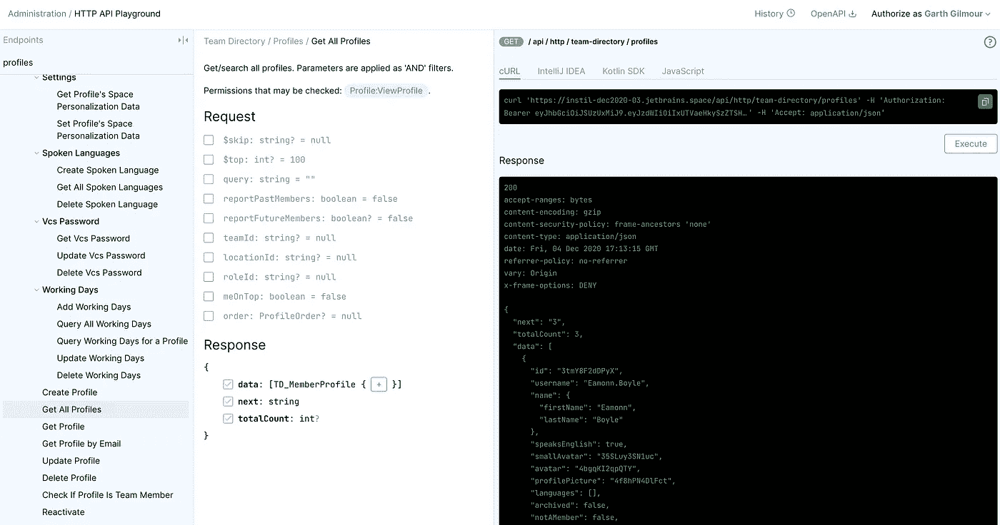
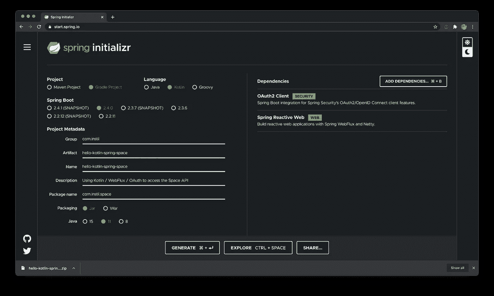
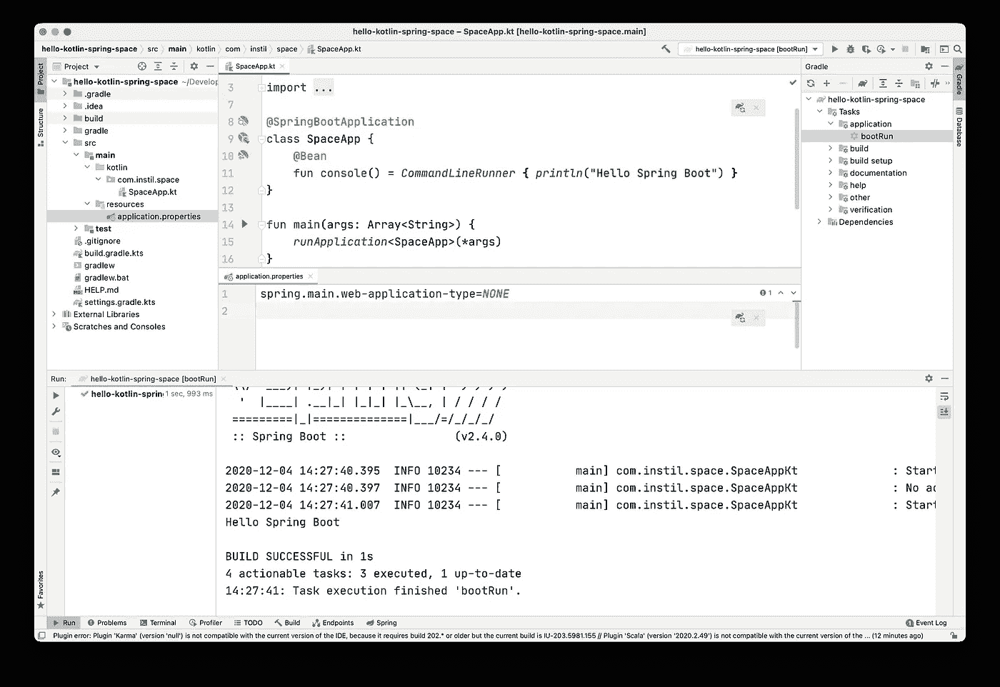
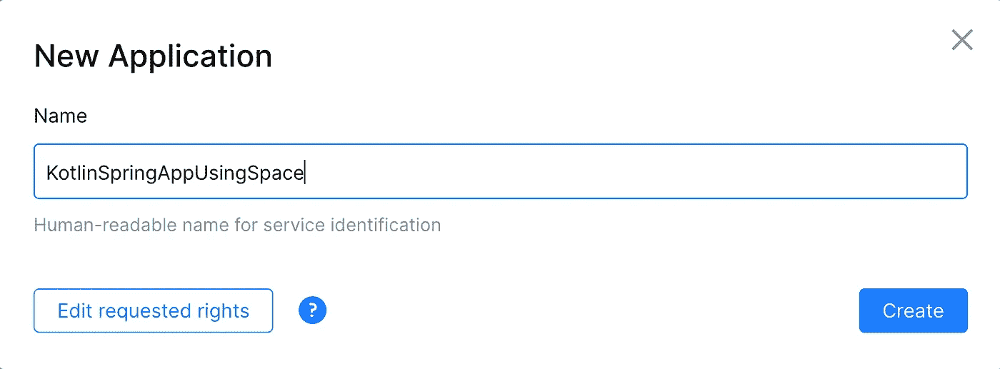
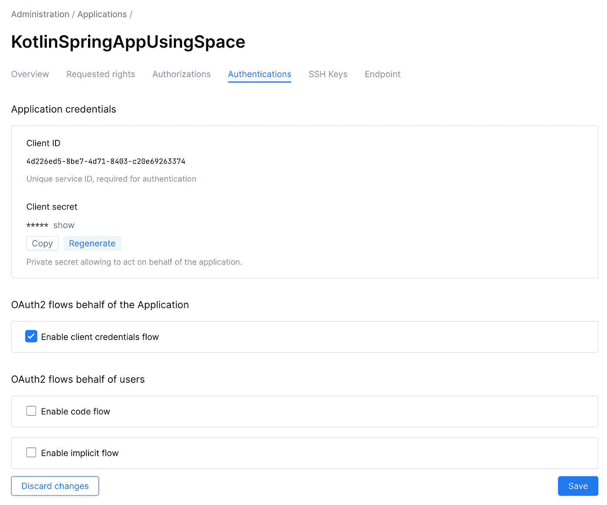
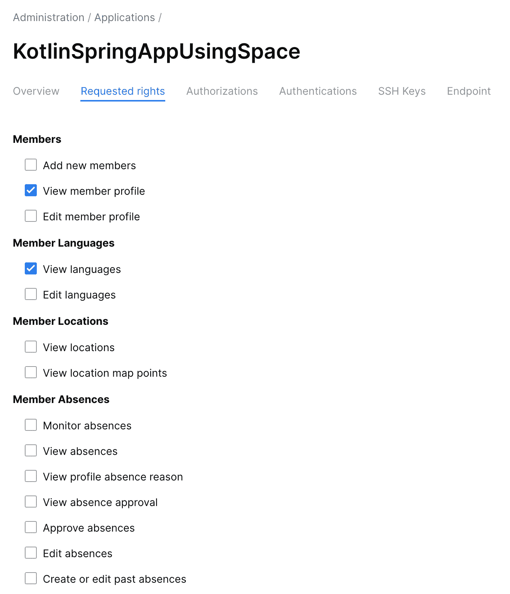
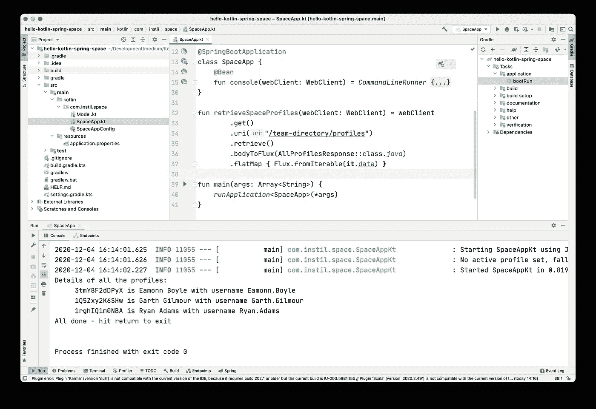

# 太空中的科特林和 WebFlux

> 原文：<https://medium.com/google-developer-experts/kotlin-and-webflux-in-space-40615f28cb5?source=collection_archive---------2----------------------->


Logo for the JetBrains Space product

# 介绍

2020 年 12 月 9 日星期三将见证 [JetBrains Space](https://www.jetbrains.com/space/) 的正式发布。空间是团队的环境，旨在为版本控制、博客、聊天、代码审查等提供“一站式商店”

在[研究所](https://instil.co/)，我们是太空的早期采用者。我们的培训团队出席了哥本哈根的 [KotlinConf 并参加了发布活动。此后，我们使用它取得了很好的效果，最初是在内部管理新课程的代码库，然后在冠状病毒疫情期间作为我们向虚拟培训转变的一部分。](https://kotlinconf.com/2019/)

Space 有自己的 HTTP API，可以用来对实例中的各种资源执行 CRUD 操作。这些包括个人资料、项目、出版物、聊天和日历。为了使用这些端点，您通常会创建并注册自己的应用程序，但是要开始使用，空间管理员可以使用内置的 HTTP API Playground。

下面是一个使用 API Playground 检索一个实例中所有注册用户的配置文件的例子。



The Space HTTP API Playground

# 要完成的任务

为了庆祝 Space 的正式发布，让我向您展示如何创建和注册一个可以从外部访问相同端点的应用程序。为了与现代技术的主题保持一致，我们将使用 [Kotlin](https://kotlinlang.org/) 语言和 Reactive Spring(通过 [Project Reactor](https://projectreactor.io/) 和 [WebFlux](https://docs.spring.io/spring-framework/docs/current/reference/html/web-reactive.html) )。

完整的代码可以在[这个 BitBucket Git 存储库](https://bitbucket.org/GarthGilmour/kotlin-spring-space-2020)中找到，但是在这里我将带你从头开始设置和实现。

# 开始吧

第一步是用 Spring Initializr 创建一个新项目。我们选择 Kotlin 作为我们的语言，Gradle 作为我们的构建工具。

在依赖关系窗口中，我们选择 *Spring Reactive Web* 来获取 *WebClient* 。我们将使用它来访问空间 API。但是在我们这样做之前，我们需要通过 OAuth 登录，所以我们还包括了 *OAuth2 客户端*。



The Spring Initializr Tool

当我们点击 *Generate* 按钮时，浏览器将下载一个 ZIP 文件，其中包含一个预配置的构建文件和一些示例代码。我们可以解压缩这个归档文件，并在 IntelliJ 中打开生成的文件夹。

在下面的截图中，我修改了 Initializr 生成的标准代码，创建了一个基本的控制台应用程序。 *SpaceApp* 类包含一个 bean provider 方法，该方法依次构建并返回一个 *CommandLineRunner* 。Spring 将自动检测并运行它来产生我们的“你好，Spring Boot”输出。



The Code For a Hello World Spring Boot Application

因为我们已经包含了 WebFlux 框架，Spring 会自动启动 Netty 服务器的一个实例。我们必须在 *application.properties* 配置文件中显式禁用它(如上所示)。

# 注册我们的应用程序

我们现在已经启动并运行了基本的应用程序。在我们继续之前，我们需要在空间中注册它。

在我们的空间实例的管理菜单中，我们选择创建一个新的应用程序，并给它命名…



The Dialog for Creating a New Application in Space

然后，我们需要指定我们希望使用哪个 OAuth 流来验证我们自己。由于我们的应用程序不需要支持通过第三方登录，我们可以选择*客户端凭证流*。

注意，Space 已经为我们的应用程序分配了一个*客户端 ID* 和*客户端秘密*。这些是我们在 Kotlin / Spring 代码中访问 HTTP API 所需要的。通常这些是安全的，但是为了演示的目的，我们将它们直接放在属性文件中。



Space Dialog for Managing Application Authentication

最后，我们需要明确授予应用程序适当的权限。空间权限模型是非常细粒度的，目的是使您能够集成外部系统而不损害安全性。



Space Dialog for Managing Application Permissions

# 向应用程序添加注册详细信息

回到 IntelliJ，我们需要将刚刚发现的设置添加到 *application.properties* 文件中。在下面的清单中，我用 *megacorp* 替换了实际的公司名称，并为客户 ID *(1234)* 和机密信息 *(5678)* 添加了虚拟值。

> space . base . URL = https://mega corp . jetbrains . space
> space . API . URL = $ { space . base . URL }/API/http
> 
> spring . security . oauth 2 . client . registration . hello . authorization-type = client _ credentials
> spring . security . oauth 2 . client . registration . hello . client-id = 1234
> spring . security . oauth 2 . client . registration . hello . secret = 5678

注意，属性的名称是由 Spring OAuth2 模块定义的。但是每个属性名的倒数第二部分是一个标识符，我们可以在代码中使用它来获取一组相关的设置。在这种情况下，标识符是 *HELLO* 。

# 完成代码

这个过程的最后阶段是我们都喜欢的阶段。编码:-)

我们首先创建 Kotlin 类型来表示 Space 返回的数据。Kotlin 简洁的语法使得它比老的 OO 语言中的等价代码要短得多。

```
class Name(var firstName: String,
           var lastName: String) {
    override fun toString() = "$firstName $lastName"
}

class Profile(var id: String,
              var username: String,
              var name: Name) {
    override fun toString() = "$id is $name with username $username"
}

class AllProfilesResponse(var next: String,
                          var totalCount: String,
                          var data: List<Profile>)
```

接下来的部分是最棘手的。我们需要创建一个 Bean Provider 方法，它将为我们制造一个 *WebClient* 对象。通常这是微不足道的，但是这里我们必须使用 Spring 中的 OAuth2 支持来确保客户端自动让我们登录。

这是怎么做的。为了清楚起见，我将该方法放在一个单独的配置类中:

```
@Configuration
class SpaceAppConfig {
    @Bean
    fun oauthWebClient(
          clientRegistrations: ReactiveClientRegistrationRepository,
          @Value("\${space.api.url}") baseUrl: String
        ): WebClient {

        val clientService = InMemoryReactiveOAuth2AuthorizedClientService(clientRegistrations) val manager = AuthorizedClientServiceReactiveOAuth2AuthorizedClientManager(clientRegistrations, clientService) val oauth = ServerOAuth2AuthorizedClientExchangeFilterFunction(manager)
        oauth.setDefaultClientRegistrationId("HELLO")

        return WebClient.builder()
                .filter(oauth)
                .baseUrl(baseUrl)
                .build()
    }
}
```

请注意:

*   我们使用*值*注释传入在 *application.properties* 文件中定义的空间实例的 URL。从而避免重复。
*   我们使用 *HELLO* 标识符来指定我们希望 OAuth2 模块使用配置文件中的哪些设置。在实际的解决方案中，我们可能需要对许多远程服务进行身份验证，因此我们需要一种方法来支持任意的属性组。

现在我们有了一个可以与空间实例通信的 *WebClient* 对象，我们可以编写一个方法来检索所有可用的概要文件:

```
fun retrieveSpaceProfiles(webClient: WebClient) = webClient
        .get()
        .uri("/team-directory/profiles")
        .retrieve()
        .bodyToFlux(AllProfilesResponse::class.*java*)
        .flatMap **{** Flux.fromIterable(**it**.data) **}**
```

正如你所看到的，这段代码使用了 Springs 反应流，更好的说法是 Flux。 *WebClient* 类型是面向未来的(没有双关语的意思),所有的 API 都是被动的。这已被广泛预期，但尚未实现。具体来说, *WebClient* 假设服务器想要通过 SSE、WebSockets 或 RSocket 之类的协议以增量方式向我们发送项目。

由于情况并非如此，我们需要:

*   向服务器发送一个标准的 GET 请求
*   将返回的数据整理成一个 *AllProfilesResponse*
*   将其中的配置文件列表转换成通量

最后，我们需要像这样扩展我们的控制台方法:

```
@Bean
fun console(webClient: WebClient) = *CommandLineRunner* **{** val header = Mono.just("Details of all the profiles:")
    val profiles = *retrieveSpaceProfiles*(webClient).map **{** "\t $**it**" **}** val footer = Mono.just("All done - hit return to exit")

    val values = header
            .concatWith(profiles)
            .concatWith(footer)

    values.subscribe(::println)

    *//Because this is a console app we need to keep the
    // main thread alive. Otherwise Spring would exit.
    readLine*()
**}**
```

如您所见，bean provider 方法现在将 *WebClient* 作为参数。这将通过依赖注入来创建和传递。我们需要记住， *WebClient* 中的活动将与主线程异步发生。所以进入溪流的世界后，最好继续前进。

我们创建一个单一的项目流(又名。单声道)用于我们想要发送的第一条和最后一条消息，然后将这些消息与简档流连接起来。然后可以订阅合并的流。我们只需要为完整的值指定事件处理程序。在我们的简单演示中，那只是 *println* 。

因为这是一个控制台应用程序，并且 Spring*application context*是在主线程上管理的，所以我们需要保持该线程运行，直到所有结果都显示出来。显然，如果这段代码运行在 Netty 内执行的 WebFlux 控制器中，情况就不会这样了。

下面是针对一个示例 Spring 实例运行的完整代码:



The Finished Application

# 结论

希望本教程向您展示了登录和远程管理一个空间实例并不太复杂。当我们使用 Kotlin 删除不必要的样板文件并简化反应式管道时，尤其如此。在未来的教程中，我将展示我们如何使用 Instil 的 API 为课程、研讨会和黑客马拉松配置定制空间实例。