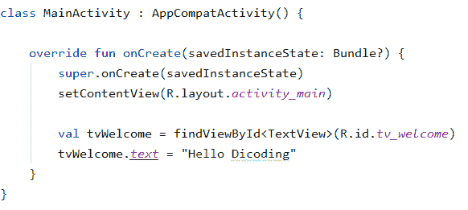
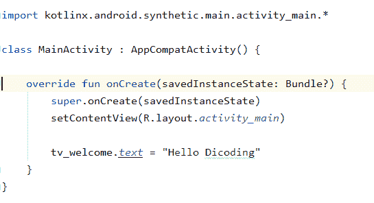
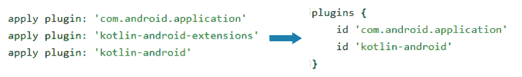
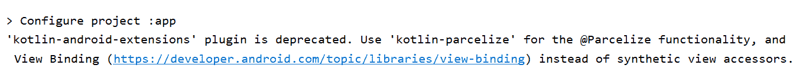
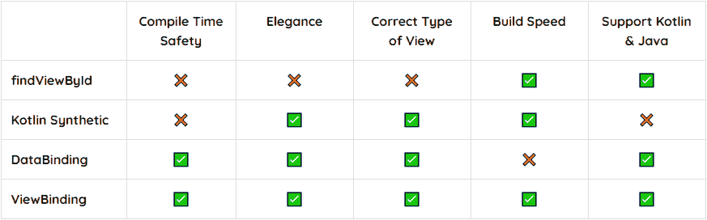

# Kotlin Android Extension Deprecated? Yuk Migrasi Synthetic ke View Binding| New in Android Studio 4.1 Part #2

> 原文：<https://medium.easyread.co/kotlin-android-extension-deprecated-cad3b698d163?source=collection_archive---------1----------------------->

Hai gaess.. kali ini kita akan melanjutkan series blog yang sebelumnya, yaitu yang berhubungan dengan update yang cukup signifikan ketika membuat project baru di Android Studio 4.1.

Jika kalian penasaran dengan series yang pertama, silakan cek di sini

[](https://medium.com/@arifaizin/migrasi-appcompat-ke-material-design-component-mdc-new-in-android-studio-4-1-part-1-87af7ef30ad4) [## Migrasi AppCompat ke Material Design Component (MDC) | New in Android Studio 4.1 Part #1

### Hai gaes.. beberapa minggi kemarin ada update yang cukup menggemparkan untuk kami pembuat course Android. Mengapa? Hal…

medium.com](https://medium.com/@arifaizin/migrasi-appcompat-ke-material-design-component-mdc-new-in-android-studio-4-1-part-1-87af7ef30ad4) 

Nah pada part dua ini kita akan membahas Kotlin Android Extension. Sebelum melangkah lebih jauh, yuk kita bahas apa itu Kotlin Android Extension (KAE)? Ini merupakan plugin yang sering Anda gunakan namun Anda tak sadar kalau menggunakannya. hehe.

# Kotlin Synthetic

Salah satu fitur utama dari KAE ini yaitu Kotlin Synthetic. Dengan Kotlin Synthetic Anda bisa memanggil view yang di dalam layout tanpa perlu menginisialisasinya secara manual menggunakan findViewById.

Berikut ini adalah contoh cara manual dengan menggunakan findViewById:



Dan kemudian ini adalah contoh penggunaan Kotlin Synthetic



Seperti yang Anda lihat, Anda hanya cukup menambahkan import sesuai dengan layout yang ingin diakses dan Anda bisa langsung menggunakan id yang di dalam layout tersebut. Mantap bukan?

Untuk Anda yang sejak pertama pengguna Kotlin mungkin sudah terbiasa, bahkan mungkin tak tau proses dibaliknya. Namun bagi yang sebelumnya menggunakan Java ini adalah sesuatu yang keren! Hal ini karena kode jadi lebih simpel dan efisien.

# Android Studio 4.1 New Template

Nah, lalu apa problemnya? Hal ini bermula ketika negara api menyerang, eh ketika update ke Android Studio 4.1\. Yakni ketika Anda membuat project baru, saat ini Kotlin Android Extension sudah tidak termasuk di plugin default yang di-generate.



Sebenarnya Anda bisa menambahkan plugin ini secara manual, namun hal ini menyisakan pertanyaan dan penasaran. Mengapa plugin KAE ini dihilangkan?

Setelah hari berlalu, barulah diketahui bahwa ternyata pada **Kotlin 1.4.20** , KAE ini dinyatakan deprecated, ya benar **deprecated** . Artinya plugin ini sudah tidak di-update lagi walaupun masih bisa digunakan.

Seperti ini warningnya jika Anda mencoba menjalankan project dengan KAE pada Kotlin 1.4.20 :



Disebutkan bahwa untuk saat ini sebaiknya Anda menggunakan ViewBinding daripada Kotlin Synthetic, namun kira-kira mengapa ya? Berikut ini jawabannya.

# ViewBinding Vs Kotlin Synthetic



Jika dilihat Kotlin Synthetic memang keren dan bikin kode lebih simpel dan elegan. Namun problemnya yaitu penggunaan Kotlin Synthetic terkadang tidak aman. Hal ini bisa terjadi jika Anda memiliki 2 komponen dengan id yang sama dengan layout berbeda, Anda bisa saja salah memanggil id yang bisa menyebabkan error.

Selain itu ia hanya support pada bahasa Kotlin saja. Berbeda dengan ViewBinding yang support keduanya dan tentunya *Compile Time Safety* . Aman dari error seperti di atas.

# Cara Menggunakan ViewBinding

Lalu bagaimana mengimplementasikan ViewBinding pada project yang sudah Anda buat. Hal pertama yang perlu Anda lakukan yaitu mengaktifkan ViewBinding pada build.gradle seperti berikut:

```
android {
    ...
 **buildFeatures {
        viewBinding true
   }**
}
```

Maka secara otomatis ia akan men-generate semua layout menjadi kelas yang sudah berisi inisialisasi View. Sebagai contoh jika Anda mempunyai **activity_main.xml** maka menjadi **ActivityMainBinding.** Dan berikut ini adalah contoh implementasinya.

```
class MainActivity : AppCompatActivity() {

 **private lateinit var binding: ActivityMainBinding** 
   override fun onCreate(savedInstanceState: Bundle?) {
       super.onCreate(savedInstanceState)
 **binding = ActivityMainBinding.inflate(layoutInflater)**       setContentView(**binding.root**)
       //Not need : val tvWelcome = findViewById(R.id.tv_welcome) 
  **     binding.tvWelcome.text = "Hello Gaes"**
   }
}
```

Selanjutnya Anda bisa memanggil id yang di dalam activity_main.xml dengan format camelCase, seperti yang sebelumnya **tv_welcome** maka menjadi **tvWelcome** . Mantap! Sudah tidak perlu findViewById lagi kan?

# ViewBinding pada Fragment

Lalu bagaimana jika di Fragment. Untuk di Fragment agak sedikit berbeda, di mana Anda harus me-reset binding pada onDestroyView supaya tidak terjadi *memory leak.*

```
**private var _binding: FragmentHomeBinding? = null
private val binding get() = _binding!!**override fun onCreateView(
       inflater: LayoutInflater, container: ViewGroup?,
       savedInstanceState: Bundle?
): View? {
 **_binding = FragmentHomeBinding.inflate(inflater, container, false)
   return binding.root**
}override fun onDestroyView() {
   super.onDestroyView()
 **_binding = null**
}
```

# ViewBinding pada Adapter

Lalu berikut ini adalah contoh penerapannya di dalam adapter saat menggunakan RecyclerView dengan **item_layout.xml**

```
override fun onCreateViewHolder(parent: ViewGroup, viewType: Int): MyViewHolder {
        **val binding = ItemLayoutBinding.inflate**(
              LayoutInflater.from(parent.context), parent, false)
        return MyViewHolder(**binding**)
    }inner class MyViewHolder(**val binding: ItemLayoutBinding**): RecyclerView.ViewHolder(**binding.root**) {
   fun bind(hero: Hero) {
       **binding.tvName**.setText(hero.name)
   }
}
```

# ViewBinding pada Include Layout

Jika terdapat layout yang include layout lain, Anda tidak bisa langsung menggunakan ViewBinding. Anda harus memberikan id pada include tersebut seperti ini:

```
<include 
 **android:id="@+id/content"**   layout="@layout/content_detail_main" />
```

Maka Anda bisa memanggil View yang di dalam include layout tersebut seperti ini:

```
binding.**content**.tvDetailDescription.text = "Hai!"
```

# Bonus: Kotlin Parcelize

Perlu Anda ketahui bahwa Parcelize yang digunakan untuk membuat Parcelable juga termasuk pada plugin Kotlin Android Extension. Lalu bagaimana untuk mengatasinya?

Anda perlu menambahkan plugin baru khusus untuk Parcelize dengan menambahkan kode berikut pada build.gradle

```
plugins{
   id 'com.android.application'
   id 'kotlin-android'
   **id 'kotlin-parcelize'** }
```

dan mengganti import yang sebelumnya

```
import kotlinx.android.parcel.Parcelize
```

menjadi

```
import kotlinx.parcelize.Parcelize
```

Untuk kode yang lainnya tetap sama. Alhamdulillah

Mantap! Banyak sekali perubahan yang terjadi pada Android Studio 4.1\. ini. Semoga artikel ini bisa memberikan pencerahan dan membantu Anda dalam bermigrasi. Yang jelas supaya nggak bingung ketika membuat project baru. Hehe.

Sekian dari saya dan sampai jumpa!

> *progress is ompossible without change, and those wh cannot change their minds cannot change anything. — George Bernard Shaw*