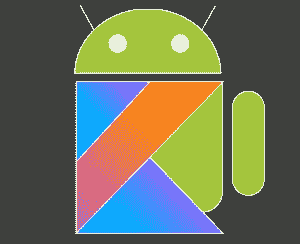
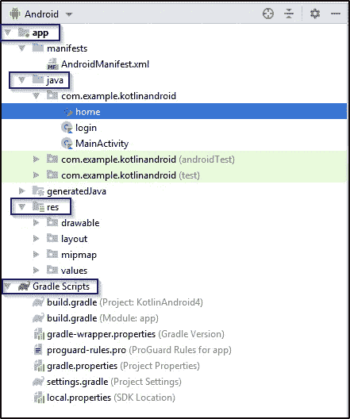
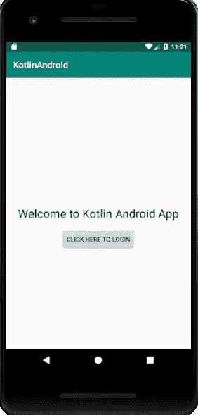
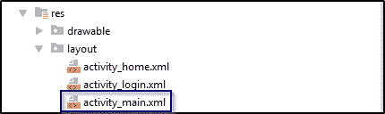
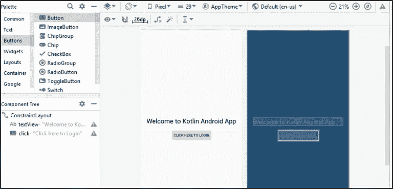
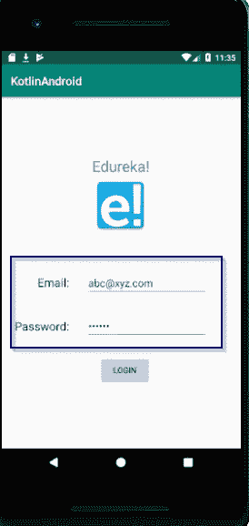
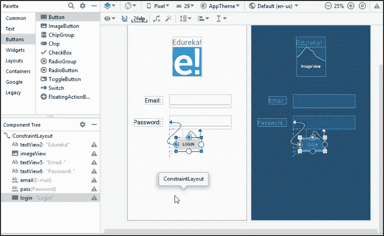
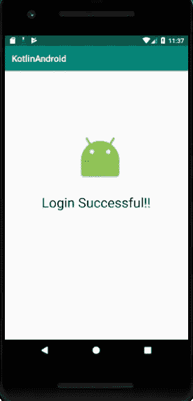
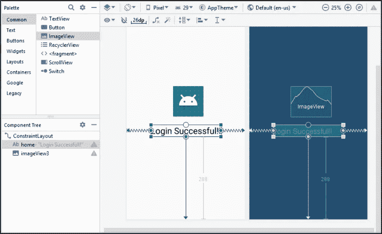

# 如何使用 Kotlin 开发 Android App？

> 原文：<https://medium.com/edureka/kotlin-android-tutorial-cea896d0ae18?source=collection_archive---------2----------------------->


Kotlin Android Tutorial — Edureka

Kotlin 是一种可以在 JVM 上运行的语言。Google 已经宣布 Kotlin 是 Android Studio 中官方支持的编程语言之一，Android 社区正在以很高的速度从 Java 迁移到 Kotlin。在这篇 Kotlin Android 教程中，我将告诉你如何使用 Kotlin 创建一个 Android 应用程序。

本文涵盖了以下主题:

*   科特林是什么？
*   Android 简介
*   Android Studio 简介
*   使用 Kotlin 创建第一个 Android 应用程序

我们开始吧！

# 科特林是什么？

Kotlin 是一种静态类型的通用编程语言，具有类型推断功能。它被广泛用于开发 Android 应用程序。Kotlin 旨在与 Java 完全互操作，其标准库的 JVM 版本依赖于 Java 类库，但类型推断允许其语法更加简洁。Kotlin 主要针对 JVM，但也编译成 JavaScriptor 或本地代码。Kotlin 由 JetBrains 和 Google 通过 Kotlin 基金会赞助。

现在我们来了解一下 Android 的基本基本面。

# Android 简介

Android 是谷歌开发的移动操作系统。它基于 Linux 内核，主要为智能手机和平板电脑等触摸屏移动设备设计。



Android 是当今市场上最成功、最强大的移动操作系统。所以在开始之前，让我们先来回答一下为什么选择 Android？

*   开源
*   可定制的操作系统
*   降低开发成本和整体复杂性
*   更大的社区和开发者覆盖范围
*   应用程序间集成
*   更高的成功率
*   丰富的开发环境—可以开发各种应用

# Android Studio 简介

Android studio 是为 **Android** 平台开发应用程序的官方 IDE(集成开发环境)或工具之一。它有一个强大的编辑器工具，用于开发不同版本的创意 UI 和仿真器，以便在没有实际的 **Android** 设备的情况下测试和模拟传感器。

也可以用 IntelliJ 开发 Android 应用，但 Android Studio 更适合 app 开发。现在让我们看看如何在您的系统上安装它。

**第一步:**从[这个链接](https://developer.android.com/studio)下载 Android Studio。

**第二步:**下载完成后，打开 Android Studio，在欢迎界面或**文件|新建|新建项目**上点击**开始一个新的 Android Studio 项目。**

**步骤 3:** 选择一个定义应用程序行为的[活动](https://developer.android.com/guide/components/activities/intro-activities)。你的第一次申请。选择**刚显示一个画面的空活动**，点击**下一步**。

**第四步:**之后，你需要选择首选的编程语言，点击下一步按钮。

**步骤 5:** 一旦一切都设置好了，并且您的项目也配置好了，您的项目结构看起来如下所示。



这不过是对 Android 应用程序的剖析，它由一个*应用程序、Java、res* 和 *Gradle 脚本*组成。

现在让我们编写一个程序，创建一个简单的登录 Android 应用程序。

# 使用 Kotlin 创建第一个 Android 应用程序

在这里，我将创建一个*登录 android 应用程序。*这里，第一个屏幕是欢迎页面，如下所示。



为了创建和设计这个屏幕，您需要配置您的布局。为此，您需要打开布局文件夹并双击 *activity_main.xml* ，如下所示。



打开 XML 文件后，您需要根据您希望屏幕显示的结构创建元素。在创建元素之前，我将打开 design 选项卡，将按钮拖放到我的屏幕上，如下所示。



之后，我将返回并配置 *activity_main.xml* 文件，并创建所有的元素。您的代码看起来像:

```
<?xml version="1.0" encoding="utf-8"?>
<androidx.constraintlayout.widget.ConstraintLayout
xmlns:android="[http://schemas.android.com/apk/res/android](http://schemas.android.com/apk/res/android)"
xmlns:tools="[http://schemas.android.com/tools](http://schemas.android.com/tools)"
xmlns:app="[http://schemas.android.com/apk/res-auto](http://schemas.android.com/apk/res-auto)"
android:layout_width="match_parent"
android:layout_height="match_parent"
tools:context=".MainActivity">

<TextView
android:layout_width="wrap_content"
android:layout_height="wrap_content"
android:text="Welcome to Kotlin Android App"
android:textSize="26sp"
android:textColor="#000000"
app:layout_constraintBottom_toBottomOf="parent"
app:layout_constraintLeft_toLeftOf="parent"
app:layout_constraintRight_toRightOf="parent"
app:layout_constraintTop_toTopOf="parent" android:id="@+id/textView"/>
<Button
android:text="Click here to Login"
android:layout_width="wrap_content"
android:layout_height="wrap_content"
android:id="@+id/click" android:layout_marginTop="16dp"
app:layout_constraintTop_toBottomOf="@+id/textView" android:layout_marginEnd="96dp"
android:layout_marginRight="96dp" app:layout_constraintEnd_toEndOf="@+id/textView"/>

</androidx.constraintlayout.widget.ConstraintLayout>
```

**注意:**如果第一次打开项目时 Gradle 项目同步失败，点击“消息”窗口中的“安装缺失的平台并同步项目”链接，缺失的组件将由 Android Studio 下载并安装。

在此之后，您需要创建一个 Kotlin 类文件来添加侦听器，以便从 XML 文件中调用操作。所以在这里，我将添加侦听器来调用我在 XML 文件中创建的按钮和文本视图的操作。

```
package com.example.kotlinandroid

import android.content.Intent
import androidx.appcompat.app.AppCompatActivity
import android.os.Bundle
import android.widget.Button
import android.widget.Toast

class MainActivity : AppCompatActivity() {

override fun onCreate(savedInstanceState: Bundle?) {
super.onCreate(savedInstanceState)
setContentView(R.layout.activity_main)

val but_click=findViewById<Button>(R.id.click)
but_click.setOnClickListener{
val intent = Intent(this, login::class.java)
startActivity(intent)
}
}
}
```

这样，您的第一个欢迎页面屏幕就完全创建好了。接下来，您将看到登录屏幕，您需要输入电子邮件地址和密码，然后点击登录按钮，如下图所示。



现在，我将根据第二个活动的“设计”选项卡中的上图创建设计，即 *activity_login.xml* 文件，如下所示。



之后，我将配置我的 XML 文件，如上图所示。

```
<?xml version="1.0" encoding="utf-8"?>
<androidx.constraintlayout.widget.ConstraintLayout
xmlns:android="[http://schemas.android.com/apk/res/android](http://schemas.android.com/apk/res/android)"
xmlns:tools="[http://schemas.android.com/tools](http://schemas.android.com/tools)"
xmlns:app="[http://schemas.android.com/apk/res-auto](http://schemas.android.com/apk/res-auto)"
android:layout_width="match_parent"
android:layout_height="match_parent"
tools:context=".login">

<TextView
android:text="Edureka!"
android:textSize="26sp"
android:textColor="#3677d1"
android:layout_width="wrap_content"
android:layout_height="wrap_content"
android:id="@+id/textView2" app:layout_constraintTop_toTopOf="parent"
app:layout_constraintStart_toStartOf="parent" android:layout_marginTop="101dp"
app:layout_constraintEnd_toEndOf="parent"/>
<ImageView
android:layout_width="100sp"
android:layout_height="100sp" app:srcCompat="[@mipmap/edureka](http://twitter.com/mipmap/edureka)"
android:id="@+id/imageView"
app:layout_constraintTop_toBottomOf="@+id/textView2"
app:layout_constraintEnd_toEndOf="@+id/textView2"/>
<TextView
android:text="Email: "
android:textSize="20sp"
android:textColor="#000000"
android:layout_width="wrap_content"
android:layout_height="wrap_content"
app:layout_constraintStart_toStartOf="parent" android:layout_marginTop="69dp"
android:layout_marginLeft="6dp" android:layout_marginStart="6dp"
app:layout_constraintTop_toBottomOf="@+id/imageView" android:id="@+id/textView5"
app:layout_constraintHorizontal_chainStyle="packed" app:layout_constraintEnd_toStartOf="@+id/email"
android:layout_marginEnd="24dp" android:layout_marginRight="24dp"/>
<TextView
android:text="Password: "
android:textSize="20sp"
android:textColor="#000000"
android:layout_width="wrap_content"
android:layout_height="wrap_content"
app:layout_constraintStart_toStartOf="parent" android:layout_marginTop="144dp"
android:layout_marginLeft="6dp" android:layout_marginStart="6dp"
app:layout_constraintTop_toBottomOf="@+id/imageView" android:id="@+id/textView6"
app:layout_constraintHorizontal_chainStyle="packed" app:layout_constraintEnd_toStartOf="@+id/pass"
android:layout_marginEnd="24dp" android:layout_marginRight="24dp"
app:layout_constraintHorizontal_bias="1.0"/>
<EditText
android:layout_width="wrap_content"
android:layout_height="wrap_content"
android:inputType="textEmailAddress"
android:ems="10"
android:id="@+id/email"
app:layout_constraintBaseline_toBaselineOf="@+id/textView5"
app:layout_constraintStart_toEndOf="@+id/textView5" app:layout_constraintEnd_toEndOf="parent"/>
<EditText
android:layout_width="wrap_content"
android:layout_height="wrap_content"
android:inputType="textPassword"
android:ems="10"
android:id="@+id/pass"
app:layout_constraintStart_toStartOf="@+id/email" android:layout_marginTop="29dp"
app:layout_constraintTop_toBottomOf="@+id/email"/>
<Button
android:text="Login"
android:layout_width="wrap_content"
android:layout_height="wrap_content"
android:id="@+id/login"
app:layout_constraintStart_toStartOf="@+id/pass" android:layout_marginTop="29dp"
android:layout_marginLeft="23dp" android:layout_marginStart="23dp"
app:layout_constraintTop_toBottomOf="@+id/pass"/>
</androidx.constraintlayout.widget.ConstraintLayout>
```

在此之后，您需要创建一个 Kotlin 类文件来添加侦听器，以便从 XML 文件中调用操作。所以在这里，我将添加侦听器来调用电子邮件和密码字段的操作，以及我在 XML 文件中创建的按钮的操作。

```
package com.example.kotlinandroid

import android.content.Intent
import androidx.appcompat.app.AppCompatActivity
import android.os.Bundle
import android.widget.Button
import android.widget.EditText
import android.widget.Toast

class login : AppCompatActivity() {

override fun onCreate(savedInstanceState: Bundle?) {
super.onCreate(savedInstanceState)
setContentView(R.layout.activity_login)
val email = findViewById(R.id.email) as EditText
val pass = findViewById(R.id.pass) as EditText

val btnLogin = findViewById(R.id.login) as Button
btnLogin.setOnClickListener {
//read value from EditText to a String variable
val ema: String = email.text.toString()
val pas: String = pass.text.toString()
//check if the EditText have values or not
if (ema.trim().length == 0) {
Toast.makeText(applicationContext, "Email field cannot be empty", Toast.LENGTH_SHORT).show()
}
if (pas.trim().length == 0) {
Toast.makeText(applicationContext, "Password field cannot be empty", Toast.LENGTH_SHORT).show()
}

if (ema.equals("[abc@xyz.com](mailto:abc@xyz.com)")&&(pas.equals("123456"))){
val intent = Intent(this, home::class.java)
startActivity(intent)
} else{
Toast.makeText(applicationContext, "Wrong Email or Password!!", Toast.LENGTH_SHORT).show()
}
}
}
}
```

现在，您只剩下最后一个屏幕。那是你的主屏幕。输入有效的用户名和密码后，您将进入下一个屏幕，如下所示。



我还必须配置这个屏幕。现在，我将根据第二个活动的“设计”选项卡中的上图创建设计，即 *activity_home.xml* 文件，如下所示。



现在让我们为创建的相同设计编写代码。

```
<?xml version="1.0" encoding="utf-8"?>
<androidx.constraintlayout.widget.ConstraintLayout
xmlns:android="[http://schemas.android.com/apk/res/android](http://schemas.android.com/apk/res/android)"
xmlns:tools="[http://schemas.android.com/tools](http://schemas.android.com/tools)"
xmlns:app="[http://schemas.android.com/apk/res-auto](http://schemas.android.com/apk/res-auto)"
android:layout_width="match_parent"
android:layout_height="match_parent"
tools:context=".home">

<TextView
android:text="Login Successful!!"
android:textColor="#000000"
android:textSize="30sp"
android:layout_width="wrap_content"
android:layout_height="wrap_content"
android:id="@+id/home"
app:layout_constraintStart_toStartOf="parent"
app:layout_constraintEnd_toEndOf="parent" app:layout_constraintBottom_toBottomOf="parent"
android:layout_marginBottom="288dp"/>
<ImageView
android:layout_width="142dp"
android:layout_height="106dp" app:srcCompat="[@android](http://twitter.com/android):drawable/sym_def_app_icon"
android:id="@+id/imageView3"
app:layout_constraintStart_toStartOf="@+id/home" android:layout_marginLeft="60dp"
android:layout_marginStart="60dp" android:layout_marginBottom="28dp"
app:layout_constraintBottom_toTopOf="@+id/home"/>
</androidx.constraintlayout.widget.ConstraintLayout>
```

在此之后，您需要创建一个 Kotlin 类文件来添加侦听器，以便从 XML 文件中调用操作。所以在这里，我将添加侦听器，用于调用我在 XML 文件中创建的文本视图和图像的操作。

```
package com.example.kotlinandroid

import androidx.appcompat.app.AppCompatActivity
import android.os.Bundle
class home : AppCompatActivity() {
override fun onCreate(savedInstanceState: Bundle?) {
super.onCreate(savedInstanceState)
setContentView(R.layout.activity_home)
}
}
```

配置完所有 3 个屏幕后，你必须检查 gradle build，然后运行项目。当你这样做时，它会要求你选择虚拟设备，你需要选择一个你喜欢的，并运行代码。您的第一个移动应用程序将会启动。

这就是你需要如何使用 Kotlin 编程语言创建你的第一个 Android 应用程序。这就把我们带到了这篇关于 Kotlin Android 教程的文章的结尾。希望你清楚这篇文章中与你分享的所有内容。

如果你想查看更多关于人工智能、Python、道德黑客等市场最热门技术的文章，那么你可以参考 E [dureka 的官方网站。](https://www.edureka.co/blog/?utm_source=medium&utm_medium=content-link&utm_campaign=kotlin-android-tutorial)

请留意本系列中的其他文章，它们将解释 Android 的各个方面。

> [如何与科特林土著合作？](/edureka/basic-kotlin-native-app-a22febf0f6d7)
> 
> [如何成为一名 Android 开发者？](/edureka/become-android-developer-4a6424d698f3)

*原载于 2019 年 8 月 5 日*[*https://www.edureka.co*](https://www.edureka.co/blog/kotlin-android-tutorial/)*。*