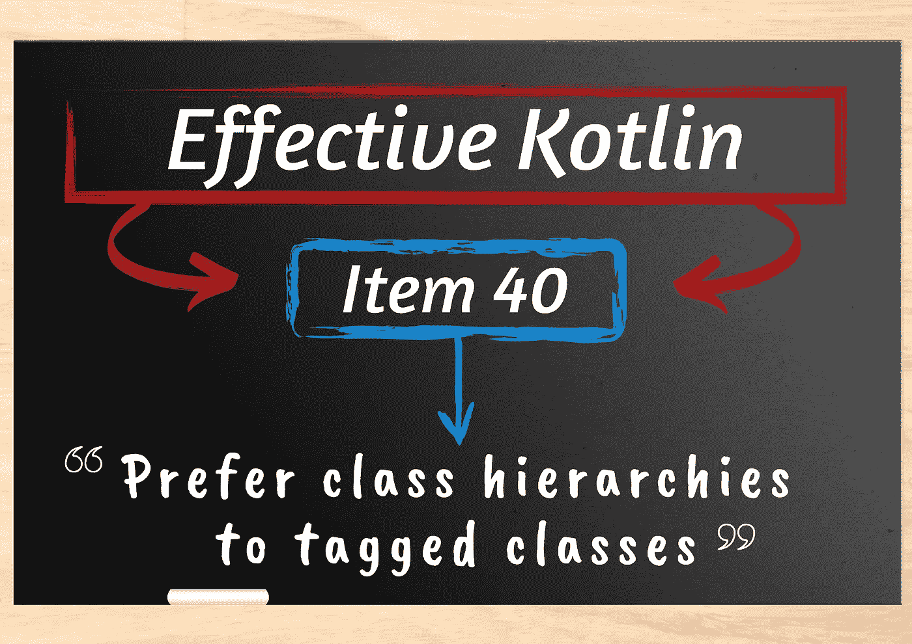

# 来自 Kt 的 Kotlin 文章和研讨会信息。学院

> 原文：<https://blog.kotlin-academy.com/kotlin-articles-and-workshop-info-from-kt-academy-f5bad4bfee08?source=collection_archive---------4----------------------->

你好，
Kt。这里是学院**👋**

以下是您将在此简讯中找到的内容的快捷方式:

✅ 2 篇文章是有效的科特林书的一部分:
👉使用密封的类和接口来表达受限的层次结构
👉更喜欢类层次结构而不是标记类
✅·科特林集合 vs 序列只需 5 分钟

尽情享受吧！⏬

密封的类和接口可能看起来没什么大不了的，但是它们极大地改变了我们构建程序的方式。
要了解更多信息，请阅读文章 [**使用密封的类和接口来表达受限的层次结构**](https://kt.academy/article/ek-sealed-classes) ，这是有效的科特林书的一部分，作者是**马钦·莫斯卡扎·⤵️**

如果您想知道什么是标记类，以及为什么我们应该使用类层次结构来代替它们，请阅读本文👇

让我们在短短 5 分钟内了解一下 [**科特林集合与序列的区别**](/kotlin-collections-vs-sequences-in-just-5minutes-70a3c3ec94a8) **🔥**
文章由**莫妮卡·库马尔·杰塔尼撰写👇**

我们现在正在组织
❗️ [**重构清理代码**](https://kt.academy/workshop/refactoringToCleanCode) ❗️
的公开研讨会，由**沃德克·克拉科夫斯基主持🤩**

**日期**:2021 年 6 月 21 日
**时间**:10:00–18:00 CEST
**价格** : 180 欧元/份

了解更多详情并在此注册👇

要查看我们的其他研讨会，请访问我们的网站[kt.academy/workshop](https://kt.academy/workshop)或者如果您有任何具体需求，请直接联系我们。

谢谢，再见！

卡帕头。学院团队