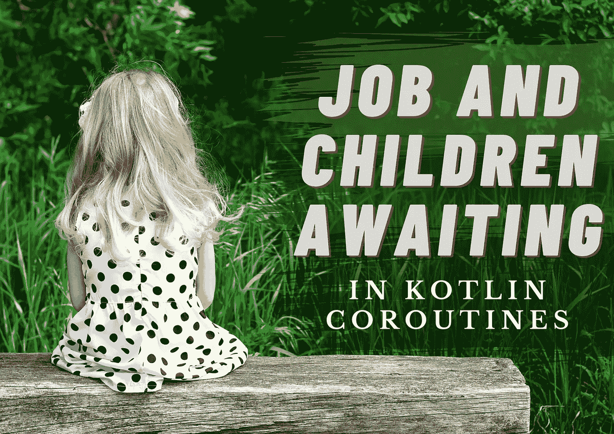
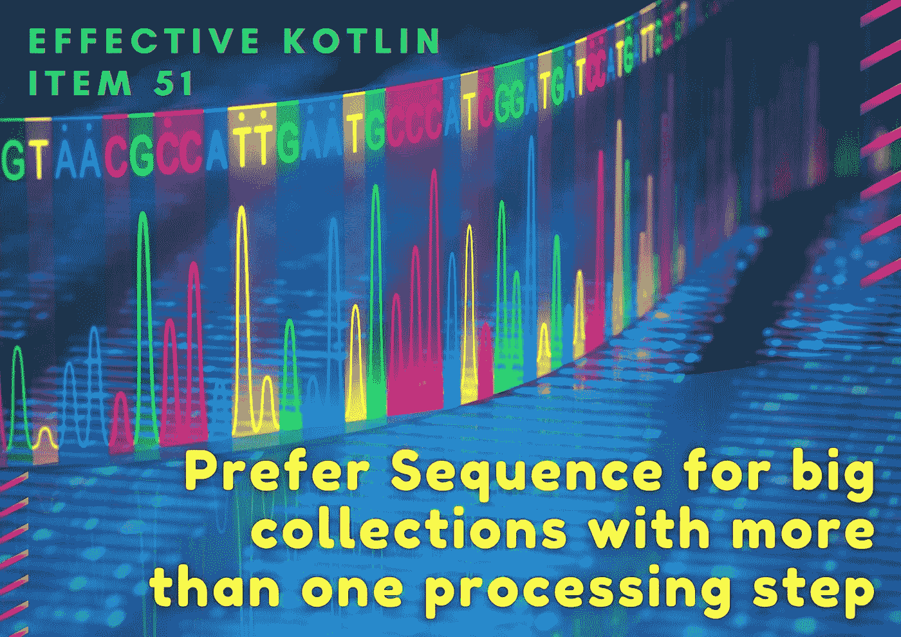
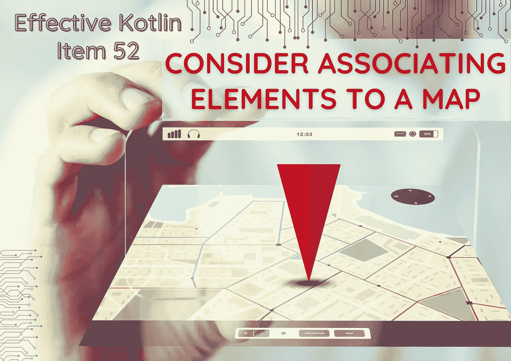

# Kt 的 Kotlin 文章和 Kotlin 协同程序研讨会。学院

> 原文：<https://blog.kotlin-academy.com/kotlin-articles-kotlin-coroutines-workshop-from-kt-academy-2146c418e04?source=collection_archive---------1----------------------->

你好！
Kt。这里是学院**👋**

这次我们为科特林爱好者准备了 4 篇文章！

*️⃣:我们很想听听你对这份时事通讯的想法和建议。请回复此邮件与我们分享📩

以下是今天内容的简要总结👇

**文章**
👉[在科特林协程中等待的工作和孩子](https://kt.academy/article/cc-job)
👉[在 Kotlin 协程中取消](https://kt.academy/article/cc-cancellation)
👉有效 Kotlin 项目 51: [对于具有多于一个处理步骤](https://kt.academy/article/ek-sequence)
的 [的大集合，优选顺序👉有效 Kotlin 项目 52:](https://kt.academy/article/ek-sequence) [考虑将元素关联到一个地图](https://kt.academy/article/ek-associate)

**Kotlin Coroutines 开放工作坊**即将在🥳举行

尽情享受吧！⏬

什么是作业，它是负责结构化并发的最重要的上下文是什么？

**工作和孩子在科特林县等待着👇**

[Job and children awaiting in Kotlin Coroutines](https://kt.academy/article/cc-job)
🔻 This is a chapter from the [Kotlin Coroutines](https://kt.academy/book/coroutines) book. You can find Early Access on [LeanPub](https://leanpub.com/coroutines/).

关于 Kotlin 协程中的取消机制，您需要了解的一切。

**Marcin Moskala 的《科特林协程》中的取消**👇

[Cancellation in Kotlin Coroutines](https://kt.academy/article/cc-cancellation)
🔻 This is a chapter from the [Kotlin Coroutines](https://kt.academy/book/coroutines) book. You can find Early Access on [LeanPub](https://leanpub.com/coroutines/).

列表和序列处理的区别是什么，什么时候应该优先选择哪一种？

**多于一个加工步骤的大型系列的首选顺序**Marcin moska a👇

[Effective Kotlin Item 51: Prefer Sequence for big collections with more than one processing step](https://kt.academy/article/ek-sequence)
🔻 This is a chapter from the [Effective Kotlin](https://kt.academy/book/effectivekotlin) book. You can find it on [LeanPub](https://leanpub.com/effectivekotlin) or [Amazon](https://www.amazon.com/Effective-Kotlin-practices-Marcin-Moskala/dp/8395452837/ref=sr_1_1?dchild=1&keywords=effective+kotlin&qid=1615033955&sr=8-1).

associateBy 对提高查找元素的性能有何帮助？

考虑将元素与 Marcin Moskał a 的地图相关联👇

[Item 52: Consider associating elements to a map](https://kt.academy/article/ek-associate)
🔻 This is a chapter from the [Effective Kotlin](https://kt.academy/book/effectivekotlin) book. You can find it on [LeanPub](https://leanpub.com/effectivekotlin) or [Amazon](https://www.amazon.com/Effective-Kotlin-practices-Marcin-Moskala/dp/8395452837/ref=sr_1_1?dchild=1&keywords=effective+kotlin&qid=1615033955&sr=8-1).

还有不到两周的时间来参加我们由 Marcin Moskał a 主持的公开 **Kotlin Coroutines** 研讨会🔥

日期:**2021 年 10 月 7-8 日**
时间:**9:00-17:00 CET**(GMT+2)
价格: **280 欧元**每人
郎:**恩**

查看详细信息并在此注册👇
[科特林花冠开放工场](https://kt.academy/workshop/coroutines)

今天就到这里吧！

谢谢，再见！

卡帕头。学院团队

www: [kt.academy](https://kt.academy/)
博客:[blog.kotlin-academy.com](http://blog.kotlin-academy.com/)
Twitter EN:[@ ktdotsacademy](https://twitter.com/ktdotacademy)
Twitter PL:[@ ktdotsacademypl](https://twitter.com/ktdotacademyPL)
FB:[@ ktdotsacademy](https://www.facebook.com/KtDotAcademy)
LinkedIn:[@ Kt。学院](https://www.linkedin.com/company/kt-academy/)

