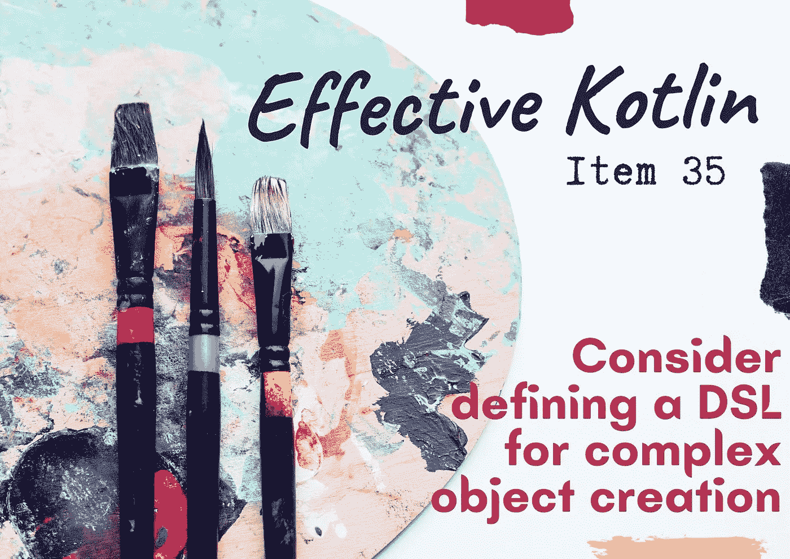
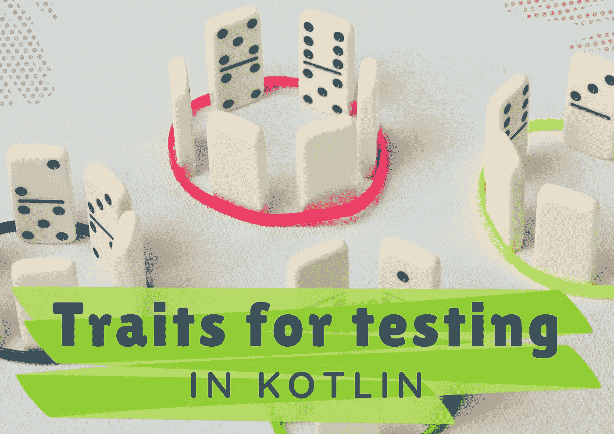
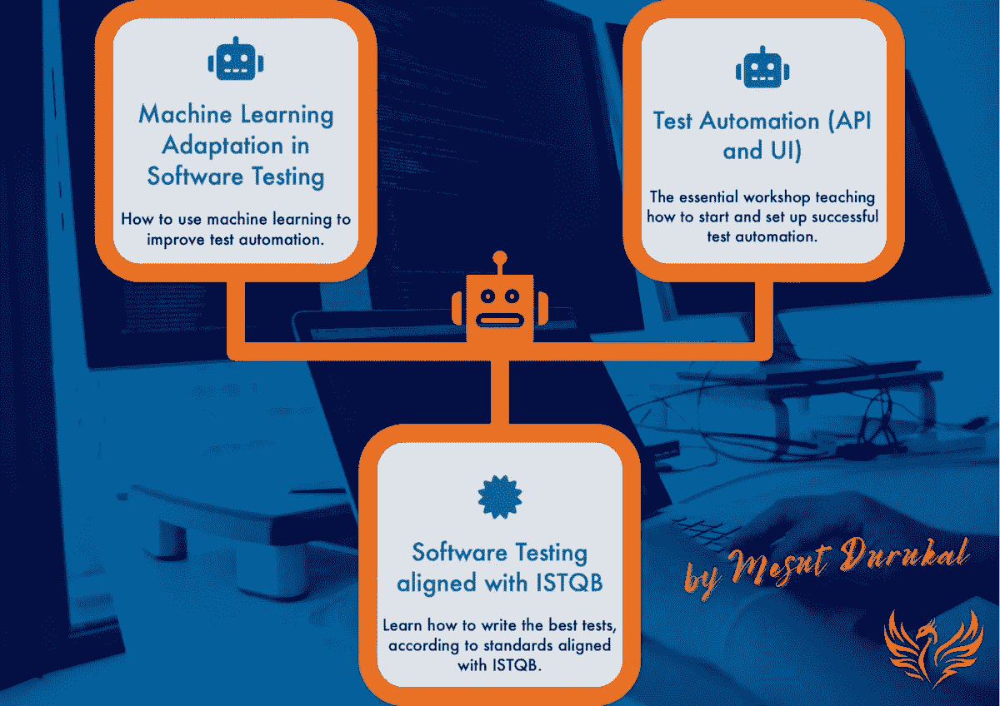
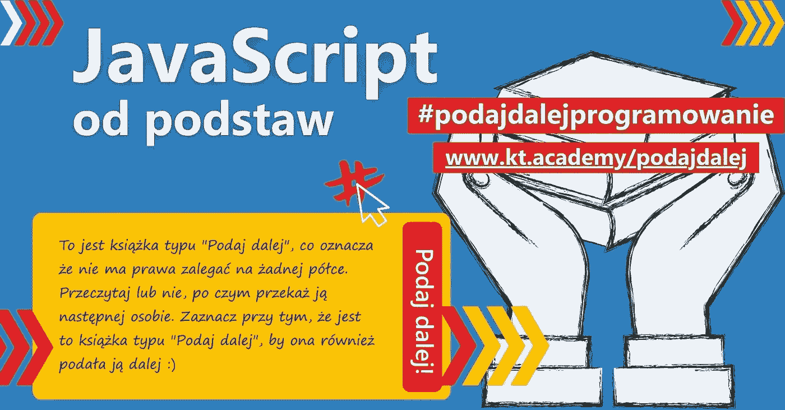

# 科特林文章&更多来自 Kt 的新闻。学院💪

> 原文：<https://blog.kotlin-academy.com/kotlin-articles-more-news-from-kt-academy-fe0aef91a550?source=collection_archive---------0----------------------->

嘿大家好！**👋**

夏天过得怎么样？希望你没有在高温下挣扎太多！🥵为了让你的夏日时光更加愉快，我们正在发送一批新的精彩内容！

请记住，您可以通过回复此电子邮件与我们分享您的想法和建议📩

现在，这是今天内容的快捷方式👇

**文章**👉考虑为复杂对象创建定义 DSL
👉为什么使用 Kotlin 协程？
👉Kotlin 测试的特征
👉Kotlin 协程

**中的序列构建器新工作坊**现已推出！
多几个**变**为 Kt。学院**网站。**
给我们波兰观众的新闻！🇵🇱

尽情享受吧！⏬

什么是 Kotlin DSLs，它们是如何工作的，我们如何自己实现这种模式？🤔

**考虑为复杂对象创建定义一个 DSL**👇

[Effective Kotlin Item 35: Consider defining a DSL for complex object creation](https://kt.academy/article/ek-dsl)
🔻 This is a chapter from the [Effective Kotlin](https://kt.academy/book/effectivekotlin) book. You can find it on [LeanPub](https://leanpub.com/effectivekotlin) or [Amazon](https://www.amazon.com/Effective-Kotlin-practices-Marcin-Moskala/dp/8395452837/ref=sr_1_1?dchild=1&keywords=effective+kotlin&qid=1615033955&sr=8-1).

Marcin Moskala 解释了为什么协同程序脱颖而出，并为我们提供了其他技术没有提供的东西。

**为什么要使用 Kotlin 协程？**👇

[Why using Kotlin Coroutines?](https://kt.academy/article/cc-why)
🔻 This is a chapter from the [Kotlin Coroutines](https://kt.academy/book/coroutines) book. You can find Early Access on [LeanPub](https://leanpub.com/coroutines/).

在 Kotlin 中，使用特征进行测试是一种相当流行的模式👀

要了解它是如何工作的，请阅读 Marcin Moska 写的文章**在 Kotlin 中测试的特征**👇

[Traits for testing in Kotlin](https://kt.academy/article/traits-testing)

如何使用 Kotlin 协程创建序列？

**Marcin Moskala 的 Kotlin 协同程序中的序列构建器**👇

[Sequence builders in Kotlin Coroutines](https://kt.academy/article/cc-sequence)
🔻 This is a chapter from the [Kotlin Coroutines](https://kt.academy/book/coroutines) book. You can find Early Access on [LeanPub](https://leanpub.com/coroutines/).

我们提供了 3 个新的工作坊，都是由一位伟大的培训师主持的🔥

✅ [软件测试中的机器学习适应](https://kt.academy/workshop/testML)
✅ [测试自动化(API 和 UI)](https://kt.academy/workshop/testAutomation)
✅ [软件测试与 ISTQB](https://kt.academy/workshop/testingISTQB) 保持一致

了解更多详情并在我们的网站上注册👇
[Kt。学院-研讨会](https://kt.academy/workshop)

我们网站的 2 个变化🎉

1️⃣ **文章评论**💬

现在，您可以在每篇文章的末尾添加评论并查看他人的评论👉它意味着更容易的交流和更多的互动！

2️⃣ **RSS 提要** ⚛️

对于使用 RSS 的用户，我们最终启动了对 it 的支持。学院【】
https://kt . academy/RSS . XML】[https://kt . academy/atom . XML](https://kt.academy/atom.xml) 

这是我们的政治听证会

我们启动了行动" T12 "接着是" T13 "这本书" t14 " JavaScript 从底部开始" T15 "，由 marcin Moscow 编写。

我们希望通过它来普及编程技能。
作为行动的一部分，我们分发 1000 本“下一步”书籍，让他们从手中游移，帮助下一个人

除其他外，**【阿勒格洛阿、公证员、程序员杂志】**以及许多程序员和影响者已经参与了行动

如果您想了解更多有关行动的信息，请成为我们的大使或以任何其他方式支持行动，请访问下面的
[https://kt . academy/pl/presenter]页面学院足球俱乐部](https://kt.academy/pl/podajdalej)

让知识传播！(西班牙语)

[https://kt.academy/pl/podajdalej](https://kt.academy/pl/podajdalej)

今天就到这里！

谢谢你，再见！

-你好。学院队

www . t26 . academy 博客:T29 .科林学院. com
Twitter 和:[@ kt cademy](https://twitter.com/ktdotacademy)Twitter { fn 方正准圆简体 fs 121 chc 9e cc 4 } Twitter { fn 方正准圆简体 fs 121 chc 9e cc 4 }这是一个很好的例子学院奖

